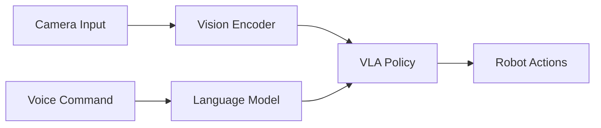

# Vision-Language-Action Models: The Future of Robotic Intelligence

How do you teach a robot to understand "Pick up the red mug and place it on the shelf"? The answer lies in **Vision-Language-Action (VLA) models**—the breakthrough that's transforming robotics.

<!--truncate-->

## The Problem with Traditional Robotics

Classical robot programming requires:

1. **Hard-coded behaviors** for every task
2. **Explicit state machines** (IF this THEN that)
3. **No generalization** to new objects or commands

This approach **doesn't scale**. You'd need thousands of engineers to program every possible scenario.

---

## Enter VLA Models

VLA models integrate three modalities:

### 1. **Vision** 👁️
- RGB cameras, depth sensors, LIDAR
- Object detection, segmentation, pose estimation
- **Example:** "I see a red cylindrical object (mug)"

### 2. **Language** 💬
- Natural language understanding (GPT-4, LLaMA)
- Task decomposition and planning
- **Example:** "Pick up" → [approach, grasp, lift, move, release]

### 3. **Action** 🤖
- Low-level motor control
- Inverse kinematics, trajectory planning
- **Example:** Joint angles [θ₁, θ₂, ..., θₙ] to execute grasp

---

## Architecture



**Key Components:**

### Vision Encoder
```python
# Using CLIP or ResNet
image_features = vision_encoder(camera_frame)
# Output: 512-dim embedding
```

### Language Model
```python
# Using GPT-4 or fine-tuned LLaMA
task_plan = llm.generate(
    f"Break down this task: {user_command}"
)
# Output: ["approach object", "align gripper", "close gripper", ...]
```

### Action Policy
```python
# Transformer-based policy
action = policy_network(
    vision_features=image_features,
    language_features=task_embedding,
    robot_state=joint_positions
)
# Output: joint velocities or end-effector pose
```

---

## State-of-the-Art VLA Models

### 1. **RT-2 (Google DeepMind)**
- **Training:** 6 billion parameters, trained on web images + robotics data
- **Zero-shot generalization:** Can manipulate objects it's never seen
- **Performance:** 62% success rate on novel tasks

### 2. **PaLM-E (Google)**
- **Multimodal:** Integrates vision, language, and sensor data into a single 562B param model
- **Embodied reasoning:** Can answer questions about the physical world
- **Example:** "Which room has the most chairs?" → navigates + counts

### 3. **OpenVLA (Open Source)**
- **Training:** 7B parameters, fully open-source
- **Dataset:** 970K robot trajectories from Open X-Embodiment
- **Advantage:** Can be fine-tuned on custom hardware

---

## Building Your Own VLA Agent

### Step 1: Collect Data

```python
# Record demonstrations
dataset = []
for episode in range(1000):
    obs = env.reset()
    language_command = get_user_command()
    
    while not done:
        action = human_teleop()  # Collect expert actions
        obs, reward, done = env.step(action)
        dataset.append((obs['image'], language_command, action))
```

### Step 2: Train the Policy

```python
import torch
from transformers import CLIPVisionModel, GPT2Model

class VLAPolicy(torch.nn.Module):
    def __init__(self):
        super().__init__()
        self.vision_encoder = CLIPVisionModel.from_pretrained("openai/clip-vit-base-patch32")
        self.language_encoder = GPT2Model.from_pretrained("gpt2")
        self.action_head = torch.nn.Linear(512 + 768, action_dim)
    
    def forward(self, image, text_tokens, robot_state):
        vision_feat = self.vision_encoder(image).pooler_output
        lang_feat = self.language_encoder(text_tokens).last_hidden_state[:, -1]
        
        combined = torch.cat([vision_feat, lang_feat], dim=-1)
        action = self.action_head(combined)
        return action

# Train with behavioral cloning
for epoch in range(100):
    for batch in dataloader:
        images, commands, actions = batch
        predicted_actions = model(images, commands, robot_state)
        loss = torch.nn.MSELoss()(predicted_actions, actions)
        loss.backward()
        optimizer.step()
```

### Step 3: Deploy to ROS 2

```python
import rclpy
from rclpy.node import Node
from sensor_msgs.msg import Image
from std_msgs.msg import String

class VLANode(Node):
    def __init__(self):
        super().__init__('vla_node')
        self.model = load_trained_model()
        
        self.create_subscription(Image, '/camera/image', self.image_callback, 10)
        self.create_subscription(String, '/voice_command', self.command_callback, 10)
        
        self.action_pub = self.create_publisher(JointState, '/joint_commands', 10)
    
    def image_callback(self, msg):
        self.latest_image = msg
    
    def command_callback(self, msg):
        # Run inference
        action = self.model.predict(self.latest_image, msg.data)
        
        # Publish to robot
        joint_msg = JointState()
        joint_msg.position = action
        self.action_pub.publish(joint_msg)
```

---

## Real-World Applications

### 🏭 **Manufacturing**
- "Assemble the blue gear onto the red shaft"
- Handles part variations without reprogramming

### 🏥 **Healthcare**
- "Hand me the scalpel" → robot identifies and grasps surgical tool
- Voice control for sterile environments

### 🏠 **Home Assistance**
- "Clear the table after dinner"
- Adapts to different table layouts and dish types

---

## Challenges and Future Directions

### Current Limitations:
- **Data hunger:** Requires millions of demonstrations
- **Sim-to-real gap:** Models trained in simulation often fail on real robots
- **Safety:** Hard to guarantee safe behavior in all scenarios

### Emerging Solutions:
- **Foundation models:** Leverage pre-trained vision/language models (less data needed)
- **Synthetic data:** Use Isaac Sim + procedural generation
- **Human-in-the-loop:** Real-time safety monitoring

---

## Try It Now

**Open-Source VLA Projects:**
- [OpenVLA](https://openvla.github.io/)
- [RT-X Datasets](https://robotics-transformer-x.github.io/)
- [Ibrahim's VLA Resources](https://github.com/Ibrahim-Tayyab?tab=repositories)

**Getting Started:**
```bash
git clone https://github.com/Ibrahim-Tayyab/vla-robotics.git
pip install -r requirements.txt
python scripts/train_vla.py --config configs/base.yaml
```

---

**Further Reading:**
- [RT-2 Paper (Google)](https://arxiv.org/abs/2307.15818)
- [PaLM-E Paper](https://arxiv.org/abs/2303.03378)
- [Open X-Embodiment Dataset](https://robotics-transformer-x.github.io/)

_By Muhammed Ibrahim | [GitHub](https://github.com/Ibrahim-Tayyab?tab=repositories)_
