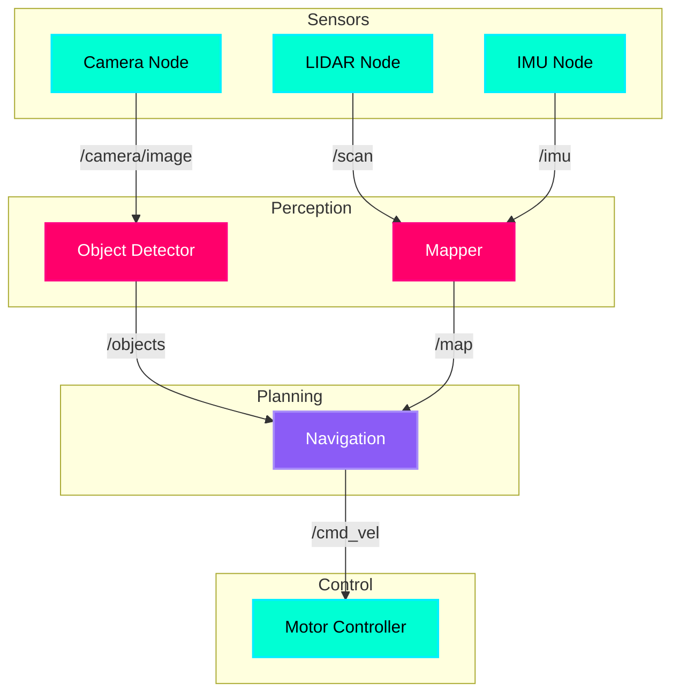

# ROS 2 Fundamentals: Nodes and Topics

## The Nervous System Analogy

If Physical AI is about giving robots bodies, **ROS 2 (Robot Operating System 2)** is their **nervous system**. Just like your brain sends electrical signals through neurons to control your muscles, ROS 2 allows software components (nodes) to communicate through message channels (topics) to coordinate robot behavior.

:::info Key Insight
ROS 2 isn't an operating system like Windows or Linux—it's a **middleware framework** that sits on top of Linux and provides the communication infrastructure for distributed robot systems.
:::

---

## What Are Nodes? (The Neurons)

A **node** is a single, modular process that performs a specific computation. Think of nodes as specialized brain cells:

- **Camera Node**: Captures images from a robot's camera sensor
- **Perception Node**: Processes images to detect objects
- **Planning Node**: Decides where the robot should move
- **Control Node**: Sends commands to motors to execute movement

### Why Nodes Matter

In traditional robotics, all code might run in a single monolithic program. ROS 2 breaks this into **independent nodes** that can:

1. **Run in parallel** (on different CPU cores or even different machines)
2. **Be developed independently** (camera team doesn't need to know control code)
3. **Be reused across robots** (same perception node works on humanoid or quadruped)
4. **Fail gracefully** (if one node crashes, others keep running)

:::tip Biological Parallel
Just like neurons in your brain are specialized (visual cortex for sight, motor cortex for movement), ROS 2 nodes are specialized software components that work together to create intelligent behavior.
:::

---

## What Are Topics? (The Signals)

**Topics** are named message channels that nodes use to communicate. They implement a **publish-subscribe pattern**:

- **Publisher Node**: Sends messages on a topic (e.g., `/camera/image`)
- **Subscriber Node**: Listens for messages on a topic

### The Talker-Listener Example

Here's the classic ROS 2 communication pattern:

```mermaid
graph LR
    A[Talker Node] -->|Publishes| B[/chatter Topic]
    B -->|Subscribes| C[Listener Node]
    
    style A fill:#00FFD4,stroke:#00F0FF,stroke-width:2px,color:#000
    style B fill:#FF006B,stroke:#FF0080,stroke-width:2px,color:#fff
    style C fill:#00FFD4,stroke:#00F0FF,stroke-width:2px,color:#000
```

**How it works:**
1. **Talker Node** publishes a message ("Hello, World!") on the `/chatter` topic
2. ROS 2's **middleware** (DDS - Data Distribution Service) handles message routing
3. **Listener Node** receives the message and prints it

:::note Important
Multiple nodes can publish to the same topic, and multiple nodes can subscribe. This creates a **many-to-many communication network** that scales beautifully for complex robot systems.
:::

---

## Message Types

Topics carry **typed messages**. Common message types include:

| Message Type | Description | Use Case |
|--------------|-------------|----------|
| `std_msgs/String` | Simple text | Logging, debugging |
| `sensor_msgs/Image` | Camera images | Computer vision |
| `geometry_msgs/Twist` | Velocity commands | Motor control |
| `nav_msgs/Odometry` | Robot position/velocity | Navigation |
| `sensor_msgs/LaserScan` | LIDAR data | Obstacle detection |

Example message structure:

```python
# geometry_msgs/Twist - Used to command robot movement
linear:
  x: 0.5  # Move forward at 0.5 m/s
  y: 0.0
  z: 0.0
angular:
  x: 0.0
  y: 0.0
  z: 0.2  # Rotate at 0.2 rad/s
```

---

## Command Reference: Exploring the ROS 2 Graph

ROS 2 provides powerful command-line tools to inspect running nodes and topics:

### 1. Run a Node

```bash
# Run the talker example from the demo_nodes_py package
ros2 run demo_nodes_py talker
```

**Output:**
```
[INFO] [talker]: Publishing: "Hello World: 0"
[INFO] [talker]: Publishing: "Hello World: 1"
[INFO] [talker]: Publishing: "Hello World: 2"
```

### 2. List Active Topics

```bash
# See all topics currently being published/subscribed
ros2 topic list
```

**Output:**
```
/chatter
/parameter_events
/rosout
```

### 3. Inspect Topic Messages

```bash
# See messages being published on /chatter in real-time
ros2 topic echo /chatter
```

**Output:**
```
data: 'Hello World: 42'
---
data: 'Hello World: 43'
---
```

### 4. Get Topic Information

```bash
# See message type and number of publishers/subscribers
ros2 topic info /chatter
```

**Output:**
```
Type: std_msgs/msg/String
Publisher count: 1
Subscription count: 1
```

### 5. Publish Manually from Terminal

```bash
# Publish a single message to /chatter
ros2 topic pub /chatter std_msgs/msg/String "{data: 'Hello from terminal'}"
```

---

## Hands-On Exercise: Create Your First ROS 2 System

**Scenario:** You'll create a simple two-node system where a "sensor" publishes temperature readings and a "monitor" logs them.

### Step 1: Run the Talker (in Terminal 1)

```bash
ros2 run demo_nodes_py talker
```

### Step 2: Run the Listener (in Terminal 2)

```bash
ros2 run demo_nodes_py listener
```

**You should see:**
- Terminal 1: Publishing messages
- Terminal 2: Receiving and printing messages

### Step 3: Inspect the Graph (in Terminal 3)

```bash
# List all running nodes
ros2 node list

# Output:
# /talker
# /listener

# List all topics
ros2 topic list

# Output:
# /chatter
# /parameter_events
# /rosout

# See real-time data flow
ros2 topic hz /chatter

# Output:
# average rate: 1.000
#     min: 1.000s max: 1.000s std dev: 0.00000s window: 10
```

:::tip Challenge
Try running **two** talker nodes simultaneously. What happens when two nodes publish to the same topic? Use `ros2 topic echo /chatter` to observe the behavior.
:::

---

## The ROS 2 Computational Graph

The **ROS 2 graph** is the network of all nodes and topics in your system. Here's a real-world example from a mobile robot:



**Key Observations:**
- **Sensor nodes** (cyan) publish raw data
- **Perception nodes** (magenta) process sensor data
- **Planning nodes** (purple) make decisions
- **Control nodes** (cyan) execute commands

This **modular architecture** is what makes ROS 2 robots scalable and maintainable.

---

## Key Takeaways

✅ **Nodes** are independent processes performing specific tasks (like neurons)  
✅ **Topics** are named communication channels using publish-subscribe (like neural signals)  
✅ **Messages** are typed data structures flowing through topics  
✅ **ROS 2 Graph** is the network of all nodes and topics in your system  
✅ **Command-line tools** (`ros2 run`, `ros2 topic list/echo/info`) let you inspect the graph

---

## What's Next?

Now that you understand **how nodes communicate**, the next chapter will teach you **how to write your own nodes in Python** using the `rclpy` library. You'll build a simple publisher-subscriber pair that controls a simulated robot.

---

## Further Reading

- [ROS 2 Humble Documentation](https://docs.ros.org/en/humble/)
- [Understanding ROS 2 Nodes](https://docs.ros.org/en/humble/Tutorials/Beginner-CLI-Tools/Understanding-ROS2-Nodes/Understanding-ROS2-Nodes.html)
- [Understanding ROS 2 Topics](https://docs.ros.org/en/humble/Tutorials/Beginner-CLI-Tools/Understanding-ROS2-Topics/Understanding-ROS2-Topics.html)
- [ROS 2 Design - DDS Middleware](https://design.ros2.org/articles/ros_on_dds.html)
