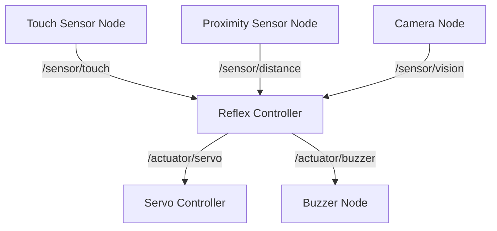

# Mini-Project: Robotic Nervous System

## Objective
Design a **sensor-driven control system** that mimics the human nervous system's reflex arc using ROS 2.

---

## Project Overview

### **Scenario:**
Your humanoid robot must react to external stimuli (touch, proximity, vision) by triggering appropriate motor responses **without central planning** (similar to biological reflexes).

### **Requirements:**

1. **Sensor Nodes (3 minimum):**
   - Touch sensor (simulated or real GPIO)
   - Proximity sensor (ultrasonic or LIDAR)
   - Camera-based object detection (OpenCV)

2. **Actuator Nodes (2 minimum):**
   - Servo motor controller (gripper or arm)
   - LED/buzzer feedback system

3. **Reflex Logic Node:**
   - Subscribes to sensor topics
   - Publishes to actuator topics
   - Implements rule-based or ML-based decision logic

---

## System Architecture



---

## Implementation Steps

### **Step 1: Workspace Setup**
```bash
mkdir -p ~/ros2_ws/src
cd ~/ros2_ws/src
ros2 pkg create --build-type ament_python nervous_system
cd ~/ros2_ws
colcon build
source install/setup.bash
```

### **Step 2: Sensor Node Example (Proximity)**
```python
import rclpy
from rclpy.node import Node
from std_msgs.msg import Float32
import random

class ProximitySensor(Node):
    def __init__(self):
        super().__init__('proximity_sensor')
        self.publisher = self.create_publisher(Float32, '/sensor/distance', 10)
        self.timer = self.create_timer(0.5, self.publish_distance)
    
    def publish_distance(self):
        msg = Float32()
        msg.data = random.uniform(0.1, 2.0)  # Simulated distance in meters
        self.publisher.publish(msg)
        self.get_logger().info(f'Distance: {msg.data:.2f}m')

def main(args=None):
    rclpy.init(args=args)
    node = ProximitySensor()
    rclpy.spin(node)
    node.destroy_node()
    rclpy.shutdown()
```

### **Step 3: Reflex Controller Node**
```python
import rclpy
from rclpy.node import Node
from std_msgs.msg import Float32, Bool

class ReflexController(Node):
    def __init__(self):
        super().__init__('reflex_controller')
        
        # Subscribers
        self.create_subscription(Float32, '/sensor/distance', self.distance_callback, 10)
        self.create_subscription(Bool, '/sensor/touch', self.touch_callback, 10)
        
        # Publishers
        self.servo_pub = self.create_publisher(Float32, '/actuator/servo', 10)
        self.buzzer_pub = self.create_publisher(Bool, '/actuator/buzzer', 10)
    
    def distance_callback(self, msg):
        if msg.data < 0.3:  # Object too close
            self.get_logger().warn('Obstacle detected! Activating reflex...')
            self.activate_buzzer()
    
    def touch_callback(self, msg):
        if msg.data:  # Touch detected
            self.get_logger().info('Touch reflex triggered!')
            self.move_servo(90.0)
    
    def activate_buzzer(self):
        msg = Bool()
        msg.data = True
        self.buzzer_pub.publish(msg)
    
    def move_servo(self, angle):
        msg = Float32()
        msg.data = angle
        self.servo_pub.publish(msg)

def main(args=None):
    rclpy.init(args=args)
    node = ReflexController()
    rclpy.spin(node)
    node.destroy_node()
    rclpy.shutdown()
```

---

## Deliverables

### 1. **Source Code** (50%)
- GitHub repository with:
  - All ROS 2 nodes
  - `package.xml` and `setup.py`
  - Launch file for entire system

### 2. **Documentation** (30%)
- `README.md` with:
  - System architecture diagram
  - Installation instructions
  - Usage examples
  - Video demo link

### 3. **Demo Video** (20%)
- Record a 3-5 minute video showing:
  - System startup
  - Sensor triggers
  - Actuator responses
  - Edge case handling

---

## Evaluation Criteria

| Criterion | Points | Description |
|-----------|--------|-------------|
| **Functionality** | 40 | All sensors and actuators work correctly |
| **Code Quality** | 20 | Clean, commented, follows ROS 2 conventions |
| **Architecture** | 20 | Modular design, proper topic naming |
| **Documentation** | 15 | Clear README, architecture diagram |
| **Creativity** | 5 | Bonus for unique sensor/reflex combinations |

**Total:** 100 points

---

## Advanced Extensions (Optional)

1. **Machine Learning Reflex:**
   - Train a small neural network to classify sensor patterns
   - Deploy using ONNX Runtime

2. **Multi-Robot Coordination:**
   - Have two robots communicate reflexes via ROS 2 topics
   - Example: Robot A detects danger → warns Robot B

3. **Real Hardware:**
   - Deploy to Raspberry Pi + Arduino
   - Use actual GPIO sensors and servos

---

## Submission Guidelines

**Due:** End of Week 5  
**Format:** GitHub repository link  
**Include:**
- Source code
- `README.md`
- `demo_video.mp4` (upload to Google Drive/YouTube)

**Submit via:** Course LMS

---

## FAQ

**Q: Can I use C++ instead of Python?**  
A: Yes, but provide equivalent functionality.

**Q: Is simulation acceptable or must I use real hardware?**  
A: Simulation is acceptable. Use Gazebo or custom mock nodes.

**Q: Can I work in pairs?**  
A: No, this is an individual project. However, you may discuss concepts with peers.

**Q: What if my sensor node crashes?**  
A: Implement error handling and restart logic. Document failure modes in README.
