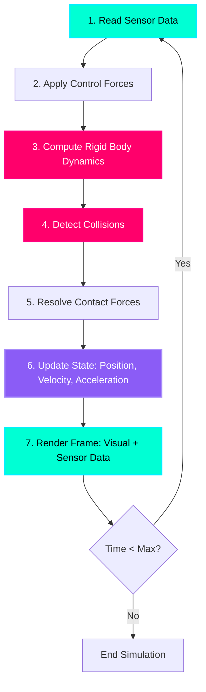

# The Physics of Simulation: Gazebo

## The Digital Twin Concept

Before building a $50,000 humanoid robot, you need to test it **millions of times** in software. Enter **Gazebo**—an open-source robot simulator that models the laws of physics with stunning accuracy.

**Gazebo simulates:**
- **Gravity** (9.81 m/s² pulling objects down)
- **Inertia** (massive objects resist acceleration)
- **Friction** (surfaces resist sliding motion)
- **Collisions** (objects can't occupy the same space)
- **Joint Dynamics** (motors apply torque, joints have limits)

:::info Why Simulation Matters
Boston Dynamics trained Atlas to do backflips by running **100 million** simulated jumps before attempting one in reality. Simulation is where robots learn to walk, run, and manipulate—**without breaking hardware**.
:::

---

## The Physics Loop: How Simulation Works

Every simulation runs a **physics loop** at 1000 Hz (1ms per iteration). Here's what happens in each step:



**Step-by-Step Breakdown:**

1. **Read Sensor Data** (cyan): Get camera images, LIDAR distances, IMU readings
2. **Apply Control Forces** (blue): Your controller commands motors to apply torque
3. **Compute Rigid Body Dynamics** (magenta): F = ma, calculate accelerations
4. **Detect Collisions** (magenta): Check if any objects overlap
5. **Resolve Contact Forces** (purple): Apply reaction forces (e.g., ground pushes up on foot)
6. **Update State** (purple): New positions, velocities, accelerations
7. **Render Frame** (cyan): Draw 3D scene and publish sensor data on ROS 2 topics

This loop runs **1000 times per second**, creating the illusion of continuous motion.

---

## Physics Fundamentals

### 1. Gravity

**Gravity** pulls all objects toward the ground at 9.81 m/s² (Earth standard).

```xml
<!-- In Gazebo world file -->
<physics type="ode">
  <gravity>0 0 -9.81</gravity>  <!-- X Y Z components -->
  <max_step_size>0.001</max_step_size>  <!-- 1ms time step -->
  <real_time_factor>1</real_time_factor>  <!-- 1x real-time speed -->
</physics>
```

**What this means:**
- An object dropped from 1 meter hits the ground in 0.45 seconds
- Terminal velocity depends on mass and air resistance (not modeled by default)
- You can change gravity to simulate Mars (3.71 m/s²) or the Moon (1.62 m/s²)

---

### 2. Inertia

**Inertia** is an object's resistance to changes in motion. Heavy objects are harder to accelerate.

```xml
<!-- In URDF link definition -->
<inertial>
  <mass value="3.0"/>  <!-- 3 kg thigh -->
  <inertia ixx="0.04" ixy="0.0" ixz="0.0"
           iyy="0.04" iyz="0.0"
           izz="0.001"/>  <!-- kg·m² -->
</inertial>
```

**Inertia Tensor Explained:**
- `ixx`, `iyy`, `izz`: Moment of inertia around X, Y, Z axes
- **Higher values** = harder to rotate around that axis
- For a **cylinder** (like a thigh): Higher inertia along length axis

:::warning Critical for Stability
Incorrect inertia values cause simulation instability. A robot might:
- Spin uncontrollably (inertia too low)
- Move sluggishly (inertia too high)
- Fall through the floor (conflicting physics constraints)

Always use **realistic values** from CAD software or physics calculators.
:::

---

### 3. Friction

**Friction** resists sliding motion between surfaces.

```xml
<!-- In SDF/Gazebo collision definition -->
<surface>
  <friction>
    <ode>
      <mu>1.0</mu>   <!-- Coefficient of friction (0 = ice, 1 = rubber) -->
      <mu2>1.0</mu2> <!-- Secondary direction friction -->
    </ode>
  </friction>
  <contact>
    <ode>
      <kp>1000000.0</kp>  <!-- Contact stiffness (N/m) -->
      <kd>1.0</kd>        <!-- Contact damping (N·s/m) -->
    </ode>
  </contact>
</surface>
```

**Friction Coefficients:**
- **μ = 0.0**: Frictionless (ice skating)
- **μ = 0.5**: Low friction (wet floor)
- **μ = 1.0**: High friction (rubber on concrete)
- **μ = 1.5**: Very high friction (climbing shoe on rock)

**Why it matters:** A humanoid's foot needs **high friction** (μ ≈ 1.0) to push off the ground without slipping.

---

## Creating Your First Gazebo World

A **world file** (.world or .sdf) defines the simulation environment. Here's a minimal world:

### Complete World File: `empty_world.world`

```xml
<?xml version="1.0"?>
<sdf version="1.6">
  <world name="empty_world">
    
    <!-- ========================================
         PHYSICS ENGINE CONFIGURATION
         ======================================== -->
    <physics type="ode">
      <max_step_size>0.001</max_step_size>  <!-- 1ms (1000 Hz) -->
      <real_time_factor>1.0</real_time_factor>
      <real_time_update_rate>1000.0</real_time_update_rate>
      
      <gravity>0 0 -9.81</gravity>  <!-- Earth gravity -->
      
      <ode>
        <solver>
          <type>quick</type>  <!-- Quick solver (fast, less accurate) -->
          <iters>50</iters>   <!-- Constraint solver iterations -->
          <sor>1.3</sor>      <!-- Successive over-relaxation -->
        </solver>
        <constraints>
          <cfm>0.0</cfm>      <!-- Constraint force mixing -->
          <erp>0.2</erp>      <!-- Error reduction parameter -->
          <contact_max_correcting_vel>100.0</contact_max_correcting_vel>
          <contact_surface_layer>0.001</contact_surface_layer>
        </constraints>
      </ode>
    </physics>

    <!-- ========================================
         LIGHTING (SUN)
         ======================================== -->
    <light name="sun" type="directional">
      <cast_shadows>true</cast_shadows>
      <pose>0 0 10 0 0 0</pose>  <!-- 10m above origin -->
      <diffuse>0.8 0.8 0.8 1</diffuse>  <!-- Bright white light -->
      <specular>0.2 0.2 0.2 1</specular>
      <direction>-0.5 0.1 -0.9</direction>  <!-- Angled downward -->
    </light>

    <!-- ========================================
         GROUND PLANE
         ======================================== -->
    <model name="ground_plane">
      <static>true</static>  <!-- Doesn't move under physics -->
      <link name="link">
        <collision name="collision">
          <geometry>
            <plane>
              <normal>0 0 1</normal>  <!-- Surface normal (points up) -->
              <size>100 100</size>    <!-- 100m x 100m plane -->
            </plane>
          </geometry>
          <surface>
            <friction>
              <ode>
                <mu>1.0</mu>   <!-- High friction (rubber) -->
                <mu2>1.0</mu2>
              </ode>
            </friction>
          </surface>
        </collision>
        
        <visual name="visual">
          <cast_shadows>false</cast_shadows>
          <geometry>
            <plane>
              <normal>0 0 1</normal>
              <size>100 100</size>
            </plane>
          </geometry>
          <material>
            <ambient>0.3 0.3 0.3 1</ambient>  <!-- Dark gray -->
            <diffuse>0.7 0.7 0.7 1</diffuse>
            <specular>0.01 0.01 0.01 1</specular>
          </material>
        </visual>
      </link>
    </model>

    <!-- ========================================
         SCENE PROPERTIES
         ======================================== -->
    <scene>
      <ambient>0.4 0.4 0.4 1</ambient>  <!-- Ambient light (soft global lighting) -->
      <background>0.25 0.25 0.25 1</background>  <!-- Gray sky -->
      <shadows>true</shadows>
      <grid>true</grid>  <!-- Show grid lines -->
    </scene>

    <!-- ========================================
         GAZEBO GUI SETTINGS
         ======================================== -->
    <gui>
      <camera name="user_camera">
        <pose>5 -5 2 0 0.275 2.356</pose>  <!-- Camera position and orientation -->
        <view_controller>orbit</view_controller>
      </camera>
    </gui>

  </world>
</sdf>
```

---

## Breaking Down the World File

### Physics Configuration (Lines 8-26)

```xml
<physics type="ode">
  <max_step_size>0.001</max_step_size>
  <real_time_factor>1.0</real_time_factor>
```

**Key Parameters:**
- `max_step_size`: Time step size (1ms = 1000 Hz simulation rate)
- `real_time_factor`: 1.0 = real-time, 0.5 = half-speed (more accurate), 2.0 = 2x speed
- `type="ode"`: Open Dynamics Engine (Gazebo's default physics solver)

:::tip Performance Tip
For humanoid robots, use **0.001s** (1ms) time steps. Smaller = more accurate but slower. Larger = faster but unstable for complex robots.
:::

---

### Sun Light (Lines 31-37)

```xml
<light name="sun" type="directional">
  <direction>-0.5 0.1 -0.9</direction>
```

**Why directional light?**
- Simulates sunlight (rays are parallel)
- Creates realistic shadows
- Direction vector points from sky toward ground

Alternative: `type="point"` creates a light bulb (rays radiate from a point).

---

### Ground Plane (Lines 43-76)

```xml
<model name="ground_plane">
  <static>true</static>
```

**Critical Properties:**
- `static="true"`: Object doesn't move (infinite mass)
- `<plane>`: Infinite 2D surface (efficient for large floors)
- `<mu>1.0</mu>`: High friction for robot foot contact

**Visual vs Collision:**
- **Collision geometry**: What physics engine "feels" (simple shapes for speed)
- **Visual geometry**: What camera sees (can be detailed meshes)

---

## Running Your World in Gazebo

### Step 1: Save the World File

```bash
mkdir -p ~/gazebo_worlds
cd ~/gazebo_worlds
nano empty_world.world
# Paste the XML content above, then Ctrl+X, Y, Enter
```

### Step 2: Launch Gazebo

```bash
# Method 1: Directly with Gazebo
gazebo empty_world.world

# Method 2: With ROS 2 (preferred for robot control)
ros2 launch gazebo_ros gazebo.launch.py world:=/home/YOUR_USERNAME/gazebo_worlds/empty_world.world
```

**Expected Result:**
- Gray ground plane extending to horizon
- Grid lines visible
- Shadows from directional light
- Orbit camera control (drag with mouse)

---

## Adding Objects to the World

### Example: Spawn a Box

```xml
<!-- Add inside <world> tag -->
<model name="red_box">
  <pose>0 0 0.5 0 0 0</pose>  <!-- Position: 0.5m above ground -->
  <static>false</static>  <!-- Falls under gravity -->
  
  <link name="link">
    <collision name="collision">
      <geometry>
        <box>
          <size>0.5 0.5 0.5</size>  <!-- 50cm cube -->
        </box>
      </geometry>
    </collision>
    
    <visual name="visual">
      <geometry>
        <box>
          <size>0.5 0.5 0.5</size>
        </box>
      </geometry>
      <material>
        <ambient>1 0 0 1</ambient>  <!-- Red color -->
        <diffuse>1 0 0 1</diffuse>
      </material>
    </visual>
    
    <inertial>
      <mass>10.0</mass>  <!-- 10 kg box -->
      <inertia>
        <ixx>0.416</ixx>
        <iyy>0.416</iyy>
        <izz>0.416</izz>
      </inertia>
    </inertial>
  </link>
</model>
```

**What happens:**
1. Box spawns 0.5m above ground
2. Gravity pulls it down (9.81 m/s²)
3. Collides with ground plane
4. Settles at z=0.25m (half its height)

---

## Hands-On Exercise: Build a Ramp

**Challenge:** Create a world with:
1. Ground plane (already done)
2. A **ramp** (inclined plane at 30°)
3. A **sphere** that rolls down the ramp

**Starter Code:**
```xml
<model name="ramp">
  <static>true</static>
  <pose>0 0 0.5 0 0.523599 0</pose>  <!-- 0.523599 rad = 30° -->
  <link name="link">
    <collision name="collision">
      <geometry>
        <box>
          <size>2 1 0.1</size>  <!-- 2m long, 1m wide, 10cm thick -->
        </box>
      </geometry>
      <!-- ADD FRICTION HERE -->
    </collision>
    <!-- ADD VISUAL HERE -->
  </link>
</model>

<model name="rolling_sphere">
  <pose>0 0 2 0 0 0</pose>  <!-- Starts 2m high -->
  <!-- YOUR CODE: Add sphere geometry (radius 0.2m, mass 1kg) -->
</model>
```

**Verification:**
1. Launch Gazebo with your world
2. Press **Play** button
3. Sphere should roll down ramp due to gravity
4. Adjust ramp angle or friction to change speed

---

## Key Takeaways

✅ **Gazebo simulates realistic physics** (gravity, inertia, friction, collisions)  
✅ **Physics loop runs at 1000 Hz** (1ms time steps for accuracy)  
✅ **World files (.sdf/.world)** define simulation environment  
✅ **Ground plane** requires `static="true"` and high friction (μ=1.0)  
✅ **Inertia values must be realistic** to prevent instability  
✅ **Lighting** affects visual realism (directional sun + ambient light)  

---

## What's Next?

Gazebo provides **physically accurate** simulation but lacks visual fidelity. The next chapter introduces **Unity**—a game engine that renders photorealistic environments using ray tracing and advanced materials. You'll learn how to bridge ROS 2 and Unity for **high-fidelity** robot visualization.

---

## Further Reading

- [Gazebo Classic Documentation](http://classic.gazebosim.org/tutorials)
- [SDF Format Specification](http://sdformat.org/)
- [Gazebo Physics Properties](http://classic.gazebosim.org/tutorials?tut=physics_params)
- [ODE Solver Parameters](https://www.ode.org/)
- [Gazebo + ROS 2 Integration](https://docs.ros.org/en/humble/Tutorials/Advanced/Simulators/Gazebo/Gazebo.html)
