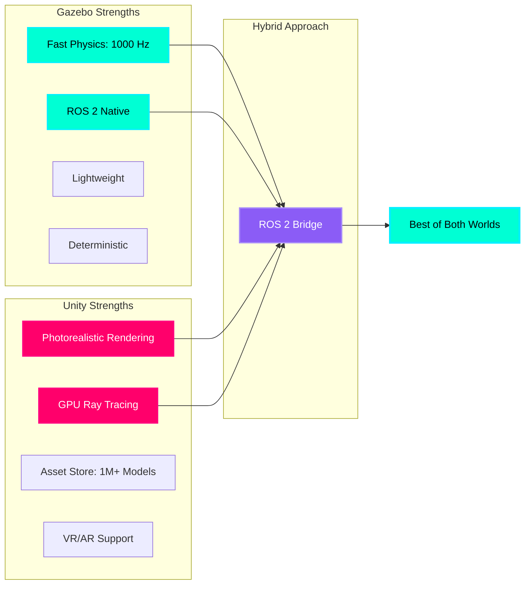
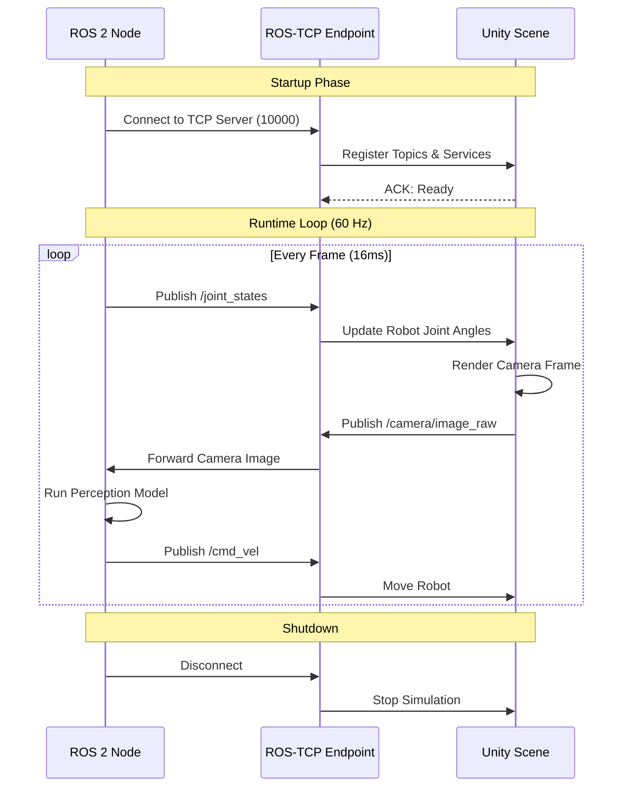

# High-Fidelity Rendering: Unity for Robotics

## The Visual Realism Gap

**Gazebo** excels at physics simulation but struggles with visual fidelity. Its graphics engine from 2004 can't compete with modern demands for:
- **Photorealistic materials** (metal reflections, fabric textures)
- **Advanced lighting** (ray tracing, global illumination)
- **Complex scenes** (thousands of objects, dynamic weather)
- **Camera simulation** (depth of field, motion blur, lens distortion)

Enter **Unity**—a professional game engine used for AAA games and Hollywood CGI. Unity brings **movie-quality visuals** to robotics simulation.

:::info Real-World Example
NVIDIA Isaac Sim (based on Omniverse/Unity architecture) uses **ray-traced rendering** to train perception models. A robot trained on photorealistic synthetic data can transfer to real-world cameras with **minimal sim-to-real gap**.
:::

---

## Gazebo vs Unity: The Trade-Off



**The Strategy:**
1. **Gazebo** runs physics simulation (contacts, friction, joint dynamics)
2. **Unity** renders visuals (camera feed, depth images, segmentation masks)
3. **ROS 2 Bridge** synchronizes state between both systems

---

## The ROS 2 ↔ Unity Communication Bridge

The **Unity Robotics Hub** enables bidirectional communication between ROS 2 and Unity using TCP/IP.



**Message Flow:**
1. **ROS 2 → Unity**: Joint states, velocity commands, spawn requests
2. **Unity → ROS 2**: Camera images, depth maps, collision events
3. **Frequency**: 60 Hz (Unity rendering) + 1000 Hz (ROS 2 physics optional)

---

## Why Unity Looks Beautiful (Technical Deep Dive)

### 1. Physically-Based Rendering (PBR)

Unity uses **PBR materials** that simulate light physics:

| Property | Description | Real-World Example |
|----------|-------------|-------------------|
| **Albedo** | Base color (no lighting) | Red paint |
| **Metallic** | 0 = dielectric, 1 = metal | Aluminum = 1.0 |
| **Smoothness** | 0 = rough, 1 = mirror | Polished steel = 0.9 |
| **Normal Map** | Surface micro-details | Wood grain bumps |
| **Emission** | Self-illumination | LED light strip |

**Gazebo materials:**
```xml
<material>
  <ambient>0.5 0.5 0.5 1</ambient>  <!-- Flat color, no light physics -->
</material>
```

**Unity PBR shader:**
```csharp
Material robotMetal = new Material(Shader.Find("Standard"));
robotMetal.SetColor("_Color", Color.gray);
robotMetal.SetFloat("_Metallic", 0.8f);    // 80% metallic
robotMetal.SetFloat("_Glossiness", 0.6f);  // 60% smooth
```

---

### 2. Ray Tracing (Unity 2021+)

**Ray tracing** simulates light paths bouncing through the scene:

**Traditional rasterization (Gazebo):**
- Projects 3D triangles onto 2D screen
- No reflections, no shadows from secondary light sources
- Fast but unrealistic

**Ray tracing (Unity HDRP):**
- Traces light rays from camera through pixels
- Calculates reflections, refractions, caustics
- Slow (requires RTX GPU) but photorealistic

:::tip Performance Note
Ray tracing requires **NVIDIA RTX GPU** (2060+ recommended). For CPU-only machines, use Unity's **HDRP Baked Lighting** (pre-computed global illumination).
:::

---

## Setting Up Unity Robotics Hub

### Step 1: Install Unity Hub

```bash
# Download Unity Hub from official site
# https://unity.com/download

# Recommended version: Unity 2022.3 LTS (Long-Term Support)
# Install modules: Linux Build Support, Visual Studio Code Editor
```

---

### Step 2: Create New 3D Project

1. Open Unity Hub
2. Click **New Project**
3. Template: **3D (URP)** (Universal Render Pipeline)
4. Name: `RobotSimulation`
5. Click **Create**

---

### Step 3: Install Unity Robotics Hub Package

**Method 1: Package Manager (Recommended)**

```
1. In Unity Editor, open Window > Package Manager
2. Click "+" → "Add package from git URL"
3. Enter: https://github.com/Unity-Technologies/ROS-TCP-Connector.git?path=/com.unity.robotics.ros-tcp-connector
4. Click "Add"
5. Repeat for: https://github.com/Unity-Technologies/URDF-Importer.git?path=/com.unity.robotics.urdf-importer
```

**Method 2: Manual Installation**

```bash
cd ~/RobotSimulation/Packages
git clone https://github.com/Unity-Technologies/ROS-TCP-Connector.git
git clone https://github.com/Unity-Technologies/URDF-Importer.git
```

---

### Step 4: Configure ROS TCP Endpoint

**In Unity Editor:**

1. **Robotics > ROS Settings**
2. Set **ROS IP Address**: `127.0.0.1` (localhost) or your ROS 2 machine IP
3. Set **ROS Port**: `10000`
4. **Protocol**: `ROS 2`

**On ROS 2 Side (Terminal):**

```bash
# Install ROS TCP Endpoint package
sudo apt install ros-humble-ros-tcp-endpoint

# Launch TCP server
ros2 run ros_tcp_endpoint default_server_endpoint --ros-args -p ROS_IP:=0.0.0.0
```

**Expected Output:**
```
[INFO] [ros_tcp_endpoint]: Starting server on 0.0.0.0:10000
[INFO] [ros_tcp_endpoint]: Waiting for Unity connection...
```

---

## Importing URDF into Unity

### Step 1: Prepare Your URDF

Ensure your URDF has **mesh files** (not just primitives):

```xml
<!-- Example: Robot arm link with mesh -->
<link name="upper_arm">
  <visual>
    <geometry>
      <mesh filename="package://my_robot/meshes/upper_arm.dae"/>
    </geometry>
  </visual>
  <collision>
    <geometry>
      <cylinder radius="0.05" length="0.3"/>  <!-- Simplified collision -->
    </geometry>
  </collision>
</link>
```

**Supported mesh formats:**
- `.dae` (COLLADA) - **Recommended** (supports materials, textures)
- `.stl` (STereoLithography) - Basic geometry only
- `.obj` (Wavefront) - Geometry + UV mapping

---

### Step 2: Import URDF in Unity

**Method 1: URDF Importer GUI**

```
1. Robotics > Import Robot from URDF
2. Click "Select URDF File"
3. Navigate to your_robot.urdf
4. Choose import settings:
   - Mesh Decomposer: VHACD (for complex collisions)
   - Axis Type: Y Axis (Unity default)
   - Fix Inertia Tensor: Checked
5. Click "Import Robot"
```

**Method 2: Script-Based Import (Advanced)**

```csharp
using Unity.Robotics.UrdfImporter;

public class RobotLoader : MonoBehaviour {
    void Start() {
        string urdfPath = "/path/to/robot.urdf";
        UrdfRobotExtensions.CreateRuntime(urdfPath, new ImportSettings {
            choosenAxis = ImportSettings.axisType.yAxis,
            convexMethod = ImportSettings.convexDecomposer.vHACD
        });
    }
}
```

---

### Step 3: Verify in Unity Scene

**Expected Result:**
1. **Hierarchy Panel**: GameObject named after your robot
2. **Child objects**: One per URDF link
3. **Components on each link**:
   - `MeshRenderer` (visual geometry)
   - `MeshCollider` (collision geometry)
   - `ArticulationBody` (Unity's physics joint system)

**Inspector View:**
```
RobotArm (Root)
├── base_link (ArticulationBody: Fixed)
├── shoulder_link (ArticulationBody: Revolute, limits: -90° to 90°)
├── elbow_link (ArticulationBody: Revolute, limits: 0° to 150°)
└── wrist_link (ArticulationBody: Revolute, limits: -180° to 180°)
```

---

## Controlling the Robot from ROS 2

### Unity Script: Joint State Subscriber

```csharp
using UnityEngine;
using Unity.Robotics.ROSTCPConnector;
using RosMessageTypes.Sensor;

public class JointStateSubscriber : MonoBehaviour {
    private ArticulationBody[] joints;
    
    void Start() {
        // Get all articulation bodies in robot
        joints = GetComponentsInChildren<ArticulationBody>();
        
        // Subscribe to /joint_states topic
        ROSConnection.GetOrCreateInstance().Subscribe<JointStateMsg>(
            "/joint_states", 
            UpdateJointPositions
        );
    }
    
    void UpdateJointPositions(JointStateMsg msg) {
        // Update Unity joints from ROS message
        for (int i = 0; i < msg.position.Length; i++) {
            if (i < joints.Length) {
                var drive = joints[i].xDrive;
                drive.target = (float)msg.position[i] * Mathf.Rad2Deg;  // Convert rad to deg
                joints[i].xDrive = drive;
            }
        }
    }
}
```

**Attach this script to your robot root GameObject.**

---

### ROS 2 Node: Publish Joint Commands

```python
#!/usr/bin/env python3
import rclpy
from rclpy.node import Node
from sensor_msgs.msg import JointState
import math

class JointCommandPublisher(Node):
    def __init__(self):
        super().__init__('joint_commander')
        self.publisher = self.create_publisher(JointState, '/joint_states', 10)
        self.timer = self.create_timer(0.01, self.publish_command)  # 100 Hz
        self.angle = 0.0
        
    def publish_command(self):
        msg = JointState()
        msg.header.stamp = self.get_clock().now().to_msg()
        msg.name = ['shoulder_joint', 'elbow_joint', 'wrist_joint']
        
        # Sine wave motion (smooth oscillation)
        self.angle += 0.01
        msg.position = [
            math.sin(self.angle),        # Shoulder: -1 to 1 rad
            math.sin(self.angle * 2),    # Elbow: faster oscillation
            math.sin(self.angle * 0.5)   # Wrist: slower oscillation
        ]
        
        self.publisher.publish(msg)

def main():
    rclpy.init()
    node = JointCommandPublisher()
    rclpy.spin(node)

if __name__ == '__main__':
    main()
```

**Run simultaneously:**
```bash
# Terminal 1: ROS TCP Endpoint
ros2 run ros_tcp_endpoint default_server_endpoint

# Terminal 2: Joint Commander
python3 joint_commander.py

# Terminal 3: Unity Editor (press Play button)
```

**Expected Result:** Robot arm smoothly oscillates in Unity scene synchronized with ROS 2 commands.

---

## Adding a Camera in Unity

### Step 1: Create Camera GameObject

```
1. Hierarchy > Right-click > Create Empty → Name: "RobotCamera"
2. Position camera on robot (e.g., on head link)
3. Add Component > Camera
4. Set parameters:
   - Field of View: 90° (wide-angle)
   - Near Clip Plane: 0.1m
   - Far Clip Plane: 100m
```

---

### Step 2: Publish Camera Image to ROS 2

```csharp
using UnityEngine;
using Unity.Robotics.ROSTCPConnector;
using RosMessageTypes.Sensor;

public class CameraPublisher : MonoBehaviour {
    public Camera robotCamera;
    private ROSConnection ros;
    
    void Start() {
        ros = ROSConnection.GetOrCreateInstance();
        ros.RegisterPublisher<ImageMsg>("/camera/image_raw");
        InvokeRepeating("PublishImage", 0.1f, 0.033f);  // 30 Hz
    }
    
    void PublishImage() {
        // Render camera to texture
        RenderTexture rt = new RenderTexture(640, 480, 24);
        robotCamera.targetTexture = rt;
        robotCamera.Render();
        
        // Read pixels
        RenderTexture.active = rt;
        Texture2D image = new Texture2D(640, 480, TextureFormat.RGB24, false);
        image.ReadPixels(new Rect(0, 0, 640, 480), 0, 0);
        image.Apply();
        
        // Convert to ROS message
        ImageMsg msg = new ImageMsg {
            header = new RosMessageTypes.Std.HeaderMsg { 
                stamp = new RosMessageTypes.BuiltinInterfaces.TimeMsg { 
                    sec = (int)Time.time, 
                    nanosec = (uint)((Time.time % 1) * 1e9) 
                },
                frame_id = "camera_link"
            },
            height = 480,
            width = 640,
            encoding = "rgb8",
            step = 640 * 3,
            data = image.GetRawTextureData()
        };
        
        ros.Publish("/camera/image_raw", msg);
        
        // Cleanup
        robotCamera.targetTexture = null;
        RenderTexture.active = null;
        Destroy(rt);
    }
}
```

**Attach to RobotCamera GameObject, assign `robotCamera` field in Inspector.**

---

## Hands-On Exercise: Side-by-Side Comparison

**Challenge:** Create a Unity scene showing Gazebo-style rendering vs Unity PBR:

1. **Left robot**: Basic diffuse material (Gazebo-like)
2. **Right robot**: PBR material with metallic finish

**Steps:**
```csharp
// Create two materials
Material gazeboStyle = new Material(Shader.Find("Unlit/Color"));
gazeboStyle.color = Color.gray;

Material unityPBR = new Material(Shader.Find("Standard"));
unityPBR.SetFloat("_Metallic", 0.9f);
unityPBR.SetFloat("_Glossiness", 0.8f);

// Apply to robot meshes
leftRobot.GetComponent<MeshRenderer>().material = gazeboStyle;
rightRobot.GetComponent<MeshRenderer>().material = unityPBR;
```

**Observation:** The PBR robot reflects environment lighting, creating a **3D depth perception** that flat-shaded Gazebo robots lack.

---

## Key Takeaways

✅ **Unity renders photorealistic visuals** (PBR, ray tracing, advanced lighting)  
✅ **ROS 2 Bridge** synchronizes Unity with Gazebo/ROS 2 physics  
✅ **URDF Importer** converts robot models to Unity GameObjects  
✅ **ArticulationBody** is Unity's physics joint system (similar to URDF joints)  
✅ **Camera images** can be published to ROS 2 at 30-60 Hz  
✅ **Hybrid approach**: Gazebo for physics, Unity for visuals  

---

## What's Next?

You've mastered visual rendering. The next chapter covers **sensor simulation**—how to add cameras, LIDAR, and IMUs to your robot model, generating synthetic data for training perception models.

---

## Further Reading

- [Unity Robotics Hub GitHub](https://github.com/Unity-Technologies/Unity-Robotics-Hub)
- [ROS-TCP Connector Documentation](https://github.com/Unity-Technologies/ROS-TCP-Connector)
- [URDF Importer Documentation](https://github.com/Unity-Technologies/URDF-Importer)
- [Unity PBR Materials Guide](https://docs.unity3d.com/Manual/StandardShaderMaterialParameters.html)
- [Unity HDRP Ray Tracing](https://docs.unity3d.com/Packages/com.unity.render-pipelines.high-definition@12.0/manual/Ray-Tracing-Getting-Started.html)
