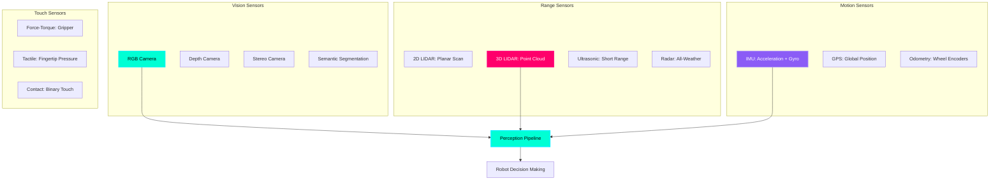
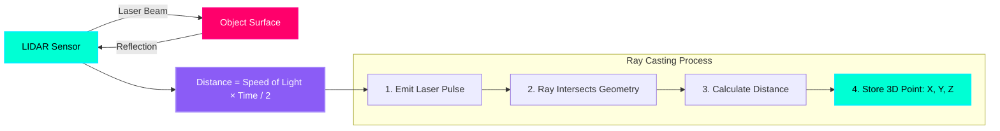

# Simulating Eyes & Ears: Robot Sensors

## Why Simulate Sensors?

Real sensors are **expensive** and **fragile**:
- **LIDAR**: $1,000 - $75,000 (Velodyne VLP-16 to HDL-64E)
- **Stereo Camera**: $200 - $2,000 (Intel RealSense to ZED 2)
- **IMU**: $50 - $5,000 (MPU-6050 to Xsens MTi)

In simulation, you can:
- **Test 100 sensor configurations** before buying hardware
- **Generate millions of training images** for perception models (object detection, segmentation)
- **Simulate sensor failures** (camera occlusion, LIDAR noise, IMU drift)

:::info Real-World Example
Waymo's self-driving cars trained on **20 billion miles** of simulated driving before hitting real roads. Simulated cameras and LIDAR generated synthetic datasets for their perception neural networks.
:::

---

## Sensor Types Overview



**Most Common for Humanoids:**
1. **RGB Camera**: Color images (640×480 to 4K)
2. **Depth Camera**: Distance to each pixel (RGB-D)
3. **3D LIDAR**: 360° point cloud (millions of 3D points)
4. **IMU**: 6-axis motion (3-axis accel + 3-axis gyro)

---

## How LIDAR Works: Ray Casting

**LIDAR (Light Detection And Ranging)** fires laser beams and measures return time:



**Simulation Steps:**
1. **Emit Ray**: Shoot virtual laser from LIDAR position at angle θ
2. **Ray Intersection**: Find first object hit by ray
3. **Calculate Distance**: Measure distance from LIDAR to hit point
4. **Store Point**: Record (x, y, z) in sensor frame
5. **Repeat**: Scan 360° with thousands of rays (e.g., 16 beams × 1024 points/beam = 16,384 points)

**Point Cloud Output:**
```
Point 0: x=2.5, y=0.3, z=0.1, intensity=0.8
Point 1: x=2.4, y=0.4, z=0.1, intensity=0.9
Point 2: x=2.3, y=0.5, z=0.2, intensity=0.7
...
```

---

## Adding a Camera to Your Robot

### Step 1: Define Camera in URDF

```xml
<?xml version="1.0"?>
<robot name="robot_with_camera">
  
  <!-- Existing robot links here (base, torso, head, etc.) -->
  
  <!-- Camera Link -->
  <link name="camera_link">
    <visual>
      <geometry>
        <box size="0.05 0.05 0.03"/>  <!-- 5cm × 5cm × 3cm camera box -->
      </geometry>
      <material name="black">
        <color rgba="0.1 0.1 0.1 1"/>
      </material>
    </visual>
    <collision>
      <geometry>
        <box size="0.05 0.05 0.03"/>
      </geometry>
    </collision>
    <inertial>
      <mass value="0.1"/>  <!-- 100 grams -->
      <inertia ixx="0.0001" ixy="0" ixz="0"
               iyy="0.0001" iyz="0"
               izz="0.0001"/>
    </inertial>
  </link>

  <!-- Camera Joint (Fixed to head) -->
  <joint name="camera_joint" type="fixed">
    <parent link="head_link"/>
    <child link="camera_link"/>
    <origin xyz="0.05 0 0.1" rpy="0 0 0"/>  <!-- 5cm forward, 10cm up from head -->
  </joint>

  <!-- Camera Sensor (Gazebo Plugin) -->
  <gazebo reference="camera_link">
    <sensor type="camera" name="front_camera">
      <update_rate>30.0</update_rate>  <!-- 30 FPS -->
      <camera name="head_camera">
        <horizontal_fov>1.5708</horizontal_fov>  <!-- 90° FOV (π/2 radians) -->
        <image>
          <width>640</width>
          <height>480</height>
          <format>R8G8B8</format>  <!-- RGB (no alpha channel) -->
        </image>
        <clip>
          <near>0.1</near>  <!-- Minimum distance: 10cm -->
          <far>100</far>    <!-- Maximum distance: 100m -->
        </clip>
        <noise>
          <type>gaussian</type>
          <mean>0.0</mean>
          <stddev>0.007</stddev>  <!-- Simulate sensor noise -->
        </noise>
      </camera>
      
      <plugin name="camera_controller" filename="libgazebo_ros_camera.so">
        <ros>
          <namespace>/robot</namespace>
          <remapping>image_raw:=camera/image_raw</remapping>
          <remapping>camera_info:=camera/camera_info</remapping>
        </ros>
        <camera_name>front_camera</camera_name>
        <frame_name>camera_link</frame_name>
      </plugin>
    </sensor>
  </gazebo>

</robot>
```

---

### Camera Parameter Breakdown

**`<horizontal_fov>` (Field of View):**
- **1.5708 rad** = 90° (wide-angle, like human peripheral vision)
- **0.7854 rad** = 45° (narrow, telephoto lens)
- Wider FOV sees more but with lower detail per degree

**`<image>` (Resolution):**
- **640×480**: Standard VGA (fast, low detail)
- **1920×1080**: Full HD (detailed, 3× slower to process)
- **3840×2160**: 4K (cinematic, 10× slower)

**`<clip>` (Depth Range):**
- **near=0.1m**: Objects closer than 10cm are invisible (prevents seeing inside robot's head)
- **far=100m**: Objects beyond 100m are not rendered (performance optimization)

**`<noise>` (Sensor Realism):**
- **stddev=0.007**: Adds Gaussian noise (7 intensity units on 0-255 scale)
- Simulates CCD sensor noise, lens distortion, compression artifacts

---

### Step 2: View Camera Feed

```bash
# Launch Gazebo with your robot
ros2 launch my_robot_description gazebo.launch.py

# In another terminal, view camera stream
ros2 run rqt_image_view rqt_image_view
# Select topic: /robot/camera/image_raw
```

**Expected Output:** Real-time video stream from robot's camera POV.

---

## Adding LIDAR to Your Robot

### Step 1: Define 2D LIDAR in URDF

```xml
<!-- LIDAR Link (Spinning Sensor) -->
<link name="lidar_link">
  <visual>
    <geometry>
      <cylinder radius="0.05" length="0.07"/>  <!-- 5cm diameter, 7cm tall -->
    </geometry>
    <material name="blue">
      <color rgba="0 0 0.8 1"/>
    </material>
  </visual>
  <collision>
    <geometry>
      <cylinder radius="0.05" length="0.07"/>
    </geometry>
  </collision>
  <inertial>
    <mass value="0.5"/>  <!-- 500 grams -->
    <inertia ixx="0.001" ixy="0" ixz="0"
             iyy="0.001" iyz="0"
             izz="0.0005"/>
  </inertial>
</link>

<!-- LIDAR Joint (Fixed on top of robot) -->
<joint name="lidar_joint" type="fixed">
  <parent link="base_link"/>
  <child link="lidar_link"/>
  <origin xyz="0 0 0.3" rpy="0 0 0"/>  <!-- 30cm above base -->
</joint>

<!-- LIDAR Sensor (Gazebo Plugin) -->
<gazebo reference="lidar_link">
  <sensor type="ray" name="lidar_sensor">
    <pose>0 0 0 0 0 0</pose>
    <visualize>true</visualize>  <!-- Show rays in Gazebo GUI -->
    <update_rate>10</update_rate>  <!-- 10 Hz scan rate -->
    
    <ray>
      <scan>
        <horizontal>
          <samples>720</samples>  <!-- 720 rays per scan -->
          <resolution>1</resolution>
          <min_angle>-3.14159</min_angle>  <!-- -π radians = -180° -->
          <max_angle>3.14159</max_angle>   <!-- +π radians = +180° -->
        </horizontal>
      </scan>
      <range>
        <min>0.1</min>  <!-- Minimum range: 10cm -->
        <max>30.0</max>  <!-- Maximum range: 30m -->
        <resolution>0.01</resolution>  <!-- 1cm accuracy -->
      </range>
      <noise>
        <type>gaussian</type>
        <mean>0.0</mean>
        <stddev>0.01</stddev>  <!-- 1cm noise -->
      </noise>
    </ray>
    
    <plugin name="lidar_controller" filename="libgazebo_ros_ray_sensor.so">
      <ros>
        <namespace>/robot</namespace>
        <remapping>~/out:=scan</remapping>
      </ros>
      <output_type>sensor_msgs/LaserScan</output_type>
      <frame_name>lidar_link</frame_name>
    </plugin>
  </sensor>
</gazebo>
```

---

### LIDAR Parameter Breakdown

**`<samples>720</samples>`**
- 720 rays per 360° scan = **0.5° angular resolution**
- More samples = denser point cloud but slower processing

**`<min_angle>` / `<max_angle>`**
- **-π to +π**: Full 360° scan (robot sees all around)
- **-π/4 to +π/4**: 90° forward-facing scan (blindspot behind)

**`<range>` (Distance Limits)**
- **min=0.1m**: Ignores objects closer than 10cm (avoids self-detection)
- **max=30.0m**: Effective range (real LIDAR: 10m to 200m depending on model)

**Message Type: `sensor_msgs/LaserScan`**
```python
# ROS 2 LaserScan message structure
Header header
float32 angle_min        # -π
float32 angle_max        # +π
float32 angle_increment  # π/360 = 0.00873 rad (0.5°)
float32 time_increment   # Time between rays (1/720/10Hz = 0.00014s)
float32 scan_time        # Total scan time (0.1s at 10Hz)
float32 range_min        # 0.1m
float32 range_max        # 30.0m
float32[] ranges         # [2.5, 2.4, 2.3, ...] (720 distances)
float32[] intensities    # [0.8, 0.9, 0.7, ...] (reflection strength)
```

---

### Step 2: Visualize LIDAR in RViz

```bash
# Launch robot in Gazebo
ros2 launch my_robot_description gazebo.launch.py

# Launch RViz
ros2 run rviz2 rviz2

# In RViz:
# 1. Add > LaserScan
# 2. Topic: /robot/scan
# 3. Fixed Frame: base_link
# 4. Size: 0.05 (point size)
# 5. Color: Rainbow (by intensity)
```

**Expected Output:** Red dots showing obstacles detected by LIDAR, updating in real-time.

---

## Adding 3D LIDAR (Velodyne-Style)

For **3D point clouds** (used in self-driving cars):

```xml
<gazebo reference="lidar_link">
  <sensor type="ray" name="velodyne_sensor">
    <pose>0 0 0 0 0 0</pose>
    <visualize>false</visualize>  <!-- Too many rays, disable visualization -->
    <update_rate>10</update_rate>
    
    <ray>
      <scan>
        <horizontal>
          <samples>1024</samples>  <!-- 1024 rays per horizontal scan -->
          <min_angle>-3.14159</min_angle>
          <max_angle>3.14159</max_angle>
        </horizontal>
        <vertical>
          <samples>16</samples>  <!-- 16 vertical layers (like Velodyne VLP-16) -->
          <min_angle>-0.2618</min_angle>  <!-- -15° down -->
          <max_angle>0.2618</max_angle>   <!-- +15° up -->
        </vertical>
      </scan>
      <range>
        <min>0.5</min>
        <max>100.0</max>  <!-- 100m range -->
        <resolution>0.01</resolution>
      </range>
    </ray>
    
    <plugin name="velodyne_controller" filename="libgazebo_ros_velodyne_laser.so">
      <ros>
        <namespace>/robot</namespace>
        <remapping>~/out:=velodyne_points</remapping>
      </ros>
      <output_type>sensor_msgs/PointCloud2</output_type>
      <frame_name>lidar_link</frame_name>
    </plugin>
  </sensor>
</gazebo>
```

**Output:** `sensor_msgs/PointCloud2` with **16,384 points per scan** (1024 horizontal × 16 vertical).

---

## Understanding Point Clouds

A **point cloud** is a set of 3D points representing surfaces:

```python
# Example: Processing point cloud in Python
import rclpy
from sensor_msgs.msg import PointCloud2
import sensor_msgs_py.point_cloud2 as pc2

class PointCloudProcessor(Node):
    def __init__(self):
        super().__init__('pc_processor')
        self.subscription = self.create_subscription(
            PointCloud2,
            '/robot/velodyne_points',
            self.pointcloud_callback,
            10
        )
    
    def pointcloud_callback(self, msg):
        # Convert ROS PointCloud2 to list of (x, y, z, intensity)
        points = list(pc2.read_points(msg, field_names=("x", "y", "z", "intensity")))
        
        # Filter points: Only objects within 5 meters
        close_points = [p for p in points if p[0]**2 + p[1]**2 + p[2]**2 < 25]
        
        self.get_logger().info(f'Total points: {len(points)}, Close points: {len(close_points)}')
```

**Point Cloud Visualization in RViz:**
```
Add > PointCloud2
Topic: /robot/velodyne_points
Color Transformer: Intensity
Size (m): 0.01
```

---

## Adding an IMU (Inertial Measurement Unit)

IMU measures **linear acceleration** (3 axes) and **angular velocity** (3 axes):

```xml
<!-- IMU Link (Tiny sensor, no visual needed) -->
<link name="imu_link">
  <inertial>
    <mass value="0.01"/>  <!-- 10 grams -->
    <inertia ixx="0.0001" ixy="0" ixz="0"
             iyy="0.0001" iyz="0"
             izz="0.0001"/>
  </inertial>
</link>

<!-- IMU Joint (Fixed to torso) -->
<joint name="imu_joint" type="fixed">
  <parent link="torso_link"/>
  <child link="imu_link"/>
  <origin xyz="0 0 0" rpy="0 0 0"/>  <!-- Center of mass -->
</joint>

<!-- IMU Sensor (Gazebo Plugin) -->
<gazebo reference="imu_link">
  <sensor name="imu_sensor" type="imu">
    <always_on>true</always_on>
    <update_rate>100</update_rate>  <!-- 100 Hz (standard for IMU) -->
    
    <plugin name="imu_plugin" filename="libgazebo_ros_imu_sensor.so">
      <ros>
        <namespace>/robot</namespace>
        <remapping>~/out:=imu</remapping>
      </ros>
      <frame_name>imu_link</frame_name>
      
      <!-- Noise parameters (realistic sensor characteristics) -->
      <initial_orientation_as_reference>false</initial_orientation_as_reference>
      
      <!-- Accelerometer noise -->
      <gaussian_noise>0.01</gaussian_noise>  <!-- 0.01 m/s² noise -->
      
      <!-- Gyroscope noise -->
      <angular_velocity_stdev>0.0002</angular_velocity_stdev>  <!-- 0.0002 rad/s noise -->
      
      <!-- Orientation noise -->
      <orientation_stdev>0.001</orientation_stdev>
    </plugin>
  </sensor>
</gazebo>
```

**IMU Message (`sensor_msgs/Imu`):**
```python
Header header
geometry_msgs/Quaternion orientation  # Roll, pitch, yaw (as quaternion)
float64[9] orientation_covariance     # Uncertainty in orientation
geometry_msgs/Vector3 angular_velocity  # Rotation rates: x, y, z (rad/s)
float64[9] angular_velocity_covariance
geometry_msgs/Vector3 linear_acceleration  # Accel: x, y, z (m/s²)
float64[9] linear_acceleration_covariance
```

**Use Case:** Detect when robot is falling (large angular velocity) or colliding (sudden acceleration spike).

---

## Hands-On Exercise: Multi-Sensor Robot

**Challenge:** Create a robot with:
1. **Front-facing camera** (640×480, 30 FPS)
2. **360° 2D LIDAR** (720 samples, 10 Hz)
3. **IMU** (100 Hz)

**Verification Steps:**
```bash
# Launch robot
ros2 launch my_robot_description gazebo.launch.py

# Check topics
ros2 topic list
# Expected:
# /robot/camera/image_raw
# /robot/scan
# /robot/imu

# Monitor data rates
ros2 topic hz /robot/camera/image_raw  # ~30 Hz
ros2 topic hz /robot/scan              # ~10 Hz
ros2 topic hz /robot/imu               # ~100 Hz
```

---

## Key Takeaways

✅ **Cameras** provide RGB images (30-60 FPS, 640×480 to 4K resolution)  
✅ **LIDAR** generates point clouds via ray casting (2D planar or 3D volumetric)  
✅ **IMU** measures acceleration and rotation (100-1000 Hz for fast dynamics)  
✅ **Gazebo plugins** (`libgazebo_ros_camera.so`, `libgazebo_ros_ray_sensor.so`) publish sensor data to ROS 2  
✅ **Noise parameters** add realism (Gaussian noise on range/intensity/acceleration)  
✅ **Point clouds** are sets of (x, y, z, intensity) points representing surfaces  

---

## What's Next?

You've mastered simulation fundamentals (physics, rendering, sensors). The next module covers **Module 3: The AI Brain**—where you'll integrate vision-language models (VLMs) like GPT-4V to give robots **reasoning abilities**: "Pick up the red mug on the left table."

---

## Further Reading

- [Gazebo Sensor Plugins](http://classic.gazebosim.org/tutorials?tut=ros_gzplugins#Camera)
- [ROS 2 sensor_msgs Documentation](https://docs.ros.org/en/humble/p/sensor_msgs/)
- [Point Cloud Library (PCL)](https://pointclouds.org/)
- [Open3D for Point Cloud Processing](http://www.open3d.org/)
- [LIDAR Principles (Velodyne)](https://velodynelidar.com/blog/lidar-101-an-introduction-to-lidar-technology/)
