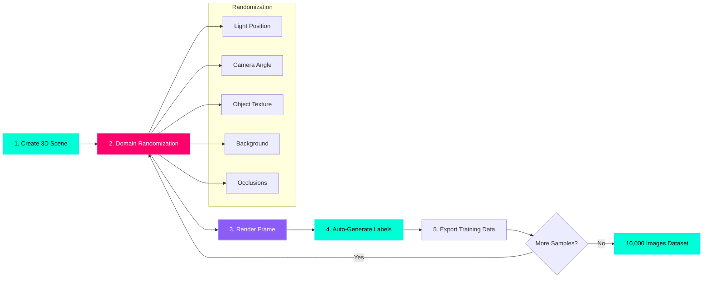

# NVIDIA Isaac Sim: The Synthetic Data Factory

## The Training Data Bottleneck

Training a vision model to detect objects requires **thousands of labeled images**:
- **Manual labeling**: 1 image every 30 seconds = 83 hours for 10,000 images
- **Cost**: $0.10 per image × 10,000 = $1,000
- **Real-world collection**: Camera setup, lighting variations, 100s of physical objects

**Isaac Sim solution:** Generate **10,000 photorealistic labeled images in 1 hour** with automatic annotation.

:::info Real-World Example
Amazon uses **synthetic data** to train pick-and-place robots. They generate millions of images of warehouse items with randomized poses, lighting, and occlusions—achieving **95%+ real-world accuracy** without manual labeling.
:::

---

## The Synthetic Data Generation Pipeline



**Pipeline Steps:**
1. **Create 3D Scene**: Import CAD model of object (screw, bolt, tool) in USD format
2. **Domain Randomization**: Vary lighting, camera pose, textures, backgrounds
3. **Render Frame**: Photorealistic ray-traced image (1920×1080 or higher)
4. **Auto-Generate Labels**: Bounding boxes, segmentation masks, depth maps
5. **Export**: COCO format JSON + PNG images ready for PyTorch/TensorFlow

**Key Advantage:** Labels are **perfectly accurate** (no human error) and generation is **massively parallel** on GPU.

---

## What is NVIDIA Omniverse?

**Omniverse** is a platform for physically-accurate simulation and collaboration:
- **USD (Universal Scene Description)**: Pixar's open-source 3D scene format
- **RTX Ray Tracing**: Photorealistic rendering on NVIDIA GPUs
- **Isaac Sim**: Robotics simulator built on Omniverse
- **PhysX**: Physics engine for realistic object interactions

**Isaac Sim = Omniverse + ROS 2 + Robotics-Specific Tools**

---

## USD Files: The Universal Scene Format

**USD** (from Pixar Animation Studios) is the "HTML for 3D":

```python
#usda 1.0
(
    defaultPrim = "Screw"
    upAxis = "Y"
)

def Xform "Screw" {
    def Mesh "ScrewMesh" {
        float3[] points = [(0, 0, 0), (1, 0, 0), ...] # Vertex positions
        int[] faceVertexCounts = [3, 3, 3, ...] # Triangles
        int[] faceVertexIndices = [0, 1, 2, ...] # Vertex order
        
        # Material assignment
        rel material:binding = </Materials/Steel>
    }
}

def Material "Steel" {
    token outputs:surface.connect = </Materials/Steel/Shader.outputs:surface>
    
    def Shader "Shader" {
        uniform token info:id = "UsdPreviewSurface"
        color3f inputs:diffuseColor = (0.7, 0.7, 0.7) # Gray steel
        float inputs:metallic = 0.9 # Very metallic
        float inputs:roughness = 0.3 # Slightly rough
    }
}
```

**Key Features:**
- **Hierarchical**: Objects can be nested (robot → arm → gripper → finger)
- **Layered**: Combine multiple USD files (base scene + randomizations)
- **Streaming**: Load only visible parts of massive scenes
- **Collaborative**: Multiple artists can edit the same scene simultaneously

---

## Installing NVIDIA Isaac Sim

### System Requirements

| Component | Minimum | Recommended |
|-----------|---------|-------------|
| **GPU** | RTX 2070 (8GB VRAM) | RTX 4080 (16GB VRAM) |
| **CPU** | Intel i7-9700K | Intel i9-13900K |
| **RAM** | 32GB | 64GB |
| **Storage** | 50GB SSD | 500GB NVMe SSD |
| **OS** | Ubuntu 20.04/22.04 | Ubuntu 22.04 LTS |

:::warning RTX GPU Required
Isaac Sim requires **NVIDIA RTX GPU** for ray tracing. AMD GPUs and Intel Arc are not supported. Minimum RTX 2070 (2019 or newer).
:::

---

### Installation Steps

**Method 1: Omniverse Launcher (Recommended)**

```bash
# 1. Download Omniverse Launcher
wget https://install.launcher.omniverse.nvidia.com/installers/omniverse-launcher-linux.AppImage

# 2. Make executable
chmod +x omniverse-launcher-linux.AppImage

# 3. Run launcher
./omniverse-launcher-linux.AppImage

# 4. In launcher GUI:
#    - Sign in with NVIDIA account (free)
#    - Library > Install "Isaac Sim" (version 2023.1.1 or later)
#    - Wait for 20GB download + installation
```

**Method 2: Docker (For Headless Servers)**

```bash
# Pull Isaac Sim container
docker pull nvcr.io/nvidia/isaac-sim:2023.1.1

# Run with GPU support
docker run --gpus all -it \
  -v ~/isaac_sim_data:/workspace/data \
  nvcr.io/nvidia/isaac-sim:2023.1.1
```

---

## Generating Synthetic Data: Screw Detection Example

### Step 1: Create Base Scene

**Python script: `create_scene.py`**

```python
from omni.isaac.kit import SimulationApp

# Initialize Isaac Sim
simulation_app = SimulationApp({"headless": False})  # Set True for no GUI

from omni.isaac.core import World
from omni.isaac.core.utils.stage import add_reference_to_stage
import omni.replicator.core as rep

# Create world
world = World()
world.scene.add_default_ground_plane()

# Import screw CAD model (converted to USD)
screw_prim = add_reference_to_stage(
    usd_path="/workspace/assets/screw_m6.usd",
    prim_path="/World/Screw"
)

# Add camera
camera = rep.create.camera(
    position=(0.5, 0.5, 0.3),  # 50cm away, 30cm high
    look_at=(0, 0, 0.05)  # Look at screw center
)

# Add lights
light = rep.create.light(
    light_type="Dome",  # Environment HDRI lighting
    intensity=1000,
    texture="omniverse://localhost/NVIDIA/Assets/Skies/Clear/noon_grass_4k.hdr"
)

print("Scene created. Ready for data generation.")
```

---

### Step 2: Domain Randomization

**The secret to generalization:** Train on **infinite variations** so model works in any condition.

```python
import omni.replicator.core as rep
import random

# Randomization configuration
with rep.trigger.on_frame(num_frames=10000):  # Generate 10,000 images
    
    # 1. RANDOMIZE CAMERA POSE
    with camera:
        rep.modify.pose(
            position=rep.distribution.uniform((0.3, 0.3, 0.2), (0.7, 0.7, 0.4)),
            look_at=(0, 0, 0.05)
        )
    
    # 2. RANDOMIZE LIGHTING
    with light:
        rep.modify.attribute(
            "intensity", 
            rep.distribution.uniform(500, 2000)  # 500-2000 lumens
        )
        rep.modify.attribute(
            "color",
            rep.distribution.uniform((0.8, 0.8, 0.8), (1.0, 1.0, 1.0))  # Slight color tint
        )
    
    # 3. RANDOMIZE OBJECT POSE
    with screw_prim:
        rep.modify.pose(
            position=rep.distribution.uniform((-0.05, -0.05, 0), (0.05, 0.05, 0.1)),
            rotation=rep.distribution.uniform((0, 0, 0), (360, 360, 360))  # Random rotation
        )
    
    # 4. RANDOMIZE MATERIAL (TEXTURE)
    materials = [
        "/Materials/Steel_Brushed",
        "/Materials/Steel_Galvanized",
        "/Materials/Steel_Rusted",
        "/Materials/Brass",
        "/Materials/Aluminum"
    ]
    with screw_prim:
        rep.randomizer.materials(materials)
    
    # 5. RANDOMIZE BACKGROUND
    backgrounds = [
        "/Backgrounds/Workbench_Wood",
        "/Backgrounds/Concrete_Floor",
        "/Backgrounds/Metal_Plate",
        "/Backgrounds/Cardboard_Box"
    ]
    with rep.get.prims(path_pattern="/World/GroundPlane"):
        rep.randomizer.materials(backgrounds)

print("Randomization configured for 10,000 variations.")
```

---

### Step 3: Generate Labels and Export

```python
# Setup output writers
render = rep.AnnotatorRegistry.get_annotator("rgb")  # RGB image
bbox = rep.AnnotatorRegistry.get_annotator("bounding_box_2d_tight")  # Bounding boxes
semantic = rep.AnnotatorRegistry.get_annotator("semantic_segmentation")  # Pixel masks
depth = rep.AnnotatorRegistry.get_annotator("distance_to_camera")  # Depth map

# Write to disk in COCO format
rep.WriterRegistry.register(rep.writers.KittiWriter)
writer = rep.WriterRegistry.get("KittiWriter")
writer.initialize(
    output_dir="/workspace/data/screw_dataset",
    rgb=True,
    bounding_box_2d_tight=True,
    semantic_segmentation=True,
    distance_to_camera=True
)

# Start generation
rep.orchestrator.run()

# Isaac Sim will now render 10,000 frames (takes ~30-60 minutes on RTX 4080)
```

**Output Directory Structure:**
```
/workspace/data/screw_dataset/
├── rgb/
│   ├── 0000.png
│   ├── 0001.png
│   ├── ...
│   └── 9999.png
├── bounding_box_2d_tight/
│   ├── 0000.json  # {"bbox": [x, y, width, height], "class": "screw"}
│   ├── 0001.json
│   └── ...
├── semantic_segmentation/
│   ├── 0000.png  # Pixel-level labels (screw=1, background=0)
│   └── ...
└── distance_to_camera/
    ├── 0000.npy  # Depth map (32-bit float, meters)
    └── ...
```

---

## Training a Detector on Synthetic Data

Once you have the dataset, train with PyTorch:

```python
from detectron2.engine import DefaultTrainer
from detectron2.config import get_cfg
from detectron2 import model_zoo

# Configure COCO-pretrained Faster R-CNN
cfg = get_cfg()
cfg.merge_from_file(model_zoo.get_config_file("COCO-Detection/faster_rcnn_R_50_FPN_3x.yaml"))
cfg.DATASETS.TRAIN = ("screw_synthetic_train",)
cfg.DATASETS.TEST = ("screw_synthetic_val",)
cfg.DATALOADER.NUM_WORKERS = 4
cfg.MODEL.WEIGHTS = model_zoo.get_checkpoint_url("COCO-Detection/faster_rcnn_R_50_FPN_3x.yaml")
cfg.SOLVER.IMS_PER_BATCH = 16
cfg.SOLVER.BASE_LR = 0.001
cfg.SOLVER.MAX_ITER = 5000  # 5,000 iterations for 10,000 images
cfg.MODEL.ROI_HEADS.NUM_CLASSES = 1  # Only "screw" class

# Train
trainer = DefaultTrainer(cfg)
trainer.resume_or_load(resume=False)
trainer.train()

# Test on real images
cfg.MODEL.WEIGHTS = os.path.join(cfg.OUTPUT_DIR, "model_final.pth")
predictor = DefaultPredictor(cfg)
outputs = predictor(real_image)  # Detects screws in real photos!
```

**Expected Results:**
- **Synthetic-only training**: 85-90% mAP on real images (with good randomization)
- **Mixed training** (synthetic + 1,000 real): 95%+ mAP
- **Training time**: 2-3 hours on RTX 4080 for 10,000 images

---

## Domain Randomization Best Practices

| Parameter | Too Little | Too Much | Sweet Spot |
|-----------|------------|----------|------------|
| **Camera Distance** | Fixed 50cm | 10cm to 5m | 30cm to 1m |
| **Lighting Intensity** | Fixed 1000 lumens | 100 to 10,000 | 500 to 2000 |
| **Object Rotations** | Only upright | Full 360° all axes | ±30° tilt, full yaw |
| **Background Textures** | 1 texture | 1000 textures | 5-10 representative |
| **Occlusions** | None | 90% covered | 10-40% covered |

**Golden Rule:** Randomize **everything the model will see in reality**, but keep ranges **realistic**.

---

## Hands-On Exercise: Generate Your Dataset

**Challenge:** Generate 1,000 images of a **coffee mug** for a household robot gripper.

**Steps:**
1. Download a free 3D mug model (TurboSquid, Sketchfab)
2. Convert to USD format (Blender → USD exporter)
3. Modify `create_scene.py` to use mug instead of screw
4. Add randomization:
   - Camera: 30-80cm distance, ±20° viewing angle
   - Lighting: Kitchen HDRI (morning/afternoon/evening)
   - Mug pose: Random rotation on table
   - Backgrounds: Wood table, granite countertop, metal tray
5. Run generation script

**Verification:**
```bash
ls /workspace/data/mug_dataset/rgb/ | wc -l  # Should output: 1000
```

---

## Key Takeaways

✅ **Isaac Sim generates photorealistic labeled data** (10K images in 1 hour)  
✅ **USD format** is the standard for 3D scenes (like HTML for 3D)  
✅ **Domain randomization** is critical for sim-to-real transfer  
✅ **Automatic labeling** eliminates manual annotation cost ($0 vs $1,000)  
✅ **RTX GPU required** for ray-traced rendering (RTX 2070 minimum)  
✅ **COCO format output** works with PyTorch Detectron2, TensorFlow, YOLOv8  

---

## What's Next?

You've mastered synthetic data generation. The next chapter covers **Nav2 and Visual SLAM**—how robots build maps and navigate autonomously using cameras and LIDAR, enabling commands like "Go to the kitchen."

---

## Further Reading

- [Isaac Sim Documentation](https://docs.omniverse.nvidia.com/isaacsim/latest/)
- [Omniverse Replicator (Synthetic Data)](https://docs.omniverse.nvidia.com/extensions/latest/ext_replicator.html)
- [USD Format Specification](https://openusd.org/release/index.html)
- [Domain Randomization Paper (OpenAI)](https://arxiv.org/abs/1703.06907)
- [COCO Dataset Format](https://cocodataset.org/#format-data)
