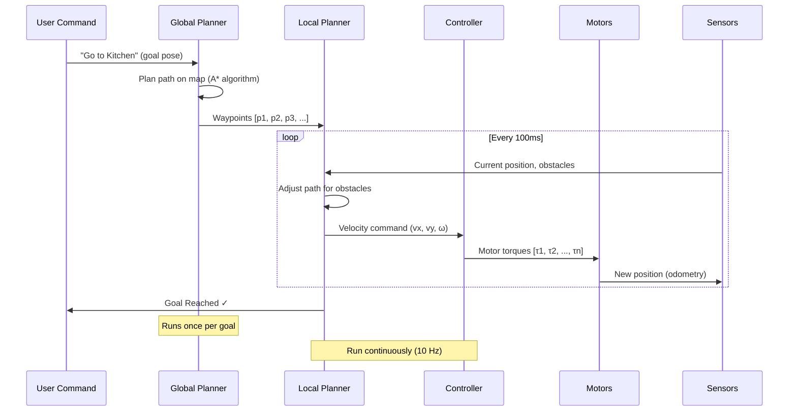

# Navigation & Visual SLAM: Teaching Robots to Find Their Way

## The Navigation Problem

A humanoid robot in your home needs to answer: **"Where am I?" and "How do I get there?"**

Traditional solutions:
- **GPS**: Doesn't work indoors (blocked by roof)
- **Motion Capture**: Requires expensive external cameras ($50K+ Vicon system)
- **Pre-mapped Environment**: Breaks when you move furniture

**Modern solution:** **SLAM (Simultaneous Localization and Mapping)** using onboard sensors—build a map **while** figuring out your position on it.

:::info Real-World Example
Amazon warehouse robots use LIDAR SLAM to navigate 1 million+ square feet autonomously. Tesla Optimus humanoid uses **Visual SLAM** (camera-only) for household navigation—no LIDAR needed.
:::

---

## The Nav2 Stack: How Robots Navigate

**Nav2** (Navigation 2) is ROS 2's autonomous navigation framework:



**Component Breakdown:**

1. **Global Planner** (cyan): 
   - **Input**: Map + goal position ("Kitchen at x=5, y=3")
   - **Output**: High-level path (waypoints every 50cm)
   - **Algorithm**: A* or Dijkstra (finds shortest obstacle-free path)
   - **Frequency**: Runs once per goal, replans if map changes

2. **Local Planner** (magenta):
   - **Input**: Waypoints + real-time sensor data (LIDAR, camera)
   - **Output**: Short-term trajectory (1 second ahead)
   - **Algorithm**: Dynamic Window Approach (DWA) or Timed Elastic Band (TEB)
   - **Frequency**: 10 Hz (every 100ms)
   - **Purpose**: Avoid dynamic obstacles (humans, pets, other robots)

3. **Controller** (purple):
   - **Input**: Desired velocity (vx=0.5 m/s forward, ω=0.2 rad/s turn left)
   - **Output**: Motor commands (wheel speeds or joint torques)
   - **Frequency**: 100-1000 Hz (low-level control loop)

4. **Sensors** (cyan):
   - **Position**: IMU + wheel odometry + SLAM localization
   - **Obstacles**: LIDAR scan (2D/3D point clouds) or depth camera

---

## LIDAR SLAM vs Visual SLAM (VSLAM)

### LIDAR SLAM (Traditional)

**How it works:**
1. Spin 2D/3D LIDAR to scan environment
2. Match current scan to previous scans (point cloud registration)
3. Estimate robot motion from scan alignment
4. Build 2D occupancy grid map (white=free space, black=obstacle)

**Pros:**
- ✅ Works in any lighting (infrared laser)
- ✅ Accurate distance measurements (±1cm)
- ✅ Fast processing (simple geometry)

**Cons:**
- ❌ Expensive ($1,000 for 2D, $10,000+ for 3D)
- ❌ Mechanical (spinning parts wear out)
- ❌ No texture/color information (can't distinguish objects)

---

### Visual SLAM (VSLAM) - Camera-Based

**How it works:**
1. Extract **keypoints** from camera images (corners, edges using ORB/SIFT)
2. Match keypoints across frames to estimate camera motion
3. Triangulate 3D positions of keypoints (Structure from Motion)
4. Optimize camera trajectory and 3D map jointly (Bundle Adjustment)

**Pros:**
- ✅ Cheap ($50-$200 stereo camera vs $1,000+ LIDAR)
- ✅ No moving parts (solid-state)
- ✅ Rich visual information (can recognize objects, read signs)

**Cons:**
- ❌ Fails in low light or textureless environments (white walls)
- ❌ Scale ambiguity with monocular cameras (needs stereo or IMU)
- ❌ Higher compute (image processing is GPU-intensive)

---

## Setting Up isaac_ros_visual_slam

**isaac_ros_visual_slam** is NVIDIA's GPU-accelerated Visual SLAM:
- **10× faster** than CPU-based ORB-SLAM3
- **Stereo or monocular** camera support
- **IMU fusion** for robust tracking

### Installation

```bash
# 1. Install Isaac ROS (requires NVIDIA Jetson or RTX GPU)
sudo apt install ros-humble-isaac-ros-visual-slam

# 2. Install dependencies
sudo apt install ros-humble-realsense2-camera  # For Intel RealSense
sudo apt install ros-humble-image-proc
```

---

### Launch VSLAM with RealSense Camera

**Create launch file: `vslam_realsense.launch.py`**

```python
from launch import LaunchDescription
from launch_ros.actions import Node

def generate_launch_description():
    return LaunchDescription([
        # 1. Start RealSense camera node
        Node(
            package='realsense2_camera',
            executable='realsense2_camera_node',
            name='camera',
            parameters=[{
                'depth_module.profile': '640x480x30',  # Depth: 640×480 @ 30 FPS
                'rgb_camera.profile': '640x480x30',    # RGB: 640×480 @ 30 FPS
                'enable_sync': True,  # Synchronize depth and RGB
                'align_depth.enable': True,  # Align depth to RGB frame
            }],
            remappings=[
                ('/camera/color/image_raw', '/camera/rgb/image_raw'),
                ('/camera/depth/image_rect_raw', '/camera/depth/image_raw'),
            ]
        ),
        
        # 2. Start Visual SLAM node
        Node(
            package='isaac_ros_visual_slam',
            executable='isaac_ros_visual_slam',
            name='visual_slam',
            parameters=[{
                'enable_image_denoising': True,  # Reduce noise
                'rectified_images': True,  # Assume calibrated camera
                'enable_imu_fusion': False,  # Set True if IMU available
                'enable_observations_view': True,  # Publish keypoints for debug
                'enable_slam_visualization': True,  # Publish map for RViz
                'path_max_size': 1024,  # Remember last 1024 poses
            }],
            remappings=[
                ('stereo_camera/left/image', '/camera/rgb/image_raw'),
                ('stereo_camera/left/camera_info', '/camera/rgb/camera_info'),
                ('stereo_camera/right/image', '/camera/depth/image_raw'),
                ('stereo_camera/right/camera_info', '/camera/depth/camera_info'),
            ]
        ),
        
        # 3. Publish static transform (camera to robot base)
        Node(
            package='tf2_ros',
            executable='static_transform_publisher',
            name='camera_tf',
            arguments=['0', '0', '0.15', '0', '0', '0', 'base_link', 'camera_link']
            # Camera is 15cm above base_link, no rotation
        ),
    ])
```

---

### Run VSLAM

```bash
# Terminal 1: Launch VSLAM
ros2 launch my_robot vslam_realsense.launch.py

# Terminal 2: Visualize in RViz
ros2 run rviz2 rviz2

# In RViz:
# 1. Fixed Frame: "odom"
# 2. Add > TF (see camera pose updating)
# 3. Add > Map (see 3D point cloud map)
# 4. Add > Path (see robot trajectory)
```

**Expected Output:**
- Camera pose updates at 30 Hz
- 3D map of keypoints appears (green dots)
- Robot trajectory shown as red line

---

## Commanding the Robot: "Go to Kitchen"

Once you have a map, use **Nav2** to navigate autonomously.

### Step 1: Save the Map

```bash
# While VSLAM is running, save map
ros2 service call /visual_slam/save_map isaac_ros_visual_slam_interfaces/srv/FilePath "{file_path: '/home/user/maps/home_map.yaml'}"
```

**Map file structure:**
```yaml
# home_map.yaml
image: home_map.pgm  # Occupancy grid (white=free, black=occupied)
resolution: 0.05  # 5cm per pixel
origin: [-10.0, -10.0, 0.0]  # Map origin in meters
occupied_thresh: 0.65  # Pixel darker than 65% = obstacle
free_thresh: 0.2  # Pixel lighter than 20% = free space
```

---

### Step 2: Launch Nav2 Stack

```bash
# Install Nav2
sudo apt install ros-humble-navigation2 ros-humble-nav2-bringup

# Launch Nav2 with your map
ros2 launch nav2_bringup bringup_launch.py \
  map:=/home/user/maps/home_map.yaml \
  use_sim_time:=False
```

**Nav2 starts these nodes:**
- `map_server`: Loads saved map
- `amcl`: Localizes robot on map (Adaptive Monte Carlo Localization)
- `planner_server`: A* global path planning
- `controller_server`: DWA local planning
- `bt_navigator`: Behavior tree coordinator

---

### Step 3: Send Navigation Goal

**Method 1: RViz (GUI)**

```bash
# Launch RViz with Nav2 config
ros2 launch nav2_bringup rviz_launch.py

# In RViz:
# 1. Click "2D Pose Estimate" button
# 2. Click on map where robot currently is (sets initial pose)
# 3. Click "Nav2 Goal" button
# 4. Click on "Kitchen" location (sets goal)
# Robot starts moving!
```

**Method 2: Python Script**

```python
import rclpy
from rclpy.node import Node
from geometry_msgs.msg import PoseStamped
from nav2_simple_commander.robot_navigator import BasicNavigator

class KitchenNavigator(Node):
    def __init__(self):
        super().__init__('kitchen_navigator')
        self.navigator = BasicNavigator()
        
        # Wait for Nav2 to start
        self.navigator.waitUntilNav2Active()
        self.get_logger().info('Nav2 is ready!')
        
        # Define "Kitchen" location (x=5.0m, y=3.0m, facing north)
        kitchen_pose = PoseStamped()
        kitchen_pose.header.frame_id = 'map'
        kitchen_pose.header.stamp = self.get_clock().now().to_msg()
        kitchen_pose.pose.position.x = 5.0
        kitchen_pose.pose.position.y = 3.0
        kitchen_pose.pose.orientation.w = 1.0  # Facing forward (no rotation)
        
        # Send goal
        self.navigator.goToPose(kitchen_pose)
        self.get_logger().info('Going to Kitchen...')
        
        # Wait for completion
        while not self.navigator.isTaskComplete():
            feedback = self.navigator.getFeedback()
            self.get_logger().info(f'Distance remaining: {feedback.distance_remaining:.2f}m')
            rclpy.spin_once(self, timeout_sec=0.1)
        
        result = self.navigator.getResult()
        if result == TaskResult.SUCCEEDED:
            self.get_logger().info('Arrived at Kitchen! ✓')
        else:
            self.get_logger().error('Failed to reach Kitchen')

def main():
    rclpy.init()
    navigator = KitchenNavigator()
    rclpy.spin(navigator)

if __name__ == '__main__':
    main()
```

**Run the script:**
```bash
python3 kitchen_navigator.py
# Robot autonomously navigates to kitchen, avoiding obstacles
```

---

## Obstacle Avoidance in Action

While navigating, **Local Planner** continuously adjusts path:

**Scenario:** Human walks in front of robot

```
Initial Path:  Robot -----> Kitchen
                     ↓
Human appears:  Robot --→ Human ← Kitchen
                         ↓
Robot adjusts:  Robot ↗   Human   Kitchen
                      ↘_____↗
```

**How it works:**
1. LIDAR/camera detects new obstacle (human)
2. Local planner marks area as temporarily blocked
3. DWA algorithm searches for alternative velocities (slow down, turn left/right)
4. Controller executes adjusted path
5. When human moves away, resume original path

---

## Hands-On Exercise: Navigate Your Home

**Challenge:** Map your room and command robot to visit 3 waypoints:
1. **Start**: Door entrance
2. **Waypoint 1**: Desk (x=2, y=1)
3. **Waypoint 2**: Bookshelf (x=4, y=3)
4. **Waypoint 3**: Window (x=1, y=4)

**Steps:**
```python
waypoints = [
    (2.0, 1.0),  # Desk
    (4.0, 3.0),  # Bookshelf
    (1.0, 4.0),  # Window
]

for i, (x, y) in enumerate(waypoints):
    goal = PoseStamped()
    goal.header.frame_id = 'map'
    goal.header.stamp = navigator.get_clock().now().to_msg()
    goal.pose.position.x = x
    goal.pose.position.y = y
    goal.pose.orientation.w = 1.0
    
    navigator.goToPose(goal)
    while not navigator.isTaskComplete():
        rclpy.spin_once(navigator, timeout_sec=0.1)
    
    print(f"Reached waypoint {i+1}")
```

---

## Key Takeaways

✅ **Nav2 stack** coordinates global planning (A*) and local planning (DWA)  
✅ **LIDAR SLAM** is accurate but expensive ($1K-$10K)  
✅ **Visual SLAM** uses cameras ($50-$200) but needs good lighting  
✅ **isaac_ros_visual_slam** accelerates VSLAM on NVIDIA GPUs (10× faster)  
✅ **Nav2 goals** can be sent via RViz GUI or Python scripts  
✅ **Obstacle avoidance** happens automatically via local planner  

---

## What's Next?

You've mastered navigation with pre-programmed maps. The next chapter covers **Reinforcement Learning (RL)**—how robots **learn** to walk, run, and manipulate objects through trial-and-error in simulation, requiring **no manual programming** of movement controllers.

---

## Further Reading

- [Nav2 Documentation](https://navigation.ros.org/)
- [isaac_ros_visual_slam GitHub](https://github.com/NVIDIA-ISAAC-ROS/isaac_ros_visual_slam)
- [ORB-SLAM3 Paper](https://arxiv.org/abs/2007.11898)
- [Dynamic Window Approach (DWA)](https://www.ri.cmu.edu/pub_files/pub1/fox_dieter_1997_1/fox_dieter_1997_1.pdf)
- [AMCL Algorithm](http://robots.stanford.edu/papers/thrun.robust-mcl.pdf)
