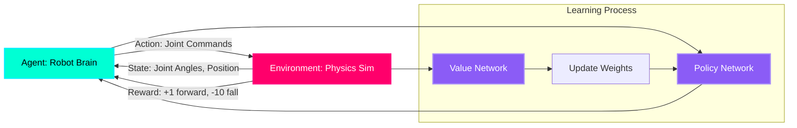

# Reinforcement Learning: How Robots Learn to Walk

## The Traditional Robotics Problem

**Old approach** (2000-2020): Manually program every movement:

```python
def walk_forward():
    while True:
        move_left_leg(angle=30, duration=0.5)
        shift_weight_right()
        move_right_leg(angle=30, duration=0.5)
        shift_weight_left()
        # 500 more lines of state machines and PID controllers...
```

**Problems:**
- Takes **months** to tune by hand
- Breaks when terrain changes (stairs, slopes, gravel)
- Requires expert roboticist knowledge

**Modern approach (2020+):** Let the robot **learn** by trying millions of times in simulation.

:::info Real-World Success
Boston Dynamics' Atlas backflip was **learned through RL** (not hand-coded). DeepMind's DexHand solved a Rubik's Cube using **pure RL** trained on 1,000 GPUs for 100 years of simulated experience.
:::

---

## The Reinforcement Learning Loop



**Components:**

1. **Agent (Robot Brain)**: Neural network that takes current state and outputs actions
   - **Input**: 50 numbers (joint angles, velocities, IMU orientation)
   - **Output**: 12 numbers (torque commands for 12 leg joints)
   - **Architecture**: 3-layer MLP (256-256-128 neurons)

2. **Environment (Physics Simulator)**: Runs physics at 1000 Hz
   - **Simulates**: Gravity, friction, contacts, joint limits
   - **Returns**: New state after action applied

3. **State**: Complete description of robot condition
   ```python
   state = [
       base_position_x, base_position_y, base_position_z,  # 3D position
       base_orientation_roll, base_orientation_pitch, base_orientation_yaw,  # Orientation
       joint_angle_1, joint_angle_2, ..., joint_angle_12,  # 12 joint angles
       joint_velocity_1, ..., joint_velocity_12,  # 12 joint velocities
       imu_acceleration_x, imu_acceleration_y, imu_acceleration_z,  # IMU
       previous_action_1, ..., previous_action_12  # Memory of last action
   ]
   # Total: 50 values
   ```

4. **Action**: Commands sent to robot
   ```python
   action = [
       hip_left_torque, knee_left_torque, ankle_left_torque,  # Left leg (3 joints)
       hip_right_torque, knee_right_torque, ankle_right_torque,  # Right leg (3 joints)
       # ... repeat for arms if applicable
   ]
   # Total: 12 torque commands (-100 Nm to +100 Nm)
   ```

5. **Reward**: Scalar feedback signal (single number)
   - **Positive**: Robot moved forward (+1 per meter)
   - **Negative**: Robot fell down (-10), energy wasted (-0.01 per Nm²)

---

## Designing a Reward Function for Walking

The **reward function** is the **most critical** part of RL. It defines what "success" means.

### Basic Walking Reward

```python
def compute_reward(state, action, next_state):
    reward = 0.0
    
    # 1. FORWARD PROGRESS (main objective)
    velocity_forward = next_state['base_velocity_x']
    reward += velocity_forward * 1.0  # +1 per meter/second
    
    # 2. PENALTY FOR FALLING
    base_height = next_state['base_position_z']
    if base_height < 0.3:  # Robot fell below 30cm
        reward -= 10.0
        episode_done = True  # Reset simulation
    
    # 3. PENALTY FOR ENERGY WASTE
    torque_squared = sum(action[i]**2 for i in range(12))
    reward -= 0.001 * torque_squared  # Encourage smooth, efficient movements
    
    # 4. KEEP TORSO UPRIGHT
    torso_tilt = abs(next_state['base_orientation_pitch'])
    reward -= 0.5 * torso_tilt  # Penalty for leaning forward/backward
    
    # 5. FOOT CONTACT BONUS
    left_foot_contact = check_contact(next_state, 'left_foot')
    right_foot_contact = check_contact(next_state, 'right_foot')
    if left_foot_contact and right_foot_contact:
        reward -= 0.1  # Both feet on ground = not walking
    
    return reward
```

**Reward Breakdown:**
- **Velocity**: +0.5 for walking at 0.5 m/s
- **Falling**: -10 (episode terminates, bad!)
- **Energy**: -0.05 for using 50 Nm torque (encourages efficiency)
- **Upright**: -0.1 if tilted 0.2 radians (≈11°)
- **Total per step**: Typically +0.4 to +0.5 if walking well

:::warning Reward Shaping is Hard
Bad reward function = robot learns to cheat:
- **Example**: Reward "stay upright" → robot learns to crawl forward on belly (still upright, but not walking)
- **Fix**: Add penalty for joint velocity (belly-crawling requires fast joint motion)
:::

---

## Isaac Gym: 4,096 Parallel Robots

**Isaac Gym** is NVIDIA's GPU-accelerated RL environment:
- **Physics on GPU**: 1,000× faster than CPU-based simulators (MuJoCo, PyBullet)
- **Parallel Environments**: Train 4,096 robots simultaneously on 1 GPU
- **Tight Integration**: PyTorch neural networks run on same GPU (no data transfer)

### Installation

```bash
# Download Isaac Gym (requires NVIDIA GPU + CUDA 11.8+)
# https://developer.nvidia.com/isaac-gym

# Extract and install
cd isaacgym/python
pip install -e .

# Test installation
python examples/1080_balls_of_solitude.py
# Should show 1,080 balls bouncing in real-time
```

---

## Training a Humanoid to Walk

### Step 1: Define the Task

**File: `humanoid_walk_task.py`**

```python
from isaacgym import gymapi, gymtorch
import torch

class HumanoidWalkTask:
    def __init__(self, cfg, sim_device='cuda:0'):
        self.cfg = cfg
        self.device = sim_device
        
        # Create Isaac Gym simulation
        self.gym = gymapi.acquire_gym()
        
        # Simulation parameters
        sim_params = gymapi.SimParams()
        sim_params.dt = 0.01  # 10ms timestep (100 Hz)
        sim_params.substeps = 2  # 2 physics steps per RL step
        sim_params.gravity = gymapi.Vec3(0.0, 0.0, -9.81)
        sim_params.up_axis = gymapi.UP_AXIS_Z
        
        # Physics engine (PhysX)
        sim_params.physx.solver_type = 1
        sim_params.physx.num_position_iterations = 4
        sim_params.physx.num_velocity_iterations = 1
        sim_params.physx.contact_offset = 0.01
        sim_params.physx.rest_offset = 0.0
        
        self.sim = self.gym.create_sim(0, 0, gymapi.SIM_PHYSX, sim_params)
        
        # Load humanoid URDF
        asset_root = "./assets"
        asset_file = "humanoid.urdf"
        asset_options = gymapi.AssetOptions()
        asset_options.fix_base_link = False  # Free-floating base
        self.humanoid_asset = self.gym.load_asset(self.sim, asset_root, asset_file, asset_options)
        
        # Create 4096 parallel environments
        self.num_envs = 4096
        envs_per_row = 64
        env_spacing = 3.0  # 3 meters apart
        
        self.envs = []
        self.humanoid_handles = []
        
        for i in range(self.num_envs):
            # Create environment
            env = self.gym.create_env(self.sim, 
                                      gymapi.Vec3(-env_spacing, -env_spacing, 0),
                                      gymapi.Vec3(env_spacing, env_spacing, env_spacing),
                                      envs_per_row)
            
            # Add humanoid to environment
            pose = gymapi.Transform()
            pose.p = gymapi.Vec3(0, 0, 1.0)  # Start 1m above ground
            humanoid_handle = self.gym.create_actor(env, self.humanoid_asset, pose, "humanoid", i, 1)
            
            self.envs.append(env)
            self.humanoid_handles.append(humanoid_handle)
        
        # Get state tensors (GPU-resident)
        self.root_states = self.gym.acquire_actor_root_state_tensor(self.sim)
        self.dof_states = self.gym.acquire_dof_state_tensor(self.sim)
        
        # Wrap in PyTorch tensors
        self.root_states = gymtorch.wrap_tensor(self.root_states)
        self.dof_states = gymtorch.wrap_tensor(self.dof_states)
        
    def get_observations(self):
        """Return state for all 4096 robots (4096 × 50 tensor)"""
        return torch.cat([
            self.root_states[:, :13],  # Base position + orientation (quaternion)
            self.dof_states[:, :24],   # 12 joint angles + 12 velocities
            self.previous_actions,     # 12 previous commands
        ], dim=1)
    
    def step(self, actions):
        """Apply actions and simulate physics"""
        # Clip actions to safe range
        actions = torch.clamp(actions, -100, 100)  # ±100 Nm max torque
        
        # Apply torques to joints
        self.gym.set_dof_actuation_force_tensor(self.sim, gymtorch.unwrap_tensor(actions))
        
        # Simulate physics
        self.gym.simulate(self.sim)
        self.gym.fetch_results(self.sim, True)
        
        # Compute rewards
        rewards = self.compute_reward(self.get_observations(), actions)
        
        # Check for termination
        dones = (self.root_states[:, 2] < 0.3)  # Fell below 30cm
        
        return self.get_observations(), rewards, dones
```

---

### Step 2: Train with PPO (Proximal Policy Optimization)

**PPO** is the most popular RL algorithm for robotics (used by OpenAI, DeepMind).

```python
import torch
import torch.nn as nn
from torch.optim import Adam

class PolicyNetwork(nn.Module):
    """Neural network that maps state → action"""
    def __init__(self, state_dim=50, action_dim=12):
        super().__init__()
        self.fc1 = nn.Linear(state_dim, 256)
        self.fc2 = nn.Linear(256, 256)
        self.fc3 = nn.Linear(256, 128)
        self.mean = nn.Linear(128, action_dim)
        self.log_std = nn.Parameter(torch.zeros(action_dim))  # Learned noise
        
    def forward(self, state):
        x = torch.relu(self.fc1(state))
        x = torch.relu(self.fc2(x))
        x = torch.relu(self.fc3(x))
        mean = self.mean(x)
        std = torch.exp(self.log_std)
        return mean, std

# Training loop
env = HumanoidWalkTask(cfg)
policy = PolicyNetwork().to('cuda')
optimizer = Adam(policy.parameters(), lr=3e-4)

num_iterations = 10000
for iteration in range(num_iterations):
    # Collect 4096 experiences
    states = env.get_observations()  # Shape: (4096, 50)
    mean, std = policy(states)
    actions = torch.normal(mean, std)  # Sample from Gaussian
    
    next_states, rewards, dones = env.step(actions)
    
    # Compute PPO loss (simplified)
    # ... (full implementation requires advantage estimation, clipping, etc.)
    
    optimizer.zero_grad()
    loss.backward()
    optimizer.step()
    
    if iteration % 100 == 0:
        avg_reward = rewards.mean().item()
        print(f"Iteration {iteration}: Avg Reward = {avg_reward:.2f}")

# Save trained model
torch.save(policy.state_dict(), 'humanoid_walk_policy.pth')
```

**Training Time:**
- **Isaac Gym (RTX 4090)**: 2-4 hours for 10M steps
- **CPU simulator (MuJoCo)**: 200+ hours for same steps
- **Speedup**: 50-100×

---

## Sim-to-Real Transfer: The Reality Gap

**Problem:** A policy trained in simulation often fails on real hardware due to:
1. **Physics Mismatch**: Simulator friction ≠ real friction
2. **Latency**: Real motors have 10-50ms delay, simulation is instant
3. **Sensor Noise**: Real IMU has drift, simulation is perfect

### Solution: Domain Randomization

**During training, randomize everything:**

```python
def randomize_physics():
    # Randomize every 1000 steps
    if env.step_count % 1000 == 0:
        # Friction: 0.5 to 1.5 (real robot might vary)
        env.set_friction(random.uniform(0.5, 1.5))
        
        # Mass: ±10% (real robot has measurement error)
        true_mass = 50.0  # kg
        env.set_mass(random.uniform(0.9 * true_mass, 1.1 * true_mass))
        
        # Motor strength: ±20% (motors degrade over time)
        env.set_motor_strength(random.uniform(0.8, 1.2))
        
        # IMU noise: Add Gaussian noise
        env.set_imu_noise(stddev=random.uniform(0.01, 0.05))
        
        # External forces: Wind, pushes
        if random.random() < 0.1:  # 10% chance
            env.apply_external_force(random.uniform(-50, 50))  # 50N push
```

**Result:** Robot learns to walk **robustly** across all these variations, so it works in the real world.

---

## Hands-On Exercise: Train a Simple Walker

**Challenge:** Train a 2-legged walker to move forward.

**Starter Code:**
```python
reward = 0.0

# Reward forward velocity
reward += state['velocity_x'] * 1.0

# Penalty for falling
if state['height'] < 0.3:
    reward -= 10.0

# Penalty for excessive joint torque
reward -= 0.001 * sum(action**2)

# YOUR CODE: Add penalty for spinning (angular velocity around Z-axis)
# YOUR CODE: Add bonus for keeping head level (minimize roll/pitch)

return reward
```

**Training:**
```bash
python train_walker.py --num_envs=1024 --iterations=5000
# Should converge to ~2.0 reward (walking at 2 m/s)
```

---

## Key Takeaways

✅ **RL teaches robots through trial-and-error** (no manual programming)  
✅ **Reward function** is critical (wrong reward = wrong behavior)  
✅ **Isaac Gym** trains 4,096 robots in parallel on 1 GPU (50-100× speedup)  
✅ **PPO algorithm** is industry standard for locomotion/manipulation  
✅ **Domain randomization** bridges sim-to-real gap (vary physics parameters)  
✅ **Training time**: 2-4 hours for walking, 10-20 hours for manipulation  

---

## What's Next?

You've mastered the three pillars of Physical AI:
1. **ROS 2**: Robot nervous system (communication)
2. **Simulation**: Digital twins (Gazebo, Unity, Isaac Sim)
3. **AI Brain**: Learning and navigation (VSLAM, RL)

The final module covers **Module 4: Vision-Language-Action (VLA) Models**—giving robots the ability to understand natural language commands like "Pick up the red mug and place it in the sink."

---

## Further Reading

- [Isaac Gym Paper](https://arxiv.org/abs/2108.10470)
- [PPO Algorithm (OpenAI)](https://arxiv.org/abs/1707.06347)
- [Domain Randomization (OpenAI)](https://arxiv.org/abs/1703.06907)
- [Learning Dexterous In-Hand Manipulation](https://arxiv.org/abs/1808.00177) (OpenAI's Rubik's Cube)
- [Reinforcement Learning: An Introduction (Sutton & Barto)](http://incompleteideas.net/book/the-book.html)
