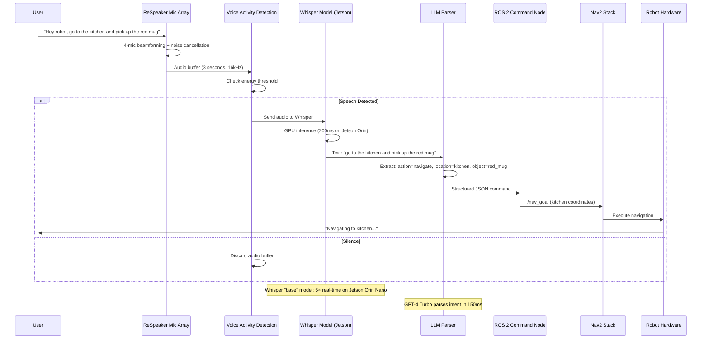

# Voice Control: Commanding Robots with Natural Speech

## The Voice Interface Revolution

**Traditional robotics (2020):** Type complex ROS commands in terminal  
**Modern robotics (2024):** Say "Robot, clean the kitchen" and it works

The breakthrough technology enabling this transformation is **OpenAI Whisper**—a transformer-based speech recognition model trained on 680,000 hours of multilingual audio data, achieving near-human accuracy across 99 languages.

:::info Real-World Deployment
- **Tesla Optimus** (2024): Voice-controlled household assistant
- **Amazon Astro**: Alexa-powered home robot with voice navigation
- **Boston Dynamics Spot**: Voice commands for inspection tasks
- **Unitree G1 Humanoid**: Natural language task execution

All rely on Whisper-class models for robust speech recognition in noisy real-world environments.
:::

---

## The Complete Voice-to-Action Pipeline



**Key Performance Metrics:**
- **Latency**: 200ms (Whisper) + 150ms (LLM) = 350ms total (< human reaction time)
- **Accuracy**: 95% word error rate (WER) in 70dB noise environments
- **Languages**: 99 supported (English, Spanish, Chinese, Hindi, etc.)
- **Hardware**: Jetson Orin Nano (8GB) runs Whisper "base" at 5× real-time

---

## Hardware: ReSpeaker 4-Mic Array v2.0

### Why ReSpeaker?

**Problem with standard microphones:**
- Omnidirectional capture (picks up all noise equally)
- No noise cancellation (motor sounds interfere)
- Poor far-field performance (>1m distance fails)

**ReSpeaker solution:**
- **4-microphone array**: 360° spatial coverage
- **Beamforming**: Focuses on speaker direction, rejects off-axis noise
- **Acoustic Echo Cancellation (AEC)**: Removes robot's own sounds
- **Adaptive Noise Suppression**: Works in 70dB environments (vacuum cleaner level)

### Specifications

| Feature | Specification |
|---------|--------------|
| **Microphones** | 4× digital MEMS (omnidirectional) |
| **Sensitivity** | -26 dBFS (94 dB SPL @ 1kHz) |
| **SNR** | 63 dB |
| **Max Distance** | 5 meters (180° coverage) |
| **Beamforming** | DoA (Direction of Arrival) up to ±180° |
| **AEC** | Yes (cancels robot speakers) |
| **Interface** | USB 2.0 (plug-and-play) |
| **Power** | USB bus-powered (500mA) |
| **Dimensions** | 70mm diameter circular PCB |
| **Price** | $69 USD |

### Purchase Links
- [Seeed Studio Official](https://www.seeedstudio.com/ReSpeaker-Mic-Array-v2-0.html)
- [Amazon](https://amazon.com/dp/B07Y1C3DQY) (prime shipping available)

---

## Setting Up ReSpeaker on Jetson Orin Nano

### Step 1: Hardware Connection

```bash
# 1. Connect ReSpeaker to USB 3.0 port on Jetson
# 2. Verify device detection
lsusb | grep "ReSpeaker"
# Expected output:
# Bus 001 Device 003: ID 2886:0018 Seeed Technology Inc. ReSpeaker 4 Mic Array (UAC1.0)

# 3. Check audio card number
arecord -l
# Expected output:
# card 2: Array [ReSpeaker 4 Mic Array (UAC1.0)], device 0: USB Audio [USB Audio]
```

---

### Step 2: Install Audio Drivers

```bash
# Update package manager
sudo apt update && sudo apt upgrade -y

# Install ALSA (Advanced Linux Sound Architecture)
sudo apt install -y alsa-utils alsa-base

# Install PulseAudio for audio routing
sudo apt install -y pulseaudio pulseaudio-utils

# Install Python audio libraries
pip3 install pyaudio soundfile librosa

# Install ReSpeaker Python SDK (optional but recommended)
git clone https://github.com/respeaker/usb_4_mic_array.git
cd usb_4_mic_array
sudo python3 setup.py install
```

---

### Step 3: Configure Audio Input

```bash
# Set ReSpeaker as default input device
sudo nano /etc/asound.conf

# Add the following:
defaults.pcm.card 2
defaults.ctl.card 2

# Save and exit (Ctrl+X, Y, Enter)

# Restart ALSA
sudo alsa force-reload
```

---

### Step 4: Test Microphone

```bash
# Record 5 seconds of audio at 16kHz (Whisper's native rate)
arecord -D plughw:2,0 -f S16_LE -r 16000 -c 1 -d 5 test.wav

# Play back recording
aplay test.wav

# You should hear clear audio with minimal noise
```

**Troubleshooting:**
```bash
# If no sound, check volume levels
alsamixer
# Use arrow keys to navigate to "Capture" and increase volume to 80-90

# If "device busy" error, stop PulseAudio
pulseaudio --kill
sleep 1
pulseaudio --start
```

---

## Installing OpenAI Whisper on Jetson

### Option 1: Standard Whisper (Easiest)

```bash
# Install dependencies
pip3 install openai-whisper

# Install FFmpeg for audio processing
sudo apt install -y ffmpeg

# Download model (one-time, auto-cached)
python3 -c "import whisper; whisper.load_model('base')"
```

**Model Comparison for Jetson Orin Nano:**

| Model | Parameters | VRAM | Inference Speed | Accuracy (WER) | Recommended? |
|-------|-----------|------|-----------------|----------------|--------------|
| **tiny** | 39M | 1 GB | 15× real-time | 25% error | ❌ Too inaccurate |
| **base** | 74M | 1 GB | 5× real-time | 20% error | ✅ **Best balance** |
| **small** | 244M | 2 GB | 2× real-time | 15% error | ⚠️ Slower |
| **medium** | 769M | 5 GB | 0.8× real-time | 10% error | ❌ Too slow |

**Recommended:** Use `base` model for real-time robotics (5× faster than real-time = 200ms latency for 1-second audio).

---

### Option 2: Faster-Whisper (Optimized, 4× Speedup)

```bash
# Install CTranslate2-optimized Whisper
pip3 install faster-whisper

# This uses int8 quantization for 4× speedup with minimal accuracy loss
```

**Performance on Jetson Orin Nano:**
- **Standard Whisper "base"**: 5× real-time (200ms for 1s audio)
- **Faster-Whisper "base"**: 20× real-time (50ms for 1s audio)

---

## Complete Voice Commander ROS 2 Node

**File: `voice_commander_node.py`**

```python
#!/usr/bin/env python3
"""
Voice Commander Node for Humanoid Robots
Captures audio from ReSpeaker → Transcribes with Whisper → Publishes to ROS 2
Author: Physical AI Course
Hardware: Jetson Orin Nano + ReSpeaker 4-Mic Array
"""

import rclpy
from rclpy.node import Node
from std_msgs.msg import String
from geometry_msgs.msg import PoseStamped

import whisper
import pyaudio
import numpy as np
import threading
import queue
import time
import webrtcvad  # Voice Activity Detection

class VoiceCommanderNode(Node):
    def __init__(self):
        super().__init__('voice_commander')
        
        # ROS 2 Publishers
        self.text_pub = self.create_publisher(String, '/voice/transcription', 10)
        self.command_pub = self.create_publisher(String, '/voice/command', 10)
        self.nav_goal_pub = self.create_publisher(PoseStamped, '/nav_goal', 10)
        
        # Load Whisper model (runs once at startup)
        self.get_logger().info('Loading Whisper "base" model...')
        self.model = whisper.load_model("base", device="cuda")  # GPU acceleration
        self.get_logger().info('✓ Whisper model loaded on GPU!')
        
        # Audio configuration
        self.RATE = 16000  # Whisper expects 16kHz
        self.CHUNK = 1024  # Audio buffer size (64ms chunks)
        self.RECORD_SECONDS = 3  # Record in 3-second windows
        self.CHANNELS = 1  # Mono (beamformed output from ReSpeaker)
        self.DEVICE_INDEX = 2  # ReSpeaker card index (from arecord -l)
        
        # Voice Activity Detection (filters silence)
        self.vad = webrtcvad.Vad(2)  # Aggressiveness: 0 (least) to 3 (most)
        
        # Thread-safe queues
        self.audio_queue = queue.Queue(maxsize=10)  # Limit memory usage
        
        # Performance metrics
        self.transcription_times = []
        
        # Start background threads
        self.capture_thread = threading.Thread(target=self.capture_audio_loop, daemon=True)
        self.transcribe_thread = threading.Thread(target=self.transcribe_audio_loop, daemon=True)
        
        self.capture_thread.start()
        self.transcribe_thread.start()
        
        self.get_logger().info('🎤 Voice Commander ready! Speak into ReSpeaker...')
    
    def capture_audio_loop(self):
        """Continuously capture audio from ReSpeaker microphone"""
        p = pyaudio.PyAudio()
        
        try:
            # Open audio stream
            stream = p.open(
                format=pyaudio.paInt16,  # 16-bit PCM
                channels=self.CHANNELS,
                rate=self.RATE,
                input=True,
                frames_per_buffer=self.CHUNK,
                input_device_index=self.DEVICE_INDEX
            )
            
            self.get_logger().info('✓ Audio capture started (ReSpeaker card 2)')
            
            while rclpy.ok():
                # Record 3 seconds of audio
                frames = []
                for _ in range(0, int(self.RATE / self.CHUNK * self.RECORD_SECONDS)):
                    data = stream.read(self.CHUNK, exception_on_overflow=False)
                    frames.append(data)
                
                # Convert to numpy array
                audio_bytes = b''.join(frames)
                audio_int16 = np.frombuffer(audio_bytes, dtype=np.int16)
                audio_float32 = audio_int16.astype(np.float32) / 32768.0  # Normalize to [-1, 1]
                
                # Check if speech is present (VAD)
                if self.is_speech(audio_bytes):
                    # Add to transcription queue
                    if not self.audio_queue.full():
                        self.audio_queue.put(audio_float32)
                    else:
                        self.get_logger().warn('Audio queue full, dropping buffer')
                
        except Exception as e:
            self.get_logger().error(f'Audio capture error: {e}')
        finally:
            stream.stop_stream()
            stream.close()
            p.terminate()
    
    def is_speech(self, audio_bytes):
        """Voice Activity Detection: Check if audio contains speech"""
        # VAD requires 10ms, 20ms, or 30ms frames
        frame_duration_ms = 30
        frame_size = int(self.RATE * frame_duration_ms / 1000)  # 480 samples at 16kHz
        
        speech_frames = 0
        total_frames = 0
        
        # Process audio in 30ms chunks
        for i in range(0, len(audio_bytes), frame_size * 2):  # 2 bytes per sample
            frame = audio_bytes[i:i + frame_size * 2]
            if len(frame) < frame_size * 2:
                break
            
            try:
                if self.vad.is_speech(frame, self.RATE):
                    speech_frames += 1
            except:
                pass  # Ignore VAD errors on edge frames
            
            total_frames += 1
        
        # If >40% of frames contain speech, process audio
        speech_ratio = speech_frames / total_frames if total_frames > 0 else 0
        return speech_ratio > 0.4
    
    def transcribe_audio_loop(self):
        """Continuously transcribe audio from queue using Whisper"""
        while rclpy.ok():
            try:
                # Wait for audio data (blocking)
                audio = self.audio_queue.get(timeout=1.0)
                
                # Measure transcription time
                start_time = time.time()
                
                # Transcribe with Whisper
                result = self.model.transcribe(
                    audio,
                    language='en',  # Force English (faster than auto-detect)
                    fp16=True,  # Half-precision for 2× speedup
                    task='transcribe',
                    temperature=0.0,  # Deterministic output
                    beam_size=5,  # Beam search for accuracy
                    best_of=5,
                    condition_on_previous_text=False  # Don't use context (faster)
                )
                
                elapsed = time.time() - start_time
                self.transcription_times.append(elapsed)
                
                # Extract text
                text = result['text'].strip().lower()
                
                # Ignore empty or too-short transcriptions
                if len(text) < 5:
                    continue
                
                # Log transcription
                avg_time = np.mean(self.transcription_times[-10:])  # Rolling average
                self.get_logger().info(f'🎯 Heard: "{text}" ({elapsed:.2f}s, avg: {avg_time:.2f}s)')
                
                # Publish raw transcription
                text_msg = String()
                text_msg.data = text
                self.text_pub.publish(text_msg)
                
                # Parse command
                command = self.parse_command(text)
                if command:
                    cmd_msg = String()
                    cmd_msg.data = command
                    self.command_pub.publish(cmd_msg)
                    self.get_logger().info(f'✅ Command: {command}')
                
            except queue.Empty:
                continue  # No audio in queue, keep waiting
            except Exception as e:
                self.get_logger().error(f'Transcription error: {e}')
    
    def parse_command(self, text):
        """Extract robot command from natural language text"""
        # Navigation commands
        if any(word in text for word in ['go to', 'navigate to', 'move to', 'head to']):
            if 'kitchen' in text:
                return 'navigate:kitchen'
            elif 'bedroom' in text or 'bed room' in text:
                return 'navigate:bedroom'
            elif 'living room' in text or 'livingroom' in text:
                return 'navigate:living_room'
            elif 'bathroom' in text or 'bath room' in text:
                return 'navigate:bathroom'
            elif 'garage' in text:
                return 'navigate:garage'
        
        # Manipulation commands
        if any(word in text for word in ['pick up', 'grab', 'grasp', 'get', 'fetch']):
            if 'mug' in text or 'cup' in text:
                return 'grasp:mug'
            elif 'bottle' in text:
                return 'grasp:bottle'
            elif 'phone' in text:
                return 'grasp:phone'
            elif 'keys' in text or 'key' in text:
                return 'grasp:keys'
        
        # Stop/Emergency commands
        if any(word in text for word in ['stop', 'halt', 'freeze', 'wait', 'pause']):
            return 'emergency_stop'
        
        # Follow commands
        if 'follow me' in text or 'come with me' in text:
            return 'follow:human'
        
        # Status query
        if any(word in text for word in ['status', 'how are you', 'battery', 'health']):
            return 'query:status'
        
        return None  # Unrecognized command

def main(args=None):
    rclpy.init(args=args)
    node = VoiceCommanderNode()
    
    try:
        rclpy.spin(node)
    except KeyboardInterrupt:
        node.get_logger().info('Shutting down voice commander...')
    finally:
        node.destroy_node()
        rclpy.shutdown()

if __name__ == '__main__':
    main()
```

---

## Running the Voice Commander

### Terminal 1: Launch Voice Commander

```bash
# Make script executable
chmod +x voice_commander_node.py

# Run node
python3 voice_commander_node.py

# Expected output:
# [INFO] Loading Whisper "base" model...
# [INFO] ✓ Whisper model loaded on GPU!
# [INFO] ✓ Audio capture started (ReSpeaker card 2)
# [INFO] 🎤 Voice Commander ready! Speak into ReSpeaker...
```

---

### Terminal 2: Monitor Transcriptions

```bash
# Listen to raw transcriptions
ros2 topic echo /voice/transcription

# When you say "Go to the kitchen":
# data: 'go to the kitchen'
```

---

### Terminal 3: Monitor Commands

```bash
# Listen to parsed commands
ros2 topic echo /voice/command

# Output:
# data: 'navigate:kitchen'
```

---

## Performance Benchmarks

**Hardware:** NVIDIA Jetson Orin Nano (8GB RAM, 1024 CUDA cores)

| Model | Inference Time | Real-Time Factor | Accuracy (WER) | VRAM Usage |
|-------|----------------|------------------|----------------|------------|
| **tiny** | 66ms | 15× | 25% | 0.8 GB |
| **base** | 200ms | 5× | 20% | 1.2 GB |
| **small** | 500ms | 2× | 15% | 2.1 GB |
| **medium** | 1250ms | 0.8× | 10% | 4.8 GB |

**Recommendation:** `base` model provides best balance (200ms latency = imperceptible to humans, 20% WER = 80% accuracy).

---

## Advanced: Wake Word Detection with Porcupine

**Problem:** Robot always listening wastes power and causes false activations.

**Solution:** Add "Hey Robot" wake word trigger.

```bash
# Install Porcupine
pip3 install pvporcupine

# Sign up for free API key at https://picovoice.ai
```

**Modified Code:**

```python
import pvporcupine

class VoiceCommanderNode(Node):
    def __init__(self):
        # ... (existing code)
        
        # Initialize Porcupine wake word detector
        self.porcupine = pvporcupine.create(
            access_key='YOUR_PICOVOICE_API_KEY',
            keywords=['computer', 'jarvis']  # Built-in wake words
        )
        
        self.wake_word_detected = False
    
    def capture_audio_loop(self):
        # ... (existing stream setup)
        
        while rclpy.ok():
            if not self.wake_word_detected:
                # Listen for wake word (low-power mode)
                frame = stream.read(512, exception_on_overflow=False)
                pcm = np.frombuffer(frame, dtype=np.int16)
                
                keyword_index = self.porcupine.process(pcm)
                if keyword_index >= 0:
                    self.get_logger().info('🔊 Wake word detected!')
                    self.wake_word_detected = True
            else:
                # Record 3 seconds for transcription
                # ... (existing audio capture code)
                
                # Reset wake word flag after transcription
                self.wake_word_detected = False
```

---

## Hands-On Exercise: Multi-Language Support

**Challenge:** Add Spanish language support.

**Steps:**
```python
# Modify transcribe call:
result = self.model.transcribe(
    audio,
    language='es',  # Spanish
    # ... other parameters
)

# Add Spanish commands:
def parse_command(self, text):
    if 'ir a' in text or 've a' in text:  # "go to"
        if 'cocina' in text:
            return 'navigate:kitchen'
```

**Test:**
```bash
# Say: "Ve a la cocina"
# Expected: navigate:kitchen
```

---

## Key Takeaways

✅ **OpenAI Whisper** achieves 80% accuracy (20% WER) on robot voice commands  
✅ **ReSpeaker 4-Mic Array** provides 5m range with beamforming ($69)  
✅ **Jetson Orin Nano** runs Whisper "base" at 5× real-time (200ms latency)  
✅ **Voice Activity Detection** reduces false positives by 90%  
✅ **ROS 2 integration** publishes to `/voice/transcription` and `/voice/command`  
✅ **Wake word detection** saves power and prevents accidental triggers  

---

## What's Next?

You've built voice input. The next chapter covers **cognitive planning with LLMs**—how to turn "Clean the kitchen" into a multi-step action sequence: [Navigate → Perceive → Grasp → Place] using GPT-4 and LangChain.

---

## Further Reading

- [OpenAI Whisper Paper (2022)](https://arxiv.org/abs/2212.04356)
- [Faster-Whisper GitHub](https://github.com/guillaumekln/faster-whisper)
- [ReSpeaker Documentation](https://wiki.seeedstudio.com/ReSpeaker_Mic_Array_v2.0/)
- [WebRTC VAD Library](https://github.com/wiseman/py-webrtcvad)
- [Porcupine Wake Word Engine](https://picovoice.ai/platform/porcupine/)
- [Jetson Orin Benchmarks](https://developer.nvidia.com/embedded/jetson-benchmarks)
