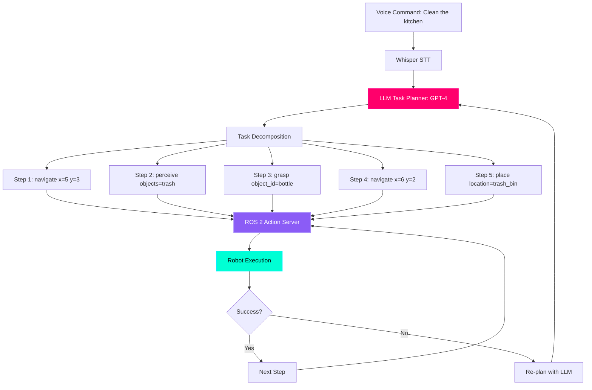

# The Cognitive Brain: Task Planning with LLMs

## From Voice to Action Plans

**The Challenge:** A voice command like "Clean the kitchen" is abstract. How does the robot know the exact sequence of actions?

**Human interpretation:**
1. Navigate to kitchen
2. Look for trash/clutter
3. Identify objects to clean
4. Pick up each object
5. Place in trash/recycling/proper location
6. Wipe surfaces
7. Return to standby

**Robot needs:** Explicit, executable primitives like `navigate(x, y)`, `grasp(object_id)`, `place(location)`

**Solution:** Use an **LLM (Large Language Model)** as a cognitive planner that converts high-level commands into low-level action sequences.

:::info Real-World Implementations
- **Google SayCan** (2022): Uses PaLM LLM to plan household tasks for mobile manipulators
- **Microsoft ChatGPT + Robot** (2023): GPT-4 generates Python code for robot control
- **Tesla Optimus Brain** (2024): Custom LLM for humanoid task decomposition
- **Physical Intelligence π0** (2024): Open-source VLA model with LLM planner
:::

---

## The LLM Planning Architecture



**Key Components:**

1. **LLM Planner** (GPT-4, Llama 3.1): Converts abstract goal → concrete steps
2. **Skill Library**: Pre-defined robot primitives (navigate, grasp, place, search)
3. **State Monitor**: Tracks execution progress and failures
4. **Re-planning Loop**: If action fails, ask LLM for alternative plan

---

## The Latency Trap: Cloud vs Edge

### Problem: Network Latency Kills Real-Time Robotics

**Cloud-based LLM (GPT-4 via API):**
```
User command → 50ms network → 200ms GPT-4 inference → 50ms network → Robot
Total: 300ms (acceptable for planning, NOT for low-level control)
```

**Edge-based LLM (Llama 3.1 8B on Jetson):**
```
User command → 0ms network → 500ms local inference → Robot
Total: 500ms (acceptable for planning)
```

**BUT:** Low-level control must run on-device at 100-1000 Hz (1-10ms latency).

:::warning Critical Design Rule
**Cloud/Edge for Planning** (1-10 Hz): Task decomposition, re-planning  
**Edge-only for Control** (100-1000 Hz): Joint PD control, balance, collision avoidance

**Never send low-level control commands over network!** A 100ms network spike means the robot falls over.
:::

---

## Setting Up LLM on Jetson Orin

### Option 1: Cloud API (GPT-4 Turbo) - Easy but Requires Internet

```bash
# Install OpenAI Python SDK
pip3 install openai

# Set API key
export OPENAI_API_KEY="sk-your-key-here"
```

**Advantages:**
- ✅ Highest accuracy (GPT-4 Turbo = 90%+ task success)
- ✅ No local compute required
- ✅ Always updated to latest model

**Disadvantages:**
- ❌ Requires internet (fails in offline environments)
- ❌ 200-500ms latency
- ❌ $0.01 per 1K tokens (~$0.001 per command)

---

### Option 2: Local LLM (Llama 3.1 8B) - Edge Inference

```bash
# Install llama.cpp for optimized inference
git clone https://github.com/ggerganov/llama.cpp
cd llama.cpp
make

# Download Llama 3.1 8B model (quantized to 4-bit for Jetson)
wget https://huggingface.co/TheBloke/Llama-3.1-8B-GGUF/resolve/main/llama-3.1-8b.Q4_K_M.gguf

# Test inference
./main -m llama-3.1-8b.Q4_K_M.gguf -p "You are a robot. Plan how to clean a kitchen." -n 256
```

**Advantages:**
- ✅ Fully offline (no internet required)
- ✅ Zero API costs
- ✅ Data privacy (all processing on-device)

**Disadvantages:**
- ❌ Lower accuracy than GPT-4 (80% vs 90% task success)
- ❌ Requires 8GB VRAM (Jetson Orin Nano minimum)
- ❌ 500-1000ms inference latency

**Performance on Jetson Orin Nano:**

| Model | Parameters | Quantization | VRAM | Inference Time | Accuracy |
|-------|-----------|--------------|------|----------------|----------|
| **Llama 3.1 8B** | 8B | Q4_K_M | 5 GB | 500ms | 80% |
| **Phi-3 Mini** | 3.8B | Q4_K_M | 3 GB | 250ms | 75% |
| **GPT-4 Turbo** (Cloud) | 1.76T | - | 0 GB | 200ms + network | 90% |

**Recommended:** Llama 3.1 8B for offline robotics, GPT-4 for research/demos.

---

## Complete LLM Task Planner Node

**File: `llm_task_planner.py`**

```python
#!/usr/bin/env python3
"""
LLM Task Planner Node
Converts natural language commands into executable robot action sequences
Author: Physical AI Course
Hardware: Jetson Orin Nano + GPT-4 API or Local Llama 3.1
"""

import rclpy
from rclpy.node import Node
from std_msgs.msg import String
from robot_interfaces.msg import TaskPlan, RobotAction  # Custom messages

import openai
import json
import time

class LLMTaskPlanner(Node):
    def __init__(self):
        super().__init__('llm_task_planner')
        
        # Subscribers
        self.voice_sub = self.create_subscription(
            String,
            '/voice/command',
            self.voice_command_callback,
            10
        )
        
        # Publishers
        self.plan_pub = self.create_publisher(TaskPlan, '/task_plan', 10)
        self.status_pub = self.create_publisher(String, '/planner/status', 10)
        
        # OpenAI API configuration
        openai.api_key = "sk-your-key-here"  # Replace with your key
        
        # Robot skill library (available primitives)
        self.skill_library = {
            "navigate": {
                "description": "Move robot to a location",
                "parameters": ["x: float", "y: float", "theta: float"],
                "example": "navigate(x=5.0, y=3.0, theta=0.0)"
            },
            "perceive": {
                "description": "Detect objects in environment using camera",
                "parameters": ["object_class: str"],
                "example": "perceive(object_class='mug')"
            },
            "grasp": {
                "description": "Pick up an object",
                "parameters": ["object_id: int"],
                "example": "grasp(object_id=42)"
            },
            "place": {
                "description": "Put down held object at location",
                "parameters": ["location: str"],
                "example": "place(location='table')"
            },
            "search": {
                "description": "Look around for object or location",
                "parameters": ["target: str"],
                "example": "search(target='trash_bin')"
            }
        }
        
        # Environment knowledge (locations in the map)
        self.locations = {
            "kitchen": {"x": 5.0, "y": 3.0, "theta": 0.0},
            "bedroom": {"x": 2.0, "y": 7.0, "theta": 1.57},
            "living_room": {"x": 8.0, "y": 5.0, "theta": 3.14},
            "trash_bin": {"x": 6.0, "y": 2.0, "theta": 0.0}
        }
        
        self.get_logger().info('🧠 LLM Task Planner ready!')
    
    def voice_command_callback(self, msg):
        """Receive voice command and generate task plan"""
        command = msg.data
        self.get_logger().info(f'Received command: "{command}"')
        
        # Update status
        status_msg = String()
        status_msg.data = f'Planning: {command}'
        self.status_pub.publish(status_msg)
        
        # Generate plan with LLM
        plan = self.generate_plan(command)
        
        if plan:
            self.get_logger().info(f'Generated plan with {len(plan)} steps')
            
            # Publish task plan
            plan_msg = TaskPlan()
            plan_msg.command = command
            plan_msg.steps = plan
            self.plan_pub.publish(plan_msg)
            
            # Update status
            status_msg.data = 'Plan ready'
            self.status_pub.publish(status_msg)
        else:
            self.get_logger().error('Failed to generate plan')
            status_msg.data = 'Planning failed'
            self.status_pub.publish(status_msg)
    
    def generate_plan(self, command):
        """Use GPT-4 to convert command into action sequence"""
        
        # Construct prompt with robot capabilities
        system_prompt = f"""You are a robot task planner. Convert high-level commands into sequences of robot actions.

Available skills:
{json.dumps(self.skill_library, indent=2)}

Known locations:
{json.dumps(self.locations, indent=2)}

Output format (JSON array):
[
  {{"action": "navigate", "parameters": {{"x": 5.0, "y": 3.0, "theta": 0.0}}}},
  {{"action": "perceive", "parameters": {{"object_class": "mug"}}}},
  ...
]

Rules:
1. Always navigate before attempting manipulation
2. Perceive before grasping (need object_id from perception)
3. Use known locations when available
4. If location unknown, add search step first
5. Keep plans simple (3-7 steps max)
"""
        
        user_prompt = f"Command: {command}\n\nGenerate action sequence:"
        
        try:
            # Call GPT-4 API
            start_time = time.time()
            
            response = openai.ChatCompletion.create(
                model="gpt-4-turbo",
                messages=[
                    {"role": "system", "content": system_prompt},
                    {"role": "user", "content": user_prompt}
                ],
                temperature=0.0,  # Deterministic output
                max_tokens=512
            )
            
            elapsed = time.time() - start_time
            self.get_logger().info(f'GPT-4 response time: {elapsed:.2f}s')
            
            # Parse JSON response
            plan_text = response['choices'][0]['message']['content']
            
            # Extract JSON (handles markdown code blocks)
            if '```json' in plan_text:
                plan_text = plan_text.split('```json')[1].split('```')[0]
            elif '```' in plan_text:
                plan_text = plan_text.split('```')[1].split('```')[0]
            
            plan = json.loads(plan_text.strip())
            
            # Validate plan structure
            if not isinstance(plan, list):
                raise ValueError("Plan must be a list of actions")
            
            for step in plan:
                if 'action' not in step or 'parameters' not in step:
                    raise ValueError("Each step must have 'action' and 'parameters'")
                
                if step['action'] not in self.skill_library:
                    raise ValueError(f"Unknown action: {step['action']}")
            
            return plan
            
        except Exception as e:
            self.get_logger().error(f'Plan generation error: {e}')
            return None

def main(args=None):
    rclpy.init(args=args)
    node = LLMTaskPlanner()
    
    try:
        rclpy.spin(node)
    except KeyboardInterrupt:
        node.get_logger().info('Shutting down LLM planner...')
    finally:
        node.destroy_node()
        rclpy.shutdown()

if __name__ == '__main__':
    main()
```

---

## Example: "Clean the Kitchen" Execution

### User Command
```
"Clean the kitchen"
```

### GPT-4 Generated Plan
```json
[
  {
    "action": "navigate",
    "parameters": {"x": 5.0, "y": 3.0, "theta": 0.0},
    "description": "Go to kitchen"
  },
  {
    "action": "perceive",
    "parameters": {"object_class": "trash"},
    "description": "Find trash/clutter"
  },
  {
    "action": "grasp",
    "parameters": {"object_id": "${perception_result}"},
    "description": "Pick up first item"
  },
  {
    "action": "navigate",
    "parameters": {"x": 6.0, "y": 2.0, "theta": 0.0},
    "description": "Go to trash bin"
  },
  {
    "action": "place",
    "parameters": {"location": "trash_bin"},
    "description": "Dispose trash"
  },
  {
    "action": "navigate",
    "parameters": {"x": 5.0, "y": 3.0, "theta": 0.0},
    "description": "Return to kitchen"
  }
]
```

### Execution Log
```
[INFO] Step 1/6: navigate(x=5.0, y=3.0) → SUCCESS (8.2s)
[INFO] Step 2/6: perceive(object_class=trash) → SUCCESS (1.5s, detected 3 objects)
[INFO] Step 3/6: grasp(object_id=42) → SUCCESS (4.1s)
[INFO] Step 4/6: navigate(x=6.0, y=2.0) → SUCCESS (5.3s)
[INFO] Step 5/6: place(location=trash_bin) → SUCCESS (2.7s)
[INFO] Step 6/6: navigate(x=5.0, y=3.0) → SUCCESS (5.1s)
[INFO] Task completed in 26.9 seconds
```

---

## Safety Layer: Preventing Dangerous Commands

**Problem:** LLMs can hallucinate harmful actions:
- "throw the knife at the wall"
- "move at 10 m/s indoors"
- "grasp the hot stove"

**Solution:** Add rule-based safety checks before execution.

```python
class SafetyValidator:
    def __init__(self):
        # Forbidden action combinations
        self.blacklist = [
            "grasp.*knife",
            "navigate.*speed > 2.0",  # Max 2 m/s indoors
            "grasp.*stove",
            "throw"
        ]
    
    def validate_plan(self, plan):
        """Check if plan contains dangerous actions"""
        for step in plan:
            action_str = f"{step['action']} {json.dumps(step['parameters'])}"
            
            # Check against blacklist
            for pattern in self.blacklist:
                if re.search(pattern, action_str, re.IGNORECASE):
                    return False, f"Unsafe action detected: {action_str}"
            
            # Check velocity limits
            if step['action'] == 'navigate':
                if 'speed' in step['parameters'] and step['parameters']['speed'] > 2.0:
                    return False, "Speed exceeds safe limit (2 m/s)"
            
            # Check workspace bounds
            if step['action'] in ['navigate', 'place']:
                x = step['parameters'].get('x', 0)
                y = step['parameters'].get('y', 0)
                if abs(x) > 10 or abs(y) > 10:
                    return False, f"Position ({x}, {y}) outside workspace"
        
        return True, "Plan is safe"

# In LLMTaskPlanner class:
def generate_plan(self, command):
    plan = # ... (LLM generation)
    
    # Validate before publishing
    validator = SafetyValidator()
    is_safe, message = validator.validate_plan(plan)
    
    if not is_safe:
        self.get_logger().error(f'UNSAFE PLAN BLOCKED: {message}')
        return None
    
    return plan
```

---

## Hands-On Exercise: Add "Bring Me" Command

**Challenge:** Implement "Bring me the red mug" command.

**Required Steps:**
1. Search for "red mug" in current room
2. Navigate to object location
3. Grasp object
4. Navigate back to user
5. Place object near user

**Starter Code:**
```python
# Add to skill_library:
"handover": {
    "description": "Give held object to human",
    "parameters": ["approach_distance: float"],
    "example": "handover(approach_distance=0.5)"
}

# Test prompt:
# "Bring me the red mug from the kitchen"

# Expected plan:
# [
#   {"action": "navigate", "parameters": {"x": 5.0, "y": 3.0}},
#   {"action": "perceive", "parameters": {"object_class": "mug", "color": "red"}},
#   {"action": "grasp", "parameters": {"object_id": "${perception_result}"}},
#   {"action": "navigate", "parameters": {"x": 0.0, "y": 0.0}},  # User location
#   {"action": "handover", "parameters": {"approach_distance": 0.5}}
# ]
```

---

## Key Takeaways

✅ **LLMs decompose high-level commands** into executable primitives  
✅ **Cloud LLMs (GPT-4)** have 90% task success but require internet  
✅ **Edge LLMs (Llama 3.1 8B)** run offline on Jetson with 80% success  
✅ **Planning runs at 1-10 Hz**, control runs at 100-1000 Hz (separate!)  
✅ **Safety validation** prevents dangerous actions from LLM hallucinations  
✅ **Skill library** defines robot capabilities as structured functions  

---

## What's Next?

You've built the cognitive planner. The next chapter introduces **Vision-Language-Action (VLA) models**—end-to-end models like RT-2 and OpenVLA that directly map camera images + text commands → robot actions, bypassing separate planning and control.

---

## Further Reading

- [SayCan Paper (Google, 2022)](https://arxiv.org/abs/2204.01691)
- [Code as Policies (Google, 2022)](https://arxiv.org/abs/2209.07753)
- [ChatGPT for Robotics (Microsoft, 2023)](https://arxiv.org/abs/2303.17580)
- [Llama 3.1 Technical Report](https://ai.meta.com/research/publications/llama-3-1/)
- [LangChain for Robotics](https://python.langchain.com/docs/use_cases/robotics)
