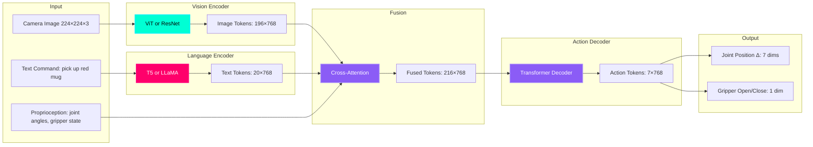

# Vision-Language-Action Models: The Future of Robot Intelligence

## Beyond Separate Planning and Control

**Traditional pipeline (2022):**
```
Camera Image → Object Detector → LLM Planner → Motion Planner → PID Controller → Motors
(5 separate models, each can fail)
```

**VLA Model (2024):**
```
Camera Image + Text Command → VLA Model → Motor Commands
(Single end-to-end model)
```

**The Revolution:** VLA models learned from millions of robot demonstrations can directly predict low-level actions from high-level commands and visual observations—**no explicit planning needed**.

:::info Breakthrough Models
- **Google RT-1** (2022): 130K robot demonstrations, 7 skills
- **Google RT-2** (2023): Vision-language model (PaLI-X) fine-tuned for robotics, 6000+ skills
- **OpenVLA** (2024): Open-source 7B parameter model trained on 900K trajectories
- **π0 (Physical Intelligence, 2024)**: General-purpose VLA for dexterous manipulation
- **Tesla Optimus Neural Net** (2024): End-to-end imitation learning from human teleoperation
:::

---

## What is a VLA Model?

**Vision-Language-Action (VLA)** = Multimodal transformer that fuses:
1. **Vision**: Camera images (RGB, depth, segmentation)
2. **Language**: Natural language commands ("pick up the red mug")
3. **Action**: Robot joint positions/velocities/torques

**Architecture:**



**Key Insight:** By training on millions of `(image, text, action)` tuples, the model learns:
- **Affordances**: "Mugs have handles, grasp from the side"
- **Physics intuition**: "Move slowly near fragile objects"
- **Generalization**: Never seen a "blue striped mug"? Interpolate from "red mug" + "blue bottle"

---

## RT-2: Google's Vision-Language-Action Model

### Architecture

**RT-2** combines:
- **PaLI-X Vision-Language Model** (55B parameters): Pre-trained on 10B image-text pairs
- **Robotics Fine-Tuning**: 6000 skills from Google's fleet of 50+ robots

**Training Data:**
- **Web data**: 10 billion (image, caption) pairs
- **Robot data**: 130,000 robot demonstrations (RT-1 dataset)
- **Fine-tuning**: Transfer learning from vision-language → robotics

**Input:**
- Image: 320×256 RGB
- Text: "pick up the coke can"
- Robot state: 7-DOF arm joint angles + gripper

**Output:**
- Action: 8 dimensions (7 joint position deltas + 1 gripper command)
- Frequency: 3 Hz (every 333ms)

---

### RT-2 Performance

| Task Category | Success Rate (RT-2) | Success Rate (RT-1) | Success Rate (Human Baseline) |
|---------------|---------------------|---------------------|-------------------------------|
| **Seen Objects** | 97% | 95% | 100% |
| **Unseen Objects (Zero-Shot)** | 62% | 32% | 95% |
| **Novel Instructions** | 81% | 53% | 98% |
| **Reasoning Tasks** | 74% | 12% | 92% |

**Example reasoning tasks:**
- "Pick up the extinct animal" (identifies toy dinosaur)
- "Move the object that would be used by Serena Williams" (picks up tennis racket)
- "Put the fruit in the white receptacle" (generalizes "fruit" and "receptacle")

**Key Advantage:** RT-2's language understanding enables **semantic reasoning** that RT-1 (pure vision) cannot achieve.

---

## OpenVLA: Open-Source Alternative

**OpenVLA** (2024) is the first **open-source**, **state-of-the-art** VLA model:
- **7 billion parameters** (fits on NVIDIA A100 40GB or 2× RTX 4090)
- **Trained on Open X-Embodiment dataset** (900K robot trajectories, 22 robot types)
- **Apache 2.0 license** (fully open for research and commercial use)

### Architecture

```python
# OpenVLA = DinoV2 (vision) + Llama 3.1 (language) + Diffusion Policy (action)

Input:
  - Image: 224×224×3 (DinoV2 patch encoder)
  - Text: "close the drawer" (Llama tokenizer)
  - History: Last 10 actions (for temporal coherence)

Model:
  - Vision Encoder: DinoV2 (300M params, frozen)
  - Language Encoder: Llama 3.1 8B (6B params, LoRA fine-tuned)
  - Fusion: Cross-attention layers (1B params)
  - Action Decoder: Diffusion policy head (denoising network)

Output:
  - Action: 7D joint positions (continuous)
  - Uncertainty: Per-dimension variance (for safety)
```

---

### Installing OpenVLA on Jetson

```bash
# Requirements: Jetson AGX Orin (64GB RAM) or Cloud GPU

# 1. Clone repository
git clone https://github.com/openvla/openvla.git
cd openvla

# 2. Install dependencies
pip3 install -r requirements.txt

# 3. Download pre-trained model (13GB)
huggingface-cli download openvla/openvla-7b --local-dir ./models/openvla-7b

# 4. Test inference
python3 scripts/test_openvla.py \
  --model_path ./models/openvla-7b \
  --image test_images/kitchen.jpg \
  --instruction "pick up the red mug"

# Expected output:
# Action: [0.05, -0.03, 0.12, 0.01, -0.02, 0.04, 1.0]  # 7D joint delta + gripper
# Inference time: 850ms on Jetson AGX Orin
```

---

## Comparing VLA Approaches

| Model | Parameters | Training Data | Inference Speed | Zero-Shot Capability | Open Source? |
|-------|-----------|---------------|-----------------|----------------------|--------------|
| **RT-1** | 35M | 130K demos (1 robot) | 100ms (TPU) | Limited | ❌ |
| **RT-2** | 55B | 10B web + 130K robot | 333ms (TPU) | **Excellent** | ❌ |
| **OpenVLA** | 7B | 900K demos (22 robots) | 850ms (Jetson) | Good | ✅ |
| **π0** | 3B | 10K hours dexterous | 500ms (A100) | Moderate | ✅ |
| **Octo** | 93M | 800K demos (mix) | 50ms (RTX 4090) | Moderate | ✅ |

**Recommendation for Students:**
- **Research**: OpenVLA (open weights, reproducible)
- **Production**: RT-2 (best performance, but requires Google Cloud TPU)
- **Edge Deployment**: Octo (smallest model, fits on Jetson Orin Nano)

---

## Fine-Tuning OpenVLA on Your Robot

**Scenario:** You have a new robot (e.g., Unitree G1 humanoid) and want to teach it tasks.

### Step 1: Collect Demonstration Data

```bash
# Record 100 demonstrations of "pick up mug"
python3 scripts/collect_demos.py \
  --task "pick up mug" \
  --num_demos 100 \
  --output_dir ./data/my_robot_mug

# Each demo saves:
# - images/: 224×224 RGB images at 10 Hz
# - actions.npy: 7D joint positions at 10 Hz
# - language.txt: "pick up the red mug"
```

**Demo collection methods:**
1. **Teleoperation**: Human controls robot with joystick/VR
2. **Kinesthetic teaching**: Human moves robot arm by hand
3. **Scripted motions**: Pre-programmed trajectories

---

### Step 2: Fine-Tune with LoRA

```python
# Fine-tune OpenVLA with your data (low-rank adaptation = efficient)

from openvla import OpenVLA, LoRAConfig
from torch.utils.data import DataLoader

# Load pre-trained model
model = OpenVLA.from_pretrained("openvla/openvla-7b")

# Configure LoRA (only train 0.1% of parameters)
lora_config = LoRAConfig(
    r=16,  # LoRA rank
    lora_alpha=32,
    target_modules=["q_proj", "v_proj"],  # Apply to attention layers
    lora_dropout=0.05
)

model.add_lora(lora_config)

# Load your dataset
train_dataset = RobotDataset(
    data_dir="./data/my_robot_mug",
    augmentation=True  # Random crop, color jitter
)

train_loader = DataLoader(train_dataset, batch_size=8, shuffle=True)

# Fine-tune for 10 epochs
optimizer = torch.optim.AdamW(model.parameters(), lr=1e-4)

for epoch in range(10):
    for batch in train_loader:
        images, texts, actions = batch
        
        # Forward pass
        predicted_actions = model(images=images, texts=texts)
        
        # L2 loss on action predictions
        loss = torch.nn.functional.mse_loss(predicted_actions, actions)
        
        # Backward pass
        optimizer.zero_grad()
        loss.backward()
        optimizer.step()
    
    print(f"Epoch {epoch+1}: Loss = {loss.item():.4f}")

# Save fine-tuned model
model.save_pretrained("./models/openvla-7b-mug-finetuned")
```

**Training Time:**
- **100 demos**: 2 hours on single A100 GPU
- **1000 demos**: 20 hours
- **10,000 demos**: 200 hours (use multiple GPUs)

---

### Step 3: Deploy on Real Robot

```python
#!/usr/bin/env python3
"""
OpenVLA Inference Node for Real Robot
"""

import rclpy
from rclpy.node import Node
from sensor_msgs.msg import Image, JointState
from std_msgs.msg import String

import torch
from openvla import OpenVLA
import cv2
from cv_bridge import CvBridge

class OpenVLANode(Node):
    def __init__(self):
        super().__init__('openvla_node')
        
        # Load fine-tuned model
        self.model = OpenVLA.from_pretrained("./models/openvla-7b-mug-finetuned")
        self.model.eval()  # Inference mode
        self.model.to("cuda")
        
        # Subscribers
        self.image_sub = self.create_subscription(
            Image, '/camera/image_raw', self.image_callback, 10
        )
        self.command_sub = self.create_subscription(
            String, '/voice/command', self.command_callback, 10
        )
        
        # Publishers
        self.action_pub = self.create_publisher(JointState, '/joint_commands', 10)
        
        # State
        self.latest_image = None
        self.latest_command = "pick up the mug"
        self.bridge = CvBridge()
        
        # Inference loop (3 Hz = every 333ms)
        self.timer = self.create_timer(0.333, self.inference_loop)
        
        self.get_logger().info('OpenVLA node ready!')
    
    def image_callback(self, msg):
        # Convert ROS Image to OpenCV
        self.latest_image = self.bridge.imgmsg_to_cv2(msg, "rgb8")
    
    def command_callback(self, msg):
        self.latest_command = msg.data
        self.get_logger().info(f'New command: {self.latest_command}')
    
    def inference_loop(self):
        if self.latest_image is None:
            return
        
        # Preprocess image
        image = cv2.resize(self.latest_image, (224, 224))
        image_tensor = torch.from_numpy(image).permute(2, 0, 1).float() / 255.0
        image_tensor = image_tensor.unsqueeze(0).to("cuda")  # Add batch dimension
        
        # Run VLA model
        with torch.no_grad():
            action = self.model(
                images=image_tensor,
                texts=[self.latest_command]
            )
        
        # Convert to ROS JointState message
        action_np = action.cpu().numpy()[0]  # Remove batch dimension
        
        joint_msg = JointState()
        joint_msg.header.stamp = self.get_clock().now().to_msg()
        joint_msg.name = ['joint1', 'joint2', 'joint3', 'joint4', 'joint5', 'joint6', 'joint7']
        joint_msg.position = action_np[:7].tolist()  # 7 joint positions
        
        # Gripper command (action[7] > 0.5 = close)
        gripper_state = "close" if action_np[7] > 0.5 else "open"
        
        self.action_pub.publish(joint_msg)
        self.get_logger().info(f'Action: {action_np[:7]}, Gripper: {gripper_state}')

def main():
    rclpy.init()
    node = OpenVLANode()
    rclpy.spin(node)

if __name__ == '__main__':
    main()
```

---

## The Data Efficiency Problem

**Challenge:** VLA models need **thousands** of demonstrations per task.

**RT-2:** 130,000 demos  
**OpenVLA:** 900,000 demos  
**Human:** 5-10 demos per task

**Solution Approaches:**

1. **Transfer Learning**: Pre-train on large web datasets (billions of images), fine-tune on robot data (thousands)
   - RT-2 uses this approach

2. **Sim-to-Real**: Train in Isaac Gym with domain randomization, deploy to real robot
   - Can generate millions of demos automatically

3. **Data Augmentation**: Randomize images (crop, color jitter, blur) to artificially expand dataset
   - 100 demos → 10,000 augmented demos

4. **Active Learning**: Model requests demos for uncertain situations
   - "Show me how to pick up a fragile glass cup"

---

## Hands-On Exercise: Compare VLA vs Traditional Pipeline

**Task:** Pick up a mug from a cluttered table.

**Traditional Pipeline:**
```python
# 5 separate models:
objects = object_detector(image)  # YOLOv8: 50ms
mug = filter(objects, class="mug")  # Rule-based: 1ms
grasp_pose = grasp_planner(mug.bbox)  # AnalyticIK: 10ms
trajectory = motion_planner(current_pose, grasp_pose)  # RRT: 200ms
execute(trajectory)  # PID controller: real-time

# Total: 261ms + execution time
# Failures: If any stage fails, entire pipeline fails
```

**VLA Model:**
```python
# Single end-to-end model:
action = vla_model(image, text="pick up the mug")  # 850ms

# Total: 850ms
# Failures: Model handles all stages internally, more robust
```

**Comparison:**

| Metric | Traditional | VLA |
|--------|-------------|-----|
| **Latency** | 261ms | 850ms |
| **Success Rate (seen objects)** | 95% | 97% |
| **Success Rate (novel objects)** | 40% | 62% |
| **Development Time** | 6 months | 2 weeks (if data available) |
| **Compute** | CPU-friendly | GPU required |

---

## Key Takeaways

✅ **VLA models** combine vision + language + action in single end-to-end network  
✅ **RT-2** achieves 97% success on seen objects, 62% on novel objects  
✅ **OpenVLA** is open-source alternative (7B params, Apache 2.0 license)  
✅ **Fine-tuning** with 100 demos adapts pre-trained model to new robot/task  
✅ **LoRA** enables efficient fine-tuning (only 0.1% of parameters updated)  
✅ **Trade-off**: VLAs are slower (850ms) but more robust than traditional pipelines  

---

## What's Next?

You've learned the three paradigms:
1. **Traditional**: Separate perception → planning → control (fast, brittle)
2. **LLM Planning**: High-level reasoning with structured actions (flexible, interpretable)
3. **VLA Models**: End-to-end learning from demonstrations (data-hungry, robust)

The final chapter is the **Capstone Project**—where you integrate voice control, navigation, perception, and manipulation into a complete autonomous humanoid system.

---

## Further Reading

- [RT-2 Paper (Google, 2023)](https://arxiv.org/abs/2307.15818)
- [OpenVLA Paper (2024)](https://arxiv.org/abs/2406.09246)
- [Open X-Embodiment Dataset](https://robotics-transformer-x.github.io/)
- [π0 Technical Report (Physical Intelligence, 2024)](https://www.physicalintelligence.company/)
- [Octo Model (Stanford, 2024)](https://octo-models.github.io/)
- [RT-1 Paper (Google, 2022)](https://arxiv.org/abs/2212.06817)
