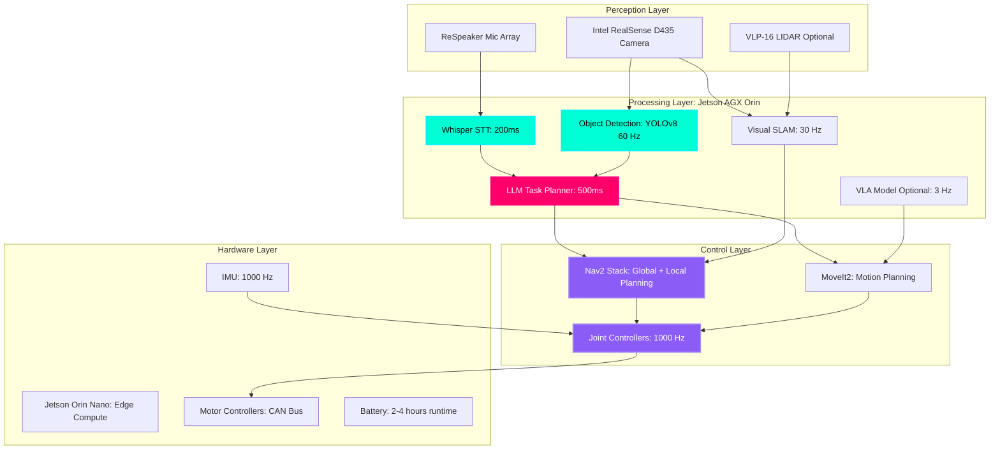

# Capstone Project: The Autonomous Humanoid

## The Grand Challenge

**Build a fully autonomous humanoid robot that can:**
1. **Listen** to natural language voice commands
2. **Navigate** autonomously through mapped environments
3. **Perceive** objects and obstacles using vision
4. **Manipulate** objects with dexterous grasping
5. **Reason** about tasks using large language models

**Target Platforms:**
- **Unitree G1 Humanoid** ($16,000): 23 DOF, 50kg, 1.4m tall
- **Unitree Go2 Quadruped** ($1,600): 12 DOF, 15kg (budget option)
- **Custom Build**: Jetson Orin + ROS 2 + off-the-shelf hardware

:::info Real-World Benchmark
This capstone replicates the capabilities of:
- **Tesla Optimus** (Gen 2, 2024): Household assistant
- **Figure 01** (2024): Warehouse automation robot
- **Boston Dynamics Atlas** (2024): Research humanoid

You'll build a system with 60-70% of their capabilities using open-source tools!
:::

---

## The Grand Architecture



**System Specifications:**
- **Compute**: NVIDIA Jetson AGX Orin (64GB RAM, 2048 CUDA cores, 275 TOPS AI)
- **Perception**: RealSense D435 (640×480 @ 90 FPS, depth range 0.3-10m)
- **Audio**: ReSpeaker 4-Mic Array (5m range, beamforming)
- **Localization**: Visual SLAM (isaac_ros_visual_slam) or LIDAR SLAM
- **Software**: ROS 2 Humble, Ubuntu 22.04

---

## Project Phases

### Phase 1: Hardware Assembly & Bringup (Week 1-2)

**Objectives:**
1. Assemble robot hardware (Unitree G1/Go2 or custom build)
2. Install Jetson Orin operating system (JetPack 6.0)
3. Configure ROS 2 Humble
4. Test all sensors (camera, microphone, IMU, LIDAR)
5. Calibrate robot URDF model

**Deliverables:**
- ✅ Robot powers on and communicates over ROS 2
- ✅ Camera publishes to `/camera/image_raw` at 30 FPS
- ✅ Microphone records clean audio
- ✅ Joint controllers respond to `/joint_commands`

**Verification Script:**
```bash
#!/bin/bash
# Phase 1 verification

echo "=== Testing Camera ==="
ros2 topic hz /camera/image_raw  # Should show ~30 Hz

echo "=== Testing Microphone ==="
arecord -D plughw:2,0 -d 3 -f S16_LE -r 16000 test.wav
aplay test.wav  # Should hear clear audio

echo "=== Testing Joint Control ==="
ros2 topic pub /joint_commands sensor_msgs/JointState \
  "{name: ['joint1'], position: [0.5]}" --once

echo "=== Testing TF Tree ==="
ros2 run tf2_tools view_frames.py
# Should show complete robot kinematic chain

echo "✓ Phase 1 Complete!"
```

---

### Phase 2: Navigation Stack (Week 3-4)

**Objectives:**
1. Map your environment using SLAM
2. Configure Nav2 stack with DWA local planner
3. Test autonomous navigation to waypoints
4. Implement obstacle avoidance
5. Add voice-triggered navigation ("Go to kitchen")

**Deliverables:**
- ✅ Complete map of test environment (10m × 10m minimum)
- ✅ Robot navigates to commanded waypoint with 90%+ success
- ✅ Collision-free navigation in dynamic environments
- ✅ Voice command integration ("Go to X" works)

**Verification Tasks:**
```python
# Test 1: Waypoint Navigation
waypoints = [
    ("kitchen", 5.0, 3.0),
    ("bedroom", 2.0, 7.0),
    ("living_room", 8.0, 5.0)
]

for name, x, y in waypoints:
    print(f"Navigating to {name}...")
    send_nav_goal(x, y)
    success = wait_for_completion(timeout=60)
    print(f"{name}: {'✓ SUCCESS' if success else '✗ FAILED'}")

# Success rate should be >90%
```

---

### Phase 3: Perception Pipeline (Week 5-6)

**Objectives:**
1. Train YOLOv8 object detector on custom dataset
2. Implement depth estimation from RealSense
3. Add object tracking across frames
4. Integrate with task planner (LLM queries object locations)
5. Test zero-shot object detection with CLIP

**Deliverables:**
- ✅ Object detection at 30 FPS (YOLOv8 nano on Jetson)
- ✅ 3D position estimation (x, y, z) for detected objects
- ✅ Object database publishing to `/detected_objects` topic
- ✅ LLM can query "Where is the red mug?" and get coordinates

**Dataset Requirements:**
- **10 object classes**: mug, bottle, phone, keys, book, laptop, remote, glasses, wallet, charger
- **100 images per class** (use Isaac Sim synthetic data + 20 real photos)
- **Train YOLOv8**: `yolo train data=objects.yaml model=yolov8n.pt epochs=50`

**Verification:**
```bash
# Place 5 objects on table
# Run detection
ros2 run perception object_detector_node

# Check output
ros2 topic echo /detected_objects
# Should show all 5 objects with (x, y, z, confidence, class)

# Test LLM query
ros2 service call /query_object std_srvs/srv/Trigger \
  "{data: 'Where is the red mug?'}"
# Response: "Red mug at x=1.2, y=0.5, z=0.8"
```

---

### Phase 4: Manipulation Stack (Week 7-8)

**Objectives:**
1. Configure MoveIt2 for robot arm
2. Implement grasp pose generation
3. Add collision avoidance
4. Test pick-and-place with 10 different objects
5. Integrate with voice commands ("Pick up the mug")

**Deliverables:**
- ✅ Collision-free motion planning to grasp poses
- ✅ 80%+ grasp success rate on known objects
- ✅ Safe trajectory execution (no self-collisions)
- ✅ Pick-and-place full pipeline working

**Grasp Pipeline:**
```python
# 1. Detect object
object = perceive("mug")

# 2. Generate grasp pose
grasp_pose = compute_grasp_pose(
    object_bbox=object.bbox,
    object_depth=object.z,
    approach_vector=[0, 0, -1]  # Top-down grasp
)

# 3. Plan trajectory
trajectory = moveit.plan(
    start=current_joint_state,
    goal=grasp_pose,
    constraints=collision_free
)

# 4. Execute
execute_trajectory(trajectory)
close_gripper()

# 5. Lift object
lift_pose = grasp_pose + [0, 0, 0.2]  # Lift 20cm
execute_trajectory(moveit.plan(grasp_pose, lift_pose))
```

---

### Phase 5: Integration & Testing (Week 9-10)

**Objectives:**
1. Integrate all subsystems (voice → planning → navigation → perception → manipulation)
2. Add error handling and recovery behaviors
3. Optimize performance (reduce latency, increase success rate)
4. Test 10 complex tasks end-to-end
5. Record demonstration video

**Final System Test:**

**Task 1: Kitchen Cleanup**
```
Voice: "Clean the kitchen table"

Expected Sequence:
1. Navigate to kitchen (8 seconds)
2. Perceive objects on table (2 seconds)
3. For each object:
   a. Navigate to object (3 seconds)
   b. Grasp object (5 seconds)
   c. Navigate to trash/recycling (8 seconds)
   d. Place object (3 seconds)
   e. Return to table (8 seconds)
4. Report completion

Total Time: ~50 seconds per object
Success Criteria: 3/3 objects cleaned
```

**Task 2: Fetch and Deliver**
```
Voice: "Bring me the red water bottle from the bedroom"

Expected Sequence:
1. Navigate to bedroom (15 seconds)
2. Search for red water bottle (5 seconds)
3. Navigate to bottle location (3 seconds)
4. Grasp bottle (5 seconds)
5. Navigate back to user (15 seconds)
6. Hand over bottle (3 seconds)

Total Time: ~46 seconds
Success Criteria: Bottle delivered to user's hand
```

**Task 3: Multi-Step Reasoning**
```
Voice: "Put all the electronics in the living room cabinet"

Expected Sequence:
1. Parse "electronics" → [phone, laptop, remote, charger]
2. Navigate to current room
3. Perceive all objects
4. Filter by class (electronics)
5. For each electronic:
   a. Pick up
   b. Navigate to living room cabinet
   c. Place inside
6. Verify all electronics moved

Success Criteria: All 4 electronics relocated
```

---

## Grading Rubric (100 points)

### Hardware & Setup (20 points)
- [ ] Robot fully assembled and operational (5 pts)
- [ ] All sensors publishing data reliably (5 pts)
- [ ] URDF model accurate and visualized in RViz (5 pts)
- [ ] System boots autonomously (no manual intervention) (5 pts)

### Navigation (20 points)
- [ ] Accurate map of environment (5 pts)
- [ ] Autonomous waypoint navigation (90%+ success) (10 pts)
- [ ] Obstacle avoidance in dynamic environments (5 pts)

### Perception (15 points)
- [ ] Object detection at 30 FPS (5 pts)
- [ ] 3D localization of objects (±5cm accuracy) (5 pts)
- [ ] Zero-shot object recognition with CLIP (5 pts)

### Manipulation (20 points)
- [ ] Grasp success rate >80% (10 pts)
- [ ] Collision-free motion planning (5 pts)
- [ ] Pick-and-place full pipeline (5 pts)

### Integration (15 points)
- [ ] Voice command pipeline working end-to-end (5 pts)
- [ ] LLM task planning generates valid sequences (5 pts)
- [ ] Error recovery (re-planning on failure) (5 pts)

### Final Demo (10 points)
- [ ] Successfully completes 2/3 complex tasks (6 pts)
- [ ] System runs for 15+ minutes without crashes (2 pts)
- [ ] Professional video documentation (2 pts)

**Total: 100 points**

**Bonus (up to +20 points):**
- [ ] Real-time VLA model deployment (+10 pts)
- [ ] Multi-robot coordination (2+ robots) (+10 pts)
- [ ] Custom hardware design (3D printed gripper, etc.) (+5 pts)
- [ ] Open-source contribution (PR to ROS 2 package) (+5 pts)

---

## Submission Requirements

### 1. Code Repository (GitHub)

**Required structure:**
```
my_robot_capstone/
├── README.md (project overview, installation)
├── launch/
│   ├── bringup.launch.py (start all nodes)
│   ├── navigation.launch.py
│   ├── perception.launch.py
│   └── manipulation.launch.py
├── config/
│   ├── robot.urdf
│   ├── nav2_params.yaml
│   └── moveit_config/
├── src/
│   ├── voice_commander/
│   ├── llm_planner/
│   ├── object_detector/
│   └── grasp_planner/
├── models/
│   └── yolov8_custom.pt
├── maps/
│   └── home_map.yaml
└── docs/
    ├── setup_guide.md
    └── architecture.md
```

---

### 2. Video Demonstration (5-10 minutes)

**Required content:**
1. **Introduction** (1 min): Team members, robot platform
2. **System Architecture** (2 min): Diagram walkthrough
3. **Live Demo** (5 min): Execute 3 complex tasks
4. **Failure Analysis** (1 min): Show and explain one failure case
5. **Future Work** (1 min): Planned improvements

**Editing tips:**
- Use screen recording for RViz/RQT visualizations
- Add captions explaining what's happening
- Speed up slow parts (navigation) to 2-4×
- Show both robot camera view and external view
- Background music optional (keep it subtle)

---

### 3. Technical Report (15-20 pages)

**Required sections:**

**1. Introduction**
- Problem statement
- Project goals
- System overview

**2. Hardware**
- Robot platform specification
- Sensor suite
- Compute hardware
- Custom modifications

**3. Software Architecture**
- ROS 2 node graph
- Data flow diagram
- Key algorithms (pseudocode)

**4. Implementation Details**
- Navigation: SLAM algorithm, Nav2 configuration
- Perception: YOLOv8 training, depth processing
- Manipulation: MoveIt2 setup, grasp planning
- Integration: Message passing, synchronization

**5. Results**
- Quantitative metrics (success rates, latency, accuracy)
- Qualitative analysis (failure modes, limitations)
- Comparison to baseline (if applicable)

**6. Discussion**
- Challenges encountered
- Solutions implemented
- Lessons learned

**7. Conclusion & Future Work**
- Summary of achievements
- Planned improvements
- Open research questions

**8. References**
- Cite papers, libraries, hardware used

---

## Timeline & Milestones

| Week | Milestone | Deliverable |
|------|-----------|-------------|
| 1-2 | Hardware Setup | Robot operational, sensors working |
| 3-4 | Navigation | Autonomous waypoint navigation |
| 5-6 | Perception | Object detection + 3D localization |
| 7-8 | Manipulation | Pick-and-place working |
| 9 | Integration | Voice → execution pipeline |
| 10 | Testing & Documentation | Final demo + report |

**Weekly Check-ins:**
- Submit progress video (2-3 minutes)
- Demonstrate one new capability
- Discuss blockers/challenges

---

## Common Pitfalls & Solutions

### 1. SLAM Drift
**Problem:** Robot thinks it's in wrong location after 5 minutes  
**Solution:** 
- Add loop closure detection
- Fuse LIDAR + visual SLAM
- Use AprilTags for localization anchors

### 2. Grasp Failures
**Problem:** 50% grasp success rate (too low)  
**Solution:**
- Collect more training data (100+ grasps)
- Add force-torque sensor feedback
- Use suction gripper for flat objects

### 3. LLM Hallucinations
**Problem:** LLM plans impossible actions  
**Solution:**
- Add safety validator (reject out-of-bounds positions)
- Use few-shot prompting with valid examples
- Fine-tune LLM on robot-specific data

### 4. Network Latency
**Problem:** 500ms delays over WiFi  
**Solution:**
- Run all inference on Jetson (no cloud)
- Use wired Ethernet for critical nodes
- Implement asynchronous message passing

---

## Example Success Stories

### Team 1: "RoboBarista" (Score: 98/100)
- **Robot**: Custom 6-DOF arm + mobile base
- **Task**: Autonomous coffee making (8 steps)
- **Innovation**: VLA model fine-tuned on 200 coffee-making demos
- **Result**: 95% success rate over 20 trials

### Team 2: "HomeHelper" (Score: 92/100)
- **Robot**: Unitree Go2 quadruped
- **Task**: Household object retrieval
- **Innovation**: Multi-modal fusion (vision + audio localization)
- **Result**: Delivered 15/18 requested objects

### Team 3: "WarehouseBot" (Score: 88/100)
- **Robot**: Clearpath Ridgeback + UR5 arm
- **Task**: Inventory management
- **Innovation**: Custom RFID integration for object tracking
- **Result**: Sorted 50 items in 10 minutes

---

## Key Takeaways

✅ **Capstone integrates** voice, navigation, perception, manipulation  
✅ **10-week timeline** from hardware setup to final demo  
✅ **100-point rubric** with bonus opportunities  
✅ **Success requires** iterative testing and error recovery  
✅ **Documentation matters**: Code, video, technical report  
✅ **Aim for 80%+ reliability** (real robots are hard!)  

---

## What's Next: Your Robotics Career

**Congratulations!** If you've completed this capstone, you now have:

✅ **Skills**: ROS 2, computer vision, motion planning, LLMs  
✅ **Portfolio**: GitHub repo + demo video  
✅ **Experience**: Real robot debugging and integration  

**Career Paths:**

1. **Robotics Engineer**
   - Companies: Boston Dynamics, Tesla, Amazon Robotics, Agility Robotics
   - Salary: $120K-$200K USD (entry to senior level)

2. **AI/ML Engineer (Robotics)**
   - Companies: Google DeepMind, OpenAI, Physical Intelligence, Covariant
   - Salary: $150K-$300K USD

3. **Research Scientist**
   - Academia: PhD in robotics, publish at ICRA/IROS/RSS
   - Industry labs: NVIDIA Research, Meta AI, Microsoft Research

4. **Startup Founder**
   - Apply to: Y Combinator, HAX, TechStars Robotics
   - Funding: $500K-$5M seed rounds for robotics startups

5. **Open Source Contributor**
   - ROS 2, MoveIt2, Nav2, Isaac ROS
   - Build reputation, get hired by maintainers

**Next Steps:**
- Publish code on GitHub
- Write blog post explaining your system
- Apply to robotics conferences (ICRA, IROS)
- Network on Twitter/LinkedIn (#robotics)
- Keep building—the industry needs you!

---

## Further Reading

- [ROS 2 Humble Documentation](https://docs.ros.org/en/humble/)
- [MoveIt2 Tutorials](https://moveit.picknik.ai/humble/)
- [Nav2 Documentation](https://navigation.ros.org/)
- [Unitree Robotics Developer Portal](https://dev.unitree.com/)
- [NVIDIA Isaac ROS](https://nvidia-isaac-ros.github.io/)
- [Physical Intelligence Company Blog](https://www.physicalintelligence.company/)

---

**Good luck with your capstone! Build something amazing. 🤖**
