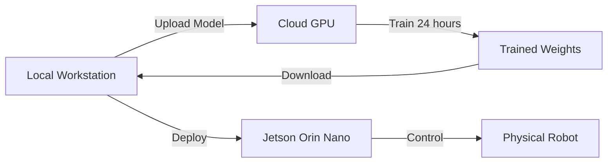

# Building the Physical AI Lab

## Introduction: The Infrastructure Decision

Before you write your first line of robot code, you face a critical infrastructure decision: **Cloud or Physical?** This isn't just about cost—it's about latency, scalability, maintenance, and learning objectives.

:::tip The Hybrid Approach
Most successful Physical AI programs use **both**: cloud for training compute-intensive models, physical hardware for real-time inference and robot control.
:::

---

## Option 1: The "Ether Lab" (Cloud Infrastructure)

### Why Cloud?

The cloud-based approach eliminates upfront capital expenditure (CapEx) and provides instant access to high-end GPUs without hardware maintenance.

**Advantages:**
- ✅ Zero upfront investment
- ✅ Instant provisioning (spin up instances in 2 minutes)
- ✅ Access to latest hardware (H100s, A100s on demand)
- ✅ No cooling, power, or space requirements
- ✅ Perfect for 10-week courses (no equipment storage)

**Disadvantages:**
- ❌ Ongoing operational costs (OpEx)
- ❌ Network latency for real-time control
- ❌ Cannot connect to physical robots directly
- ❌ Data egress fees (downloading models)
- ❌ Credit exhaustion risk for students

---

### Recommended Cloud Configuration

#### AWS g5.2xlarge Instance

**Specifications:**
- **GPU**: 1x NVIDIA A10G Tensor Core (24GB VRAM)
- **vCPUs**: 8 cores (3rd Gen AMD EPYC)
- **RAM**: 32 GB
- **Storage**: 225 GB NVMe SSD
- **Network**: Up to 10 Gbps
- **Cost**: ~$1.21/hour (On-Demand, us-east-1)

**Monthly Cost Estimate (8 hours/day, 20 days/month):**
```
$1.21/hour × 8 hours/day × 20 days = $193.60/month
```

:::warning Cost Management
Enable **auto-stop** after 2 hours of inactivity to prevent accidental overnight charges ($30+ per night).
:::

---

#### AWS Setup Guide

**Step 1: Launch Instance**
```bash
# Install AWS CLI
curl "https://awscli.amazonaws.com/awscli-exe-linux-x86_64.zip" -o "awscliv2.zip"
unzip awscliv2.zip
sudo ./aws/install

# Configure credentials
aws configure

# Launch g5.2xlarge with Deep Learning AMI
aws ec2 run-instances \
  --image-id ami-0c7217cdde317cfec \
  --instance-type g5.2xlarge \
  --key-name your-keypair \
  --security-group-ids sg-xxxxxxxxx \
  --subnet-id subnet-xxxxxxxxx \
  --block-device-mappings '[{"DeviceName":"/dev/sda1","Ebs":{"VolumeSize":500}}]' \
  --tag-specifications 'ResourceType=instance,Tags=[{Key=Name,Value=PhysicalAI-Lab}]'
```

**Step 2: Connect and Verify GPU**
```bash
# SSH into instance
ssh -i your-keypair.pem ubuntu@<instance-ip>

# Verify GPU
nvidia-smi

# Expected output:
# +-----------------------------------------------------------------------------+
# | NVIDIA-SMI 525.60.13    Driver Version: 525.60.13    CUDA Version: 12.0     |
# |-------------------------------+----------------------+----------------------+
# | GPU  Name        Persistence-M| Bus-Id        Disp.A | Volatile Uncorr. ECC |
# |   0  NVIDIA A10G         On   | 00000000:00:1E.0 Off |                    0 |
```

**Step 3: Install Isaac Sim (Cloud)**
```bash
# Install Omniverse Launcher
wget https://install.launcher.omniverse.nvidia.com/installers/omniverse-launcher-linux.AppImage
chmod +x omniverse-launcher-linux.AppImage

# Note: Isaac Sim headless mode for cloud
# Full GUI rendering requires X11 forwarding or VNC
```

---

### Alternative Cloud Providers

#### Paperspace (More Affordable)

**Configuration**: P4000 instance
- **GPU**: NVIDIA Quadro P4000 (8GB)
- **Cost**: $0.51/hour ($81.60/month @ 8 hrs/day)
- **Best for**: Students on tight budgets
- **Limitation**: Cannot run Isaac Sim (needs 12GB+ VRAM)

#### Google Colab Pro+ (Quick Experiments)

- **GPU**: V100 or A100 (varies)
- **Cost**: $50/month (limited compute units)
- **Best for**: Jupyter notebook experiments, not production
- **Limitation**: 24-hour session timeout

---

## Option 2: The "Sim Rig" (Physical Workstation)

### Why Physical Hardware?

A dedicated workstation provides low-latency control for physical robots and avoids recurring cloud costs for long-term projects.

**Advantages:**
- ✅ One-time investment (own forever)
- ✅ Zero latency for robot control
- ✅ No data egress fees
- ✅ Can connect USB sensors (RealSense, ReSpeaker)
- ✅ Tax-deductible for educational institutions

**Disadvantages:**
- ❌ High upfront cost ($1,800 - $3,000)
- ❌ Requires physical space and cooling
- ❌ Maintenance responsibility
- ❌ Hardware obsolescence (3-5 year lifespan)

---

### Recommended Workstation Configuration

#### The "Golden Build" ($1,849)

| Component | Model | Specs | Price |
|-----------|-------|-------|-------|
| **GPU** | NVIDIA RTX 4070 Ti | 12GB GDDR6X, 7680 CUDA cores | $799 |
| **CPU** | AMD Ryzen 9 7900X | 12 cores, 24 threads, 4.7 GHz | $429 |
| **Motherboard** | ASUS TUF Gaming X670E | PCIe 5.0, WiFi 6E | $289 |
| **RAM** | Corsair Vengeance DDR5 | 32GB (2x16GB), 5600 MHz | $119 |
| **Storage** | Samsung 980 Pro | 500GB NVMe Gen4 | $69 |
| **PSU** | Corsair RM850x | 850W 80+ Gold | $129 |
| **Case** | Fractal Design Meshify 2 | Airflow optimized | $159 |
| **Cooling** | Noctua NH-D15 | Dual tower, 140mm fans | $109 |

**Total**: $2,102 (before tax/shipping)

:::info Why RTX 4070 Ti?
The 12GB VRAM is the **minimum** for NVIDIA Isaac Sim's recommended specs. RTX 4060 Ti (8GB) will struggle with complex scenes.
:::

---

#### Alternative Budget Build ($1,299)

For students or hobbyists:

| Component | Downgrade | Savings |
|-----------|-----------|---------|
| GPU | RTX 4060 Ti (8GB) | -$300 |
| CPU | Ryzen 7 7700X (8-core) | -$150 |
| RAM | 16GB DDR5 (2x8GB) | -$60 |
| Motherboard | B650 chipset | -$100 |
| Cooling | Corsair air cooler | -$50 |

**New Total**: $1,442

**Trade-offs:**
- ⚠️ Isaac Sim will run at low graphics settings
- ⚠️ Limited to 2-3 simulated robots simultaneously
- ⚠️ Cannot train large RL models locally

---

### Operating System: Ubuntu 22.04 LTS

**Why Ubuntu?**
- ✅ ROS 2 Humble official support (until 2027)
- ✅ NVIDIA Isaac Sim native compatibility
- ✅ All tutorials assume Ubuntu/Linux
- ✅ Free and open-source

**Installation Guide:**

1. **Download Ubuntu 22.04**
   ```bash
   # Download from official site
   wget https://releases.ubuntu.com/22.04/ubuntu-22.04.3-desktop-amd64.iso
   
   # Create bootable USB (on Linux)
   sudo dd if=ubuntu-22.04.3-desktop-amd64.iso of=/dev/sdX bs=4M status=progress
   ```

2. **Dual Boot Configuration (Optional)**
   - Keep Windows for gaming, Ubuntu for robotics
   - Allocate 200GB+ partition for Ubuntu
   - Install GRUB bootloader

3. **Post-Installation: NVIDIA Drivers**
   ```bash
   # Check GPU detection
   lspci | grep -i nvidia
   
   # Install latest NVIDIA driver
   sudo ubuntu-drivers devices
   sudo ubuntu-drivers autoinstall
   
   # Reboot and verify
   sudo reboot
   nvidia-smi
   ```

---

## CapEx vs OpEx Analysis

### 5-Year Total Cost of Ownership

**Cloud (AWS g5.2xlarge):**
```
Cost per hour: $1.21
Hours per week: 40 (full-time usage)
Weeks per year: 50 (accounting for breaks)

Annual cost: $1.21 × 40 × 50 = $2,420/year
5-year cost: $2,420 × 5 = $12,100
```

**Physical Workstation:**
```
Initial investment: $1,849
Electricity: ~$15/month × 12 × 5 = $900
Upgrades (RAM, storage): $300 over 5 years

5-year cost: $1,849 + $900 + $300 = $3,049
```

**Break-even point**: ~18 months of regular usage

:::tip Institutional Decision
- **Universities**: Physical workstations (multi-student access, 10+ year amortization)
- **Bootcamps/Short Courses**: Cloud (no maintenance, pay-per-use)
- **Individual Learners**: Physical if committed to 2+ years, Cloud for experimentation
:::

---

## Recommended Lab Layout

### Small-Scale Lab (1-10 Students)

**Configuration:**
- 5x Physical Workstations (RTX 4070 Ti)
- 1x High-end Server (Dual RTX 4090s for shared training)
- 1x NAS (Network Attached Storage) for datasets
- 10Gbps local network

**Cost**: ~$15,000 initial + $200/month electricity

---

### Large-Scale Lab (50+ Students)

**Configuration:**
- 2x Physical Workstations (instructor demos)
- AWS Cloud Credits ($100/student/semester)
- Remote desktop infrastructure (Apache Guacamole)
- GitLab instance for code collaboration

**Cost**: ~$10,000 setup + $5,000/semester cloud

---

## Space and Power Requirements

### Physical Requirements

**Per Workstation:**
- **Space**: 2' × 2' desk footprint
- **Power**: 850W PSU (draws 300-600W typical)
- **Cooling**: Room AC recommended (generates ~1,200 BTU/hour)
- **Ventilation**: Avoid enclosed cabinets (GPU needs airflow)

**Classroom Setup:**
- **Electrical**: 15A circuit per 2 workstations
- **Cooling**: 1 ton AC per 5 workstations
- **Fire Safety**: Ensure proper extinguisher access

:::danger Fire Hazard
Never run more than 3 high-power GPUs on a single 15A household circuit. Use dedicated 20A circuits for labs.
:::

---

## Maintenance and Upkeep

### Physical Workstation Maintenance

**Monthly:**
- Clean dust filters (every 30 days in dusty environments)
- Check GPU temperatures (below 80°C under load)
- Backup important datasets

**Quarterly:**
- Update NVIDIA drivers
- Update Ubuntu kernel
- Repaste thermal compound if temps exceed 85°C

**Annual:**
- Replace case fans (if noisy or failing)
- Upgrade storage if under 20% free space
- Consider GPU upgrade if under 8GB VRAM

---

## Decision Framework

### Choose **Cloud** if:
- ✅ Course duration under 6 months
- ✅ Budget is flexible (OpEx model approved)
- ✅ No physical robot hardware
- ✅ Students work remotely
- ✅ Need access to H100/A100 GPUs

### Choose **Physical** if:
- ✅ Long-term commitment (2+ years)
- ✅ Budget has upfront capital available
- ✅ Physical robots in lab (Unitree, Boston Dynamics)
- ✅ Low-latency control required
- ✅ Want to teach hardware maintenance

---

## Hybrid Approach (Recommended)

### Best of Both Worlds

**Local Workstations** (1-2 units):
- Robot control and testing
- Real-time inference (Jetson connected)
- Student project demonstrations

**Cloud Instances** (AWS/GCP):
- Large-scale RL training (Isaac Gym)
- Synthetic data generation (10,000+ images)
- Model fine-tuning (LoRA, RLHF)

**Workflow:**


---

## Troubleshooting Common Issues

### Cloud Problems

**Issue**: "Insufficient capacity" error on AWS
```bash
# Solution: Try different availability zone
aws ec2 run-instances ... --availability-zone us-east-1b
```

**Issue**: Slow SSH connection
```bash
# Solution: Enable connection multiplexing
# Add to ~/.ssh/config:
Host *.compute.amazonaws.com
    ControlMaster auto
    ControlPath ~/.ssh/sockets/%r@%h-%p
    ControlPersist 600
```

### Physical Hardware Problems

**Issue**: GPU not detected in Ubuntu
```bash
# Solution: Secure boot may block NVIDIA drivers
# Disable in BIOS or sign drivers:
sudo mokutil --disable-validation
```

**Issue**: Overheating (greater than 85°C)
```bash
# Check fan speeds
nvidia-smi -q -d TEMPERATURE

# Solution: Improve case airflow or repaste GPU
```

---

## Summary

| Aspect | Cloud (AWS g5.2xlarge) | Physical (RTX 4070 Ti) |
|--------|------------------------|------------------------|
| **Upfront Cost** | $0 | $1,849 |
| **Monthly Cost** | $194 (8hr/day) | $15 (electricity) |
| **5-Year Cost** | $11,640 | $2,749 |
| **GPU VRAM** | 24GB (A10G) | 12GB |
| **Robot Control** | ❌ High latency | ✅ Real-time |
| **Maintenance** | Zero | DIY required |
| **Best For** | Short courses | Long-term projects |

---

## Next Steps

1. **Evaluate Budget**: Calculate CapEx vs OpEx for your timeline
2. **Assess Use Case**: Do you need physical robot integration?
3. **Prototype First**: Start with cloud, migrate to physical if committed
4. **Plan Space**: Ensure adequate power and cooling for physical rigs

**Recommended Path for Most Learners:**
1. Start with AWS free tier (limited)
2. Use Paperspace for experimentation ($50-100/month)
3. Invest in physical workstation if continuing beyond 6 months

---

:::tip Pro Tip
Many universities have **AWS Educate** or **Azure for Students** credits ($100-200/year). Check with your institution before paying out of pocket.
:::

**Next Chapter**: [The Student Kit (Jetson & Sensors)](./02-edge-hardware.mdx)
