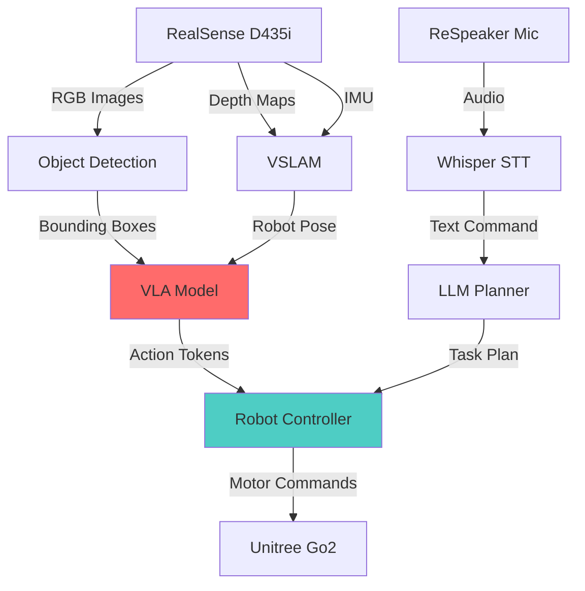

# The Student Kit: Jetson & Sensors

## Introduction: The Edge Computing Revolution

While cloud GPUs provide massive training power, **real-world robots need real-time inference** on battery-powered hardware. Enter **NVIDIA Jetson**—the edge AI platform that brings GPU acceleration to robots, drones, and autonomous vehicles.

:::info Why Edge Compute?
**Cloud**: 100-500ms latency (unusable for balance/grasping)  
**Edge**: 10-30ms latency (real-time control possible)

A humanoid robot running VLA models locally can react 10-50× faster than one waiting for cloud responses.
:::

---

## The NVIDIA Jetson Platform

### The Jetson Family (2024)

| Model | GPU | RAM | Power | Price | Best For |
|-------|-----|-----|-------|-------|----------|
| **Orin Nano 8GB** | 1024 CUDA cores | 8GB | 7-15W | $249 | Students, prototypes |
| **Orin Nano (4GB)** | 512 CUDA cores | 4GB | 5-10W | $199 | Budget projects |
| **Orin NX 16GB** | 1024 CUDA cores | 16GB | 10-25W | $599 | Production robots |
| **AGX Orin 32GB** | 2048 CUDA cores | 32GB | 15-60W | $999 | Autonomous vehicles |
| **AGX Orin 64GB** | 2048 CUDA cores | 64GB | 15-60W | $1,999 | Multi-sensor fusion |

:::tip Student Recommendation
**Orin Nano 8GB** ($249) is the sweet spot for learning. Runs:
- ✅ ROS 2 Humble
- ✅ Isaac ROS (visual SLAM, object detection)
- ✅ Whisper (voice control)
- ✅ Small VLA models (OpenVLA 7B with quantization)
:::

---

### Jetson Orin Nano Deep Dive

**Technical Specifications:**
- **GPU**: 1024-core NVIDIA Ampere (same architecture as RTX 30 series)
- **CPU**: 6-core ARM Cortex-A78AE @ 1.5 GHz
- **AI Performance**: 40 TOPS (INT8), 20 TFLOPS (FP16)
- **Memory**: 8GB LPDDR5 (unified memory, shared CPU/GPU)
- **Storage**: MicroSD + M.2 NVMe slot
- **I/O**: 4× USB 3.2, HDMI 2.1, 1Gbps Ethernet, GPIOs
- **Size**: 4.0" × 3.8" (credit card size)

**Power Modes:**
- **7W Mode**: Battery-powered robots (Unitree Go2)
- **15W Mode**: Maximum performance (plugged in)

**Why It's Revolutionary:**
```
2019: NVIDIA Jetson Nano (128 CUDA cores, 1 TFLOPS) - $99
2024: NVIDIA Jetson Orin Nano (1024 CUDA cores, 20 TFLOPS) - $249

20× more AI performance for 2.5× the cost
```

---

### Setting Up Jetson Orin Nano

#### Hardware Assembly

**Required Components:**
1. **Jetson Orin Nano Developer Kit** ($249)
2. **Power Supply**: 19V 3.42A (65W) barrel connector (included)
3. **MicroSD Card**: 128GB+ UHS-I (Samsung EVO Select) - $15
4. **NVMe SSD** (Optional): 256GB M.2 2280 (Samsung 980) - $35
5. **WiFi Module** (Optional): Intel AX210 M.2 - $25

**Total Basic Setup**: $289

---

#### Software Installation

**Step 1: Flash JetPack 6.0 (Latest)**

```bash
# On Ubuntu host machine:
# Download NVIDIA SDK Manager
wget https://developer.nvidia.com/sdk-manager

# Install dependencies
sudo apt install libfuse2

# Launch SDK Manager
./sdkmanager_*.AppImage

# Follow GUI:
# 1. Select "Jetson Orin Nano" as target
# 2. Check "Jetson Linux" + "Jetson SDK Components"
# 3. Flash to microSD card
# 4. Wait 45 minutes for installation
```

**Step 2: First Boot Configuration**

```bash
# Connect Jetson via USB-C (for serial console)
# OR connect HDMI monitor + USB keyboard

# On Jetson (after first boot):
# Set username, password, timezone

# Update system
sudo apt update && sudo apt upgrade -y

# Install essential tools
sudo apt install -y \
    build-essential \
    cmake \
    git \
    nano \
    htop \
    python3-pip \
    curl
```

**Step 3: Verify CUDA Installation**

```bash
# Check GPU
nvidia-smi

# Expected output (JetPack 6.0):
# +-----------------------------------------------------------------------------+
# | NVIDIA-SMI 535.104.12   Driver Version: 535.104.12   CUDA Version: 12.2    |
# |-------------------------------+----------------------+----------------------+
# | GPU  Name        Persistence-M| Bus-Id        Disp.A | Volatile Uncorr. ECC |
# |   0  Orin                On   | 00000000:00:00.0 Off |                  N/A |

# Check CUDA compiler
nvcc --version

# Test TensorRT (Jetson's inference engine)
/usr/src/tensorrt/bin/trtexec --help
```

---

## The Eyes: Intel RealSense D435i

### Why RealSense?

**Traditional Cameras**: Only capture 2D images (no depth)  
**RealSense D435i**: Captures RGB + Depth + IMU (inertial measurement)

This enables:
- **VSLAM** (Visual SLAM for mapping)
- **Obstacle Avoidance** (know how far walls are)
- **Grasping** (estimate object distance for manipulation)
- **Person Following** (track humans in 3D space)

---

### D435i Specifications

| Feature | Specification |
|---------|---------------|
| **Price** | $289 (educational discount available) |
| **Depth Technology** | Active IR stereo (structured light) |
| **Depth Range** | 0.3m - 10m (optimal: 0.5m - 5m) |
| **Depth Resolution** | 1280×720 @ 30fps |
| **RGB Resolution** | 1920×1080 @ 30fps |
| **IMU** | BMI055 (6-axis: gyro + accelerometer) |
| **Field of View** | 87° × 58° (depth), 69° × 42° (RGB) |
| **USB** | USB 3.0 (2.5W power draw) |
| **Weight** | 72g |

:::info Why IMU Matters
The **IMU** (Inertial Measurement Unit) provides:
- **Linear Acceleration** (m/s²) for motion estimation
- **Angular Velocity** (rad/s) for rotation tracking
- **Sensor Fusion** with depth data → better VSLAM accuracy

Without IMU: Depth-only VSLAM drifts 10-20% per minute  
With IMU: Error &lt; 1% per minute (critical for long missions)
:::

---

### Setting Up RealSense on Jetson

**Step 1: Install librealsense**

```bash
# Install dependencies
sudo apt install -y \
    git \
    cmake \
    build-essential \
    libssl-dev \
    libusb-1.0-0-dev \
    pkg-config \
    libgtk-3-dev \
    libglfw3-dev \
    libgl1-mesa-dev \
    libglu1-mesa-dev

# Clone and build librealsense
git clone https://github.com/IntelRealSense/librealsense.git
cd librealsense
mkdir build && cd build

cmake .. \
    -DCMAKE_BUILD_TYPE=Release \
    -DBUILD_EXAMPLES=true \
    -DBUILD_PYTHON_BINDINGS=true

make -j$(nproc)
sudo make install
```

**Step 2: Verify Camera**

```bash
# List connected RealSense devices
rs-enumerate-devices

# Expected output:
# Device info:
#     Name                          : Intel RealSense D435I
#     Serial Number                 : 123456789012
#     Firmware Version              : 05.15.00.00
#     USB Type                      : 3.2

# Launch viewer (requires HDMI display)
realsense-viewer
```

**Step 3: ROS 2 Integration**

```bash
# Install RealSense ROS 2 wrapper
sudo apt install ros-humble-realsense2-camera

# Launch camera node
ros2 launch realsense2_camera rs_launch.py \
    enable_depth:=true \
    enable_color:=true \
    enable_infra:=true \
    enable_gyro:=true \
    enable_accel:=true

# Verify topics
ros2 topic list
# Expected output:
# /camera/color/image_raw
# /camera/depth/image_rect_raw
# /camera/imu
# /camera/color/camera_info
```

---

## The Ears: ReSpeaker USB Mic Array

### Why Specialized Microphones?

**Laptop mic**: Single channel, no noise cancellation, 5-meter range  
**ReSpeaker Mic Array**: 4 mics, beamforming, 10-meter range, echo cancellation

Enables:
- **Voice Commands** in noisy environments (kitchen, factory floor)
- **Speaker Localization** (robot turns to face speaker)
- **Multi-Speaker Separation** (identify who's talking)

---

### ReSpeaker 4-Mic Array Specifications

| Feature | Specification |
|---------|---------------|
| **Price** | $69 |
| **Microphones** | 4× omnidirectional MEMS |
| **Sample Rate** | 16kHz / 48kHz |
| **Channels** | 1-4 (configurable) |
| **Interface** | USB 2.0 (plug-and-play) |
| **DSP Features** | Automatic Gain Control (AGC), Noise Suppression, Echo Cancellation |
| **LED Ring** | 12× RGB LEDs (visual feedback) |
| **Range** | Up to 10 meters (3m optimal) |

---

### Setting Up ReSpeaker on Jetson

**Step 1: Hardware Connection**

```bash
# Connect ReSpeaker to Jetson USB 3.0 port
# Check device detection
lsusb | grep "Seeed"

# Expected output:
# Bus 001 Device 005: ID 2886:0018 Seeed Technology ReSpeaker 4 Mic Array
```

**Step 2: Install Audio Drivers**

```bash
# Install ALSA tools
sudo apt install -y alsa-utils

# List audio devices
arecord -l

# Expected output:
# card 2: ArrayUAC10 [ReSpeaker 4 Mic Array (UAC1.0)], device 0: USB Audio [USB Audio]
#   Subdevices: 1/1
#   Subdevice #0: subdevice #0

# Test recording (5 seconds)
arecord -D plughw:2,0 -f cd -d 5 test.wav

# Play back
aplay test.wav
```

**Step 3: Install Whisper (Speech Recognition)**

```bash
# Install OpenAI Whisper
pip3 install openai-whisper

# Download base model (74MB)
whisper --model base test.wav

# Expected output:
# [00:00.000 --> 00:05.000] Hello, robot. Please move forward.
```

---

## The Body: Unitree Robots

### Why Unitree?

**Boston Dynamics Spot**: $75,000 (enterprise only)  
**Unitree Go2**: $1,600 (open SDK, student-friendly)

Unitree offers:
- ✅ Open-source ROS 2 SDK
- ✅ Affordable pricing (10-50× cheaper than competitors)
- ✅ Active community (Discord, GitHub)
- ✅ Good documentation

---

### Unitree Robot Lineup (2024)

#### Unitree Go2 (Quadruped)

**Price**: $1,600 (EDU version)

**Specifications:**
- **Weight**: 15 kg
- **Payload**: 5 kg
- **Speed**: 2.5 m/s (walking), 5 m/s (running)
- **Battery**: 8000mAh (1-2 hours runtime)
- **Compute**: Jetson Orin NX (built-in)
- **Sensors**: 3D LiDAR, foot force sensors, IMU
- **Joints**: 12 motors (3 per leg)

**Best For:**
- Navigation research
- SLAM experiments
- Outdoor autonomy
- Inspection tasks

:::tip Go2 EDU Advantage
The **EDU version** ($1,600) includes:
- Full ROS 2 Humble SDK
- SSH root access
- Custom firmware upload
- LiDAR mapping stack

Pro version ($2,700) adds:
- Better build quality
- 4G LTE connectivity
- Extended warranty
:::

---

#### Unitree G1 (Humanoid)

**Price**: $16,000

**Specifications:**
- **Height**: 1.32 meters (4'4")
- **Weight**: 35 kg
- **Degrees of Freedom**: 23 (arms, legs, torso)
- **Hands**: 5-finger dexterous grippers
- **Compute**: Jetson AGX Orin 64GB
- **Battery**: 9000mAh (1.5 hours runtime)
- **Sensors**: RealSense D435i (head), torque sensors (all joints)

**Best For:**
- Manipulation research
- VLA model deployment
- Human-robot interaction
- Imitation learning

**Limitations:**
- ❌ No bipedal walking yet (development in progress)
- ❌ Currently stationary or wheeled base only
- ❌ Hand dexterity limited (no individual finger control)

---

### Unitree Go2 SDK Setup

**Step 1: Connect to Robot**

```bash
# Robot creates WiFi hotspot: "Unitree_Go2_XXXXXX"
# Password: "00000000" (8 zeros)

# SSH into robot
ssh unitree@192.168.123.161
# Password: 123

# Check ROS 2 installation
ros2 topic list
```

**Step 2: Install Go2 SDK on Development Machine**

```bash
# Clone SDK repository
git clone https://github.com/unitreerobotics/unitree_ros2.git
cd unitree_ros2

# Build with colcon
colcon build --cmake-args -DCMAKE_BUILD_TYPE=Release

# Source workspace
source install/setup.bash
```

**Step 3: Basic Movement Command**

```python
# go2_walk.py
import rclpy
from rclpy.node import Node
from unitree_ros2_msgs.msg import LowCmd

class Go2Walker(Node):
    def __init__(self):
        super().__init__('go2_walker')
        self.publisher = self.create_publisher(LowCmd, '/lowcmd', 10)
        
    def walk_forward(self, speed=0.5):
        """Command robot to walk forward at speed m/s"""
        cmd = LowCmd()
        cmd.mode = 0  # Walking mode
        cmd.velocity_x = speed
        cmd.velocity_y = 0.0
        cmd.yaw_speed = 0.0
        
        self.publisher.publish(cmd)
        self.get_logger().info(f'Walking forward at {speed} m/s')

def main():
    rclpy.init()
    walker = Go2Walker()
    walker.walk_forward(0.3)  # Walk slowly
    rclpy.spin(walker)

if __name__ == '__main__':
    main()
```

---

## The Complete Student Kit

### Budget Breakdown

| Item | Model | Price | Priority |
|------|-------|-------|----------|
| **Edge Compute** | Jetson Orin Nano 8GB | $249 | Essential |
| **Depth Camera** | RealSense D435i | $289 | Essential |
| **Microphone** | ReSpeaker 4-Mic Array | $69 | Recommended |
| **Storage** | 128GB MicroSD + 256GB NVMe | $50 | Essential |
| **WiFi Module** | Intel AX210 M.2 | $25 | Recommended |
| **Robot** | Unitree Go2 EDU | $1,600 | Optional |

**Total (No Robot)**: $682  
**Total (With Robot)**: $2,282

:::tip Shared Lab Equipment
For educational institutions:
- Buy **1 Unitree Go2** per 5 students (shared resource)
- Buy **individual Jetson + RealSense kits** for each student
- Students develop on personal kits, test on shared robot

**Cost per student**: $682 (own kit) + $320 (1/5 robot share) = **$1,002 total**
:::

---

## Power Management for Mobile Robots

### Battery Considerations

**Jetson Orin Nano Power Draw:**
- **Idle**: 3-5W
- **Running VSLAM**: 8-12W
- **Running VLA inference**: 12-15W

**Portable Battery Setup:**

```bash
# Use USB-C PD (Power Delivery) battery
# Recommended: Anker PowerCore 20,000mAh (65W PD)

# Calculate runtime:
# Battery capacity: 20,000mAh × 5V = 100Wh
# Jetson @ 15W max = 6.6 hours runtime
# RealSense @ 2.5W = adds load
# Total: ~5 hours practical runtime
```

**Robot Integration:**
```
Unitree Go2 has built-in power distribution:
- Main battery → Motors (12V)
- USB-C port → Jetson (19V via PD)
- No external battery needed
```

---

## Sensor Fusion Architecture

### The Perception Stack



---

## Performance Benchmarks

### Jetson Orin Nano 8GB

| Task | Model | FPS | Latency |
|------|-------|-----|---------|
| **Object Detection** | YOLOv8n (TensorRT) | 45 fps | 22ms |
| **VSLAM** | Isaac ROS Visual SLAM | 30 fps | 33ms |
| **Speech Recognition** | Whisper Tiny | Real-time | 500ms |
| **VLA Inference** | OpenVLA 7B (INT8) | 5 fps | 200ms |

:::warning VLA Model Constraints
**Full precision VLA models (FP16)** require 16GB+ RAM.  
On Orin Nano 8GB, you must use **INT8 quantization** with slight accuracy loss.

**Options:**
1. Run quantized model on Jetson (200ms latency)
2. Offload to cloud GPU (500-1000ms latency)
3. Use smaller model (Llama 3.2 3B-based VLA)
:::

---

## Troubleshooting Common Issues

### Jetson Problems

**Issue**: JetPack installation fails
```bash
# Solution: Use official NVIDIA SD card image instead of SDK Manager
wget https://developer.nvidia.com/downloads/embedded/l4t/r36_release_v2.0/jp60_image/jetson_orin_nano.img.xz
# Flash with Balena Etcher
```

**Issue**: Out of disk space (microSD full)
```bash
# Check usage
df -h

# Clean package cache
sudo apt clean
sudo apt autoremove -y

# Move Docker data to NVMe
sudo systemctl stop docker
sudo mv /var/lib/docker /mnt/nvme/docker
sudo ln -s /mnt/nvme/docker /var/lib/docker
sudo systemctl start docker
```

### RealSense Problems

**Issue**: Camera not detected (permission denied)
```bash
# Add user to video group
sudo usermod -aG video $USER

# Reboot
sudo reboot
```

**Issue**: Poor depth quality
```bash
# Enable high-accuracy preset
rs-enumerate-devices -c

# Use laser projector (for low-texture scenes)
rs-sensor-control -d 0 -e 1
```

### ReSpeaker Problems

**Issue**: No audio input detected
```bash
# Set as default device
sudo nano /etc/asound.conf

# Add:
# pcm.!default {
#     type hw
#     card 2
# }

# Restart ALSA
sudo alsa force-reload
```

---

## Next Steps

1. **Order Components**: Start with Jetson + RealSense ($538)
2. **Complete Tutorials**: Follow Module 2-4 for software setup
3. **Test Sensors**: Verify VSLAM and object detection work
4. **Plan Robot Purchase**: If continuing, invest in Unitree Go2

**Recommended Learning Path:**
1. Weeks 1-4: Jetson + RealSense (VSLAM, object detection)
2. Weeks 5-8: Add ReSpeaker (voice control)
3. Weeks 9-12: Deploy on Unitree robot (if available)

---

:::tip Educational Discounts
- **NVIDIA**: 20% off Jetson for students (.edu email)
- **Intel RealSense**: $230 (academic pricing)
- **Unitree**: Contact sales for bulk orders (10+ units)

**Total savings**: ~$150 per student kit
:::

**Next Chapter**: [Common Pitfalls & Solutions](./03-troubleshooting.mdx)
