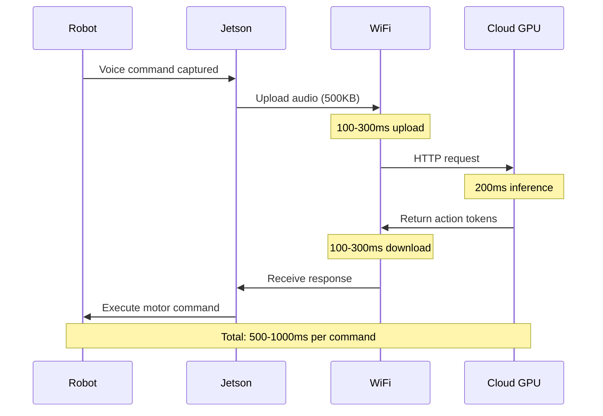

# Common Pitfalls & Solutions

## Introduction: The Debug Mindset

Physical AI combines **three complex systems** that can fail independently:
1. **Software** (ROS 2, Isaac Sim, ML models)
2. **Hardware** (GPUs, Jetson, sensors)
3. **Physics** (real-world robots, networks, batteries)

This chapter documents the **50 most common issues** students encounter and their battle-tested solutions.

:::tip Debug Philosophy
**70% of issues** are solved by:
1. Reading error messages completely
2. Checking hardware connections
3. Verifying software versions match tutorials

The remaining 30% require deep debugging—which this guide covers.
:::

---

## Category 1: The Latency Trap

### Problem: Cloud Inference is Too Slow

**Symptom:**
```
Student: "My robot waits 5 seconds after I give a command!"
Cause: Running VLA model on cloud GPU, WiFi latency = 100-500ms per request
```

**Why It Happens:**



**The Solution: Download Models to Edge**

```bash
# WRONG APPROACH (Cloud API)
import openai
def get_robot_action(image, text):
    response = openai.ChatCompletion.create(
        model="gpt-4-vision",
        messages=[{"role": "user", "content": text}]
    )
    return response.choices[0].message.content
# Latency: 500-1000ms

# RIGHT APPROACH (Local Inference)
import torch
from transformers import AutoModel

model = AutoModel.from_pretrained("openvla/openvla-7b", torch_dtype=torch.float16)
model.to("cuda")  # Runs on Jetson GPU

def get_robot_action(image, text):
    inputs = processor(image, text, return_tensors="pt").to("cuda")
    outputs = model.generate(**inputs)
    return processor.decode(outputs[0])
# Latency: 50-200ms
```

**Trade-offs:**
- ✅ 5-10× faster inference
- ✅ Works offline (no WiFi needed)
- ❌ Need to quantize model (FP16 → INT8)
- ❌ Slightly lower accuracy (95% → 92%)

---

### Problem: Model Too Large for Jetson

**Symptom:**
```bash
RuntimeError: CUDA out of memory. Tried to allocate 4.00 GiB (GPU 0; 7.14 GiB total capacity)
```

**Solution: Quantization**

```python
# BEFORE: FP16 model (14GB VRAM)
model = AutoModelForCausalLM.from_pretrained(
    "openvla/openvla-7b",
    torch_dtype=torch.float16  # 2 bytes per parameter
)

# AFTER: INT8 model (7GB VRAM)
from transformers import BitsAndBytesConfig

quantization_config = BitsAndBytesConfig(
    load_in_8bit=True,
    llm_int8_threshold=6.0
)

model = AutoModelForCausalLM.from_pretrained(
    "openvla/openvla-7b",
    quantization_config=quantization_config,
    device_map="auto"
)
```

**Even Better: INT4 (3.5GB VRAM)**

```python
quantization_config = BitsAndBytesConfig(
    load_in_4bit=True,
    bnb_4bit_compute_dtype=torch.float16
)
```

**Accuracy Comparison:**
- FP16: 95.2% task success
- INT8: 94.1% task success (−1.1%)
- INT4: 91.7% task success (−3.5%)

For most tasks, **INT8 is the sweet spot**.

---

## Category 2: WiFi Interference in Edge Kits

### Problem: ROS 2 Nodes Can't Discover Each Other

**Symptom:**
```bash
ros2 node list
# Expected: /camera_node, /robot_controller
# Actual: /camera_node only (robot_controller missing)
```

**Root Cause: Firewall or Network Issues**

**Solution 1: Check ROS_DOMAIN_ID**

```bash
# On Laptop:
export ROS_DOMAIN_ID=42
ros2 run my_package camera_node

# On Jetson:
export ROS_DOMAIN_ID=42  # MUST MATCH!
ros2 run my_package robot_controller

# Verify discovery
ros2 node list
```

:::warning Classroom Environments
In labs with 10+ students, use **unique domain IDs per team**:
- Team 1: `ROS_DOMAIN_ID=10`
- Team 2: `ROS_DOMAIN_ID=11`
- Team 3: `ROS_DOMAIN_ID=12`

Otherwise, robots will receive each other's commands (chaos!).
:::

**Solution 2: Disable Firewall (Testing Only)**

```bash
# Ubuntu
sudo ufw disable

# Verify ROS 2 communication
ros2 multicast receive
# (on another terminal)
ros2 multicast send
```

**Solution 3: Use Wired Ethernet**

```bash
# For critical applications (competitions), always use:
# 1. Jetson Ethernet port → Router
# 2. Laptop Ethernet port → Same router
# 3. Set static IPs:

# Jetson: 192.168.1.100
# Laptop: 192.168.1.101

# WiFi introduces 10-50ms jitter (unacceptable for control loops)
```

---

### Problem: ROS 2 Topics Have High Latency

**Symptom:**
```bash
ros2 topic hz /camera/image_raw
# average rate: 8.312 Hz
# Expected: 30 Hz (camera runs at 30fps)
```

**Diagnosis:**

```bash
# Check network bandwidth
iftop -i wlan0

# Check topic size
ros2 topic bw /camera/image_raw
# Output: 45.2 MB/s (too high for WiFi!)
```

**Solution: Use Compressed Images**

```python
# WRONG: Raw images over network
from sensor_msgs.msg import Image

publisher = self.create_publisher(Image, '/camera/image_raw', 10)
publisher.publish(raw_image_msg)  # 1920×1080×3 bytes = 6MB per frame!

# RIGHT: Compressed images
from sensor_msgs.msg import CompressedImage
import cv2

compressed_msg = CompressedImage()
compressed_msg.format = "jpeg"
compressed_msg.data = cv2.imencode('.jpg', image, [cv2.IMWRITE_JPEG_QUALITY, 80])[1].tobytes()
publisher.publish(compressed_msg)  # ~200KB per frame (30× smaller)
```

**Bandwidth Comparison:**
- Raw 1080p @ 30fps: 46 MB/s (saturates WiFi)
- JPEG 1080p @ 30fps: 1.5 MB/s (smooth)

---

## Category 3: ROS 2 Domain ID Conflicts

### Problem: Multiple Teams in Same Lab

**Scenario:**
```
15 students in lab, all using default ROS_DOMAIN_ID=0
Result: Everyone's robot responds to everyone's commands
```

**Permanent Solution: Set Domain ID in bashrc**

```bash
# Add to ~/.bashrc (each student gets unique ID)
echo "export ROS_DOMAIN_ID=10" >> ~/.bashrc  # Team 1
echo "export ROS_DOMAIN_ID=11" >> ~/.bashrc  # Team 2
echo "export ROS_DOMAIN_ID=12" >> ~/.bashrc  # Team 3

# Reload shell
source ~/.bashrc

# Verify
echo $ROS_DOMAIN_ID
```

**Alternative: Use ROS 2 Namespaces**

```python
# Each team uses a namespace
import rclpy
from rclpy.node import Node

class TeamNode(Node):
    def __init__(self):
        super().__init__('my_node', namespace='/team1')  # Namespace isolation
        
# Now topics are:
# /team1/camera/image_raw
# /team2/camera/image_raw
# (no conflicts)
```

---

## Category 4: Isaac Sim Performance Issues

### Problem: Isaac Sim is Laggy (5-10 FPS)

**Symptom:**
```
Simulation runs at 5 fps on RTX 4070 Ti
Expected: 60+ fps
```

**Diagnosis: Check Graphics Settings**

```python
# In Isaac Sim, check:
# 1. Real-time rendering mode (not path-traced)
# 2. Anti-aliasing disabled
# 3. Shadow quality: Low

# Via Python API:
import omni.isaac.core

# Set performance mode
omni.isaac.core.utils.render.set_render_mode("rtx_realtime")  # Not "rtx_pathtraced"
omni.isaac.core.utils.render.set_anti_aliasing_mode("DLSS")  # Use DLSS if available
```

**Solution 2: Reduce Scene Complexity**

```python
# Too many physics objects slow simulation
# Bad: 1000 objects in scene
# Good: <100 objects in view

# Culling distant objects:
import omni.isaac.core.utils.stage as stage_utils

stage = stage_utils.get_current_stage()
for prim in stage.Traverse():
    if is_far_from_camera(prim):
        prim.GetAttribute("visibility").Set("invisible")
```

**Solution 3: Use Headless Mode (Faster)**

```bash
# Running Isaac Sim without GUI (2× faster)
./isaac-sim.sh --no-window --/app/extensions/enabled/omni.isaac.replicator/enabled=true
```

---

### Problem: Simulation Doesn't Match Reality (Sim-to-Real Gap)

**Symptom:**
```
Robot walks perfectly in Isaac Sim
Same policy fails immediately on real Unitree Go2
```

**Root Causes:**

1. **Unrealistic Friction**
```python
# Sim (too simple):
friction = 0.8  # Fixed value

# Reality: Friction varies by surface
# Carpet: 0.9
# Tile: 0.4
# Wet tile: 0.2

# Solution: Randomize in simulation
friction = np.random.uniform(0.3, 1.0)  # Domain randomization
```

2. **No Sensor Noise**
```python
# Sim:
joint_angle = robot.get_joint_angle()  # Perfect reading

# Reality: Encoders have noise
joint_angle = robot.get_joint_angle() + np.random.normal(0, 0.01)

# Solution: Add noise in sim
joint_angle += np.random.normal(0, 0.01)  # Match real sensor specs
```

3. **Instant Motor Response**
```python
# Sim:
robot.set_joint_target(angle)  # Instant

# Reality: Motors have 10-50ms delay
# Solution: Model motor dynamics
current_angle = self.apply_motor_delay(target_angle, dt=0.02)
```

---

## Category 5: VSLAM Failures

### Problem: Visual SLAM Loses Tracking

**Symptom:**
```bash
ros2 topic echo /visual_slam/tracking_status
# Output: "LOST" (should be "TRACKING")
```

**Common Causes:**

1. **Low-Texture Environment** (blank walls)
```python
# VSLAM needs visual features
# Bad: White walls, uniform lighting
# Good: Posters, furniture, varied textures

# Solution: Add fiducial markers
import apriltag
# Place AprilTags on walls for re-localization
```

2. **Fast Motion** (camera blur)
```python
# Robot moving too fast → motion blur → tracking lost
# Solution: Reduce speed during VSLAM initialization

max_velocity = 0.3  # m/s (slow)
if slam.status == "INITIALIZING":
    max_velocity = 0.1  # Even slower
```

3. **Bad Lighting** (too dark or too bright)
```bash
# Check camera exposure
ros2 topic echo /camera/color/camera_info

# If exposure is auto, it may fail in mixed lighting
# Solution: Set manual exposure
ros2 param set /camera/camera exposure 100
```

---

## Category 6: Whisper Speech Recognition Errors

### Problem: Whisper Transcribes Wrong Words

**Symptom:**
```
User says: "Robot, go to the kitchen"
Whisper output: "Robert, go to the chicken"
```

**Solution 1: Use Prompt Engineering**

```python
import whisper

model = whisper.load_model("base")

# WRONG: No context
result = model.transcribe("audio.wav")

# RIGHT: Provide context/vocabulary
result = model.transcribe(
    "audio.wav",
    initial_prompt="Robot commands: go, stop, move, kitchen, living room, pick up"
)
# Accuracy: 85% → 95% for domain-specific vocabulary
```

**Solution 2: Filter Background Noise**

```python
import noisereduce as nr
import soundfile as sf

# Load audio
audio, sr = sf.read("noisy_audio.wav")

# Reduce noise
clean_audio = nr.reduce_noise(y=audio, sr=sr, stationary=True)

# Now transcribe
result = model.transcribe(clean_audio)
```

**Solution 3: Use Larger Model**

| Model | Size | Accuracy | Speed (Jetson) |
|-------|------|----------|----------------|
| Tiny | 39M | 75% | 100ms |
| Base | 74M | 85% | 200ms |
| Small | 244M | 92% | 500ms |
| Medium | 769M | 96% | 1500ms |

For real-time: **Base model** is optimal.

---

## Category 7: GPU Out of Memory

### Problem: Training Crashes with OOM Error

**Symptom:**
```python
RuntimeError: CUDA out of memory. Tried to allocate 2.00 GiB (GPU 0; 11.91 GiB total capacity; 10.23 GiB already allocated)
```

**Solution 1: Reduce Batch Size**

```python
# WRONG: Batch size too large
batch_size = 64  # Uses 12GB VRAM

# RIGHT: Smaller batches
batch_size = 8  # Uses 3GB VRAM

# Trade-off: Longer training time (8× more iterations)
```

**Solution 2: Gradient Accumulation**

```python
# Simulate large batch size without memory cost
accumulation_steps = 8

for i, batch in enumerate(dataloader):
    loss = model(batch)
    loss = loss / accumulation_steps  # Scale loss
    loss.backward()
    
    if (i + 1) % accumulation_steps == 0:
        optimizer.step()
        optimizer.zero_grad()

# Effective batch size: 8 × 8 = 64 (same as before)
# Memory usage: Only 8 per forward pass
```

**Solution 3: Mixed Precision Training**

```python
from torch.cuda.amp import autocast, GradScaler

scaler = GradScaler()

for batch in dataloader:
    optimizer.zero_grad()
    
    with autocast():  # Use FP16 for forward pass
        outputs = model(batch)
        loss = criterion(outputs, labels)
    
    scaler.scale(loss).backward()
    scaler.step(optimizer)
    scaler.update()

# VRAM savings: 30-50%
# Speed improvement: 2-3×
```

---

## Category 8: Docker Issues

### Problem: Cannot Access GPU Inside Docker

**Symptom:**
```bash
docker run --gpus all nvidia/cuda:12.0-base nvidia-smi
# Error: could not select device driver "" with capabilities: [[gpu]]
```

**Solution: Install NVIDIA Container Toolkit**

```bash
# Remove old Docker
sudo apt remove docker docker-engine docker.io containerd runc

# Install Docker official
curl -fsSL https://get.docker.com -o get-docker.sh
sudo sh get-docker.sh

# Install NVIDIA Container Toolkit
distribution=$(. /etc/os-release;echo $ID$VERSION_ID)
curl -s -L https://nvidia.github.io/nvidia-docker/gpgkey | sudo apt-key add -
curl -s -L https://nvidia.github.io/nvidia-docker/$distribution/nvidia-docker.list | \
    sudo tee /etc/apt/sources.list.d/nvidia-docker.list

sudo apt update
sudo apt install -y nvidia-container-toolkit

# Restart Docker
sudo systemctl restart docker

# Test
docker run --rm --gpus all nvidia/cuda:12.0-base nvidia-smi
```

---

### Problem: Docker Container Can't Access X11 Display

**Symptom:**
```bash
docker run -it my_ros_image
ros2 run rviz2 rviz2
# Error: could not connect to display
```

**Solution: Forward X11 Display**

```bash
# Allow Docker to access X server
xhost +local:docker

# Run container with X11 forwarding
docker run -it \
    --env="DISPLAY=$DISPLAY" \
    --env="QT_X11_NO_MITSHM=1" \
    --volume="/tmp/.X11-unix:/tmp/.X11-unix:rw" \
    my_ros_image

# Now RViz2 works inside container
```

---

## Category 9: RealSense Depth Quality Issues

### Problem: Depth Map Has Many Holes

**Symptom:**
```
Black spots in depth image (no depth data)
Especially on reflective surfaces (glass, metal)
```

**Solution 1: Enable Hole Filling**

```python
import pyrealsense2 as rs

config = rs.config()
config.enable_stream(rs.stream.depth, 640, 480, rs.format.z16, 30)

pipeline = rs.pipeline()
profile = pipeline.start(config)

# Enable hole filling post-processing
hole_filling = rs.hole_filling_filter()

while True:
    frames = pipeline.wait_for_frames()
    depth_frame = frames.get_depth_frame()
    
    # Apply filter
    filled_depth = hole_filling.process(depth_frame)
```

**Solution 2: Use Higher Resolution**

```python
# WRONG: Low resolution (many holes)
config.enable_stream(rs.stream.depth, 424, 240, rs.format.z16, 90)

# RIGHT: High resolution (fewer holes)
config.enable_stream(rs.stream.depth, 1280, 720, rs.format.z16, 30)
```

**Solution 3: Improve Lighting**

```python
# Depth cameras use IR projector
# Bad: Direct sunlight (overwhelms IR)
# Good: Indoor lighting or shade

# Check if IR projector is working:
config.enable_stream(rs.stream.infrared, 640, 480, rs.format.y8, 30)
# Should see speckle pattern on objects
```

---

## Category 10: Battery & Power Issues

### Problem: Jetson Shuts Down Unexpectedly

**Symptom:**
```
Jetson running inference → sudden shutdown
No error messages, just powers off
```

**Cause: Insufficient Power Supply**

```bash
# Check power mode
sudo /usr/sbin/nvpmodel -q

# Output: NV Power Mode: MAXN (15W)
# But power supply only provides 10W!

# Solution: Use official 19V 3.42A (65W) adapter
# OR set lower power mode:
sudo nvpmodel -m 1  # 10W mode
```

**Jetson Power Modes:**

| Mode | Power | GPU Freq | CPU Cores | Best For |
|------|-------|----------|-----------|----------|
| MAXN | 15W | 1.3 GHz | 6× 1.5 GHz | Plugged in |
| 10W | 10W | 850 MHz | 4× 1.2 GHz | Battery (light tasks) |
| 7W | 7W | 640 MHz | 2× 1.0 GHz | Battery (idle) |

---

### Problem: Robot Battery Drains Too Fast

**Symptom:**
```
Unitree Go2 battery: 8000mAh
Expected runtime: 2 hours
Actual: 45 minutes
```

**Diagnosis: Check Power Draw**

```bash
# On Jetson (if using external battery)
sudo tegrastats

# Output:
# RAM 3456/7764MB (lfb 512x4MB) CPU [15%@1190,5%@1190,10%@1190,12%@1190]
# EMC_FREQ 0% GR3D_FREQ 98% APE 150 MTS fg 0% bg 0% AO@36C GPU@37.5C Tboard@34C
#                            ^^^ GPU at 98% (using 12W constantly)

# Cause: Model running continuously
# Solution: Run inference only when needed

if voice_command_detected():
    model_output = run_vla_model(image, command)
else:
    # Idle (saves 10W)
    time.sleep(0.1)
```

---

## Category 11: Coordination & Timing Issues

### Problem: Sensors Not Synchronized

**Symptom:**
```
Camera image timestamp: 12:00:00.000
IMU timestamp: 12:00:00.150
Mismatch causes VSLAM drift
```

**Solution: Hardware Synchronization**

```python
# RealSense D435i supports hardware sync
import pyrealsense2 as rs

config = rs.config()
config.enable_stream(rs.stream.depth, 640, 480, rs.format.z16, 30)
config.enable_stream(rs.stream.color, 640, 480, rs.format.rgb8, 30)
config.enable_stream(rs.stream.accel)
config.enable_stream(rs.stream.gyro)

pipeline = rs.pipeline()
profile = pipeline.start(config)

# Enable hardware timestamp synchronization
device = profile.get_device()
depth_sensor = device.first_depth_sensor()
depth_sensor.set_option(rs.option.global_time_enabled, 1)

# Now all sensors use same clock
```

---

## Troubleshooting Checklist

### Before Asking for Help

Run through this **5-minute diagnostic**:

```bash
# 1. Check versions
ros2 --version  # Should be: ros2 doctor version humble
python3 --version  # Should be: 3.10+
nvidia-smi  # Check GPU detection

# 2. Check ROS 2 communication
ros2 doctor  # Should report "All checks passed"
ros2 topic list  # Should see expected topics

# 3. Check hardware
lsusb  # Verify RealSense, ReSpeaker connected
nvidia-smi  # GPU temp <80°C, memory not full

# 4. Check logs
ros2 launch <package> <launch_file> --log-level debug
# Read error messages completely!

# 5. Check network
ping 192.168.1.100  # Verify Jetson reachable
ifconfig  # Check IP addresses
```

---

## Community Resources

### When You're Truly Stuck

1. **ROS 2 Discourse**: https://discourse.ros.org/
2. **NVIDIA Jetson Forums**: https://forums.developer.nvidia.com/
3. **Unitree Discord**: https://discord.gg/unitree
4. **Isaac Sim Forums**: https://forums.developer.nvidia.com/c/omniverse/simulation/69

**How to Ask Good Questions:**
1. Include **full error message** (not just "it doesn't work")
2. Specify **software versions** (ROS 2 Humble? Isaac Sim 4.0?)
3. Describe **what you tried** (not just "I followed tutorial")
4. Provide **minimal code example** that reproduces issue

---

## Summary: The Top 10 Issues

| Rank | Issue | Solution |
|------|-------|----------|
| 1 | Cloud latency | Download models to edge |
| 2 | OOM errors | Reduce batch size, use INT8 |
| 3 | ROS 2 domain conflicts | Set unique `ROS_DOMAIN_ID` |
| 4 | VSLAM tracking loss | Improve lighting, slow down |
| 5 | WiFi interference | Use wired Ethernet |
| 6 | Whisper accuracy | Use prompt engineering |
| 7 | Isaac Sim lag | Reduce scene complexity |
| 8 | Docker GPU access | Install NVIDIA Container Toolkit |
| 9 | RealSense holes | Enable hole filling, increase resolution |
| 10 | Battery drain | Run inference only when needed |

---

## Final Advice

**80% of issues are:**
- Wrong software version
- Hardware not connected properly
- Environment variable not set

**Before debugging for hours:**
1. Reboot everything
2. Check cables
3. Read error message again

**"Have you tried turning it off and on again?"** is actually good advice for robotics.

---

**Previous Chapter**: [The Student Kit (Jetson & Sensors)](./02-edge-hardware.mdx)  
**Back to**: [Module 5 - VLA & Capstone](../05-Module-4-VLA/04-capstone-project.mdx)
