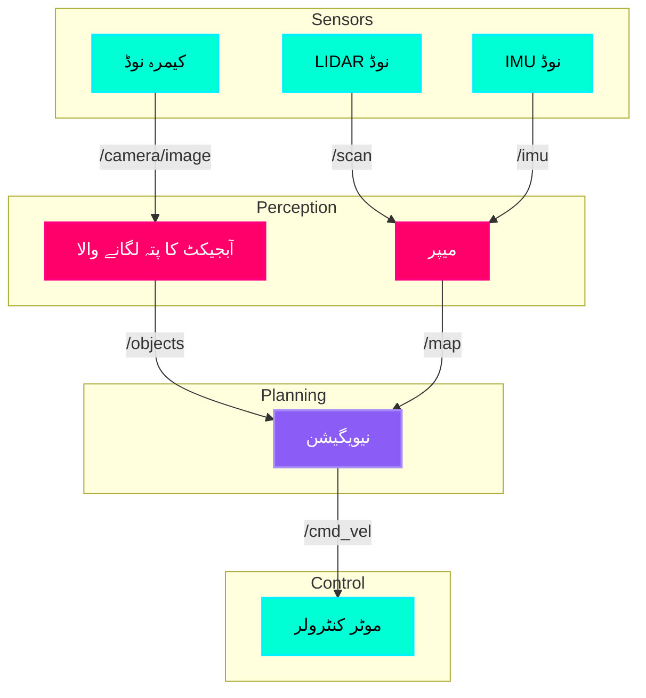

# ROS 2 کے بنیادی اصول: نوڈز اور ٹوپکس (ROS 2 Fundamentals: Nodes and Topics)

## اعصابی نظام کی مشابہت (The Nervous System Analogy)

اگر فزیکل AI روبوٹس کو جسم دینے کے بارے میں ہے، تو **ROS 2 (روبوٹ آپریٹنگ سسٹم 2)** ان کا **اعصابی نظام** ہے۔ جس طرح آپ کا دماغ آپ کے پٹھوں کو کنٹرول کرنے کے لیے نیوران کے ذریعے برقی سگنل بھیجتا ہے، ROS 2 سافٹ ویئر کے اجزاء (نوڈز) کو روبوٹ کے رویے کو مربوط کرنے کے لیے میسج چینلز (ٹوپکس) کے ذریعے بات چیت کرنے کی اجازت دیتا ہے۔

:::info کلیدی بصیرت
ROS 2 ونڈوز یا لینکس کی طرح کا آپریٹنگ سسٹم نہیں ہے — یہ ایک **مڈل ویئر فریم ورک** ہے جو لینکس کے اوپر بیٹھتا ہے اور تقسیم شدہ روبوٹ سسٹمز کے لیے مواصلاتی بنیادی ڈھانچہ فراہم کرتا ہے۔
:::

---

## نوڈز کیا ہیں؟ (نیوران) - What are Nodes?

ایک **نوڈ** ایک واحد، ماڈیولر عمل ہے جو ایک مخصوص کمپیوٹیشن انجام دیتا ہے۔ نوڈز کو دماغ کے خصوصی خلیوں کے طور پر سوچیں:

*   **کیمرہ نوڈ (Camera Node)**: روبوٹ کے کیمرہ سینسر سے تصاویر کیپچر کرتا ہے۔
*   **ادراک نوڈ (Perception Node)**: اشیاء کا پتہ لگانے کے لیے تصاویر پر کارروائی کرتا ہے۔
*   **پلاننگ نوڈ (Planning Node)**: فیصلہ کرتا ہے کہ روبوٹ کو کہاں جانا چاہیے۔
*   **کنٹرول نوڈ (Control Node)**: حرکت کو انجام دینے کے لیے موٹرز کو کمانڈ بھیجتا ہے۔

### نوڈز کیوں اہم ہیں (Why Nodes Matter)

روایتی روبوٹکس میں، تمام کوڈ ایک ہی یک سنگی (monolithic) پروگرام میں چل سکتے ہیں۔ ROS 2 اسے **آزاد نوڈز** میں توڑ دیتا ہے جو یہ کر سکتے ہیں:

1.  **متوازی طور پر چلیں** (مختلف CPU کورز یا یہاں تک کہ مختلف مشینوں پر)
2.  **آزادانہ طور پر تیار کیے جائیں** (کیمرہ ٹیم کو کنٹرول کوڈ جاننے کی ضرورت نہیں ہے)
3.  **روبوٹس میں دوبارہ استعمال کیے جائیں** (وہی پرسیپشن نوڈ ہیومنائیڈ یا کواڈرپیڈ پر کام کرتا ہے)
4.  **خوبصورتی سے ناکام ہوں** (اگر ایک نوڈ کریش ہو جاتا ہے، تو دوسرے چلتے رہتے ہیں)

:::tip حیاتیاتی متوازی
جس طرح آپ کے دماغ میں نیورانز مخصوص ہوتے ہیں (دیکھنے کے لیے بصری پرانتستا، حرکت کے لیے موٹر پرانتستا)، ROS 2 نوڈز خصوصی سافٹ ویئر اجزاء ہیں جو ذہین رویہ پیدا کرنے کے لیے مل کر کام کرتے ہیں۔
:::

---

## ٹوپکس کیا ہیں؟ (سگنلز) - What Are Topics?

**ٹوپکس** نامزد میسج چینلز ہیں جن کا استعمال نوڈز بات چیت کے لیے کرتے ہیں۔ وہ **پبلشر-سبسکرائبر پیٹرن** کو لاگو کرتے ہیں:

*   **پبلشر نوڈ (Publisher Node)**: ٹوپک پر پیغامات بھیجتا ہے (مثال کے طور پر، `/camera/image`)
*   **سبسکرائبر نوڈ (Subscriber Node)**: ٹوپک پر پیغامات سنتا ہے۔

### ٹاکر-لسنر کی مثال (The Talker-Listener Example)

یہاں کلاسک ROS 2 کمیونیکیشن پیٹرن ہے:

```mermaid
graph LR
    A[ٹاکر نوڈ] -->|شائع کرتا ہے| B[/chatter ٹوپک]
    B -->|سبسکرائب کرتا ہے| C[لسنر نوڈ]
    
    style A fill:#00FFD4,stroke:#00F0FF,stroke-width:2px,color:#000
    style B fill:#FF006B,stroke:#FF0080,stroke-width:2px,color:#fff
    style C fill:#00FFD4,stroke:#00F0FF,stroke-width:2px,color:#000
```

**یہ کیسے کام کرتا ہے:**
1.  **ٹاکر نوڈ** `/chatter` ٹوپک پر ایک پیغام ("Hello, World!") شائع کرتا ہے۔
2.  ROS 2 کا **مڈل ویئر** (DDS - ڈیٹا ڈسٹری بیوشن سروس) پیغام کی روٹنگ کو سنبھالتا ہے۔
3.  **لسنر نوڈ** پیغام وصول کرتا ہے اور اسے پرنٹ کرتا ہے۔

:::note اہم
متعدد نوڈز ایک ہی ٹوپک پر شائع کر سکتے ہیں، اور متعدد نوڈز سبسکرائب کر سکتے ہیں۔ یہ ایک **many-to-many کمیونیکیشن نیٹ ورک** بناتا ہے جو پیچیدہ روبوٹ سسٹمز کے لیے خوبصورتی سے اسکیل کرتا ہے۔
:::

---

## پیغامات کی اقسام (Message Types)

ٹوپکس **ٹائپ شدہ پیغامات** لے جاتے ہیں۔ عام پیغامات کی اقسام میں شامل ہیں:

| پیغام کی قسم | تفصیل | استعمال کا معاملہ |
| :--- | :--- | :--- |
| `std_msgs/String` | سادہ متن | لاگنگ، ڈیبگنگ |
| `sensor_msgs/Image` | کیمرے کی تصاویر | کمپیوٹر وژن |
| `geometry_msgs/Twist` | رفتار کے احکامات | موٹر کنٹرول |
| `nav_msgs/Odometry` | روبوٹ کی پوزیشن/رفتار | نیویگیشن |
| `sensor_msgs/LaserScan` | LIDAR ڈیٹا | رکاوٹ کا پتہ لگانا |

پیغام کی ساخت کی مثال:

```python
# geometry_msgs/Twist - روبوٹ کی نقل و حرکت کا حکم دینے کے لیے استعمال ہوتا ہے۔
linear:
  x: 0.5  # 0.5 m/s پر آگے بڑھیں
  y: 0.0
  z: 0.0
angular:
  x: 0.0
  y: 0.0
  z: 0.2  # 0.2 rad/s پر گھمائیں
```

---

## کمانڈ حوالہ: ROS 2 گراف کی تلاش (Command Reference)

ROS 2 چلنے والے نوڈز اور ٹوپکس کا معائنہ کرنے کے لیے طاقتور کمانڈ لائن ٹولز فراہم کرتا ہے:

### 1. ایک نوڈ چلائیں (Run a Node)

```bash
# demo_nodes_py پیکیج سے ٹاکر کی مثال چلائیں۔
ros2 run demo_nodes_py talker
```

**آؤٹ پٹ:**
```
[INFO] [talker]: Publishing: "Hello World: 0"
[INFO] [talker]: Publishing: "Hello World: 1"
[INFO] [talker]: Publishing: "Hello World: 2"
```

### 2. ایکٹیو ٹوپکس کی فہرست بنائیں (List Active Topics)

```bash
# فی الحال شائع/سبسکرائب کیے جانے والے تمام ٹوپکس کو دیکھیں۔
ros2 topic list
```

**آؤٹ پٹ:**
```
/chatter
/parameter_events
/rosout
```

### 3. ٹوپک کے پیغامات کا معائنہ کریں (Inspect Topic Messages)

```bash
# ریئل ٹائم میں /chatter پر شائع ہونے والے پیغامات کو دیکھیں۔
ros2 topic echo /chatter
```

**آؤٹ پٹ:**
```
data: 'Hello World: 42'
---
data: 'Hello World: 43'
---
```

### 4. ٹوپک کی معلومات حاصل کریں (Get Topic Information)

```bash
# پیغام کی قسم اور پبلشرز/سبسکرائبرز کی تعداد دیکھیں۔
ros2 topic info /chatter
```

**آؤٹ پٹ:**
```
Type: std_msgs/msg/String
Publisher count: 1
Subscription count: 1
```

### 5. ٹرمینل سے دستی طور پر نشر کریں (Publish Manually)

```bash
# /chatter پر ایک پیغام شائع کریں
ros2 topic pub /chatter std_msgs/msg/String "{data: 'Hello from terminal'}"
```

---

## ہینڈ آن ورزش: اپنا پہلا ROS 2 سسٹم بنائیں

**منظرنامہ:** آپ ایک سادہ دو نوڈ سسٹم بنائیں گے جہاں ایک "سینسر" درجہ حرارت کی ریڈنگ شائع کرتا ہے اور ایک "مانیٹر" انہیں لاگ کرتا ہے۔

### مرحلہ 1: ٹاکر چلائیں (ٹرمینل 1 میں)

```bash
ros2 run demo_nodes_py talker
```

### مرحلہ 2: لسنر چلائیں (ٹرمینل 2 میں)

```bash
ros2 run demo_nodes_py listener
```

**آپ کو دیکھنا چاہئے:**
*   ٹرمینل 1: پیغامات شائع کرنا
*   ٹرمینل 2: پیغامات وصول کرنا اور پرنٹ کرنا

### مرحلہ 3: گراف کا معائنہ کریں (ٹرمینل 3 میں)

```bash
# تمام چلنے والے نوڈز کی فہرست بنائیں
ros2 node list

# آؤٹ پٹ:
# /talker
# /listener

# تمام ٹوپکس کی فہرست بنائیں
ros2 topic list

# آؤٹ پٹ:
# /chatter
# /parameter_events
# /rosout

# ریئل ٹائم ڈیٹا کا بہاؤ دیکھیں
ros2 topic hz /chatter

# آؤٹ پٹ:
# average rate: 1.000
#     min: 1.000s max: 1.000s std dev: 0.00000s window: 10
```

:::tip چیلنج
ایک ساتھ **دو** ٹاکر نوڈز چلانے کی کوشش کریں۔ کیا ہوتا ہے جب دو نوڈز ایک ہی ٹوپک پر شائع کرتے ہیں؟ رویے کا مشاہدہ کرنے کے لیے `ros2 topic echo /chatter` استعمال کریں۔
:::

---

## ROS 2 کمپیوٹیشنل گراف (Computational Graph)

**ROS 2 گراف** آپ کے سسٹم میں تمام نوڈز اور ٹوپکس کا نیٹ ورک ہے۔ یہاں ایک موبائل روبوٹ سے ایک حقیقی دنیا کی مثال ہے:



**کلیدی مشاہدات:**
*   **سینسر نوڈز** (سیان) خام ڈیٹا شائع کرتے ہیں۔
*   **ادراک نوڈز** (میجنٹا) سینسر ڈیٹا پر کارروائی کرتے ہیں۔
*   **پلاننگ نوڈز** (جامنی) فیصلے کرتے ہیں۔
*   **کنٹرول نوڈز** (سیان) احکامات پر عمل کرتے ہیں۔

یہ **ماڈیولر آرکیٹیکچر** وہی ہے جو ROS 2 روبوٹس کو توسیع پذیر اور برقرار رکھنے کے قابل بناتا ہے۔

---

## کلیدی ٹیکا ویز (Key Takeaways)

✅ **نوڈز** مخصوص کام انجام دینے والے آزاد عمل ہیں (جیسے نیوران)
✅ **ٹوپکس** پبلشر-سبسکرائبر کا استعمال کرتے ہوئے کمیونیکیشن چینلز کا نام دیا گیا ہے (جیسے نیورل سگنلز)
✅ **پیغامات** ٹائپ شدہ ڈیٹا ڈھانچے ہیں جو ٹوپکس کے ذریعے بہہ رہے ہیں۔
✅ **ROS 2 گراف** آپ کے سسٹم میں موجود تمام نوڈز اور ٹوپکس کا نیٹ ورک ہے۔
✅ **کمانڈ لائن ٹولز** (`ros2 run`, `ros2 topic list/echo/info`) آپ کو گراف کا معائنہ کرنے دیتے ہیں۔

---

## اگلا کیا ہے؟

اب جب کہ آپ سمجھتے ہیں کہ **نوڈس کس طرح بات چیت کرتے ہیں**، اگلا باب آپ کو سکھائے گا کہ **Python میں اپنے نوڈز کیسے لکھیں** `rclpy` لائبریری کا استعمال کرتے ہوئے۔ آپ ایک سادہ پبلشر-سبسکرائبر جوڑا بنائیں گے جو نقلی روبوٹ کو کنٹرول کرتا ہے۔

---

## مزید پڑھنا

*   [ROS 2 Humble Documentation](https://docs.ros.org/en/humble/)
*   [Understanding ROS 2 Nodes](https://docs.ros.org/en/humble/Tutorials/Beginner-CLI-Tools/Understanding-ROS2-Nodes/Understanding-ROS2-Nodes.html)
*   [Understanding ROS 2 Topics](https://docs.ros.org/en/humble/Tutorials/Beginner-CLI-Tools/Understanding-ROS2-Topics/Understanding-ROS2-Topics.html)
*   [ROS 2 Design - DDS Middleware](https://design.ros2.org/articles/ros_on_dds.html)
