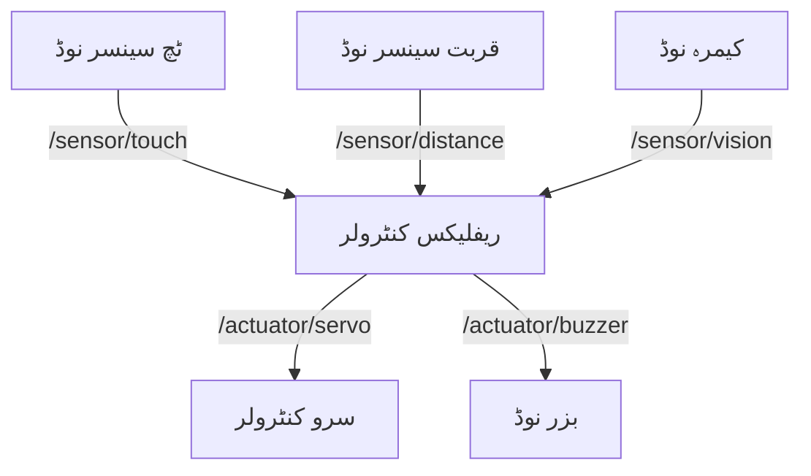

# مینی پروجیکٹ: روبوٹک نروس سسٹم (Robotic Nervous System)

## مقصد

ایک **سینسر سے چلنے والا کنٹرول سسٹم** ڈیزائن کریں جو ROS 2 کا استعمال کرتے ہوئے انسانی اعصابی نظام کی ریفلیکس آرک (reflex arc) کی نقل کرے۔

---

## پروجیکٹ کا جائزہ

### **منظرنامہ:**
آپ کے ہیومنائیڈ روبوٹ کو بیرونی محرکات (ٹچ، قربت، وژن) پر رد عمل ظاہر کرنا چاہیے جو **مرکزی منصوبہ بندی کے بغیر** مناسب موٹر ردعمل کو متحرک کر کے (حیاتیاتی اضطراب کی طرح)۔

### **تقاضے:**

1.  **سینسر نوڈس (کم از کم 3):**
    *   ٹچ سینسر (نقلی یا اصلی GPIO)
    *   قربت کا سینسر (الٹراسونک یا LIDAR)
    *   کیمرے پر مبنی آبجیکٹ کا پتہ لگانا (OpenCV)

2.  **ایکچیویٹر نوڈس (کم از کم 2):**
    *   سرو موٹر کنٹرولر (گریپر یا بازو)
    *   ایل ای ڈی/بزر فیڈ بیک سسٹم

3.  **ریفلیکس لاجک نوڈ:**
    *   سینسر کے عنوانات کو سبسکرائب کرتا ہے۔
    *   ایکچیویٹر کے عنوانات پر شائع کرتا ہے۔
    *   اصول پر مبنی یا ML پر مبنی فیصلہ سازی کی منطق کو لاگو کرتا ہے۔

---

## سسٹم آرکیٹیکچر



---

## نفاذ کے اقدامات

### **مرحلہ 1: ورک اسپیس سیٹ اپ**
```bash
mkdir -p ~/ros2_ws/src
cd ~/ros2_ws/src
ros2 pkg create --build-type ament_python nervous_system
cd ~/ros2_ws
colcon build
source install/setup.bash
```

### **مرحلہ 2: سینسر نوڈ کی مثال (قربت)**
```python
import rclpy
from rclpy.node import Node
from std_msgs.msg import Float32
import random

class ProximitySensor(Node):
    def __init__(self):
        super().__init__('proximity_sensor')
        self.publisher = self.create_publisher(Float32, '/sensor/distance', 10)
        self.timer = self.create_timer(0.5, self.publish_distance)
    
    def publish_distance(self):
        msg = Float32()
        msg.data = random.uniform(0.1, 2.0)  # میٹر میں نقلی فاصلہ
        self.publisher.publish(msg)
        self.get_logger().info(f'Distance: {msg.data:.2f}m')

def main(args=None):
    rclpy.init(args=args)
    node = ProximitySensor()
    rclpy.spin(node)
    node.destroy_node()
    rclpy.shutdown()
```

### **مرحلہ 3: ریفلیکس کنٹرولر نوڈ**
```python
import rclpy
from rclpy.node import Node
from std_msgs.msg import Float32, Bool

class ReflexController(Node):
    def __init__(self):
        super().__init__('reflex_controller')
        
        # Subscribers
        self.create_subscription(Float32, '/sensor/distance', self.distance_callback, 10)
        self.create_subscription(Bool, '/sensor/touch', self.touch_callback, 10)
        
        # Publishers
        self.servo_pub = self.create_publisher(Float32, '/actuator/servo', 10)
        self.buzzer_pub = self.create_publisher(Bool, '/actuator/buzzer', 10)
    
    def distance_callback(self, msg):
        if msg.data < 0.3:  # اعتراض بہت قریب ہے۔
            self.get_logger().warn('Obstacle detected! Activating reflex...')
            self.activate_buzzer()
    
    def touch_callback(self, msg):
        if msg.data:  # ٹچ کا پتہ چلا
            self.get_logger().info('Touch reflex triggered!')
            self.move_servo(90.0)
    
    def activate_buzzer(self):
        msg = Bool()
        msg.data = True
        self.buzzer_pub.publish(msg)
    
    def move_servo(self, angle):
        msg = Float32()
        msg.data = angle
        self.servo_pub.publish(msg)

def main(args=None):
    rclpy.init(args=args)
    node = ReflexController()
    rclpy.spin(node)
    node.destroy_node()
    rclpy.shutdown()
```

---

## ڈیلیوریبلز (Deliverables)

### 1. **سورس کوڈ** (50%)
*   کے ساتھ GitHub ذخیرہ:
    *   تمام ROS 2 نوڈس
    *   `package.xml` اور `setup.py`
    *   پورے سسٹم کے لیے فائل لانچ کریں۔

### 2. **دستاویزات** (30%)
*   `README.md` کے ساتھ:
    *   سسٹم آرکیٹیکچر ڈایاگرام
    *   انسٹالیشن کی ہدایات
    *   استعمال کی مثالیں
    *   ویڈیو ڈیمو لنک

### 3. **ڈیمو ویڈیو** (20%)
*   دکھاتے ہوئے 3-5 منٹ کی ویڈیو ریکارڈ کریں:
    *   سسٹم شروع
    *   سینسر متحرک
    *   ایکچیویٹر کے ردعمل
    *   ایج کیس ہینڈلنگ

---

## تشخیص کا معیار

| معیار | پوائنٹس | تفصیل |
| :--- | :--- | :--- |
| **فعالیت** | 40 | تمام سینسر اور ایکچیویٹرز درست طریقے سے کام کرتے ہیں۔ |
| **کوڈ کا معیار** | 20 | صاف، تبصرہ، ROS 2 کنونشنوں کی پیروی کرتا ہے۔ |
| **آرکیٹیکچر** | 20 | ماڈیولر ڈیزائن، مناسب ٹوپک کا نام |
| **دستاویزات** | 15 | صاف README، آرکیٹیکچر ڈایاگرام |
| **تخلیقی صلاحیت** | 5 | منفرد سینسر/ریفلیکس کے امتزاج کے لیے بونس |

**کل:** 100 پوائنٹس

---

## اعلی درجے کی ایکسٹینشنز (اختیاری)

1.  **مشین لرننگ ریفلیکس:**
    *   سینسر پیٹرن کی درجہ بندی کرنے کے لیے ایک چھوٹا نیورل نیٹ ورک کو تربیت دیں۔
    *   ONNX رن ٹائم کا استعمال کرتے ہوئے تعینات کریں۔

2.  **ملٹی روبوٹ کوآرڈینیشن:**
    *   کیا دو روبوٹ ROS 2 ٹوپکس کے ذریعے اضطراب کا اظہار کرتے ہیں۔
    *   مثال: روبوٹ A خطرے کا پتہ لگاتا ہے → روبوٹ B کو خبردار کرتا ہے

3.  **اصلی ہارڈ ویئر:**
    *   Raspberry Pi + Arduino پر تعینات کریں۔
    *   اصل GPIO سینسر اور سرو استعمال کریں۔

---

## جمع کرانے کے رہنما خطوط

**آخری تاریخ:** ہفتہ 5 کا اختتام
**فارمیٹ:** GitHub ذخیرہ کا لنک
**شامل ہیں:**
*   سورس کوڈ
*   `README.md`
*   `demo_video.mp4` (گوگل ڈرائیو/یوٹیوب پر اپ لوڈ کریں)

**بذریعہ جمع کروائیں:** Course LMS

---

## اکثر پوچھے گئے سوالات (FAQ)

**سوال: کیا میں Python کے بجائے C++ استعمال کر سکتا ہوں؟**
ج: جی ہاں، لیکن مساوی فعالیت فراہم کریں۔

**سوال: کیا نقلی قابل قبول ہے یا مجھے اصلی ہارڈ ویئر استعمال کرنا چاہیے؟**
ج: نقلی قابل قبول ہے۔ Gazebo یا حسب ضرورت فرضی نوڈز استعمال کریں۔

**سوال: کیا میں جوڑوں میں کام کر سکتا ہوں؟**
ج: نہیں، یہ ایک انفرادی منصوبہ ہے۔ تاہم، آپ ساتھیوں کے ساتھ تصورات پر تبادلہ خیال کر سکتے ہیں۔

**سوال: اگر میرا سینسر نوڈ کریش ہو جائے تو کیا ہوگا؟**
ج: ایرر ہینڈلنگ اور دوبارہ شروع کرنے کی منطق کو نافذ کریں۔ README میں ناکامی کے طریقوں کو دستاویز کریں۔
