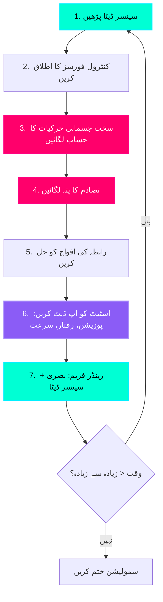

# سمولیشن کی طبیعیات: Gazebo (The Physics of Simulation: Gazebo)

## ڈیجیٹل ٹوئن تصور (The Digital Twin Concept)

$50,000 کا ہیومنائیڈ روبوٹ بنانے سے پہلے، آپ کو سافٹ ویئر میں اس کی **لاکھوں بار** جانچ کرنی ہوگی۔ درج کریں **Gazebo**—ایک اوپن سورس روبوٹ سمیلیٹر جو حیرت انگیز درستگی کے ساتھ طبیعیات کے قوانین کو ماڈل کرتا ہے۔

**Gazebo نقالی کرتا ہے:**
*   **کشش ثقل (Gravity)** (9.81 m/s² اشیاء کو نیچے کھینچ رہا ہے)
*   **انرشیا (Inertia)** (بڑے پیمانے پر اشیاء سرعت کے خلاف مزاحمت کرتی ہیں)
*   **رگڑ (Friction)** (سطحیں پھسلنے کی حرکت کے خلاف مزاحمت کرتی ہیں)
*   **تصادم (Collisions)** (اشیاء ایک ہی جگہ پر قبضہ نہیں کر سکتیں)
*   **مشترکہ ڈائنامکس (Joint Dynamics)** (موٹرز ٹارک لگاتی ہیں، جوڑوں کی حدود ہوتی ہیں)

:::info نقالی کیوں اہمیت رکھتی ہے۔
Boston Dynamics نے Atlas کو بیک فلپس کرنے کی تربیت دی حقیقت میں ایک کوشش کرنے سے پہلے **100 ملین** نقلی چھلانگیں لگا کر۔ تخروپن وہ ہے جہاں روبوٹ چلنا، دوڑنا اور ہیرا پھیری کرنا سیکھتے ہیں — **ہارڈ ویئر کو توڑے بغیر**۔
:::

---

## فزکس لوپ: سمولیشن کیسے کام کرتی ہے۔

ہر نقلی عمل **فزکس لوپ** کو 1000 Hz (1ms فی تکرار) پر چلاتا ہے۔ ہر قدم میں کیا ہوتا ہے:



**قدم بہ قدم بریک ڈاؤن:**

1.  **سینسر ڈیٹا پڑھیں** (سیان): کیمرہ کی تصاویر، LIDAR فاصلے، IMU ریڈنگ حاصل کریں
2.  **کنٹرول فورسز کا اطلاق کریں** (نیلا): آپ کا کنٹرولر موٹرز کو ٹارک لگانے کا حکم دیتا ہے
3.  **سخت جسمانی حرکیات کا حساب لگائیں** (میجنٹا): F = ma، سرعت کا حساب لگائیں
4.  **تصادم کا پتہ لگائیں** (میجنٹا): چیک کریں کہ کیا کوئی چیز اوورلیپ ہوتی ہے۔
5.  **رابطہ کی افواج کو حل کریں** (جامنی): رد عمل کی قوتوں کا اطلاق کریں (جیسے، زمین پاؤں پر اوپر دھکیلتی ہے)
6.  **اسٹیٹ کو اپ ڈیٹ کریں** (جامنی): نئی پوزیشنیں، رفتار، سرعت
7.  **رینڈر فریم** (سیان): 3D منظر بنائیں اور ROS 2 ٹوپکس پر سینسر ڈیٹا شائع کریں۔

یہ لوپ **1000 بار فی سیکنڈ** چلتا ہے، جو مسلسل حرکت کا بھرم پیدا کرتا ہے۔

---

## طبیعیات کے بنیادی اصول (Physics Fundamentals)

### 1. کشش ثقل (Gravity)

**کشش ثقل** تمام اشیاء کو 9.81 m/s² (زمین کا معیار) پر زمین کی طرف کھینچتی ہے۔

```xml
<!-- Gazebo دنیا کی فائل میں -->
<physics type="ode">
  <gravity>0 0 -9.81</gravity>  <!-- X Y Z اجزاء -->
  <max_step_size>0.001</max_step_size>  <!-- 1ms ٹائم سٹیپ -->
  <real_time_factor>1</real_time_factor>  <!-- 1x ریئل ٹائم اسپیڈ -->
</physics>
```

**اس کا مطلب کیا ہے:**
*   1 میٹر سے گرائی گئی چیز 0.45 سیکنڈ میں زمین سے ٹکراتی ہے۔
*   ٹرمینل کی رفتار بڑے پیمانے اور ہوا کی مزاحمت پر منحصر ہے (پہلے سے ماڈل نہیں کیا گیا)
*   آپ مریخ (3.71 m/s²) یا چاند (1.62 m/s²) کی نقالی کے لیے کشش ثقل کو تبدیل کر سکتے ہیں۔

---

### 2. انرشیا (Inertia)

**انرشیا** حرکت میں تبدیلیوں کے خلاف کسی چیز کی مزاحمت ہے۔ بھاری چیزوں کو تیز کرنا مشکل ہوتا ہے۔

```xml
<!-- URDF لنک کی تعریف میں -->
<inertial>
  <mass value="3.0"/>  <!-- 3 kg ران -->
  <inertia ixx="0.04" ixy="0.0" ixz="0.0"
           iyy="0.04" iyz="0.0"
           izz="0.001"/>  <!-- kg·m² -->
</inertial>
```

**انرشیا ٹینسر کی وضاحت:**
*   `ixx`, `iyy`, `izz`: X, Y, Z محور کے ارد گرد جڑتا کا لمحہ
*   **اعلی اقدار** = اس محور کے گرد گھومنا مشکل ہے۔
*   ایک **سلنڈر** کے لیے (جیسے ران): لمبائی کے محور کے ساتھ زیادہ جڑتا۔

:::warning استحکام کے لیے اہم
غلط جڑت کی اقدار نقلی عدم استحکام کا سبب بنتی ہیں۔ ایک روبوٹ ہو سکتا ہے:
*   بے قابو ہو کر گھومیں (جڑتا بہت کم)
*   سست روی سے حرکت کریں (جڑتا بہت زیادہ)
*   فرش کے ذریعے گرنا (متضاد طبیعیات کی رکاوٹیں)

ہمیشہ CAD سافٹ ویئر یا فزکس کیلکولیٹر سے **حقیقت پسندانہ اقدار** استعمال کریں۔
:::

---

### 3. رگڑ (Friction)

**رگڑ** سطحوں کے درمیان پھسلنے والی حرکت کے خلاف مزاحمت کرتی ہے۔

```xml
<!-- SDF/Gazebo تصادم کی تعریف میں -->
<surface>
  <friction>
    <ode>
      <mu>1.0</mu>   <!-- رگڑ کا گتانک (0 = برف، 1 = ربڑ) -->
      <mu2>1.0</mu2> <!-- ثانوی سمت رگڑ -->
    </ode>
  </friction>
  <contact>
    <ode>
      <kp>1000000.0</kp>  <!-- Contact stiffness (N/m) -->
      <kd>1.0</kd>        <!-- Contact damping (N·s/m) -->
    </ode>
  </contact>
</surface>
```

**رگڑ کے گتانک:**
*   **μ = 0.0**: رگڑ کے بغیر (آئس اسکیٹنگ)
*   **μ = 0.5**: کم رگڑ (گیلا فرش)
*   **μ = 1.0**: تیز رگڑ (کنکریٹ پر ربڑ)
*   **μ = 1.5**: بہت زیادہ رگڑ (چٹان پر چڑھنے کا جوتا)

**یہ کیوں اہم ہے:** ایک ہیومنائیڈ کے پاؤں کو پھسلنے کے بغیر زمین سے دھکیلنے کے لیے **زیادہ رگڑ** (μ ≈ 1.0) کی ضرورت ہوتی ہے۔

---

## اپنی پہلی Gazebo دنیا بنانا

ایک **ورلڈ فائل** (.world یا .sdf) نقلی ماحول کی وضاحت کرتی ہے۔ یہاں ایک کم سے کم دنیا ہے:

### مکمل ورلڈ فائل: `empty_world.world`

```xml
<?xml version="1.0"?>
<sdf version="1.6">
  <world name="empty_world">
    
    <!-- ========================================
         طبیعیات انجن کی ترتیب
         ======================================== -->
    <physics type="ode">
      <max_step_size>0.001</max_step_size>  <!-- 1ms (1000 Hz) -->
      <real_time_factor>1.0</real_time_factor>
      <real_time_update_rate>1000.0</real_time_update_rate>
      
      <gravity>0 0 -9.81</gravity>  <!-- زمینی کشش ثقل -->
      
      <ode>
        <solver>
          <type>quick</type>  <!-- فوری حل کرنے والا (تیز، کم درست) -->
          <iters>50</iters>   <!-- رکاوٹ حل کرنے والا تکرار -->
          <sor>1.3</sor>      <!-- یکے بعد دیگرے زیادہ نرمی -->
        </solver>
        <constraints>
          <cfm>0.0</cfm>      <!-- رکاوٹ فورس مکسنگ -->
          <erp>0.2</erp>      <!-- غلطی میں کمی کا پیرامیٹر -->
          <contact_max_correcting_vel>100.0</contact_max_correcting_vel>
          <contact_surface_layer>0.001</contact_surface_layer>
        </constraints>
      </ode>
    </physics>

    <!-- ========================================
         لائٹنگ (سورج)
         ======================================== -->
    <light name="sun" type="directional">
      <cast_shadows>true</cast_shadows>
      <pose>0 0 10 0 0 0</pose>  <!-- اصل سے 10m اوپر -->
      <diffuse>0.8 0.8 0.8 1</diffuse>  <!-- روشن سفید روشنی -->
      <specular>0.2 0.2 0.2 1</specular>
      <direction>-0.5 0.1 -0.9</direction>  <!-- نیچے کی طرف زاویہ -->
    </light>

    <!-- ========================================
         گراؤنڈ ہوائی جہاز
         ======================================== -->
    <model name="ground_plane">
      <static>true</static>  <!-- طبیعیات کے تحت حرکت نہیں کرتا -->
      <link name="link">
        <collision name="collision">
          <geometry>
            <plane>
              <normal>0 0 1</normal>  <!-- سطح نارمل (پوائنٹس اوپر) -->
              <size>100 100</size>    <!-- 100m x 100m ہوائی جہاز -->
            </plane>
          </geometry>
          <surface>
            <friction>
              <ode>
                <mu>1.0</mu>   <!-- زیادہ رگڑ (ربڑ) -->
                <mu2>1.0</mu2>
              </ode>
            </friction>
          </surface>
        </collision>
        
        <visual name="visual">
          <cast_shadows>false</cast_shadows>
          <geometry>
            <plane>
              <normal>0 0 1</normal>
              <size>100 100</size>
            </plane>
          </geometry>
          <material>
            <ambient>0.3 0.3 0.3 1</ambient>  <!-- گہرا ਸرمئی -->
            <diffuse>0.7 0.7 0.7 1</diffuse>
            <specular>0.01 0.01 0.01 1</specular>
          </material>
        </visual>
      </link>
    </model>

    <!-- ========================================
         منظر کی خصوصیات
         ======================================== -->
    <scene>
      <ambient>0.4 0.4 0.4 1</ambient>  <!-- ایمبیئنٹ لائٹ (نرم عالمی روشنی) -->
      <background>0.25 0.25 0.25 1</background>  <!-- سرمئی آسمان -->
      <shadows>true</shadows>
      <grid>true</grid>  <!-- گرڈ لائنیں دکھائیں -->
    </scene>

    <!-- ========================================
         GAZEBO GUI ترتیبات
         ======================================== -->
    <gui>
      <camera name="user_camera">
        <pose>5 -5 2 0 0.275 2.356</pose>  <!-- کیمرے کی پوزیشن اور واقفیت -->
        <view_controller>orbit</view_controller>
      </camera>
    </gui>

  </world>
</sdf>
```

---

## ورلڈ فائل کو توڑنا

### طبیعیات کی ترتیب (Lines 8-26)

```xml
<physics type="ode">
  <max_step_size>0.001</max_step_size>
  <real_time_factor>1.0</real_time_factor>
```

**کلیدی پیرامیٹرز:**
*   `max_step_size`: ٹائم سٹیپ سائز (1ms = 1000 Hz نقلی شرح)
*   `real_time_factor`: 1.0 = ریئل ٹائم، 0.5 = نصف رفتار (زیادہ درست)، 2.0 = 2x رفتار
*   `type="ode"`: اوپن ڈائنامکس انجن (Gazebo کا ڈیفالٹ فزکس solver)

:::tip کارکردگی کا مشورہ
ہیومنائیڈ روبوٹس کے لیے، **0.001s** (1ms) ٹائم سٹیپس استعمال کریں۔ چھوٹی = زیادہ درست لیکن سست۔ بڑا = تیز لیکن پیچیدہ روبوٹس کے لیے غیر مستحکم۔
:::

---

### سورج کی روشنی (Lines 31-37)

```xml
<light name="sun" type="directional">
  <direction>-0.5 0.1 -0.9</direction>
```

**دشاتمک روشنی کیوں؟**
*   سورج کی روشنی کی نقالی کرتا ہے (شعاعیں متوازی ہیں)
*   حقیقت پسندانہ سائے بناتا ہے۔
*   سمت ویکٹر آسمان سے زمین کی طرف اشارہ کرتا ہے۔

متبادل: `type="point"` لائٹ بلب بناتا ہے (شعاعیں ایک نقطہ سے نکلتی ہیں)۔

---

### گراؤنڈ ہوائی جہاز (Lines 43-76)

```xml
<model name="ground_plane">
  <static>true</static>
```

**اہم خصوصیات:**
*   `static="true"`: آبجیکٹ حرکت نہیں کرتا (لامحدود ماس)
*   `<plane>`: لامحدود 2D سطح (بڑی منزلوں کے لیے موثر)
*   `<mu>1.0</mu>`: روبوٹ پاؤں کے رابطے کے لیے زیادہ رگڑ

**بصری بمقابلہ ٹکراؤ:**
*   **تصادم جیومیٹری**: فزکس انجن کیا "محسوس" کرتا ہے (رفتار کے لیے سادہ شکلیں)
*   **بصری جیومیٹری**: کیمرہ کیا دیکھتا ہے (تفصیلی میش ہو سکتا ہے)

---

## Gazebo میں اپنی دنیا کو چلانا

### مرحلہ 1: ورلڈ فائل کو محفوظ کریں۔

```bash
mkdir -p ~/gazebo_worlds
cd ~/gazebo_worlds
nano empty_world.world
# XML مواد کو اوپر پیسٹ کریں، پھر Ctrl+X, Y, Enter
```

### مرحلہ 2: Gazebo لانچ کریں۔

```bash
# طریقہ 1: براہ راست Gazebo کے ساتھ
gazebo empty_world.world

# طریقہ 2: ROS 2 کے ساتھ (روبوٹ کنٹرول کے لیے ترجیح دی جاتی ہے)
ros2 launch gazebo_ros gazebo.launch.py world:=/home/YOUR_USERNAME/gazebo_worlds/empty_world.world
```

**متوقع نتیجہ:**
*   سرمئی زمینی ہوائی جہاز افق تک پھیلا ہوا ہے۔
*   گرڈ لائنیں نظر آتی ہیں۔
*   دشاتمک روشنی سے سائے۔
*   مدار کیمرہ کنٹرول (ماؤس کے ساتھ گھسیٹیں)

---

## دنیا میں اشیاء کو شامل کرنا

### مثال: ایک باکس کو جنم دیں۔

```xml
<!-- <world> ٹیگ کے اندر شامل کریں -->
<model name="red_box">
  <pose>0 0 0.5 0 0 0</pose>  <!-- پوزیشن: زمین سے 0.5m اوپر -->
  <static>false</static>  <!-- کشش ثقل کے نیچے گرتا ہے -->
  
  <link name="link">
    <collision name="collision">
      <geometry>
        <box>
          <size>0.5 0.5 0.5</size>  <!-- 50cm مکعب -->
        </box>
      </geometry>
    </collision>
    
    <visual name="visual">
      <geometry>
        <box>
          <size>0.5 0.5 0.5</size>
        </box>
      </geometry>
      <material>
        <ambient>1 0 0 1</ambient>  <!-- لال رنگ -->
        <diffuse>1 0 0 1</diffuse>
      </material>
    </visual>
    
    <inertial>
      <mass>10.0</mass>  <!-- 10 kg باکس -->
      <inertia>
        <ixx>0.416</ixx>
        <iyy>0.416</iyy>
        <izz>0.416</izz>
      </inertia>
    </inertial>
  </link>
</model>
```

**کیا ہوتا ہے:**
1.  باکس زمین سے 0.5m اوپر پیدا ہوتا ہے۔
2.  کشش ثقل اسے نیچے کھینچتی ہے (9.81 m/s²)
3.  زمینی ہوائی جہاز سے ٹکرا جاتا ہے۔
4.  z=0.25m پر سیٹل (اس کی اونچائی کا نصف)

---

## ہینڈ آن ورزش: ایک ریمپ بنائیں

**چیلنج:** اس کے ساتھ ایک دنیا بنائیں:
1.  گراؤنڈ ہوائی جہاز (پہلے ہی کیا گیا)
2.  ایک **ریمپ** (30° پر مائل طیارہ)
3.  ایک **کرہ (sphere)** جو ریمپ سے نیچے لڑھکتا ہے۔

**سٹارٹر کوڈ:**
```xml
<model name="ramp">
  <static>true</static>
  <pose>0 0 0.5 0 0.523599 0</pose>  <!-- 0.523599 rad = 30° -->
  <link name="link">
    <collision name="collision">
      <geometry>
        <box>
          <size>2 1 0.1</size>  <!-- 2m لمبا, 1m چوڑا, 10cm موٹا -->
        </box>
      </geometry>
      <!-- یہاں رگڑ شامل کریں۔ -->
    </collision>
    <!-- یہاں بصری شامل کریں۔ -->
  </link>
</model>

<model name="rolling_sphere">
  <pose>0 0 2 0 0 0</pose>  <!-- 2m اونچی شروعات ہوتی ہے -->
  <!-- آپ کا کوڈ: کرہ جیومیٹری شامل کریں (رداس 0.2m، ماس 1kg) -->
</model>
```

**تصدیق:**
1.  اپنی دنیا کے ساتھ Gazebo لانچ کریں۔
2.  **Play** بٹن دبائیں۔
3.  کشش ثقل کی وجہ سے دائرہ ریمپ سے نیچے لڑھکنا چاہیے
4.  رفتار کو تبدیل کرنے کے لیے ریمپ کے زاویے یا رگڑ کو ایڈجسٹ کریں۔

---

## کلیدی ٹیکا ویز (Key Takeaways)

✅ **Gazebo حقیقت پسندانہ طبیعیات کی نقل کرتا ہے** (کشش ثقل، جڑتا، رگڑ، تصادم)
✅ **فزکس لوپ 1000 Hz پر چلتا ہے** (درستگی کے لیے 1ms ٹائم سٹیپس)
✅ **ورلڈ فائلز (.sdf/.world)** نقلی ماحول کی وضاحت کرتی ہے
✅ **گراؤنڈ ہوائی جہاز** کو `static="true"` اور زیادہ رگڑ (μ=1.0) کی ضرورت ہے
✅ **عدم استحکام کو روکنے کے لیے انرشیا اقدار حقیقت پسندانہ ہونی چاہئیں**
✅ **لائٹنگ** بصری حقیقت پر اثر انداز ہوتی ہے (دشاتمک سورج + محیطی روشنی)

---

## اگلا کیا ہے؟

Gazebo **جسمانی طور پر درست** نقلی فراہم کرتا ہے لیکن اس میں بصری وفاداری کا فقدان ہے۔ اگلا باب **Unity** متعارف کراتا ہے — ایک گیم انجن جو رے ٹریسنگ اور جدید میٹریل کا استعمال کرتے ہوئے فوٹو ریلسٹک ماحول پیش کرتا ہے۔ آپ سیکھیں گے کہ **اعلی وفاداری** روبوٹ تصور کے لیے ROS 2 اور Unity کو کیسے جوڑنا ہے۔

---

## مزید پڑھنا

*   [Gazebo Classic Documentation](http://classic.gazebosim.org/tutorials)
*   [SDF Format Specification](http://sdformat.org/)
*   [Gazebo Physics Properties](http://classic.gazebosim.org/tutorials?tut=physics_params)
*   [ODE Solver Parameters](https://www.ode.org/)
*   [Gazebo + ROS 2 Integration](https://docs.ros.org/en/humble/Tutorials/Advanced/Simulators/Gazebo/Gazebo.html)
