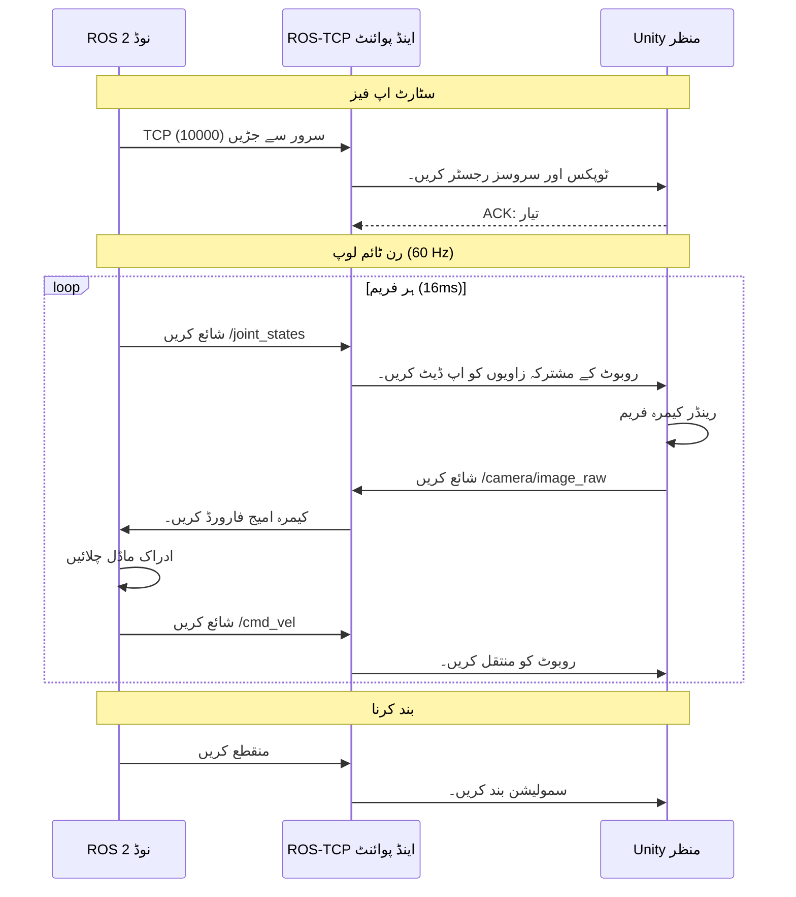

# اعلی مخلص رینڈرنگ: Unity برائے روبوٹکس (High-Fidelity Rendering: Unity for Robotics)

## بصری حقیقت پسندی کا فرق

**Gazebo** طبیعیات کی جانچ (physics simulation) میں بہترین ہے لیکن بصری وفاداری (visual fidelity) کے ساتھ جدوجہد کرتا ہے۔ 2004 سے اس کا گرافکس انجن جدید تقاضوں کا مقابلہ نہیں کر سکتا:
*   **فوٹو ریئلسٹک مواد** (دھاتی عکاسی، تانے بانے کی ساخت)
*   **جدید لائٹنگ** (رے ٹریسنگ، عالمی الیومینیشن)
*   **پیچیدہ مناظر** (ہزاروں اشیاء، متحرک موسم)
*   **کیمرہ سمولیشن** (فیلڈ کی گہرائی، موشن بلر، لینس کی مسخ)

درج کریں **Unity**—ایک پیشہ ور گیم انجن جو AAA گیمز اور ہالی ووڈ CGI کے لیے استعمال ہوتا ہے۔ Unity روبوٹکس سمولیشن میں **مووی کوالٹی کے بصری** لاتا ہے۔

:::info حقیقی دنیا کی مثال
NVIDIA Isaac Sim (Omniverse/Unity فن تعمیر پر مبنی) ادراک کے ماڈلز کو تربیت دینے کے لیے **رے ٹریسڈ رینڈرنگ** کا استعمال کرتا ہے۔ فوٹو ریلسٹک مصنوعی ڈیٹا پر تربیت یافتہ روبوٹ **کم سے کم سم ٹو ریئل فرق** کے ساتھ حقیقی دنیا کے کیمروں میں منتقل ہو سکتا ہے۔
:::

---

## Gazebo بمقابلہ Unity: تجارت بند (The Trade-Off)

```mermaid
graph LR
    subgraph Gazebo Strengths
        A1[تیز طبیعیات: 1000 Hz]
        A2[ROS 2 مقامی]
        A3[ہلکا پھلکا]
        A4[حتمی (Deterministic)]
    end
    
    subgraph Unity Strengths
        B1[فوٹو ریلسٹک رینڈرنگ]
        B2[GPU رے ٹریسنگ]
        B3[اثاثہ جات کی دکان: 1M+ ماڈلز]
        B4[VR/AR سپورٹ]
    end
    
    subgraph Hybrid Approach
        C[ROS 2 پل]
    end
    
    A1 --> C
    A2 --> C
    B1 --> C
    B2 --> C
    C --> D[دونوں جہانوں میں بہترین]
    
    style A1 fill:#00FFD4,stroke:#00F0FF,stroke-width:2px,color:#000
    style A2 fill:#00FFD4,stroke:#00F0FF,stroke-width:2px,color:#000
    style B1 fill:#FF006B,stroke:#FF0080,stroke-width:2px,color:#fff
    style B2 fill:#FF006B,stroke:#FF0080,stroke-width:2px,color:#fff
    style C fill:#8B5CF6,stroke:#A78BFA,stroke-width:2px,color:#fff
    style D fill:#00FFD4,stroke:#00F0FF,stroke-width:3px,color:#000
```

**حکمت عملی:**
1.  **Gazebo** طبیعیات کی نقالی چلاتا ہے (رابطے، رگڑ، مشترکہ حرکیات)
2.  **Unity** بصری پیش کرتا ہے (کیمرہ فیڈ، گہرائی کی تصاویر، تقسیم کے ماسک)
3.  **ROS 2 Bridge** دونوں سسٹمز کے درمیان حالت کو ہم آہنگ کرتا ہے۔

---

## ROS 2 ↔ Unity کمیونیکیشن برج

**Unity Robotics Hub** TCP/IP کا استعمال کرتے ہوئے ROS 2 اور Unity کے درمیان دو طرفہ مواصلات کو قابل بناتا ہے۔



**پیغام کا بہاؤ:**
1.  **ROS 2 → Unity**: مشترکہ ریاستیں، رفتار کے احکامات، سپون درخواستیں۔
2.  **Unity → ROS 2**: کیمرے کی تصاویر، گہرائی کے نقشے، تصادم کے واقعات
3.  **فریکوئنسی**: 60 Hz (Unity رینڈرنگ) + 1000 Hz (ROS 2 طبیعیات اختیاری)

---

## Unity کیوں خوبصورت نظر آتی ہے (تکنیکی گہرا غوطہ)

### 1. جسمانی طور پر مبنی رینڈرنگ (PBR)

Unity **PBR مواد (materials)** استعمال کرتی ہے جو ہلکی طبیعیات کی نقل کرتے ہیں:

| پراپرٹی | تفصیل | حقیقی دنیا کی مثال |
| :--- | :--- | :--- |
| **Albedo** | بنیادی رنگ (روشنی نہیں) | سرخ پینٹ |
| **Metallic** | 0 = ڈائی الیکٹرک، 1 = دھات | ایلومینیم = 1.0 |
| **Smoothness** | 0 = کھردرا، 1 = آئینہ | پالش سٹیل = 0.9 |
| **Normal Map** | سطح کی مائیکرو تفصیلات | لکڑی کے اناج کے ٹکڑے |
| **Emission** | خود الیومینیشن | ایل ای ڈی لائٹ پٹی |

**Gazebo مواد:**
```xml
<material>
  <ambient>0.5 0.5 0.5 1</ambient>  <!-- فلیٹ رنگ، کوئی ہلکی طبیعیات نہیں۔ -->
</material>
```

**Unity PBR شیڈر:**
```csharp
Material robotMetal = new Material(Shader.Find("Standard"));
robotMetal.SetColor("_Color", Color.gray);
robotMetal.SetFloat("_Metallic", 0.8f);    // 80% دھاتی
robotMetal.SetFloat("_Glossiness", 0.6f);  // 60% ہموار
```

---

### 2. رے ٹریسنگ (Unity 2021+)

**رے ٹریسنگ (Ray tracing)** منظر کے ذریعے اچھالنے والے ہلکے راستوں کی نقل کرتی ہے:

**روایتی راسٹرائزیشن (Gazebo):**
*   2D اسکرین پر 3D مثلث پروجیکٹ کرتا ہے۔
*   ثانوی روشنی کے ذرائع سے کوئی عکاسی، کوئی سائے نہیں۔
*   تیز لیکن غیر حقیقی۔

**رے ٹریسنگ (Unity HDRP):**
*   پکسلز کے ذریعے کیمرے سے روشنی کی شعاعوں کا سراغ لگاتا ہے۔
*   عکاسی، ریفریکشن، کاسٹکس کا حساب لگاتا ہے۔
*   سست (RTX GPU کی ضرورت ہے) لیکن فوٹو ریلسٹک۔

:::tip کارکردگی نوٹ
رے ٹریسنگ کے لیے **NVIDIA RTX GPU** کی ضرورت ہے (2060+ تجویز کردہ)۔ صرف CPU والی مشینوں کے لیے، Unity کی **HDRP بیکڈ لائٹنگ** (پہلے سے کمپیوٹیڈ گلوبل الیومینیشن) استعمال کریں۔
:::

---

## Unity Robotics Hub کو ترتیب دینا

### مرحلہ 1: Unity Hub انسٹال کریں۔

```bash
# آفیشل سائٹ سے Unity Hub ڈاؤن لوڈ کریں۔
# https://unity.com/download

# تجویز کردہ ورژن: Unity 2022.3 LTS (طویل مدتی سپورٹ)
# ماڈیول انسٹال کریں: لینکس بلڈ سپورٹ، ویژول اسٹوڈیو کوڈ ایڈیٹر
```

---

### مرحلہ 2: نیا 3D پروجیکٹ بنائیں

1.  Unity Hub کھولیں۔
2.  **New Project** پر کلک کریں۔
3.  ٹیمپلیٹ: **3D (URP)** (یونیورسل رینڈر پائپ لائن)
4.  نام: `RobotSimulation`
5.  **Create** پر کلک کریں۔

---

### مرحلہ 3: Unity Robotics Hub پیکیج انسٹال کریں۔

**طریقہ 1: پیکیج مینیجر (تجویز کردہ)**

```
1. Unity ایڈیٹر میں، ونڈو > پیکیج مینیجر کھولیں۔
2. "+" پر کلک کریں → "git URL سے پیکیج شامل کریں"
3. درج کریں: https://github.com/Unity-Technologies/ROS-TCP-Connector.git?path=/com.unity.robotics.ros-tcp-connector
4. "شامل کریں" پر کلک کریں
5. اس کے لیے دہرائیں: https://github.com/Unity-Technologies/URDF-Importer.git?path=/com.unity.robotics.urdf-importer
```

**طریقہ 2: دستی تنصیب**

```bash
cd ~/RobotSimulation/Packages
git clone https://github.com/Unity-Technologies/ROS-TCP-Connector.git
git clone https://github.com/Unity-Technologies/URDF-Importer.git
```

---

### مرحلہ 4: ROS TCP اینڈ پوائنٹ کو ترتیب دیں۔

**Unity ایڈیٹر میں:**

1.  **Robotics > ROS Settings**
2.  سیٹ کریں **ROS IP Address**: `127.0.0.1` (localhost) یا آپ کی ROS 2 مشین کا IP
3.  سیٹ کریں **ROS Port**: `10000`
4.  **پروٹوکول**: `ROS 2`

**ROS 2 سائیڈ (ٹرمینل) پر:**

```bash
# ROS TCP اینڈ پوائنٹ پیکیج انسٹال کریں۔
sudo apt install ros-humble-ros-tcp-endpoint

# TCP سرور لانچ کریں۔
ros2 run ros_tcp_endpoint default_server_endpoint --ros-args -p ROS_IP:=0.0.0.0
```

**متوقع آؤٹ پٹ:**
```
[INFO] [ros_tcp_endpoint]: Starting server on 0.0.0.0:10000
[INFO] [ros_tcp_endpoint]: Waiting for Unity connection...
```

---

## URDF کو Unity میں درآمد کرنا

### مرحلہ 1: اپنا URDF تیار کریں۔

یقینی بنائیں کہ آپ کے URDF میں **میش فائلیں** ہیں (نہ صرف قدیم چیزیں):

```xml
<!-- مثال: میش کے ساتھ روبوٹ بازو لنک -->
<link name="upper_arm">
  <visual>
    <geometry>
      <mesh filename="package://my_robot/meshes/upper_arm.dae"/>
    </geometry>
  </visual>
  <collision>
    <geometry>
      <cylinder radius="0.05" length="0.3"/>  <!-- آسان تصادم -->
    </geometry>
  </collision>
</link>
```

**تعاون یافتہ میش فارمیٹس:**
*   `.dae` (COLLADA) - **تجویز کردہ** (مواد، بناوٹ کی حمایت کرتا ہے)
*   `.stl` (STereoLithography) - صرف بنیادی جیومیٹری
*   `.obj` (Wavefront) - جیومیٹری + یووی میپنگ

---

### مرحلہ 2: Unity میں URDF درآمد کریں۔

**طریقہ 1: URDF امپورٹر GUI**

```
1. Robotics > Import Robot from URDF
2. "URDF فائل منتخب کریں" پر کلک کریں۔
3. اپنے your_robot.urdf پر جائیں۔
4. درآمد کی ترتیبات کا انتخاب کریں:
   - Mesh Decomposer: VHACD (پیچیدہ تصادم کے لیے)
   - Axis Type: Y Axis (Unity ڈیفالٹ)
   - Fix Inertia Tensor: Checked
5. "روبوٹ درآمد کریں" پر کلک کریں۔
```

---

### مرحلہ 3: Unity منظر میں تصدیق کریں۔

**متوقع نتیجہ:**
1.  **Hierarchy پینل**: آپ کے روبوٹ کے نام سے منسوب گیم آبجیکٹ
2.  **چائلڈ آبجیکٹ**: ایک فی URDF لنک
3.  **ہر لنک پر اجزاء**:
    *   `MeshRenderer` (بصری جیومیٹری)
    *   `MeshCollider` (تصادم جیومیٹری)
    *   `ArticulationBody` (Unity کا فزکس جوائنٹ سسٹم)

---

## ROS 2 سے روبوٹ کو کنٹرول کرنا

### Unity اسکرپٹ: جوائنٹ اسٹیٹ سبسکرائبر

```csharp
using UnityEngine;
using Unity.Robotics.ROSTCPConnector;
using RosMessageTypes.Sensor;

public class JointStateSubscriber : MonoBehaviour {
    private ArticulationBody[] joints;
    
    void Start() {
        // روبوٹ میں تمام بیاناتی باڈیز حاصل کریں۔
        joints = GetComponentsInChildren<ArticulationBody>();
        
        // /joint_states ٹوپک کو سبسکرائب کریں
        ROSConnection.GetOrCreateInstance().Subscribe<JointStateMsg>(
            "/joint_states", 
            UpdateJointPositions
        );
    }
    
    void UpdateJointPositions(JointStateMsg msg) {
        // ROS پیغام سے Unity جوڑوں کو اپ ڈیٹ کریں۔
        for (int i = 0; i < msg.position.Length; i++) {
            if (i < joints.Length) {
                var drive = joints[i].xDrive;
                drive.target = (float)msg.position[i] * Mathf.Rad2Deg;  // ریڈ کو ڈیگ میں تبدیل کریں۔
                joints[i].xDrive = drive;
            }
        }
    }
}
```

**اس اسکرپٹ کو اپنے روبوٹ روٹ گیم آبجیکٹ کے ساتھ منسلک کریں۔**

---

### ROS 2 نوڈ: جوائنٹ کمانڈز شائع کریں۔

```python
#!/usr/bin/env python3
import rclpy
from rclpy.node import Node
from sensor_msgs.msg import JointState
import math

class JointCommandPublisher(Node):
    def __init__(self):
        super().__init__('joint_commander')
        self.publisher = self.create_publisher(JointState, '/joint_states', 10)
        self.timer = self.create_timer(0.01, self.publish_command)  # 100 Hz
        self.angle = 0.0
        
    def publish_command(self):
        msg = JointState()
        msg.header.stamp = self.get_clock().now().to_msg()
        msg.name = ['shoulder_joint', 'elbow_joint', 'wrist_joint']
        
        # Sine wave motion (ہموار دوغلا پن)
        self.angle += 0.01
        msg.position = [
            math.sin(self.angle),        # کندھا: -1 to 1 rad
            math.sin(self.angle * 2),    # کہنی: تیز دوغلا پن
            math.sin(self.angle * 0.5)   # کلائی: سست دوغلا پن
        ]
        
        self.publisher.publish(msg)

def main():
    rclpy.init()
    node = JointCommandPublisher()
    rclpy.spin(node)

if __name__ == '__main__':
    main()
```

---

## Unity میں کیمرہ شامل کرنا

### مرحلہ 1: کیمرہ گیم آبجیکٹ بنائیں

```
1. درجہ بندی > رائٹ کلک کریں > خالی بنائیں → نام: "RobotCamera"
2. روبوٹ پر کیمرہ رکھیں (مثلاً، ہیڈ لنک پر)
3. جزو شامل کریں > کیمرہ
4. پیرامیٹرز سیٹ کریں:
   - Field of View: 90° (وسیع زاویہ)
   - Near Clip Plane: 0.1m
   - Far Clip Plane: 100m
```

---

### مرحلہ 2: ROS 2 پر کیمرہ امیج شائع کریں۔

```csharp
using UnityEngine;
using Unity.Robotics.ROSTCPConnector;
using RosMessageTypes.Sensor;

public class CameraPublisher : MonoBehaviour {
    public Camera robotCamera;
    private ROSConnection ros;
    
    void Start() {
        ros = ROSConnection.GetOrCreateInstance();
        ros.RegisterPublisher<ImageMsg>("/camera/image_raw");
        InvokeRepeating("PublishImage", 0.1f, 0.033f);  // 30 Hz
    }
    
    void PublishImage() {
        // کیمرہ کو ساخت پر رینڈر کریں۔
        RenderTexture rt = new RenderTexture(640, 480, 24);
        robotCamera.targetTexture = rt;
        robotCamera.Render();
        
        // پکسلز پڑھیں
        RenderTexture.active = rt;
        Texture2D image = new Texture2D(640, 480, TextureFormat.RGB24, false);
        image.ReadPixels(new Rect(0, 0, 640, 480), 0, 0);
        image.Apply();
        
        // ROS پیغام میں تبدیل کریں۔
        ImageMsg msg = new ImageMsg {
            header = new RosMessageTypes.Std.HeaderMsg { 
                stamp = new RosMessageTypes.BuiltinInterfaces.TimeMsg { 
                    sec = (int)Time.time, 
                    nanosec = (uint)((Time.time % 1) * 1e9) 
                },
                frame_id = "camera_link"
            },
            height = 480,
            width = 640,
            encoding = "rgb8",
            step = 640 * 3,
            data = image.GetRawTextureData()
        };
        
        ros.Publish("/camera/image_raw", msg);
        
        // صفائی
        robotCamera.targetTexture = null;
        RenderTexture.active = null;
        Destroy(rt);
    }
}
```

**RobotCamera گیم آبجیکٹ کے ساتھ منسلک کریں، انسپکٹر میں `robotCamera` فیلڈ تفویض کریں۔**

---

## ہینڈ آن ورزش: بہ پہلو موازنہ

**چیلنج:** Gazebo طرز کی رینڈرنگ بمقابلہ Unity PBR دکھاتے ہوئے ایک Unity منظر بنائیں:
1.  **بائیں روبوٹ**: بنیادی بازی مواد (گیزبو جیسا)
2.  **دائیں روبوٹ**: دھاتی تکمیل کے ساتھ PBR مواد

---

## کلیدی ٹیکا ویز (Key Takeaways)

✅ **Unity فوٹو ریلسٹک ویژول رینڈر کرتا ہے** (PBR، رے ٹریسنگ، جدید لائٹنگ)
✅ **ROS 2 Bridge** Unity کو Gazebo/ROS 2 فزکس کے ساتھ ہم آہنگ کرتا ہے۔
✅ **URDF Importer** روبوٹ ماڈلز کو Unity گیم آبجیکٹس میں تبدیل کرتا ہے۔
✅ **ArticulationBody** Unity کا فزکس جوائنٹ سسٹم ہے (URDF جوڑوں کی طرح)
✅ **کیمرے کی تصاویر** ROS 2 پر 30-60 Hz پر شائع کی جا سکتی ہیں۔
✅ **ہائبرڈ اپروچ**: طبیعیات کے لیے Gazebo، بصری کے لیے Unity

---

## اگلا کیا ہے؟

آپ نے بصری رینڈرنگ میں مہارت حاصل کر لی ہے۔ اگلا باب **سینسر سمولیشن** کا احاطہ کرتا ہے — اپنے روبوٹ ماڈل میں کیمروں، LIDAR، اور IMUs کو کیسے شامل کیا جائے، جو تصوراتی ماڈلز کی تربیت کے لیے مصنوعی ڈیٹا تیار کرتا ہے۔

---

## مزید پڑھنا

*   [Unity Robotics Hub GitHub](https://github.com/Unity-Technologies/Unity-Robotics-Hub)
*   [ROS-TCP Connector Documentation](https://github.com/Unity-Technologies/ROS-TCP-Connector)
*   [URDF Importer Documentation](https://github.com/Unity-Technologies/URDF-Importer)
*   [Unity PBR Materials Guide](https://docs.unity3d.com/Manual/StandardShaderMaterialParameters.html)
*   [Unity HDRP Ray Tracing](https://docs.unity3d.com/Packages/com.unity.render-pipelines.high-definition@12.0/manual/Ray-Tracing-Getting-Started.html)
