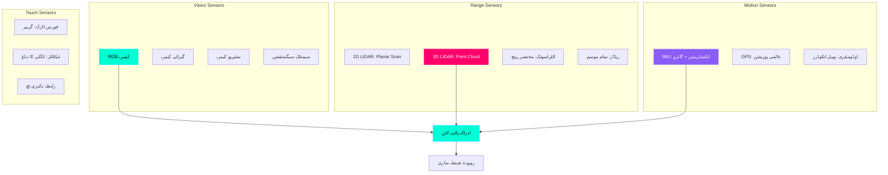
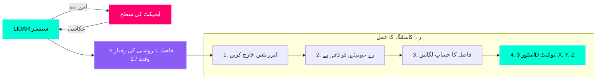

# آنکھوں اور کانوں کا تخروپن: روبوٹ سینسرز (Simulating Eyes & Ears: Robot Sensors)

## سینسرز کی نقالی کیوں؟

حقیقی سینسرز **مہنگے** اور **نازک** ہیں:
*   **LIDAR**: $1,000 - $75,000 (Velodyne VLP-16 سے HDL-64E)
*   **سٹیریو کیمرہ**: $200 - $2,000 (Intel RealSense سے ZED 2)
*   **IMU**: $50 - $5,000 (MPU-6050 سے Xsens MTi)

تخروپن میں، آپ یہ کر سکتے ہیں:
*   ہارڈ ویئر خریدنے سے پہلے **100 سینسر کنفیگریشنز کی جانچ کریں**
*   ادراک کے ماڈلز (آبجیکٹ کا پتہ لگانے، الگ کرنے) کے لیے **لاکھوں تربیتی تصاویر بنائیں**
*   **سینسر کی ناکامیوں کی نقالی کریں** (کیمرہ کا رکاوٹ، LIDAR شور، IMU بڑھے)

:::info حقیقی دنیا کی مثال
Waymo کی خود چلانے والی کاروں نے حقیقی سڑکوں پر آنے سے پہلے **20 بلین میل** کی مصنوعی ڈرائیونگ کی تربیت حاصل کی۔ مصنوعی کیمروں اور LIDAR نے ان کے ادراک نیورل نیٹ ورکس کے لیے مصنوعی ڈیٹاسیٹس تیار کیے۔
:::

---

## سینسر کی اقسام کا جائزہ



**ہیومنائیڈز کے لیے سب سے زیادہ عام:**
1.  **RGB Camera**: رنگین تصاویر (640×480 سے 4K)
2.  **Depth Camera**: ہر پکسل کا فاصلہ (RGB-D)
3.  **3D LIDAR**: 360° پوائنٹ کلاؤڈ (لاکھوں 3D پوائنٹس)
4.  **IMU**: 6 محور حرکت (3 محور ایکسل + 3 محور گائرو)

---

## LIDAR کیسے کام کرتا ہے: رے کاسٹنگ

**LIDAR (لائٹ ڈیٹیکشن اور رینجنگ)** لیزر بیم فائر کرتا ہے اور واپسی کے وقت کی پیمائش کرتا ہے:



**تخروپن کے مراحل:**
1.  **رے خارج کریں**: زاویہ θ پر LIDAR پوزیشن سے ورچوئل لیزر گولی ماریں۔
2.  **رے انٹرسیکشن**: رے کی زد میں آنے والی پہلی چیز تلاش کریں۔
3.  **فاصلہ کا حساب لگائیں**: ہٹ پوائنٹ تک LIDAR سے فاصلے کی پیمائش کریں۔
4.  **پوائنٹ اسٹور کریں**: سینسر فریم میں ریکارڈ (x, y, z)
5.  **دہرائیں**: ہزاروں شعاعوں کے ساتھ 360° اسکین کریں (مثلاً، 16 بیم × 1024 پوائنٹس/بیم = 16,384 پوائنٹس)

**پوائنٹ کلاؤڈ آؤٹ پٹ:**
```
پوائنٹ 0: x=2.5, y=0.3, z=0.1, intensity=0.8
پوائنٹ 1: x=2.4, y=0.4, z=0.1, intensity=0.9
پوائنٹ 2: x=2.3, y=0.5, z=0.2, intensity=0.7
...
```

---

## اپنے روبوٹ میں کیمرہ شامل کرنا

### مرحلہ 1: URDF میں کیمرے کی وضاحت کریں۔

```xml
<?xml version="1.0"?>
<robot name="robot_with_camera">
  
  <!-- موجودہ روبوٹ لنکس یہاں (بیس، دھڑ، سر، وغیرہ) -->
  
  <!-- کیمرہ لنک -->
  <link name="camera_link">
    <visual>
      <geometry>
        <box size="0.05 0.05 0.03"/>  <!-- 5cm × 5cm × 3cm کیمرہ باکس -->
      </geometry>
      <material name="black">
        <color rgba="0.1 0.1 0.1 1"/>
      </material>
    </visual>
    <collision>
      <geometry>
        <box size="0.05 0.05 0.03"/>
      </geometry>
    </collision>
    <inertial>
      <mass value="0.1"/>  <!-- 100 grams -->
      <inertia ixx="0.0001" ixy="0" ixz="0"
               iyy="0.0001" iyz="0"
               izz="0.0001"/>
    </inertial>
  </link>

  <!-- کیمرہ جوائنٹ (سر سے فکسڈ) -->
  <joint name="camera_joint" type="fixed">
    <parent link="head_link"/>
    <child link="camera_link"/>
    <origin xyz="0.05 0 0.1" rpy="0 0 0"/>  <!-- 5cm آگے، سر سے 10cm اوپر -->
  </joint>

  <!-- کیمرہ سینسر (Gazebo پلگ ان) -->
  <gazebo reference="camera_link">
    <sensor type="camera" name="front_camera">
      <update_rate>30.0</update_rate>  <!-- 30 FPS -->
      <camera name="head_camera">
        <horizontal_fov>1.5708</horizontal_fov>  <!-- 90° FOV (π/2 radians) -->
        <image>
          <width>640</width>
          <height>480</height>
          <format>R8G8B8</format>  <!-- RGB (کوئی الفا چینل نہیں) -->
        </image>
        <clip>
          <near>0.1</near>  <!-- کم از کم فاصلہ: 10cm -->
          <far>100</far>    <!-- زیادہ سے زیادہ فاصلہ: 100m -->
        </clip>
        <noise>
          <type>gaussian</type>
          <mean>0.0</mean>
          <stddev>0.007</stddev>  <!-- نقلی سینسر شور -->
        </noise>
      </camera>
      
      <plugin name="camera_controller" filename="libgazebo_ros_camera.so">
        <ros>
          <namespace>/robot</namespace>
          <remapping>image_raw:=camera/image_raw</remapping>
          <remapping>camera_info:=camera/camera_info</remapping>
        </ros>
        <camera_name>front_camera</camera_name>
        <frame_name>camera_link</frame_name>
      </plugin>
    </sensor>
  </gazebo>

</robot>
```

---

### کیمرہ پیرامیٹر بریک ڈاؤن

**`<horizontal_fov>` (فیلڈ آف ویو):**
*   **1.5708 rad** = 90° (وسیع زاویہ، جیسے انسانی پردیی بینائی)
*   **0.7854 rad** = 45° (تنگ، ٹیلی فوٹو لینس)
*   وسیع FOV زیادہ دیکھتا ہے لیکن فی ڈگری کم تفصیل کے ساتھ

**`<image>` (قرارداد):**
*   **640×480**: معیاری VGA (تیز، کم تفصیل)
*   **1920×1080**: مکمل HD (تفصیلی، عمل کرنے میں 3x سست)
*   **3840×2160**: 4K (سنیما، 10x سست)

**`<clip>` (گہرائی کی حد):**
*   **near=0.1m**: 10cm سے زیادہ قریب کی اشیاء پوشیدہ ہیں (روبوٹ کے سر کے اندر دیکھنے سے روکتا ہے)
*   **far=100m**: 100m سے زیادہ کی اشیاء رینڈر نہیں کی جاتیں (کارکردگی کی اصلاح)

---

### مرحلہ 2: کیمرہ فیڈ دیکھیں

```bash
# اپنے روبوٹ کے ساتھ Gazebo لانچ کریں۔
ros2 launch my_robot_description gazebo.launch.py

# دوسرے ٹرمینل میں، کیمرہ سٹریم دیکھیں
ros2 run rqt_image_view rqt_image_view
# ٹوپک منتخب کریں: /robot/camera/image_raw
```

**متوقع آؤٹ پٹ:** روبوٹ کے کیمرہ POV سے ریئل ٹائم ویڈیو اسٹریم۔

---

## اپنے روبوٹ میں LIDAR شامل کرنا

### مرحلہ 1: URDF میں 2D LIDAR کی وضاحت کریں۔

```xml
<!-- LIDAR Link (اسپننگ سینسر) -->
<link name="lidar_link">
  <visual>
    <geometry>
      <cylinder radius="0.05" length="0.07"/>  <!-- 5cm قطر, 7cm لمبا -->
    </geometry>
    <material name="blue">
      <color rgba="0 0 0.8 1"/>
    </material>
  </visual>
  <collision>
    <geometry>
      <cylinder radius="0.05" length="0.07"/>
    </geometry>
  </collision>
  <inertial>
    <mass value="0.5"/>  <!-- 500 grams -->
    <inertia ixx="0.001" ixy="0" ixz="0"
             iyy="0.001" iyz="0"
             izz="0.0005"/>
  </inertial>
</link>

<!-- LIDAR Joint (روبوٹ کے اوپر فکسڈ) -->
<joint name="lidar_joint" type="fixed">
  <parent link="base_link"/>
  <child link="lidar_link"/>
  <origin xyz="0 0 0.3" rpy="0 0 0"/>  <!-- بیس سے 30cm اوپر -->
</joint>

<!-- LIDAR Sensor (Gazebo پلگ ان) -->
<gazebo reference="lidar_link">
  <sensor type="ray" name="lidar_sensor">
    <pose>0 0 0 0 0 0</pose>
    <visualize>true</visualize>  <!-- Gazebo GUI میں شعاعیں دکھائیں۔ -->
    <update_rate>10</update_rate>  <!-- 10 Hz اسکین کی شرح -->
    
    <ray>
      <scan>
        <horizontal>
          <samples>720</samples>  <!-- 720 شعاعیں فی اسکین -->
          <resolution>1</resolution>
          <min_angle>-3.14159</min_angle>  <!-- -π ریڈینز = -180° -->
          <max_angle>3.14159</max_angle>   <!-- +π ریڈینز = +180° -->
        </horizontal>
      </scan>
      <range>
        <min>0.1</min>  <!-- کم از کم رینج: 10cm -->
        <max>30.0</max>  <!-- زیادہ سے زیادہ رینج: 30m -->
        <resolution>0.01</resolution>  <!-- 1cm درستگی -->
      </range>
      <noise>
        <type>gaussian</type>
        <mean>0.0</mean>
        <stddev>0.01</stddev>  <!-- 1cm شور -->
      </noise>
    </ray>
    
    <plugin name="lidar_controller" filename="libgazebo_ros_ray_sensor.so">
      <ros>
        <namespace>/robot</namespace>
        <remapping>~/out:=scan</remapping>
      </ros>
      <output_type>sensor_msgs/LaserScan</output_type>
      <frame_name>lidar_link</frame_name>
    </plugin>
  </sensor>
</gazebo>
```

---

### LIDAR پیرامیٹر بریک ڈاؤن

**`<samples>720</samples>`**
*   720 شعاعیں فی 360° اسکین = **0.5° کونیی ریزولوشن**
*   مزید نمونے = گھنے پوائنٹ بادل لیکن سست پروسیسنگ

**`<min_angle>` / `<max_angle>`**
*   **-π to +π**: مکمل 360° اسکین (روبوٹ چاروں طرف دیکھتا ہے)
*   **-π/4 to +π/4**: 90° آگے کا اسکین (پیچھے بلائنڈ اسپاٹ)

**`<range>` (فاصلے کی حدود)**
*   **min=0.1m**: 10cm سے زیادہ قریب کی اشیاء کو نظر انداز کرتا ہے (خود کا پتہ لگانے سے بچتا ہے)
*   **max=30.0m**: مؤثر رینج (حقیقی LIDAR: 10m سے 200m ماڈل پر منحصر ہے)

---

### مرحلہ 2: RViz میں LIDAR کا تصور کریں۔

```bash
# Gazebo میں روبوٹ لانچ کریں۔
ros2 launch my_robot_description gazebo.launch.py

# RViz لانچ کریں۔
ros2 run rviz2 rviz2

# RViz میں:
# 1. شامل کریں > LaserScan
# 2. Topic: /robot/scan
# 3. فکسڈ فریم: base_link
# 4. سائز: 0.05 (پوائنٹ سائز)
# 5. رنگ: اندردخش (شدت سے)
```

**متوقع آؤٹ پٹ:** LIDAR کے ذریعے پتہ چلنے والی رکاوٹوں کو دکھاتے ہوئے سرخ نقطے، اصل وقت میں اپ ڈیٹ ہو رہے ہیں۔

---

## 3D LIDAR شامل کرنا (Velodyne-Style)

**3D پوائنٹ کلاؤڈز** کے لیے (خود ڈرائیونگ کاروں میں استعمال ہوتا ہے):

```xml
<gazebo reference="lidar_link">
  <sensor type="ray" name="velodyne_sensor">
    <pose>0 0 0 0 0 0</pose>
    <visualize>false</visualize>  <!-- بہت زیادہ کرنیں، ویژولائزیشن کو غیر فعال کریں۔ -->
    <update_rate>10</update_rate>
    
    <ray>
      <scan>
        <horizontal>
          <samples>1024</samples>  <!-- 1024 شعاعیں فی افقی اسکین -->
          <min_angle>-3.14159</min_angle>
          <max_angle>3.14159</max_angle>
        </horizontal>
        <vertical>
          <samples>16</samples>  <!-- 16 عمودی تہیں (جیسے Velodyne VLP-16) -->
          <min_angle>-0.2618</min_angle>  <!-- -15° نیچے -->
          <max_angle>0.2618</max_angle>   <!-- +15° اوپر -->
        </vertical>
      </scan>
      <range>
        <min>0.5</min>
        <max>100.0</max>  <!-- 100m رینج -->
        <resolution>0.01</resolution>
      </range>
    </ray>
    
    <plugin name="velodyne_controller" filename="libgazebo_ros_velodyne_laser.so">
      <ros>
        <namespace>/robot</namespace>
        <remapping>~/out:=velodyne_points</remapping>
      </ros>
      <output_type>sensor_msgs/PointCloud2</output_type>
      <frame_name>lidar_link</frame_name>
    </plugin>
  </sensor>
</gazebo>
```

**آؤٹ پٹ:** `sensor_msgs/PointCloud2` کے ساتھ **16,384 پوائنٹس فی اسکین** (1024 افقی × 16 عمودی)۔

---

## پوائنٹ کلاؤڈز کو سمجھنا

ایک **پوائنٹ کلاؤڈ** 3D پوائنٹس کا ایک مجموعہ ہے جو سطحوں کی نمائندگی کرتا ہے:

```python
# مثال: Python میں پوائنٹ کلاؤڈ پروسیسنگ
import rclpy
from sensor_msgs.msg import PointCloud2
import sensor_msgs_py.point_cloud2 as pc2

class PointCloudProcessor(Node):
    def __init__(self):
        super().__init__('pc_processor')
        self.subscription = self.create_subscription(
            PointCloud2,
            '/robot/velodyne_points',
            self.pointcloud_callback,
            10
        )
    
    def pointcloud_callback(self, msg):
        # ROS PointCloud2 کو (x, y, z, intensity) کی فہرست میں تبدیل کریں۔
        points = list(pc2.read_points(msg, field_names=("x", "y", "z", "intensity")))
        
        # فلٹر پوائنٹس: صرف 5 میٹر کے اندر اشیاء
        close_points = [p for p in points if p[0]**2 + p[1]**2 + p[2]**2 < 25]
        
        self.get_logger().info(f'Total points: {len(points)}, Close points: {len(close_points)}')
```

---

## IMU (انریشل پیمائش یونٹ) شامل کرنا

IMU اقدامات **لکیری سرعت** (3 محور) اور **کونیی رفتار** (3 محور):

```xml
<!-- IMU Link (چھوٹا سینسر، بصری ضرورت نہیں) -->
<link name="imu_link">
  <inertial>
    <mass value="0.01"/>  <!-- 10 grams -->
    <inertia ixx="0.0001" ixy="0" ixz="0"
             iyy="0.0001" iyz="0"
             izz="0.0001"/>
  </inertial>
</link>

<!-- IMU Joint (دھڑ سے فکسڈ) -->
<joint name="imu_joint" type="fixed">
  <parent link="torso_link"/>
  <child link="imu_link"/>
  <origin xyz="0 0 0" rpy="0 0 0"/>  <!-- بڑے پیمانے پر مرکز -->
</joint>

<!-- IMU Sensor (Gazebo پلگ ان) -->
<gazebo reference="imu_link">
  <sensor name="imu_sensor" type="imu">
    <always_on>true</always_on>
    <update_rate>100</update_rate>  <!-- 100 Hz (standard for IMU) -->
    
    <plugin name="imu_plugin" filename="libgazebo_ros_imu_sensor.so">
      <ros>
        <namespace>/robot</namespace>
        <remapping>~/out:=imu</remapping>
      </ros>
      <frame_name>imu_link</frame_name>
      
      <!-- شور کے پیرامیٹرز (حقیقت پسندانہ سینسر کی خصوصیات) -->
      <initial_orientation_as_reference>false</initial_orientation_as_reference>
      
      <!-- ایکسلرومیٹر شور -->
      <gaussian_noise>0.01</gaussian_noise>  <!-- 0.01 m/s² شور -->
      
      <!-- گائروسکوپ شور -->
      <angular_velocity_stdev>0.0002</angular_velocity_stdev>  <!-- 0.0002 rad/s شور -->
      
      <!-- واقفیت کا شور -->
      <orientation_stdev>0.001</orientation_stdev>
    </plugin>
  </sensor>
</gazebo>
```

**IMU پیغام (`sensor_msgs/Imu`):**
```python
Header header
geometry_msgs/Quaternion orientation  # رول، پچ، یا (بطور quaternion)
float64[9] orientation_covariance     # واقفیت میں غیر یقینی صورتحال
geometry_msgs/Vector3 angular_velocity  # گردش کی شرح: x, y, z (rad/s)
float64[9] angular_velocity_covariance
geometry_msgs/Vector3 linear_acceleration  # Accel: x, y, z (m/s²)
float64[9] linear_acceleration_covariance
```

**استعمال کا معاملہ:** پتہ لگائیں کہ روبوٹ کب گر رہا ہے (بڑی کونیی رفتار) یا ٹکرا رہا ہے (اچانک ایکسلریشن اسپائک)۔

---

## ہینڈ آن ورزش: ملٹی سینسر روبوٹ

**چیلنج:** اس کے ساتھ ایک روبوٹ بنائیں:
1.  **سامنے والا کیمرہ** (640×480, 30 FPS)
2.  **360° 2D LIDAR** (720 samples, 10 Hz)
3.  **IMU** (100 Hz)

---

## کلیدی ٹیکا ویز (Key Takeaways)

✅ **کیمرے** RGB تصاویر فراہم کرتے ہیں (30-60 FPS, 640×480 سے 4K ریزولوشن)
✅ **LIDAR** رے کاسٹنگ (2D پلانر یا 3D والیومیٹرک) کے ذریعے پوائنٹ کلاؤڈز تیار کرتا ہے
✅ **IMU** سرعت اور گردش کی پیمائش کرتا ہے (تیز رفتاری کے لیے 100-1000 Hz)
✅ **Gazebo plugins** (`libgazebo_ros_camera.so`, `libgazebo_ros_ray_sensor.so`) ROS 2 پر سینسر ڈیٹا شائع کریں۔
✅ **شور کے پیرامیٹرز** حقیقت پسندی کو شامل کرتے ہیں (رینج/شدت/ایکسلریشن پر گاسین شور)
✅ **پوائنٹ کلاؤڈز** سطحوں کی نمائندگی کرنے والے (x, y, z, intensity) پوائنٹس کے سیٹ ہیں۔

---

## اگلا کیا ہے؟

آپ نے تخروپن کے بنیادی اصولوں (فزکس، رینڈرنگ، سینسرز) میں مہارت حاصل کر لی ہے۔ اگلا ماڈیول **ماڈیول 3: AI دماغ** کا احاطہ کرتا ہے — جہاں آپ روبوٹس کو **استدلال کی صلاحیتیں** دینے کے لئے GPT-4V جیسے وژن لینگویج ماڈلز (VLMs) کو ضم کریں گے: "بائیں میز پر سرخ پیالا اٹھائیں۔"

---

## مزید پڑھنا

*   [Gazebo Sensor Plugins](http://classic.gazebosim.org/tutorials?tut=ros_gzplugins#Camera)
*   [ROS 2 sensor_msgs Documentation](https://docs.ros.org/en/humble/p/sensor_msgs/)
*   [Point Cloud Library (PCL)](https://pointclouds.org/)
*   [Open3D for Point Cloud Processing](http://www.open3d.org/)
*   [LIDAR Principles (Velodyne)](https://velodynelidar.com/blog/lidar-101-an-introduction-to-lidar-technology/)
