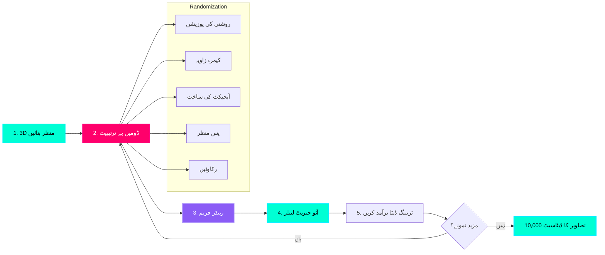

# NVIDIA Isaac Sim: مصنوعی ڈیٹا فیکٹری

## ٹریننگ ڈیٹا کی رکاوٹ

آبجیکٹ کا پتہ لگانے کے لیے وژن ماڈل کو تربیت دینے کے لیے **ہزاروں لیبل والی تصاویر** کی ضرورت ہوتی ہے:
*   **دستی لیبلنگ**: ہر 30 سیکنڈ میں 1 تصویر = 10,000 تصاویر کے لیے 83 گھنٹے
*   **لاگت**: $0.10 فی تصویر × 10,000 = $1,000
*   **حقیقی دنیا کا مجموعہ**: کیمرہ سیٹ اپ، لائٹنگ کی مختلف حالتیں، 100 جسمانی اشیاء

**Isaac Sim حل:** خودکار تشریح کے ساتھ **1 گھنٹے میں 10,000 فوٹو ریلسٹک لیبل والی تصاویر** بنائیں۔

:::info حقیقی دنیا کی مثال
Amazon پک اینڈ پلیس روبوٹس کو تربیت دینے کے لیے **مصنوعی ڈیٹا** کا استعمال کرتا ہے۔ وہ گودام کی اشیاء کی لاکھوں تصاویر بے ترتیب پوز، لائٹنگ اور رکاوٹوں کے ساتھ تیار کرتے ہیں — بغیر دستی لیبلنگ کے **95% + حقیقی دنیا کی درستگی** حاصل کرتے ہیں۔
:::

---

## مصنوعی ڈیٹا جنریشن پائپ لائن



**پائپ لائن کے مراحل:**
1.  **3D منظر بنائیں**: USD فارمیٹ میں آبجیکٹ (سکرو، بولٹ، ٹول) کا CAD ماڈل درآمد کریں۔
2.  **ڈومین بے ترتیبیت**: روشنی، کیمرہ پوز، بناوٹ، پس منظر مختلف ہوتے ہیں۔
3.  **رینڈر فریم**: فوٹو ریلسٹک رے ٹریسڈ امیج (1920×1080 یا اس سے زیادہ)
4.  **آٹو جنریٹ لیبلز**: باؤنڈنگ بکس، سیگمنٹیشن ماسکس، ڈیپتھ میپس
5.  **برآمد کریں**: COCO فارمیٹ JSON + PNG تصاویر PyTorch/TensorFlow کے لیے تیار ہیں

**کلیدی فائدہ:** لیبل **مکمل طور پر درست** ہیں (کوئی انسانی غلطی نہیں) اور جنریشن GPU پر **بڑے پیمانے پر متوازی** ہے۔

---

## NVIDIA Omniverse کیا ہے؟

**Omniverse** جسمانی طور پر درست تخروپن اور تعاون کا ایک پلیٹ فارم ہے:
*   **USD (یونیورسل سین تفصیل)**: Pixar کا اوپن سورس 3D سین فارمیٹ
*   **RTX رے ٹریسنگ**: NVIDIA GPUs پر فوٹو ریلسٹک رینڈرنگ
*   **Isaac Sim**: روبوٹکس سمیلیٹر Omniverse پر بنایا گیا ہے۔
*   **PhysX**: حقیقت پسندانہ آبجیکٹ کے تعامل کے لیے فزکس انجن

**Isaac Sim = Omniverse + ROS 2 + Robotics-Specific Tools**

---

## USD فائلیں: یونیورسل سین فارمیٹ

**USD** (پکسر اینی میشن اسٹوڈیوز سے) "3D کے لیے HTML" ہے:

```python
#usda 1.0
(
    defaultPrim = "Screw"
    upAxis = "Y"
)

def Xform "Screw" {
    def Mesh "ScrewMesh" {
        float3[] points = [(0, 0, 0), (1, 0, 0), ...] # Vertex positions
        int[] faceVertexCounts = [3, 3, 3, ...] # Triangles
        int[] faceVertexIndices = [0, 1, 2, ...] # Vertex order
        
        # مواد تفویض
        rel material:binding = </Materials/Steel>
    }
}

def Material "Steel" {
    token outputs:surface.connect = </Materials/Steel/Shader.outputs:surface>
    
    def Shader "Shader" {
        uniform token info:id = "UsdPreviewSurface"
        color3f inputs:diffuseColor = (0.7, 0.7, 0.7) # گرے سٹیل
        float inputs:metallic = 0.9 # بہت دھاتی
        float inputs:roughness = 0.3 # تھوڑا سا کھردرا
    }
}
```

**اہم خصوصیات:**
*   **مراتب**: آبجیکٹ کو نیسٹ کیا جا سکتا ہے (روبوٹ → بازو → گرپر → انگلی)
*   **پرت دار**: متعدد USD فائلوں کو یکجا کریں (بیس سین + بے ترتیب)
*   **سٹریمنگ**: بڑے مناظر کے صرف نظر آنے والے حصوں کو لوڈ کریں۔
*   **باہمی تعاون**: متعدد فنکار ایک ہی منظر میں بیک وقت ترمیم کر سکتے ہیں۔

---

## NVIDIA Isaac Sim انسٹال کرنا

### سسٹم کے تقاضے

| جزو | کم از کم | سفارش کی |
| :--- | :--- | :--- |
| **GPU** | RTX 2070 (8GB VRAM) | RTX 4080 (16GB VRAM) |
| **CPU** | Intel i7-9700K | Intel i9-13900K |
| **RAM** | 32GB | 64GB |
| **Storage** | 50GB SSD | 500GB NVMe SSD |
| **OS** | Ubuntu 20.04/22.04 | Ubuntu 22.04 LTS |

:::warning RTX GPU درکار ہے۔
Isaac Sim کو رے ٹریسنگ کے لیے **NVIDIA RTX GPU** کی ضرورت ہے۔ AMD GPUs اور Intel Arc تعاون یافتہ نہیں ہیں۔ کم از کم RTX 2070 (2019 یا جدید تر)۔
:::

---

### تنصیب کے مراحل

**طریقہ 1: Omniverse لانچر (تجویز کردہ)**

```bash
# 1. Omniverse لانچر ڈاؤن لوڈ کریں۔
wget https://install.launcher.omniverse.nvidia.com/installers/omniverse-launcher-linux.AppImage

# 2. قابل عمل بنائیں
chmod +x omniverse-launcher-linux.AppImage

# 3. لانچر چلائیں۔
./omniverse-launcher-linux.AppImage

# 4. لانچر GUI میں:
#    - NVIDIA اکاؤنٹ کے ساتھ سائن ان کریں (مفت)
#    - لائبریری > "Isaac Sim" انسٹال کریں (ورژن 2023.1.1 یا بعد کا)
#    - 20GB ڈاؤن لوڈ + انسٹالیشن کا انتظار کریں۔
```

**طریقہ 2: Docker (ہیڈ لیس سرورز کے لیے)**

```bash
# Isaac Sim کنٹینر کو کھینچیں۔
docker pull nvcr.io/nvidia/isaac-sim:2023.1.1

# GPU سپورٹ کے ساتھ چلائیں۔
docker run --gpus all -it \
  -v ~/isaac_sim_data:/workspace/data \
  nvcr.io/nvidia/isaac-sim:2023.1.1
```

---

## مصنوعی ڈیٹا بنانا: سکرو کا پتہ لگانے کی مثال

### مرحلہ 1: بیس سین (Base Scene) بنائیں

**Python script: `create_scene.py`**

```python
from omni.isaac.kit import SimulationApp

# Isaac Sim شروع کریں۔
simulation_app = SimulationApp({"headless": False})  # GUI نہ ہونے کے لیے True پر سیٹ کریں۔

from omni.isaac.core import World
from omni.isaac.core.utils.stage import add_reference_to_stage
import omni.replicator.core as rep

# دنیا بنائیں
world = World()
world.scene.add_default_ground_plane()

# سکرو CAD ماڈل درآمد کریں (USD میں تبدیل)
screw_prim = add_reference_to_stage(
    usd_path="/workspace/assets/screw_m6.usd",
    prim_path="/World/Screw"
)

# کیمرہ شامل کریں۔
camera = rep.create.camera(
    position=(0.5, 0.5, 0.3),  # 50cm دور، 30cm اونچا
    look_at=(0, 0, 0.05)  # سکرو سینٹر کو دیکھیں
)

# لائٹس شامل کریں۔
light = rep.create.light(
    light_type="Dome",  # ماحولیاتی HDRI لائٹنگ
    intensity=1000,
    texture="omniverse://localhost/NVIDIA/Assets/Skies/Clear/noon_grass_4k.hdr"
)

print("Scene created. Ready for data generation.")
```

---

### مرحلہ 2: ڈومین بے ترتیبیت

**عمومیت کا راز:** **لامتناہی تغیرات** پر ٹرین کریں تاکہ ماڈل کسی بھی حالت میں کام کرے۔

```python
import omni.replicator.core as rep
import random

# بے ترتیب ترتیب
with rep.trigger.on_frame(num_frames=10000):  # 10,000 تصاویر بنائیں
    
    # 1. کیمرے کا پوز بے ترتیب کریں۔
    with camera:
        rep.modify.pose(
            position=rep.distribution.uniform((0.3, 0.3, 0.2), (0.7, 0.7, 0.4)),
            look_at=(0, 0, 0.05)
        )
    
    # 2. لائٹنگ کو بے ترتیب کریں۔
    with light:
        rep.modify.attribute(
            "intensity", 
            rep.distribution.uniform(500, 2000)  # 500-2000 lumens
        )
        rep.modify.attribute(
            "color",
            rep.distribution.uniform((0.8, 0.8, 0.8), (1.0, 1.0, 1.0))  # معمولی رنگت
        )
    
    # 3. آبجیکٹ پوز کو بے ترتیب کریں۔
    with screw_prim:
        rep.modify.pose(
            position=rep.distribution.uniform((-0.05, -0.05, 0), (0.05, 0.05, 0.1)),
            rotation=rep.distribution.uniform((0, 0, 0), (360, 360, 360))  # بے ترتیب گردش
        )
    
    # 4. مواد کو بے ترتیب کریں (بناوٹ)
    materials = [
        "/Materials/Steel_Brushed",
        "/Materials/Steel_Galvanized",
        "/Materials/Steel_Rusted",
        "/Materials/Brass",
        "/Materials/Aluminum"
    ]
    with screw_prim:
        rep.randomizer.materials(materials)
    
    # 5. پس منظر کو بے ترتیب کریں۔
    backgrounds = [
        "/Backgrounds/Workbench_Wood",
        "/Backgrounds/Concrete_Floor",
        "/Backgrounds/Metal_Plate",
        "/Backgrounds/Cardboard_Box"
    ]
    with rep.get.prims(path_pattern="/World/GroundPlane"):
        rep.randomizer.materials(backgrounds)

print("10,000 تغیرات کے لیے رینڈمائزیشن کنفیگر کی گئی۔")
```

---

### مرحلہ 3: لیبل تیار کریں اور برآمد کریں۔

```python
# آؤٹ پٹ رائٹرز سیٹ کریں
render = rep.AnnotatorRegistry.get_annotator("rgb")  # RGB تصویر
bbox = rep.AnnotatorRegistry.get_annotator("bounding_box_2d_tight")  # باؤنڈنگ بکس
semantic = rep.AnnotatorRegistry.get_annotator("semantic_segmentation")  # پکسل ماسک
depth = rep.AnnotatorRegistry.get_annotator("distance_to_camera")  # گہرائی کا نقشہ

# COCO فارمیٹ میں ڈسک پر لکھیں۔
rep.WriterRegistry.register(rep.writers.KittiWriter)
writer = rep.WriterRegistry.get("KittiWriter")
writer.initialize(
    output_dir="/workspace/data/screw_dataset",
    rgb=True,
    bounding_box_2d_tight=True,
    semantic_segmentation=True,
    distance_to_camera=True
)

# جنریشن شروع کریں۔
rep.orchestrator.run()

# Isaac Sim اب 10,000 فریم رینڈر کرے گا (RTX 4080 پر ~30-60 منٹ لگتے ہیں)
```

**آؤٹ پٹ ڈائرکٹری کی ساخت:**
```
/workspace/data/screw_dataset/
├── rgb/
│   ├── 0000.png
│   ├── 0001.png
│   ├── ...
│   └── 9999.png
├── bounding_box_2d_tight/
│   ├── 0000.json  # {"bbox": [x, y, width, height], "class": "screw"}
│   ├── 0001.json
│   └── ...
├── semantic_segmentation/
│   ├── 0000.png  # Pixel-level labels (screw=1, background=0)
│   └── ...
└── distance_to_camera/
    ├── 0000.npy  # Depth map (32-bit float, meters)
    └── ...
```

---

## مصنوعی ڈیٹا پر ڈٹیکٹر کی تربیت

ایک بار جب آپ کے پاس ڈیٹا سیٹ ہوجائے تو PyTorch کے ساتھ تربیت دیں:

```python
from detectron2.engine import DefaultTrainer
from detectron2.config import get_cfg
from detectron2 import model_zoo

# COCO-Pretrained Faster R-CNN ترتیب دیں۔
cfg = get_cfg()
cfg.merge_from_file(model_zoo.get_config_file("COCO-Detection/faster_rcnn_R_50_FPN_3x.yaml"))
cfg.DATASETS.TRAIN = ("screw_synthetic_train",)
cfg.DATASETS.TEST = ("screw_synthetic_val",)
cfg.DATALOADER.NUM_WORKERS = 4
cfg.MODEL.WEIGHTS = model_zoo.get_checkpoint_url("COCO-Detection/faster_rcnn_R_50_FPN_3x.yaml")
cfg.SOLVER.IMS_PER_BATCH = 16
cfg.SOLVER.BASE_LR = 0.001
cfg.SOLVER.MAX_ITER = 5000  # 10,000 تصاویر کے لیے 5,000 تکرار
cfg.MODEL.ROI_HEADS.NUM_CLASSES = 1  # صرف "سکرو" کلاس

# ٹرین
trainer = DefaultTrainer(cfg)
trainer.resume_or_load(resume=False)
trainer.train()

# اصلی تصاویر پر ٹیسٹ کریں۔
cfg.MODEL.WEIGHTS = os.path.join(cfg.OUTPUT_DIR, "model_final.pth")
predictor = DefaultPredictor(cfg)
outputs = predictor(real_image)  # اصلی تصاویر میں پیچ کا پتہ لگاتا ہے!
```

**متوقع نتائج:**
*   **صرف مصنوعی تربیت**: اصلی تصاویر پر 85-90% mAP (اچھی بے ترتیب کاری کے ساتھ)
*   **مخلوط تربیت** (مصنوعی + 1,000 اصلی): 95%+ mAP
*   **تربیتی وقت**: RTX 4080 پر 2-3 گھنٹے 10,000 تصاویر کے لیے

---

## ڈومین رینڈمائزیشن کے بہترین طریقے

| پیرامیٹر | بہت کم | بہت زیادہ | بہترین جگہ (Sweet Spot) |
| :--- | :--- | :--- | :--- |
| **کیمرہ کا فاصلہ** | 50cm فکسڈ | 10cm سے 5m | 30cm سے 1m |
| **لائٹنگ کی شدت** | 1000 lumens فکسڈ | 100 سے 10,000 | 500 سے 2000 |
| **آبجیکٹ روٹیشنز** | صرف سیدھا | مکمل 360° تمام محور | ±30° جھکاؤ، مکمل یاو |
| **پس منظر کی بناوٹ** | 1 بناوٹ | 1000 بناوٹ | 5-10 نمائندہ |
| **رکاوٹیں** | کوئی نہیں | 90% ڈھکا ہوا | 10-40% ڈھکا ہوا |

**سنہری اصول:** ہر وہ چیز بے ترتیب کریں **جو ماڈل حقیقت میں دیکھے گا**، لیکن حدود کو **حقیقت پسندانہ** رکھیں۔

---

## ہینڈ آن ورزش: اپنا ڈیٹاسیٹ بنائیں

**چیلنج:** گھریلو روبوٹ گرپر کے لیے **کافی مگ (coffee mug)** کی 1,000 تصاویر بنائیں۔

---

## کلیدی ٹیکا ویز (Key Takeaways)

✅ **Isaac Sim فوٹو ریلسٹک لیبل والا ڈیٹا تیار کرتا ہے** (1 گھنٹے میں 10K تصاویر)
✅ **USD فارمیٹ** 3D مناظر کے لیے معیار ہے (جیسے HTML برائے 3D)
✅ **ڈومین رینڈمائزیشن** sim-to-real منتقلی کے لیے اہم ہے۔
✅ **خودکار لیبلنگ** دستی تشریح کی لاگت کو ختم کرتی ہے ($0 بمقابلہ $1,000)
✅ **RTX GPU درکار ہے** رے ٹریسڈ رینڈرنگ کے لیے (RTX 2070 کم از کم)
✅ **COCO فارمیٹ آؤٹ پٹ** PyTorch Detectron2, TensorFlow, YOLOv8 کے ساتھ کام کرتا ہے

---

## اگلا کیا ہے؟

آپ نے مصنوعی ڈیٹا جنریشن میں مہارت حاصل کر لی ہے۔ اگلا باب **Nav2 اور بصری SLAM** کا احاطہ کرتا ہے — روبوٹ کس طرح نقشے بناتے ہیں اور کیمروں اور LIDAR کا استعمال کرتے ہوئے خود مختاری سے نیویگیٹ کرتے ہیں، "کچن میں جاؤ" جیسی کمانڈز کو فعال کرتے ہیں۔

---

## مزید پڑھنا

*   [Isaac Sim Documentation](https://docs.omniverse.nvidia.com/isaacsim/latest/)
*   [Omniverse Replicator (Synthetic Data)](https://docs.omniverse.nvidia.com/extensions/latest/ext_replicator.html)
*   [USD Format Specification](https://openusd.org/release/index.html)
*   [Domain Randomization Paper (OpenAI)](https://arxiv.org/abs/1703.06907)
*   [COCO Dataset Format](https://cocodataset.org/#format-data)
