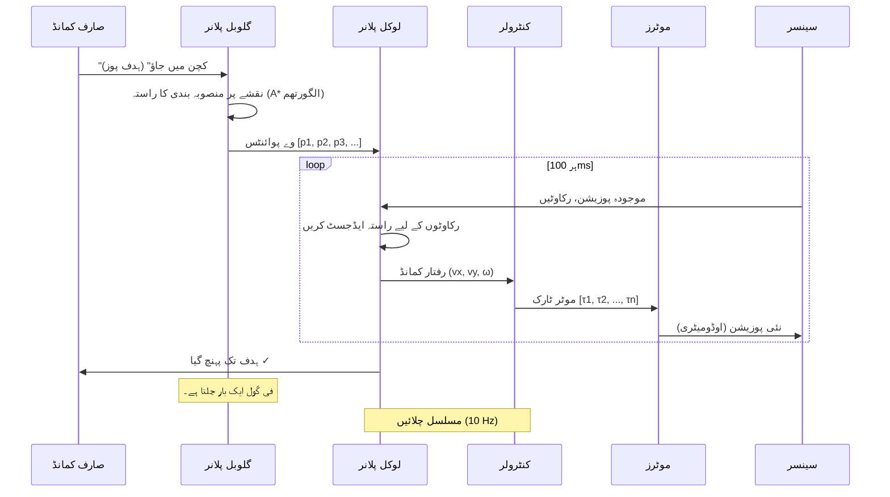

# نیویگیشن اور بصری SLAM: روبوٹ کو اپنا راستہ تلاش کرنا سکھانا

## نیویگیشن مسئلہ

آپ کے گھر میں ایک ہیومنائیڈ روبوٹ کو جواب دینے کی ضرورت ہے: **"میں کہاں ہوں؟" اور "میں وہاں کیسے پہنچوں؟"**

روایتی حل:
*   **GPS**: گھر کے اندر کام نہیں کرتا (چھت سے مسدود)
*   **موشن کیپچر**: مہنگے بیرونی کیمروں کی ضرورت ہے ($50K+ Vicon سسٹم)
*   **پہلے سے نقشہ شدہ ماحول**: جب آپ فرنیچر منتقل کرتے ہیں تو ٹوٹ جاتا ہے۔

**جدید حل:** آن بورڈ سینسرز کا استعمال کرتے ہوئے **SLAM (بیک وقت لوکلائزیشن اور میپنگ)** — اس پر اپنی پوزیشن کا پتہ لگاتے ہوئے ایک نقشہ **بنائیں**۔

:::info حقیقی دنیا کی مثال
Amazon گودام کے روبوٹ خود مختار طور پر 1 ملین+ مربع فٹ پر جانے کے لیے LIDAR SLAM کا استعمال کرتے ہیں۔ Tesla Optimus ہیومنائیڈ گھریلو نیویگیشن کے لیے **Visual SLAM** (صرف کیمرہ) کا استعمال کرتا ہے — LIDAR کی ضرورت نہیں ہے۔
:::

---

## Nav2 اسٹیک: روبوٹ کیسے نیویگیٹ کرتے ہیں۔

**Nav2** (Navigation 2) ROS 2 کا خود مختار نیویگیشن فریم ورک ہے:



**اجزا کی خرابی:**

1.  **گلوبل پلانر** (سیان):
    *   **ان پٹ**: نقشہ + ہدف کی پوزیشن ("کچن x=5, y=3 پر")
    *   **آؤٹ پٹ**: اعلی سطحی راستہ (وے پوائنٹس ہر 50cm)
    *   **الگورتھم**: A* یا Dijkstra (رکاوٹ سے پاک مختصر ترین راستہ تلاش کرتا ہے)
    *   **فریکوئنسی**: فی گول ایک بار چلتا ہے، نقشہ میں تبدیلی کے صورت میں دوبارہ منصوبہ بندی کرتا ہے

2.  **لوکل پلانر** (میجنٹا):
    *   **ان پٹ**: وے پوائنٹس + ریئل ٹائم سینسر ڈیٹا (LIDAR، کیمرہ)
    *   **آؤٹ پٹ**: قلیل مدتی رفتار (1 سیکنڈ آگے)
    *   **الگورتھم**: ڈائنامک ونڈو اپروچ (DWA) یا ٹائمڈ لچکدار بینڈ (TEB)
    *   **فریکوئنسی**: 10 Hz (ہر 100ms)
    *   **مقصد**: متحرک رکاوٹوں سے بچیں (انسان، پالتو جانور، دیگر روبوٹ)

3.  **کنٹرولر** (جامنی):
    *   **ان پٹ**: مطلوبہ رفتار (vx=0.5 m/s آگے، ω=0.2 rad/s بائیں مڑیں)
    *   **آؤٹ پٹ**: موٹر کمانڈز (پہیے کی رفتار یا مشترکہ ٹارک)
    *   **فریکوئنسی**: 100-1000 Hz (نچلی سطح کا کنٹرول لوپ)

4.  **سینسر** (سیان):
    *   **پوزیشن**: IMU + وہیل اوڈومیٹری + SLAM لوکلائزیشن
    *   **رکاوٹیں**: LIDAR اسکین (2D/3D پوائنٹ کلاؤڈز) یا گہرائی والا کیمرہ

---

## LIDAR SLAM بمقابلہ Visual SLAM (VSLAM)

### LIDAR SLAM (روایتی)

**یہ کیسے کام کرتا ہے:**
1.  ماحول کو اسکین کرنے کے لیے 2D/3D LIDAR اسپن کریں۔
2.  موجودہ اسکین کو پچھلے اسکینوں سے ملائیں (پوائنٹ کلاؤڈ رجسٹریشن)
3.  اسکین سیدھ سے روبوٹ کی حرکت کا اندازہ لگائیں۔
4.  2D قبضے کا گرڈ نقشہ بنائیں (سفید = خالی جگہ، سیاہ = رکاوٹ)

**خوبیاں:**
*   ✅ کسی بھی روشنی میں کام کرتا ہے (انفراریڈ لیزر)
*   ✅ فاصلے کی درست پیمائش (±1cm)
*   ✅ تیز پروسیسنگ (سادہ جیومیٹری)

**خامیاں:**
*   ❌ مہنگا ($1,000 برائے 2D، $10,000+ برائے 3D)
*   ❌ مکینیکل (کاتا ہوا پرزہ ختم ہو جاتا ہے)
*   ❌ کوئی بناوٹ/رنگ کی معلومات نہیں (اشیاء میں فرق نہیں کر سکتا)

---

### Visual SLAM (VSLAM) - کیمرہ پر مبنی

**یہ کیسے کام کرتا ہے:**
1.  کیمرے کی تصاویر سے **کیپوائنٹس (keypoints)** نکالیں (ORB/SIFT کا استعمال کرتے ہوئے کونے، کنارے)
2.  کیمرے کی حرکت کا اندازہ لگانے کے لیے فریموں میں کیپوائنٹس کو ملائیں۔
3.  کیپوائنٹس کی 3D پوزیشنوں کو مثلث بنائیں (حرکت سے ساخت)
4.  کیمرے کی رفتار اور 3D نقشے کو مشترکہ طور پر بہتر بنائیں (بنڈل ایڈجسٹمنٹ)

**خوبیاں:**
*   ✅ سستا ($50-$200 سٹیریو کیمرہ بمقابلہ $1,000+ LIDAR)
*   ✅ کوئی حرکت پذیر حصے نہیں (سالڈ سٹیٹ)
*   ✅ بھرپور بصری معلومات (اشیاء کو پہچان سکتا ہے، نشانیاں پڑھ سکتا ہے)

**خامیاں:**
*   ❌ کم روشنی یا بناوٹ سے پاک ماحول (سفید دیواروں) میں ناکام
*   ❌ مونوکولر کیمروں کے ساتھ پیمانے میں ابہام (سٹیریو یا IMU کی ضرورت ہے)
*   ❌ اعلی کمپیوٹ (امیج پروسیسنگ GPU-intensive ہے)

---

## isaac_ros_visual_slam ترتیب دینا

**isaac_ros_visual_slam** NVIDIA کا GPU- تیز رفتار بصری SLAM ہے:
*   **10× تیز** CPU پر مبنی ORB-SLAM3 سے
*   **سٹیریو یا مونوکولر** کیمرہ سپورٹ
*   **IMU فیوژن** مضبوط ٹریکنگ کے لیے

### تنصیب

```bash
# 1. Isaac ROS انسٹال کریں (NVIDIA Jetson یا RTX GPU کی ضرورت ہے)
sudo apt install ros-humble-isaac-ros-visual-slam

# 2. انحصارات انسٹال کریں۔
sudo apt install ros-humble-realsense2-camera  # Intel RealSense کے لیے
sudo apt install ros-humble-image-proc
```

---

### RealSense کیمرہ کے ساتھ VSLAM لانچ کریں۔

**لانچ فائل بنائیں: `vslam_realsense.launch.py`**

```python
from launch import LaunchDescription
from launch_ros.actions import Node

def generate_launch_description():
    return LaunchDescription([
        # 1. RealSense کیمرہ نوڈ شروع کریں۔
        Node(
            package='realsense2_camera',
            executable='realsense2_camera_node',
            name='camera',
            parameters=[{
                'depth_module.profile': '640x480x30',  # گہرائی: 640×480 @ 30 FPS
                'rgb_camera.profile': '640x480x30',    # RGB: 640×480 @ 30 FPS
                'enable_sync': True,  # گہرائی اور RGB کو سنکرونائز کریں۔
                'align_depth.enable': True,  # گہرائی کو RGB فریم کے ساتھ سیدھ کریں۔
            }],
            remappings=[
                ('/camera/color/image_raw', '/camera/rgb/image_raw'),
                ('/camera/depth/image_rect_raw', '/camera/depth/image_raw'),
            ]
        ),
        
        # 2. بصری SLAM نوڈ شروع کریں۔
        Node(
            package='isaac_ros_visual_slam',
            executable='isaac_ros_visual_slam',
            name='visual_slam',
            parameters=[{
                'enable_image_denoising': True,  # شور کم کریں
                'rectified_images': True,  # calibrated کیمرہ فرض کریں
                'enable_imu_fusion': False,  # True سیٹ کریں اگر IMU دستیاب ہو۔
                'enable_observations_view': True,  # ڈیبگ کے لیے کیپوائنٹس شائع کریں۔
                'enable_slam_visualization': True,  # RViz کے لیے نقشہ شائع کریں۔
                'path_max_size': 1024,  # آخری 1024 پوز یاد رکھیں
            }],
            remappings=[
                ('stereo_camera/left/image', '/camera/rgb/image_raw'),
                ('stereo_camera/left/camera_info', '/camera/rgb/camera_info'),
                ('stereo_camera/right/image', '/camera/depth/image_raw'),
                ('stereo_camera/right/camera_info', '/camera/depth/camera_info'),
            ]
        ),
        
        # 3. جامد تبدیلی شائع کریں (کیمرہ سے روبوٹ بیس)
        Node(
            package='tf2_ros',
            executable='static_transform_publisher',
            name='camera_tf',
            arguments=['0', '0', '0.15', '0', '0', '0', 'base_link', 'camera_link']
            # کیمرہ بیس_لنک سے 15cm اوپر ہے، کوئی گردش نہیں ہے۔
        ),
    ])
```

---

### VSLAM چلائیں

```bash
# ٹرمینل 1: VSLAM لانچ کریں۔
ros2 launch my_robot vslam_realsense.launch.py

# ٹرمینل 2: RViz میں تصور کریں۔
ros2 run rviz2 rviz2

# RViz میں:
# 1. فکسڈ فریم: "odom"
# 2. شامل کریں > TF (کیمرہ پوز اپ ڈیٹ دیکھتے ہوئے)
# 3. شامل کریں > نقشہ (3D پوائنٹ کلاؤڈ کا نقشہ دیکھیں)
# 4. شامل کریں > راستہ (روبوٹ کی رفتار دیکھیں)
```

**متوقع آؤٹ پٹ:**
*   کیمرہ پوز کی تازہ کاری 30 Hz پر ہوتی ہے۔
*   کیپوائنٹس کا 3D نقشہ ظاہر ہوتا ہے (سبز نقطے)
*   روبوٹ کی رفتار کو سرخ لکیر کے طور پر دکھایا گیا ہے۔

---

## روبوٹ کو کمانڈ کرنا: "کچن میں جاؤ"

ایک بار جب آپ کے پاس نقشہ ہو تو، خود مختار نیویگیٹ کرنے کے لیے **Nav2** استعمال کریں۔

### مرحلہ 1: نقشہ محفوظ کریں۔

```bash
# جب VSLAM چل رہا ہو، نقشہ محفوظ کریں۔
ros2 service call /visual_slam/save_map isaac_ros_visual_slam_interfaces/srv/FilePath "{file_path: '/home/user/maps/home_map.yaml'}"
```

**نقشہ فائل کا ڈھانچہ:**
```yaml
# home_map.yaml
image: home_map.pgm  # قبضہ گرڈ (سفید = مفت، سیاہ = مقبوضہ)
resolution: 0.05  # 5cm فی پکسل
origin: [-10.0, -10.0, 0.0]  # میٹر میں نقشہ کی اصل
occupied_thresh: 0.65  # 65% سے زیادہ گہرا پکسل = رکاوٹ
free_thresh: 0.2  # 20% سے زیادہ ہلکا پکسل = مفت جگہ
```

---

### مرحلہ 2: Nav2 اسٹیک لانچ کریں۔

```bash
# Nav2 انسٹال کریں۔
sudo apt install ros-humble-navigation2 ros-humble-nav2-bringup

# اپنے نقشے کے ساتھ Nav2 لانچ کریں۔
ros2 launch nav2_bringup bringup_launch.py \
  map:=/home/user/maps/home_map.yaml \
  use_sim_time:=False
```

**Nav2 ان نوڈس کو شروع کرتا ہے:**
*   `map_server`: محفوظ شدہ نقشہ لوڈ کرتا ہے۔
*   `amcl`: نقشے پر روبوٹ کو لوکلائز کرتا ہے (اڈیپٹیو مونٹی کارلو لوکلائزیشن)
*   `planner_server`: A* عالمی راستے کی منصوبہ بندی
*   `controller_server`: DWA مقامی منصوبہ بندی
*   `bt_navigator`: سلوک ٹری کوآرڈینیٹر

---

### مرحلہ 3: نیویگیشن گول بھیجیں۔

**طریقہ 1: RViz (GUI)**

```bash
# Nav2 کنفیگریشن کے ساتھ RViz لانچ کریں۔
ros2 launch nav2_bringup rviz_launch.py

# RViz میں:
# 1. "2D پوز کا تخمینہ" بٹن پر کلک کریں۔
# 2. نقشے پر کلک کریں جہاں روبوٹ فی الحال ہے (ابتدائی پوز سیٹ کرتا ہے)
# 3. "Nav2 گول" بٹن پر کلک کریں۔
# 4. "کچن" کے مقام پر کلک کریں (ہدف مقرر کرتا ہے)
# روبوٹ حرکت کرنا شروع کر دیتا ہے!
```

**طریقہ 2: ازگر کا اسکرپٹ (Python Script)**

```python
import rclpy
from rclpy.node import Node
from geometry_msgs.msg import PoseStamped
from nav2_simple_commander.robot_navigator import BasicNavigator

class KitchenNavigator(Node):
    def __init__(self):
        super().__init__('kitchen_navigator')
        self.navigator = BasicNavigator()
        
        # Nav2 کے شروع ہونے کا انتظار کریں۔
        self.navigator.waitUntilNav2Active()
        self.get_logger().info('Nav2 تیار ہے!')
        
        # "کچن" کی جگہ کی وضاحت کریں (x=5.0m, y=3.0m, facing north)
        kitchen_pose = PoseStamped()
        kitchen_pose.header.frame_id = 'map'
        kitchen_pose.header.stamp = self.get_clock().now().to_msg()
        kitchen_pose.pose.position.x = 5.0
        kitchen_pose.pose.position.y = 3.0
        kitchen_pose.pose.orientation.w = 1.0  # آگے کی طرف (کوری گردش نہیں)
        
        # مقصد بھیجیں۔
        self.navigator.goToPose(kitchen_pose)
        self.get_logger().info('کچن کی طرف جا رہے ہیں...')
        
        # تکمیل کا انتظار کریں۔
        while not self.navigator.isTaskComplete():
            feedback = self.navigator.getFeedback()
            self.get_logger().info(f'باقی فاصلہ: {feedback.distance_remaining:.2f}m')
            rclpy.spin_once(self, timeout_sec=0.1)
        
        result = self.navigator.getResult()
        if result == TaskResult.SUCCEEDED:
            self.get_logger().info('کچن پہنچ گئے! ✓')
        else:
            self.get_logger().error('کچن تک پہنچنے میں ناکام')

def main():
    rclpy.init()
    navigator = KitchenNavigator()
    rclpy.spin(navigator)

if __name__ == '__main__':
    main()
```

---

## ایکشن میں رکاوٹ سے بچنا

نیویگیٹ کرتے وقت، **مقامی منصوبہ ساز (Local Planner)** مسلسل راستے کو ایڈجسٹ کرتا ہے:

**منظر نامہ:** انسان روبوٹ کے سامنے چلتا ہے۔

```
ابتدائی راستہ: روبوٹ -----> کچن
                  ↓
انسان ظاہر ہوتا ہے: روبوٹ --→ انسان ← کچن
                       ↓
روبوٹ ایڈجسٹ کرتا ہے: روبوٹ ↗   انسان   کچن
                    ↘_____↗
```

**یہ کیسے کام کرتا ہے:**
1.  LIDAR/کیمرہ نئی رکاوٹ (انسان) کا پتہ لگاتا ہے۔
2.  مقامی منصوبہ ساز علاقے کو عارضی طور پر مسدود کے طور پر نشان زد کرتا ہے۔
3.  DWA الگورتھم متبادل رفتار تلاش کرتا ہے (آہستہ کریں، بائیں/دائیں مڑیں)
4.  کنٹرولر ایڈجسٹ شدہ راستے کو انجام دیتا ہے۔
5.  جب انسان دور چلا جائے تو اصل راستہ دوبارہ شروع کریں۔

---

## ہینڈ آن ورزش: اپنے گھر پر نیویگیٹ کریں۔

**چیلنج:** اپنے کمرے کا نقشہ بنائیں اور روبوٹ کو 3 وے پوائنٹس پر جانے کا حکم دیں:
1.  **Start**: دروازے کا داخلہ
2.  **Waypoint 1**: ڈیسک (x=2, y=1)
3.  **Waypoint 2**: بک شیلف (x=4, y=3)
4.  **Waypoint 3**: کھڑکی (x=1, y=4)

---

## کلیدی ٹیکا ویز (Key Takeaways)

✅ **Nav2 اسٹیک** عالمی منصوبہ بندی (A*) اور مقامی منصوبہ بندی (DWA) کو مربوط کرتا ہے۔
✅ **LIDAR SLAM** درست ہے لیکن مہنگا ہے ($1K-$10K)
✅ **Visual SLAM** کیمرے ($50-$200) استعمال کرتا ہے لیکن اچھی روشنی کی ضرورت ہوتی ہے۔
✅ **isaac_ros_visual_slam** NVIDIA GPUs پر VSLAM کو تیز کرتا ہے (10× تیز)
✅ **Nav2 اہداف** RViz GUI یا Python اسکرپٹس کے ذریعے بھیجے جا سکتے ہیں۔
✅ **رکاوٹ سے بچنا** مقامی منصوبہ ساز کے ذریعے خود بخود ہوتا ہے۔

---

## اگلا کیا ہے؟

آپ نے پہلے سے پروگرام شدہ نقشوں کے ساتھ نیویگیشن میں مہارت حاصل کر لی ہے۔ اگلا باب **ری انفورسمنٹ لرننگ (RL)** کا احاطہ کرتا ہے — روبوٹ کس طرح تخروپن میں آزمائش اور غلطی کے ذریعے چلنا، دوڑنا اور چیزوں میں ہیرا پھیری کرنا **سیکھتے ہیں**، حرکت کنٹرولرز کی **دستی پروگرامنگ نہیں** کی ضرورت ہوتی ہے۔

---

## مزید پڑھنا

*   [Nav2 Documentation](https://navigation.ros.org/)
*   [isaac_ros_visual_slam GitHub](https://github.com/NVIDIA-ISAAC-ROS/isaac_ros_visual_slam)
*   [ORB-SLAM3 Paper](https://arxiv.org/abs/2007.11898)
*   [Dynamic Window Approach (DWA)](https://www.ri.cmu.edu/pub_files/pub1/fox_dieter_1997_1/fox_dieter_1997_1.pdf)
*   [AMCL Algorithm](http://robots.stanford.edu/papers/thrun.robust-mcl.pdf)
