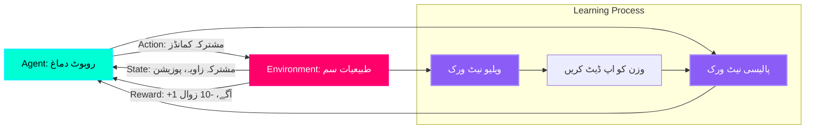

# ری انفورسمنٹ لرننگ: روبوٹ کیسے چلنا سیکھتے ہیں

## روایتی روبوٹکس مسئلہ

**پرانا طریقہ** (2000-2020): ہر حرکت کو دستی طور پر پروگرام کریں:

```python
def walk_forward():
    while True:
        move_left_leg(angle=30, duration=0.5)
        shift_weight_right()
        move_right_leg(angle=30, duration=0.5)
        shift_weight_left()
        # ریاستی مشینوں اور PID کنٹرولرز کی مزید 500 لائنیں...
```

**مسائل:**
*   ہاتھ سے ٹیون کرنے میں **مہینوں** لگتے ہیں۔
*   جب خطہ تبدیل ہوتا ہے تو ٹوٹ جاتا ہے (سیڑھیاں، ڈھلوان، بجری)
*   ماہر روبوٹسٹ علم کی ضرورت ہے

**جدید طریقہ (2020+):** روبوٹ کو نقلی انداز میں لاکھوں بار کوشش کر کے **سیکھنے** دیں۔

:::info حقیقی دنیا کی کامیابی
Boston Dynamics کے Atlas بیک فلپ کو **RL کے ذریعے سیکھا گیا** (ہاتھ سے کوڈ نہیں کیا گیا)۔ DeepMind کے DexHand نے **خالص RL** کا استعمال کرتے ہوئے ایک Rubik's Cube حل کیا جس کی تربیت 1,000 GPUs پر 100 سال کے مصنوعی تجربے کے لیے کی گئی تھی۔
:::

---

## ری انفورسمنٹ لرننگ کا لوپ



**اجزاء:**

1.  **ایجنٹ (روبوٹ دماغ)**: نیورل نیٹ ورک جو موجودہ حالت لیتا ہے اور ایکشنز آؤٹ پٹ کرتا ہے۔
    *   **ان پٹ**: 50 نمبر (مشترکہ زاویہ، رفتار، IMU واقفیت)
    *   **آؤٹ پٹ**: 12 نمبر (12 ٹانگوں کے جوڑوں کے لیے ٹارک کمانڈز)
    *   **فن تعمیر**: 3-پرت MLP (256-256-128 نیوران)

2.  **ماحول (فزکس سمیلیٹر)**: طبیعیات کو 1000 Hz پر چلاتا ہے۔
    *   **نقل کرتا ہے**: کشش ثقل، رگڑ، رابطے، مشترکہ حدود
    *   **واپسی**: کارروائی کے اطلاق کے بعد نئی ریاست

3.  **ریاست (State)**: روبوٹ کی حالت کی مکمل تفصیل
    ```python
    state = [
        base_position_x, base_position_y, base_position_z,  # 3D پوزیشن
        base_orientation_roll, base_orientation_pitch, base_orientation_yaw,  # واقفیت
        joint_angle_1, joint_angle_2, ..., joint_angle_12,  # 12 مشترکہ زاویے
        joint_velocity_1, ..., joint_velocity_12,  # 12 مشترکہ رفتار
        imu_acceleration_x, imu_acceleration_y, imu_acceleration_z,  # IMU
        previous_action_1, ..., previous_action_12  # آخری کارروائی کی یاد
    ]
    # کل: 50 اقدار
    ```

4.  **ایکشن (Action)**: روبوٹ کو بھیجے گئے کمانڈز
    ```python
    action = [
        hip_left_torque, knee_left_torque, ankle_left_torque,  # بائیں ٹانگ (3 جوڑ)
        hip_right_torque, knee_right_torque, ankle_right_torque,  # دائیں ٹانگ (3 جوڑ)
        # ... اگر قابل اطلاق ہو تو بازوؤں کے لیے دہرائیں۔
    ]
    # کل: 12 ٹارک کمانڈز (-100 Nm سے +100 Nm)
    ```

5.  **انعام (Reward)**: اسکیلر فیڈ بیک سگنل (واحد نمبر)
    *   **مثبت**: روبوٹ آگے بڑھا (+1 فی میٹر)
    *   **منفی**: روبوٹ نیچے گر گیا (-10)، توانائی ضائع ہوئی (-0.01 فی Nm²)

---

## چلنے کے لیے انعامی فنکشن کو ڈیزائن کرنا

**انعام کا فنکشن (reward function)** RL کا **سب سے اہم** حصہ ہے۔ یہ اس بات کی وضاحت کرتا ہے کہ "کامیابی" کا کیا مطلب ہے۔

### بنیادی واکنگ ریوارڈ

```python
def compute_reward(state, action, next_state):
    reward = 0.0
    
    # 1. آگے کی پیشرفت (بنیادی مقصد)
    velocity_forward = next_state['base_velocity_x']
    reward += velocity_forward * 1.0  # +1 فی میٹر/سیکنڈ
    
    # 2. گرنے کا جرمانہ
    base_height = next_state['base_position_z']
    if base_height < 0.3:  # روبوٹ 30cm سے نیچے گر گیا۔
        reward -= 10.0
        episode_done = True  # تخروپن کو دوبارہ ترتیب دیں۔
    
    # 3. توانائی کے ضیاع کا جرمانہ
    torque_squared = sum(action[i]**2 for i in range(12))
    reward -= 0.001 * torque_squared  # ہموار، موثر نقل و حرکت کی حوصلہ افزائی کریں۔
    
    # 4. تڑ کو سیدھا رکھیں
    torso_tilt = abs(next_state['base_orientation_pitch'])
    reward -= 0.5 * torso_tilt  # آگے/پیچھے جھکنے کا جرمانہ
    
    # 5. فٹ رابطہ بونس
    left_foot_contact = check_contact(next_state, 'left_foot')
    right_foot_contact = check_contact(next_state, 'right_foot')
    if left_foot_contact and right_foot_contact:
        reward -= 0.1  # دونوں پاؤں زمین پر = نہیں چل رہے ہیں۔
    
    return reward
```

**انعام کی خرابی:**
*   **رفتار**: 0.5 m/s پر چلنے کے لیے +0.5
*   **گرنا**: -10 (قسط ختم، برا!)
*   **توانائی**: 50 Nm ٹارک استعمال کرنے کے لیے -0.05 (کارکردگی کی حوصلہ افزائی کرتا ہے)
*   **سیدھا**: -0.1 اگر 0.2 ریڈین (≈11°) جھکا ہوا ہے۔
*   **کل فی قدم**: عام طور پر +0.4 سے +0.5 اگر اچھی طرح سے چل رہا ہے۔

:::warning انعام کی تشکیل مشکل ہے۔
برا انعام فنکشن = روبوٹ دھوکہ دینا سیکھتا ہے:
*   **مثال**: انعام "سیدھا رہو" → روبوٹ پیٹ پر آگے رینگنا سیکھتا ہے (ابھی تک سیدھا، لیکن چل نہیں رہا)
*   **درست کریں**: مشترکہ رفتار کے لیے جرمانہ شامل کریں (پیٹ میں رینگنے کے لیے تیز مشترکہ حرکت کی ضرورت ہوتی ہے)
:::

---

## Isaac Gym: 4,096 متوازی روبوٹ

**Isaac Gym** NVIDIA کا GPU-ایکبریٹڈ RL ماحول ہے:
*   **GPU پر فزکس**: CPU پر مبنی سمیلیٹروں سے 1,000× تیز (MuJoCo, PyBullet)
*   **متوازی ماحول**: 1 GPU پر بیک وقت 4,096 روبوٹس کو تربیت دیں۔
*   **سخت انضمام**: PyTorch نیورل نیٹ ورک اسی GPU پر چلتے ہیں (کوئی ڈیٹا کی منتقلی نہیں)

### تنصیب

```bash
# Isaac Gym ڈاؤن لوڈ کریں (NVIDIA GPU + CUDA 11.8+ درکار ہے)
# https://developer.nvidia.com/isaac-gym

# نکالیں اور انسٹال کریں۔
cd isaacgym/python
pip install -e .

# انسٹالیشن کی جانچ کریں۔
python examples/1080_balls_of_solitude.py
# 1,080 گیندوں کو حقیقی وقت میں اچھالتے ہوئے دکھانا چاہیے۔
```

---

## ہیومنائیڈ کو چلنے کی تربیت دینا

### مرحلہ 1: ٹاسک کی وضاحت کریں۔

**فائل: `humanoid_walk_task.py`**

```python
from isaacgym import gymapi, gymtorch
import torch

class HumanoidWalkTask:
    def __init__(self, cfg, sim_device='cuda:0'):
        # ... (ابتدائی کوڈ)
        
        # 4096 متوازی ماحول بنائیں
        self.num_envs = 4096
        
        # ... (ماحول کی تخلیق کا کوڈ)
        
    def get_observations(self):
        """تمام 4096 روبوٹس کے لیے واپسی کی حالت (4096 × 50 ٹینسر)"""
        return torch.cat([
            self.root_states[:, :13],  # بنیادی پوزیشن + واقفیت (quaternion)
            self.dof_states[:, :24],   # 12 مشترکہ زاویے + 12 رفتاریں۔
            self.previous_actions,     # 12 سابقہ ​​احکامات
        ], dim=1)
    
    def step(self, actions):
        """کارروائیوں کا اطلاق کریں اور طبیعیات کی نقالی کریں۔"""
        # اعمال کو محفوظ رینج میں کلپ کریں۔
        actions = torch.clamp(actions, -100, 100)  # ±100 Nm زیادہ سے زیادہ ٹارک
        
        # جوڑوں پر ٹارک لگائیں
        self.gym.set_dof_actuation_force_tensor(self.sim, gymtorch.unwrap_tensor(actions))
        
        # طبیعیات کی نقالی کریں۔
        self.gym.simulate(self.sim)
        self.gym.fetch_results(self.sim, True)
        
        # انعامات کا حساب لگائیں۔
        rewards = self.compute_reward(self.get_observations(), actions)
        
        # برطرفی کی جانچ کریں۔
        dones = (self.root_states[:, 2] < 0.3)  # 30cm سے نیچے گر گیا۔
        
        return self.get_observations(), rewards, dones
```

---

### مرحلہ 2: PPO کے ساتھ ٹرین کریں (پروکسیمل پالیسی آپٹیمائزیشن)

**PPO** روبوٹکس کے لیے سب سے مشہور RL الگورتھم ہے (OpenAI، DeepMind کے ذریعے استعمال کیا جاتا ہے)۔

```python
import torch
import torch.nn as nn
from torch.optim import Adam

class PolicyNetwork(nn.Module):
    """نیورل نیٹ ورک جو نقشہ بناتا ہے state → action"""
    def __init__(self, state_dim=50, action_dim=12):
        super().__init__()
        self.fc1 = nn.Linear(state_dim, 256)
        self.fc2 = nn.Linear(256, 256)
        self.fc3 = nn.Linear(256, 128)
        self.mean = nn.Linear(128, action_dim)
        self.log_std = nn.Parameter(torch.zeros(action_dim))  # شور سیکھا گیا۔
        
    def forward(self, state):
        x = torch.relu(self.fc1(state))
        x = torch.relu(self.fc2(x))
        x = torch.relu(self.fc3(x))
        mean = self.mean(x)
        std = torch.exp(self.log_std)
        return mean, std

# ٹریننگ لوپ
env = HumanoidWalkTask(cfg)
policy = PolicyNetwork().to('cuda')
optimizer = Adam(policy.parameters(), lr=3e-4)

num_iterations = 10000
for iteration in range(num_iterations):
    # 4096 تجربات جمع کریں۔
    states = env.get_observations()  # شکل: (4096, 50)
    mean, std = policy(states)
    actions = torch.normal(mean, std)  # Gaussian سے نمونہ
    
    next_states, rewards, dones = env.step(actions)
    
    # PPO نقصان کا حساب لگائیں (آسان)
    
    optimizer.zero_grad()
    loss.backward()
    optimizer.step()
    
    if iteration % 100 == 0:
        avg_reward = rewards.mean().item()
        print(f"Iteration {iteration}: Avg Reward = {avg_reward:.2f}")

# تربیت یافتہ ماڈل کو محفوظ کریں۔
torch.save(policy.state_dict(), 'humanoid_walk_policy.pth')
```

**تربیتی وقت:**
*   **Isaac Gym (RTX 4090)**: 10M اقدامات کے لیے 2-4 گھنٹے
*   **CPU سمیلیٹر (MuJoCo)**: انہی اقدامات کے لیے 200+ گھنٹے
*   **سپیڈ اپ**: 50-100×

---

## سم ٹو ریئل ٹرانسفر: ریئلٹی گیپ

**مسئلہ:** نقلی تربیت یافتہ پالیسی اکثر حقیقی ہارڈ ویئر پر ناکام ہو جاتی ہے کیونکہ:
1.  **فزکس کی مماثلت**: سمیلیٹر رگڑ ≠ اصلی رگڑ
2.  **تاخیر**: اصلی موٹرز میں 10-50ms تاخیر ہوتی ہے، نقلی فوری ہوتی ہے۔
3.  **سینسر شور**: اصلی IMU میں بڑھے ہوئے ہیں، نقلی کامل ہے۔

### حل: ڈومین بے ترتیبیت

**تربیت کے دوران، ہر چیز کو بے ترتیب کریں:**

```python
def randomize_physics():
    # ہر 1000 مراحل میں بے ترتیب کریں۔
    if env.step_count % 1000 == 0:
        # رگڑ: 0.5 سے 1.5 (حقیقی روبوٹ مختلف ہو سکتا ہے)
        env.set_friction(random.uniform(0.5, 1.5))
        
        # ماس: ±10% (حقیقی روبوٹ میں پیمائش کی غلطی ہے)
        true_mass = 50.0  # kg
        env.set_mass(random.uniform(0.9 * true_mass, 1.1 * true_mass))
        
        # موٹر طاقت: ±20% (موٹرز وقت کے ساتھ خراب ہو جاتی ہیں)
        env.set_motor_strength(random.uniform(0.8, 1.2))
        
        # IMU شور: Gaussian شور شامل کریں۔
        env.set_imu_noise(stddev=random.uniform(0.01, 0.05))
        
        # بیرونی قوتیں: ہوا، دھکیل
        if random.random() < 0.1:  # 10% موقع
            env.apply_external_force(random.uniform(-50, 50))  # 50N دھکا
```

**نتیجہ:** روبوٹ ان تمام تغیرات میں **مضبوطی سے** چلنا سیکھتا ہے، اس لیے یہ حقیقی دنیا میں کام کرتا ہے۔

---

## ہینڈ آن ورزش: ایک سادہ واکر کو تربیت دیں۔

**چیلنج:** آگے بڑھنے کے لیے 2 ٹانگوں والے واکر کو تربیت دیں۔

---

## کلیدی ٹیکا ویز (Key Takeaways)

✅ **RL روبوٹس کو آزمائش اور غلطی کے ذریعے سکھاتا ہے** (کوئی دستی پروگرامنگ نہیں)
✅ **انعام کا فنکشن** اہم ہے (غلط انعام = غلط رویہ)
✅ **Isaac Gym** 1 GPU پر متوازی طور پر 4,096 روبوٹس کو ٹرین کرتا ہے (50-100× سپیڈ اپ)
✅ **PPO الگورتھم** لوکوموشن/ہیرا پھیری کے لیے انڈسٹری کا معیار ہے۔
✅ **ڈومین رینڈمائزیشن** sim-to-real فرق کو ختم کرتا ہے (طبیعیات کے پیرامیٹرز مختلف ہوتے ہیں)
✅ **تربیتی وقت**: چلنے کے لیے 2-4 گھنٹے، ہیرا پھیری کے لیے 10-20 گھنٹے

---

## اگلا کیا ہے؟

آپ نے جسمانی AI کے تین ستونوں میں مہارت حاصل کی ہے:
1.  **ROS 2**: روبوٹ اعصابی نظام (مواصلات)
2.  **Simulation**: ڈیجیٹل ٹوئنز (Gazebo, Unity, Isaac Sim)
3.  **AI Brain**: سیکھنا اور نیویگیشن (VSLAM, RL)

آخری ماڈیول **ماڈیول 4: ویژن-لینگویج-ایکشن (VLA) ماڈلز** کا احاطہ کرتا ہے — روبوٹس کو قدرتی زبان کے کمانڈز جیسے کہ "سرخ پیالا اٹھاو اور اسے سنک میں رکھو" کو سمجھنے کی صلاحیت دینا۔

---

## مزید پڑھنا

*   [Isaac Gym Paper](https://arxiv.org/abs/2108.10470)
*   [PPO Algorithm (OpenAI)](https://arxiv.org/abs/1707.06347)
*   [Domain Randomization (OpenAI)](https://arxiv.org/abs/1703.06907)
*   [Learning Dexterous In-Hand Manipulation](https://arxiv.org/abs/1808.00177) (OpenAI's Rubik's Cube)
*   [Reinforcement Learning: An Introduction (Sutton & Barto)](http://incompleteideas.net/book/the-book.html)
