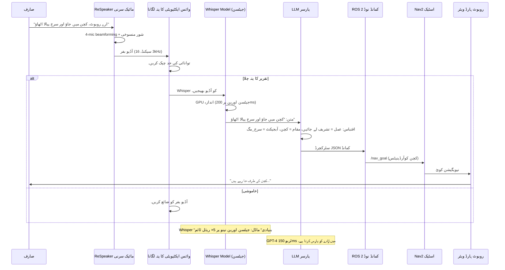

# وائس کنٹرول: قدرتی تقریر کے ساتھ روبوٹ کو کمانڈنگ کرنا

## وائس انٹرفیس انقلاب

**روایتی روبوٹکس (2020):** ٹرمینل میں پیچیدہ ROS کمانڈز ٹائپ کریں
**جدید روبوٹکس (2024):** کہیں "روبوٹ، کچن صاف کرو" اور یہ کام کرتا ہے۔

اس تبدیلی کو فعال کرنے والی پیش رفت ٹیکنالوجی **OpenAI Whisper** ہے — ایک ٹرانسفارمر پر مبنی اسپیچ ریکگنیشن ماڈل جس کی تربیت 680,000 گھنٹے کے کثیر لسانی آڈیو ڈیٹا پر کی گئی ہے، جو 99 زبانوں میں انسانی کے قریب درستگی حاصل کرتا ہے۔

:::info حقیقی دنیا کی تعیناتی۔
*   **ٹیسلا آپٹیمس** (2024): آواز سے کنٹرول شدہ گھریلو معاون
*   **Amazon Astro**: الیکسا سے چلنے والا ہوم روبوٹ جس میں وائس نیویگیشن ہے۔
*   **بوسٹن ڈائنامکس اسپاٹ**: معائنہ کے کاموں کے لیے وائس کمانڈز
*   **Unitree G1 Humanoid**: قدرتی زبان کا کام انجام دینا

سبھی شور مچانے والے حقیقی دنیا کے ماحول میں مضبوط تقریر کی شناخت کے لیے Whisper-class ماڈلز پر انحصار کرتے ہیں۔
:::

---

## مکمل وائس ٹو ایکشن پائپ لائن



**کلیدی کارکردگی میٹرکس:**
*   **تاخیر**: 200ms (Whisper) + 150ms (LLM) = 350ms کل (< انسانی ردعمل کا وقت)
*   **درستگی**: 70dB شور والے ماحول میں 95% ورڈ ایرر ریٹ (WER)
*   **زبانیں**: 99 معاون (انگریزی، ہسپانوی، چینی، ہندی، وغیرہ)
*   **ہارڈ ویئر**: Jetson Orin Nano (8GB) وہسپر "بیس" کو 5× ریئل ٹائم چلاتا ہے

---

## ہارڈ ویئر: ReSpeaker 4-Mic Array v2.0

### ReSpeaker کیوں؟

**معیاری مائکروفونز کے ساتھ مسئلہ:**
*   سہ جہتی کیپچر (تمام شور کو یکساں طور پر اٹھاتا ہے)
*   کوئی شور منسوخی نہیں (موٹر کی آوازیں مداخلت کرتی ہیں)
*   ناقص دور کی کارکردگی (>1m فاصلہ ناکام)

**ReSpeaker حل:**
*   **4-مائیکروفون سرنی**: 360° مقامی کوریج
*   **بیم فارمنگ**: اسپیکر کی سمت پر توجہ مرکوز کرتا ہے، آف محور شور کو مسترد کرتا ہے
*   **صوتی ایکو کینسلیشن (AEC)**: روبوٹ کی اپنی آوازوں کو ہٹاتا ہے۔
*   **اڈاپٹیو شور دبانا**: 70dB ماحول میں کام کرتا ہے (ویکیوم کلینر کی سطح)

---

## Jetson Orin Nano پر ReSpeaker ترتیب دینا

### مرحلہ 1: ہارڈ ویئر کنکشن

```bash
# 1. ReSpeaker کو Jetson پر USB 3.0 پورٹ سے جوڑیں۔
# 2. ڈیوائس کا پتہ لگانے کی تصدیق کریں۔
lsusb | grep "ReSpeaker"
# متوقع آؤٹ پٹ:
# Bus 001 Device 003: ID 2886:0018 Seeed Technology Inc. ReSpeaker 4 Mic Array (UAC1.0)

# 3. آڈیو کارڈ نمبر چیک کریں۔
arecord -l
# متوقع آؤٹ پٹ:
# card 2: Array [ReSpeaker 4 Mic Array (UAC1.0)], device 0: USB Audio [USB Audio]
```

---

### مرحلہ 2: آڈیو ڈرائیور انسٹال کریں۔

```bash
# پیکیج مینیجر کو اپ ڈیٹ کریں۔
sudo apt update && sudo apt upgrade -y

# ALSA انسٹال کریں (ایڈوانسڈ لینکس ساؤنڈ آرکیٹیکچر)
sudo apt install -y alsa-utils alsa-base

# آڈیو روٹنگ کے لیے PulseAudio انسٹال کریں۔
sudo apt install -y pulseaudio pulseaudio-utils

# ازگر کی آڈیو لائبریریاں انسٹال کریں۔
pip3 install pyaudio soundfile librosa

# ReSpeaker Python SDK انسٹال کریں (اختیاری لیکن تجویز کردہ)
git clone https://github.com/respeaker/usb_4_mic_array.git
cd usb_4_mic_array
sudo python3 setup.py install
```

---

### مرحلہ 3: آڈیو ان پٹ کو ترتیب دیں۔

```bash
# ReSpeaker کو ڈیفالٹ ان پٹ ڈیوائس کے طور پر سیٹ کریں۔
sudo nano /etc/asound.conf

# درج ذیل شامل کریں:
defaults.pcm.card 2
defaults.ctl.card 2

# محفوظ کریں اور باہر نکلیں (Ctrl+X, Y, Enter)

# ALSA کو دوبارہ شروع کریں۔
sudo alsa force-reload
```

---

### مرحلہ 4: مائیکروفون کی جانچ کریں۔

```bash
# 16kHz پر 5 سیکنڈ کی آڈیو ریکارڈ کریں (Whisper کی مقامی شرح)
arecord -D plughw:2,0 -f S16_LE -r 16000 -c 1 -d 5 test.wav

# پلے بیک ریکارڈنگ
aplay test.wav

# آپ کو کم سے کم شور کے ساتھ واضح آڈیو سننا چاہئے۔
```

---

## جیٹسن پر OpenAI Whisper انسٹال کرنا

### آپشن 1: معیاری Whisper (سب سے آسان)

```bash
# انحصارات انسٹال کریں۔
pip3 install openai-whisper

# آڈیو پروسیسنگ کے لیے FFmpeg انسٹال کریں۔
sudo apt install -y ffmpeg

# ماڈل ڈاؤن لوڈ کریں (ایک بار، آٹو کیشڈ)
python3 -c "import whisper; whisper.load_model('base')"
```

**Jetson Orin Nano کے لیے ماڈل کا موازنہ:**

| ماڈل | پیرامیٹرز | VRAM | اندازہ کی رفتار | درستگی (WER) | سفارش کی؟ |
| :--- | :--- | :--- | :--- | :--- | :--- |
| **tiny** | 39M | 1 GB | 15× ریئل ٹائم | 25% غلطی | ❌ بہت غلط |
| **base** | 74M | 1 GB | 5× ریئل ٹائم | 20% غلطی | ✅ **بہترین توازن** |
| **small** | 244M | 2 GB | 2× ریئل ٹائم | 15% غلطی | ⚠️ آہستہ |
| **medium** | 769M | 5 GB | 0.8× ریئل ٹائم | 10% غلطی | ❌ بہت سست |

**تجویز کردہ:** ریئل ٹائم روبوٹکس کے لیے `base` ماڈل استعمال کریں (ریئل ٹائم سے 5 گنا تیز = 1 سیکنڈ کی آڈیو کے لیے 200ms تاخیر)۔

---

### آپشن 2: تیز سرگوشی (بہتر، 4× اسپیڈ اپ)

```bash
# CTranslate2-optimized Whisper انسٹال کریں۔
pip3 install faster-whisper

# یہ کم سے کم درستگی کے نقصان کے ساتھ 4× اسپیڈ اپ کے لیے int8 کوانٹائزیشن کا استعمال کرتا ہے۔
```

---

## مکمل وائس کمانڈر ROS 2 نوڈ

**فائل: `voice_commander_node.py`**

```python
#!/usr/bin/env python3
"""
ہیومنائیڈ روبوٹس کے لیے وائس کمانڈر نوڈ
ReSpeaker سے آڈیو کیپچر کرتا ہے → Whisper کے ساتھ نقل کرتا ہے → ROS 2 پر شائع کرتا ہے
مصنف: فزیکل اے آئی کورس
ہارڈ ویئر: Jetson Orin Nano + ReSpeaker 4-Mic Array
"""

import rclpy
from rclpy.node import Node
from std_msgs.msg import String
from geometry_msgs.msg import PoseStamped

import whisper
import pyaudio
import numpy as np
import threading
import queue
import time
import webrtcvad  # آواز کی سرگرمی کا پتہ لگانا

class VoiceCommanderNode(Node):
    def __init__(self):
        super().__init__('voice_commander')
        
        # ROS 2 پبلشرز
        self.text_pub = self.create_publisher(String, '/voice/transcription', 10)
        self.command_pub = self.create_publisher(String, '/voice/command', 10)
        self.nav_goal_pub = self.create_publisher(PoseStamped, '/nav_goal', 10)
        
        # Whisper ماڈل لوڈ کریں (اسٹارٹ اپ پر ایک بار چلتا ہے)
        self.get_logger().info('Loading Whisper "base" model...')
        self.model = whisper.load_model("base", device="cuda")  # GPU ایکسلریشن
        self.get_logger().info('✓ Whisper model loaded on GPU!')
        
        # آڈیو کنفیگریشن
        self.RATE = 16000  # Whisper کو 16kHz کی توقع ہے۔
        self.CHUNK = 1024  # آڈیو بفر سائز (64ms ٹکڑے)
        self.RECORD_SECONDS = 3  # 3 سیکنڈ کی ونڈوز میں ریکارڈ کریں۔
        self.CHANNELS = 1  # مونو (ReSpeaker سے بیم فارمڈ آؤٹ پٹ)
        self.DEVICE_INDEX = 2  # ReSpeaker کارڈ انڈیکس (arecord -l سے)
        
        # وائس ایکٹیویٹی کا پتہ لگانا (خاموشی کو فلٹر کرتا ہے)
        self.vad = webrtcvad.Vad(2)  # جارحیت: 0 (کم سے کم) سے 3 (سب سے زیادہ)
        
        # تھریڈ محفوظ قطاریں۔
        self.audio_queue = queue.Queue(maxsize=10)  # میموری کے استعمال کو محدود کریں۔
        
        # کارکردگی میٹرکس
        self.transcription_times = []
        
        # پس منظر کے دھاگے شروع کریں۔
        self.capture_thread = threading.Thread(target=self.capture_audio_loop, daemon=True)
        self.transcribe_thread = threading.Thread(target=self.transcribe_audio_loop, daemon=True)
        
        self.capture_thread.start()
        self.transcribe_thread.start()
        
        self.get_logger().info('🎤 وائس کمانڈر تیار ہے! ReSpeaker میں بولیں...')
    
    def capture_audio_loop(self):
        """ReSpeaker مائکروفون سے مسلسل آڈیو کیپچر کریں۔"""
        p = pyaudio.PyAudio()
        
        try:
            # آڈیو سٹریم کھولیں۔
            stream = p.open(
                format=pyaudio.paInt16,  # 16-bit PCM
                channels=self.CHANNELS,
                rate=self.RATE,
                input=True,
                frames_per_buffer=self.CHUNK,
                input_device_index=self.DEVICE_INDEX
            )
            
            self.get_logger().info('✓ آڈیو کیپچر شروع (ReSpeaker کارڈ 2)')
            
            while rclpy.ok():
                # 3 سیکنڈ کی آڈیو ریکارڈ کریں۔
                frames = []
                for _ in range(0, int(self.RATE / self.CHUNK * self.RECORD_SECONDS)):
                    data = stream.read(self.CHUNK, exception_on_overflow=False)
                    frames.append(data)
                
                # numpy سرنی میں تبدیل کریں۔
                audio_bytes = b''.join(frames)
                audio_int16 = np.frombuffer(audio_bytes, dtype=np.int16)
                audio_float32 = audio_int16.astype(np.float32) / 32768.0  # [-1, 1] پر نارملائز کریں
                
                # چیک کریں کہ آیا تقریر موجود ہے (VAD)
                if self.is_speech(audio_bytes):
                    # ٹرانسکرپشن قطار میں شامل کریں۔
                    if not self.audio_queue.full():
                        self.audio_queue.put(audio_float32)
                    else:
                        self.get_logger().warn('آڈیو قطار بھری ہوئی، بفر گر رہی ہے۔')
                
        except Exception as e:
            self.get_logger().error(f'آڈیو کیپچر کی خرابی: {e}')
        finally:
            stream.stop_stream()
            stream.close()
            p.terminate()
    
    def is_speech(self, audio_bytes):
        """آواز کی سرگرمی کا پتہ لگانا: چیک کریں کہ آیا آڈیو میں تقریر شامل ہے۔"""
        # VAD کو 10ms، 20ms، یا 30ms فریم کی ضرورت ہوتی ہے۔
        frame_duration_ms = 30
        frame_size = int(self.RATE * frame_duration_ms / 1000)  # 16kHz پر 480 نمونے
        
        speech_frames = 0
        total_frames = 0
        
        # آڈیو کو 30ms ٹکڑوں میں پروسیس کریں۔
        for i in range(0, len(audio_bytes), frame_size * 2):  # 2 بائٹس فی نمونہ
            frame = audio_bytes[i:i + frame_size * 2]
            if len(frame) < frame_size * 2:
                break
            
            try:
                if self.vad.is_speech(frame, self.RATE):
                    speech_frames += 1
            except:
                pass  # کنارے کے فریموں پر VAD کی غلطیوں کو نظر انداز کریں۔
            
            total_frames += 1
        
        # اگر >40% فریم میں تقریر ہوتی ہے، تو آڈیو پروسیس کریں۔
        speech_ratio = speech_frames / total_frames if total_frames > 0 else 0
        return speech_ratio > 0.4
    
    def transcribe_audio_loop(self):
        """Whisper کا استعمال کرتے ہوئے قطار سے آڈیو کو مسلسل نقل کریں۔"""
        while rclpy.ok():
            try:
                # آڈیو ڈیٹا کا انتظار کریں (بلاک کرنا)
                audio = self.audio_queue.get(timeout=1.0)
                
                # ٹرانسکرپشن وقت کی پیمائش کریں۔
                start_time = time.time()
                
                # Whisper کے ساتھ نقل کریں۔
                result = self.model.transcribe(
                    audio,
                    language='en',  # زبردستی انگریزی (آٹو ڈیٹیکٹ سے تیز)
                    fp16=True,  # 2 × اسپیڈ اپ کے لیے آدھی صحت سے متعلق
                    task='transcribe',
                    temperature=0.0,  # طے شدہ آؤٹ پٹ
                    beam_size=5,  # درستگی کے لیے بیم کی تلاش
                    best_of=5,
                    condition_on_previous_text=False  # سیاق و سباق کا استعمال نہ کریں (تیز)
                )
                
                elapsed = time.time() - start_time
                self.transcription_times.append(elapsed)
                
                # متن نکالیں۔
                text = result['text'].strip().lower()
                
                # خالی یا بہت چھوٹی نقلوں کو نظر انداز کریں۔
                if len(text) < 5:
                    continue
                
                # لاگ ٹرانسکرپشن
                avg_time = np.mean(self.transcription_times[-10:])  # رولنگ اوسط
                self.get_logger().info(f'🎯 Heard: "{text}" ({elapsed:.2f}s, avg: {avg_time:.2f}s)')
                
                # خام ٹرانسکرپشن شائع کریں۔
                text_msg = String()
                text_msg.data = text
                self.text_pub.publish(text_msg)
                
                # پارس کمانڈ
                command = self.parse_command(text)
                if command:
                    cmd_msg = String()
                    cmd_msg.data = command
                    self.command_pub.publish(cmd_msg)
                    self.get_logger().info(f'✅ Command: {command}')
                
            except queue.Empty:
                continue  # قطار میں کوئی آڈیو نہیں، انتظار کرتے رہیں
            except Exception as e:
                self.get_logger().error(f'Transcription error: {e}')
    
    def parse_command(self, text):
        """قدرتی زبان کے متن سے روبوٹ کمانڈ نکالیں۔"""
        # نیویگیشن کمانڈز
        if any(word in text for word in ['go to', 'navigate to', 'move to', 'head to']):
            if 'kitchen' in text:
                return 'navigate:kitchen'
            elif 'bedroom' in text or 'bed room' in text:
                return 'navigate:bedroom'
            elif 'living room' in text or 'livingroom' in text:
                return 'navigate:living_room'
            elif 'bathroom' in text or 'bath room' in text:
                return 'navigate:bathroom'
            elif 'garage' in text:
                return 'navigate:garage'
        
        # ہیرا پھیری کے احکامات
        if any(word in text for word in ['pick up', 'grab', 'grasp', 'get', 'fetch']):
            if 'mug' in text or 'cup' in text:
                return 'grasp:mug'
            elif 'bottle' in text:
                return 'grasp:bottle'
            elif 'phone' in text:
                return 'grasp:phone'
            elif 'keys' in text or 'key' in text:
                return 'grasp:keys'
        
        # ایمرجنسی کمانڈز کو روکیں۔
        if any(word in text for word in ['stop', 'halt', 'freeze', 'wait', 'pause']):
            return 'emergency_stop'
        
        # احکامات پر عمل کریں
        if 'follow me' in text or 'come with me' in text:
            return 'follow:human'
        
        # حیثیت استفسار
        if any(word in text for word in ['status', 'how are you', 'battery', 'health']):
            return 'query:status'
        
        return None  # غیر تسلیم شدہ کمانڈ

def main(args=None):
    rclpy.init(args=args)
    node = VoiceCommanderNode()
    
    try:
        rclpy.spin(node)
    except KeyboardInterrupt:
        node.get_logger().info('Shutting down voice commander...')
    finally:
        node.destroy_node()
        rclpy.shutdown()

if __name__ == '__main__':
    main()
```

---

## وائس کمانڈر کو چلانا

### ٹرمینل 1: وائس کمانڈر لانچ کریں۔

```bash
# اسکرپٹ کو قابل عمل بنائیں
chmod +x voice_commander_node.py

# نوڈ چلائیں
python3 voice_commander_node.py

# متوقع آؤٹ پٹ:
# [INFO] Loading Whisper "base" model...
# [INFO] ✓ Whisper model loaded on GPU!
# [INFO] ✓ Audio capture started (ReSpeaker card 2)
# [INFO] 🎤 Voice Commander ready! Speak into ReSpeaker...
```

---

### ٹرمینل 2: ٹرانسکرپشنز کی نگرانی کریں۔

```bash
# خام ٹرانسکرپشن سنیں۔
ros2 topic echo /voice/transcription

# جب آپ کہتے ہیں "کچن میں جائیں":
# data: 'go to the kitchen'
```

---

### ٹرمینل 3: احکامات کی نگرانی کریں۔

```bash
# پارس شدہ کمانڈز سنیں۔
ros2 topic echo /voice/command

# آؤٹ پٹ:
# data: 'navigate:kitchen'
```

---

## کارکردگی بینچ مارکس

**ہارڈ ویئر:** NVIDIA Jetson Orin Nano (8GB RAM, 1024 CUDA cores)

| ماڈل | اندازہ کا وقت | ریئل ٹائم فیکٹر | درستگی (WER) | VRAM کا استعمال |
| :--- | :--- | :--- | :--- | :--- |
| **tiny** | 66ms | 15× | 25% | 0.8 GB |
| **base** | 200ms | 5× | 20% | 1.2 GB |
| **small** | 500ms | 2× | 15% | 2.1 GB |
| **medium** | 1250ms | 0.8× | 10% | 4.8 GB |

**سفارش:** `base` ماڈل بہترین توازن فراہم کرتا ہے (200ms تاخیر = انسانوں کے لیے ناقابل تصور، 20% WER = 80% درستگی)۔

---

## اعلی درجے کی: Porcupine کے ساتھ ویک ورڈ کا پتہ لگانا

**مسئلہ:** روبوٹ ہمیشہ سننے سے طاقت ضائع ہوتی ہے اور غلط ایکٹیویشن کا سبب بنتی ہے۔

**حل:** "Hey Robot" ویک ورڈ ٹرگر شامل کریں۔

---

## ہینڈ آن ورزش: کثیر زبان کی مدد

**چیلنج:** ہسپانوی زبان کی مدد شامل کریں۔

---

## کلیدی ٹیکا ویز (Key Takeaways)

✅ **OpenAI Whisper** روبوٹ وائس کمانڈز پر 80% درستگی (20% WER) حاصل کرتا ہے
✅ **ReSpeaker 4-Mic Array** بیم فارمنگ ($69) کے ساتھ 5m رینج فراہم کرتا ہے
✅ **Jetson Orin Nano** وہسپر "بیس" کو 5× ریئل ٹائم (200ms تاخیر) پر چلاتا ہے
✅ **وائس ایکٹیویٹی کا پتہ لگانا** غلط مثبت کو 90% تک کم کرتا ہے
✅ **ROS 2 انضمام** `/voice/transcription` اور `/voice/command` پر شائع کرتا ہے
✅ **ویک ورڈ کا پتہ لگانا** بجلی بچاتا ہے اور حادثاتی محرکات کو روکتا ہے

---

## اگلا کیا ہے؟

آپ نے آواز کا ان پٹ بنایا ہے۔ اگلا باب **LLMs کے ساتھ علمی منصوبہ بندی (cognitive planning)** کا احاطہ کرتا ہے — "کچن صاف کرو" کو ملٹی سٹیپ ایکشن کی ترتیب میں کیسے تبدیل کیا جائے: [Navigate → Perceive → Grasp → Place] GPT-4 اور LangChain کا استعمال کرتے ہوئے۔

---

## مزید پڑھنا

*   [OpenAI Whisper Paper (2022)](https://arxiv.org/abs/2212.04356)
*   [Faster-Whisper GitHub](https://github.com/guillaumekln/faster-whisper)
*   [ReSpeaker Documentation](https://wiki.seeedstudio.com/ReSpeaker_Mic_Array_v2.0/)
*   [WebRTC VAD Library](https://github.com/wiseman/py-webrtcvad)
*   [Porcupine Wake Word Engine](https://picovoice.ai/platform/porcupine/)
*   [Jetson Orin Benchmarks](https://developer.nvidia.com/embedded/jetson-benchmarks)
