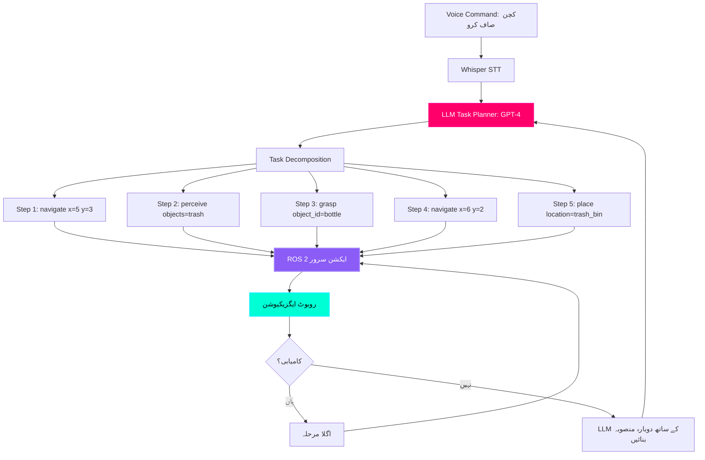

# علمی دماغ: LLMs کے ساتھ ٹاسک کی منصوبہ بندی

## آواز سے ایکشن پلان تک

**چیلنج:** "کچن صاف کرو" جیسی صوتی کمانڈ خلاصہ (abstract) ہے۔ روبوٹ کو اقدامات کی صحیح ترتیب کا کیسے پتہ چلتا ہے؟

**انسانی تشریح:**
1.  کچن کی طرف جائیں۔
2.  کچرے/ بے ترتیبی کو تلاش کریں۔
3.  صاف کرنے کے لیے اشیاء کی شناخت کریں۔
4.  ہر چیز کو اٹھاو.
5.  کچڑے/ری سائیکلنگ/مناسب جگہ پر رکھیں۔
6.  سطحوں کا صفایا کریں۔
7.  اسٹینڈ بائی پر واپس جائیں۔

**روبوٹ کی ضرورت:** واضح، قابل عمل frimitives جیسے `navigate(x, y)`, `grasp(object_id)`, `place(location)`

**حل:** **LLM (Large Language Model)** کو علمی منصوبہ ساز کے طور پر استعمال کریں جو اعلی درجے کی کمانڈز کو نچلی سطح کی ایکشن سیکوینس میں تبدیل کرتا ہے۔

:::info حقیقی دنیا کے نفاذ (Real-World Implementations)
*   **Google SayCan** (2022): موبائل مینیپولیٹرز کے لیے گھریلو کاموں کی منصوبہ بندی کرنے کے لیے PaLM LLM کا استعمال کرتا ہے۔
*   **Microsoft ChatGPT + Robot** (2023): GPT-4 روبوٹ کنٹرول کے لیے ازگر کا کوڈ تیار کرتا ہے۔
*   **Tesla Optimus Brain** (2024): ہیومنائیڈ ٹاسک گلنے (decomposition) کے لیے کسٹم LLM۔
*   **Physical Intelligence π0** (2024): LLM منصوبہ ساز کے ساتھ اوپن سورس VLA ماڈل۔
:::

---

## LLM منصوبہ بندی کا فن تعمیر



**کلیدی اجزاء:**

1.  **LLM منصوبہ ساز** (GPT-4, Llama 3.1): خلاصہ ہدف → ٹھوس اقدامات میں تبدیل کرتا ہے۔
2.  **ہنر کی لائبریری (Skill Library)**: پہلے سے طے شدہ روبوٹ پرائمیٹو (نیویگیٹ، گرفت، جگہ، تلاش)
3.  **ریاستی مانیٹر**: عملدرآمد کی پیشرفت اور ناکامیوں کو ٹریک کرتا ہے۔
4.  **دوبارہ منصوبہ بندی کا لوپ**: اگر کارروائی ناکام ہو جاتی ہے، تو LLM سے متبادل منصوبہ بندی کے لیے کہیں۔

---

## لیٹنسی ٹریپ: کلاؤڈ بمقابلہ ایج

### مسئلہ: نیٹ ورک کی تاخیر ریئل ٹائم روبوٹکس کو ختم کر دیتی ہے۔

**کلاؤڈ پر مبنی LLM (API کے ذریعے GPT-4):**
```
User command → 50ms network → 200ms GPT-4 inference → 50ms network → Robot
کل: 300ms (منصوبہ بندی کے لیے قابل قبول، نچلی سطح کے کنٹرول کے لیے نہیں)
```

**کنارے پر مبنی LLM (Llama 3.1 8B جیٹسن پر):**
```
User command → 0ms network → 500ms local inference → Robot
کل: 500ms (منصوبہ بندی کے لیے قابل قبول)
```

**لیکن:** نچلی سطح کا کنٹرول ڈیوائس پر 100-1000 Hz (1-10ms تاخیر) پر چلنا چاہیے۔

:::warning اہم ڈیزائن کا اصول
**منصوبہ بندی کے لیے کلاؤڈ/ایج** (1-10 Hz): ٹاسک گلنا، دوبارہ منصوبہ بندی کرنا
**کنٹرول کے لیے صرف ایج** (100-1000 Hz): مشترکہ PID کنٹرول، توازن، تصادم سے بچنا

**نیٹ ورک پر کبھی بھی نچلی سطح کے کنٹرول کمانڈز نہ بھیجیں!** 100ms نیٹ ورک اسپائک کا مطلب ہے روبوٹ گر جاتا ہے۔
:::

---

## جیٹسن اورین پر LLM ترتیب دینا

### آپشن 1: کلاؤڈ API (GPT-4 ٹربو) - آسان لیکن انٹرنیٹ کی ضرورت ہے

```bash
# OpenAI Python SDK انسٹال کریں۔
pip3 install openai

# API کلید سیٹ کریں۔
export OPENAI_API_KEY="sk-your-key-here"
```

**فوائد:**
*   ✅ سب سے زیادہ درستگی (GPT-4 ٹربو = 90%+ ٹاسک کامیابی)
*   ✅ مقامی کمپیوٹ کی ضرورت نہیں ہے۔
*   ✅ ہمیشہ تازہ ترین ماڈل میں اپ ڈیٹ کیا جاتا ہے۔

**نقصانات:**
*   ❌ انٹرنیٹ کی ضرورت ہے (آف لائن ماحول میں ناکام)
*   ❌ 200-500ms تاخیر
*   ❌ $0.01 فی 1K ٹوکن (~$0.001 فی کمانڈ)

---

### آپشن 2: لوکل LLM (Llama 3.1 8B) - ایج انففرنس

```bash
# بہتر انداز کے لیے llama.cpp انسٹال کریں۔
git clone https://github.com/ggerganov/llama.cpp
cd llama.cpp
make

# Llama 3.1 8B ماڈل ڈاؤن لوڈ کریں (Jetson کے لیے 4-bit کا کوانٹائزڈ)
wget https://huggingface.co/TheBloke/Llama-3.1-8B-GGUF/resolve/main/llama-3.1-8b.Q4_K_M.gguf

# ٹیسٹ کا اندازہ
./main -m llama-3.1-8b.Q4_K_M.gguf -p "You are a robot. Plan how to clean a kitchen." -n 256
```

**فوائد:**
*   ✅ مکمل طور پر آف لائن (انٹرنیٹ کی ضرورت نہیں)
*   ✅ صفر API کے اخراجات
*   ✅ ڈیٹا کی رازداری (آلہ پر تمام پروسیسنگ)

**نقصانات:**
*   ❌ GPT-4 سے کم درستگی (80% بمقابلہ 90% ٹاسک کامیابی)
*   ❌ 8GB VRAM کی ضرورت ہے (جیٹسن اورین نینو کم از کم)
*   ❌ 500-1000ms اندازہ تاخیر

**Jetson Orin Nano پر کارکردگی:**

| ماڈل | پیرامیٹرز | کوانٹائزیشن | VRAM | اندازہ کا وقت | درستگی |
| :--- | :--- | :--- | :--- | :--- | :--- |
| **Llama 3.1 8B** | 8B | Q4_K_M | 5 GB | 500ms | 80% |
| **Phi-3 Mini** | 3.8B | Q4_K_M | 3 GB | 250ms | 75% |
| **GPT-4 Turbo** (Cloud) | 1.76T | - | 0 GB | 200ms + network | 90% |

**تجویز کردہ:** آف لائن روبوٹکس کے لیے Llama 3.1 8B، تحقیق/ڈیمو کے لیے GPT-4۔

---

## مکمل LLM ٹاسک پلانر نوڈ

**فائل: `llm_task_planner.py`**

```python
#!/usr/bin/env python3
"""
LLM ٹاسک پلانر نوڈ
قدرتی زبان کے احکامات کو قابل عمل روبوٹ ایکشن کی ترتیب میں تبدیل کرتا ہے۔
مصنف: فزیکل اے آئی کورس
ہارڈ ویئر: Jetson Orin Nano + GPT-4 API یا Local Llama 3.1
"""

import rclpy
from rclpy.node import Node
from std_msgs.msg import String
from robot_interfaces.msg import TaskPlan, RobotAction  # حسب ضرورت پیغامات

import openai
import json
import time

class LLMTaskPlanner(Node):
    def __init__(self):
        super().__init__('llm_task_planner')
        
        # سبسکرائبرز
        self.voice_sub = self.create_subscription(
            String,
            '/voice/command',
            self.voice_command_callback,
            10
        )
        
        # پبلشرز
        self.plan_pub = self.create_publisher(TaskPlan, '/task_plan', 10)
        self.status_pub = self.create_publisher(String, '/planner/status', 10)
        
        # OpenAI API کنفیگریشن
        openai.api_key = "sk-your-key-here"  # اپنی کلید سے بدلیں۔
        
        # روبوٹ اسکل لائبریری (موجودہ frimitives)
        self.skill_library = {
            "navigate": {
                "description": "روبوٹ کو کسی جگہ منتقل کریں۔",
                "parameters": ["x: float", "y: float", "theta: float"],
                "example": "navigate(x=5.0, y=3.0, theta=0.0)"
            },
            "perceive": {
                "description": "کیمرے کا استعمال کرتے ہوئے ماحول میں اشیاء کا پتہ لگائیں۔",
                "parameters": ["object_class: str"],
                "example": "perceive(object_class='mug')"
            },
            "grasp": {
                "description": "کوئی چیز اٹھاؤ",
                "parameters": ["object_id: int"],
                "example": "grasp(object_id=42)"
            },
            "place": {
                "description": "رکھی ہوئی چیز کو جگہ پر نیچے رکھیں",
                "parameters": ["location: str"],
                "example": "place(location='table')"
            },
            "search": {
                "description": "کسی چیز یا مقام کے لیے ارد گرد دیکھو",
                "parameters": ["target: str"],
                "example": "search(target='trash_bin')"
            }
        }
        
        # ماحول کا علم (نقشے میں مقامات)
        self.locations = {
            "kitchen": {"x": 5.0, "y": 3.0, "theta": 0.0},
            "bedroom": {"x": 2.0, "y": 7.0, "theta": 1.57},
            "living_room": {"x": 8.0, "y": 5.0, "theta": 3.14},
            "trash_bin": {"x": 6.0, "y": 2.0, "theta": 0.0}
        }
        
        self.get_logger().info('🧠 LLM Task Planner ready!')
    
    def voice_command_callback(self, msg):
        """وائس کمانڈ حاصل کریں اور ٹاسک پلان تیار کریں۔"""
        command = msg.data
        self.get_logger().info(f'Received command: "{command}"')
        
        # اسٹیٹس کو اپ ڈیٹ کریں۔
        status_msg = String()
        status_msg.data = f'Planning: {command}'
        self.status_pub.publish(status_msg)
        
        # LLM کے ساتھ منصوبہ بنائیں
        plan = self.generate_plan(command)
        
        if plan:
            self.get_logger().info(f'Generated plan with {len(plan)} steps')
            
            # ٹاسک پلان شائع کریں۔
            plan_msg = TaskPlan()
            plan_msg.command = command
            plan_msg.steps = plan
            self.plan_pub.publish(plan_msg)
            
            # اسٹیٹس کو اپ ڈیٹ کریں۔
            status_msg.data = 'Plan ready'
            self.status_pub.publish(status_msg)
        else:
            self.get_logger().error('منصوبہ تیار کرنے میں ناکام')
            status_msg.data = 'Planning failed'
            self.status_pub.publish(status_msg)
    
    def generate_plan(self, command):
        """کمانڈ کو ایکشن سیکوینس میں تبدیل کرنے کے لیے GPT-4 کا استعمال کریں۔"""
        
        # روبوٹ کی صلاحیتوں کے ساتھ پرامپٹ بنائیں
        system_prompt = f"""You are a robot task planner. Convert high-level commands into sequences of robot actions.

Available skills:
{json.dumps(self.skill_library, indent=2)}

Known locations:
{json.dumps(self.locations, indent=2)}

Output format (JSON array):
[
  {{"action": "navigate", "parameters": {{"x": 5.0, "y": 3.0, "theta": 0.0}}}},
  {{"action": "perceive", "parameters": {{"object_class": "mug"}}}},
  ...
]

Rules:
1. Always navigate before attempting manipulation
2. Perceive before grasping (need object_id from perception)
3. Use known locations when available
4. If location unknown, add search step first
5. Keep plans simple (3-7 steps max)
"""
        
        user_prompt = f"Command: {command}\n\nGenerate action sequence:"
        
        try:
            # GPT-4 API کو کال کریں۔
            start_time = time.time()
            
            response = openai.ChatCompletion.create(
                model="gpt-4-turbo",
                messages=[
                    {"role": "system", "content": system_prompt},
                    {"role": "user", "content": user_prompt}
                ],
                temperature=0.0,  # طے شدہ آؤٹ پٹ
                max_tokens=512
            )
            
            elapsed = time.time() - start_time
            self.get_logger().info(f'GPT-4 response time: {elapsed:.2f}s')
            
            # JSON جواب کو پارس کریں۔
            plan_text = response['choices'][0]['message']['content']
            
            # JSON نکالیں (مارک ڈاؤن کوڈ بلاکس کو ہینڈل کرتا ہے)
            if '```json' in plan_text:
                plan_text = plan_text.split('```json')[1].split('```')[0]
            elif '```' in plan_text:
                plan_text = plan_text.split('```')[1].split('```')[0]
            
            plan = json.loads(plan_text.strip())
            
            # منصوبہ کی ساخت کی توثیق کریں۔
            if not isinstance(plan, list):
                raise ValueError("منصوبہ اعمال کی فہرست ہونا ضروری ہے")
            
            for step in plan:
                if 'action' not in step or 'parameters' not in step:
                    raise ValueError("ہر قدم میں 'ایکشن' اور 'پیرامیٹرز' کا ہونا ضروری ہے")
                
                if step['action'] not in self.skill_library:
                    raise ValueError(f"نامعلوم عمل: {step['action']}")
            
            return plan
            
        except Exception as e:
            self.get_logger().error(f'Plan generation error: {e}')
            return None

def main(args=None):
    rclpy.init(args=args)
    node = LLMTaskPlanner()
    
    try:
        rclpy.spin(node)
    except KeyboardInterrupt:
        node.get_logger().info('LLM منصوبہ ساز کو بند کیا جا رہا ہے...')
    finally:
        node.destroy_node()
        rclpy.shutdown()

if __name__ == '__main__':
    main()
```

---

## مثال: "باورچی خانے کو صاف کرو" عملدرآمد

### صارف کمانڈ
```
"Clean the kitchen"
```

### GPT-4 جنریٹڈ پلان
```json
[
  {
    "action": "navigate",
    "parameters": {"x": 5.0, "y": 3.0, "theta": 0.0},
    "description": "Go to kitchen"
  },
  {
    "action": "perceive",
    "parameters": {"object_class": "trash"},
    "description": "Find trash/clutter"
  },
  {
    "action": "grasp",
    "parameters": {"object_id": "${perception_result}"},
    "description": "Pick up first item"
  },
  {
    "action": "navigate",
    "parameters": {"x": 6.0, "y": 2.0, "theta": 0.0},
    "description": "Go to trash bin"
  },
  {
    "action": "place",
    "parameters": {"location": "trash_bin"},
    "description": "Dispose trash"
  },
  {
    "action": "navigate",
    "parameters": {"x": 5.0, "y": 3.0, "theta": 0.0},
    "description": "Return to kitchen"
  }
]
```

---

## حفاظتی تہہ: خطرناک احکامات کو روکنا

**مسئلہ:** LLMs نقصان دہ اقدامات کو روک سکتے ہیں:
*   "چاقو کو دیوار پر پھینک دو"
*   "10 m/s کی رفتار سے گھر کے اندر چلو"
*   "گرم چولہے کو پکڑو"

**حل:** عمل درآمد سے پہلے قاعدہ کی بنیاد پر حفاظتی جانچ شامل کریں۔

```python
class SafetyValidator:
    def __init__(self):
        # حرام کارروائی کے مجموعے
        self.blacklist = [
            "grasp.*knife",
            "navigate.*speed > 2.0",  # زیادہ سے زیادہ 2 m/s گھر کے اندر
            "grasp.*stove",
            "throw"
        ]
    
    def validate_plan(self, plan):
        """چیک کریں کہ کیا منصوبے میں خطرناک اقدامات شامل ہیں۔"""
        for step in plan:
            action_str = f"{step['action']} {json.dumps(step['parameters'])}"
            
            # بلیک لسٹ کے خلاف چیک کریں۔
            for pattern in self.blacklist:
                if re.search(pattern, action_str, re.IGNORECASE):
                    return False, f"غیر محفوظ کارروائی کا پتہ چلا: {action_str}"
            
            # رفتار کی حد چیک کریں۔
            if step['action'] == 'navigate':
                if 'speed' in step['parameters'] and step['parameters']['speed'] > 2.0:
                    return False, "تجاوز رفتار محفوظ حد (2 m/s)"
            
            # ورک اسپیس کی حدود کو چیک کریں۔
            if step['action'] in ['navigate', 'place']:
                x = step['parameters'].get('x', 0)
                y = step['parameters'].get('y', 0)
                if abs(x) > 10 or abs(y) > 10:
                    return False, f"ورک اسپیس سے باہر پوزیشن ({x}, {y})"
        
        return True, "Plan is safe"
```

---

## ہینڈ آن ورزش: "مجھے لاؤ" کمانڈ شامل کریں۔

**چیلنج:** "میرے لیے لال پیالا لاؤ" کمانڈ کو لاگو کریں۔

---

## کلیدی ٹیکا ویز (Key Takeaways)

✅ **LLMs اعلیٰ سطحی کمانڈز کو گلتے ہیں** قابل عمل primitives میں
✅ **Cloud LLMs (GPT-4)** کے پاس 90% کام کی کامیابی ہے لیکن انٹرنیٹ کی ضرورت ہے
✅ **Edge LLMs (Llama 3.1 8B)** کامیابی کے 80% کے ساتھ Jetson پر آف لائن چلائیں
✅ **منصوبہ بندی 1-10 Hz پر چلتی ہے**، کنٹرول 100-1000 Hz پر چلتا ہے (علیحدہ!)
✅ **حفاظتی توثیق** LLM فریب کاریوں سے خطرناک کارروائیوں کو روکتا ہے
✅ **ہنر کی لائبریری (Skill library)** سٹرکچرڈ فنکشنز کے طور پر روبوٹ کی صلاحیتوں کی وضاحت کرتا ہے۔

---

## اگلا کیا ہے؟

آپ نے علمی منصوبہ ساز بنا لیا ہے۔ اگلا باب **ویژن-لینگویج-ایکشن (VLA) ماڈلز** کا تعارف کراتا ہے — اینڈ ٹو اینڈ ماڈلز جیسے RT-2 اور OpenVLA جو براہ راست کیمرے کی تصاویر + متنی کمانڈز → روبوٹ ایکشنز کا نقشہ بناتے ہیں، الگ تھلگ منصوبہ بندی اور کنٹرول کو چھوڑ دیتے ہیں۔

---

## مزید پڑھنا

*   [SayCan Paper (Google, 2022)](https://arxiv.org/abs/2204.01691)
*   [Code as Policies (Google, 2022)](https://arxiv.org/abs/2209.07753)
*   [ChatGPT for Robotics (Microsoft, 2023)](https://arxiv.org/abs/2303.17580)
*   [Llama 3.1 Technical Report](https://ai.meta.com/research/publications/llama-3-1/)
*   [LangChain for Robotics](https://python.langchain.com/docs/use_cases/robotics)
