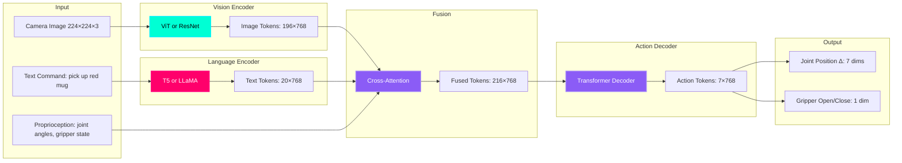

# بصری-زبان-ایکشن (VLA) ماڈلز: روبوٹ انٹیلی جنس کا مستقبل

## الگ الگ منصوبہ بندی اور کنٹرول سے پرے

**روایتی پائپ لائن (2022):**
```
Camera Image → Object Detector → LLM Planner → Motion Planner → PID Controller → Motors
(5 الگ الگ ماڈل، ہر ایک ناکام ہو سکتا ہے)
```

**VLA ماڈل (2024):**
```
Camera Image + Text Command → VLA Model → Motor Commands
(سنگل اینڈ ٹو اینڈ ماڈل)
```

**انقلاب:** لاکھوں روبوٹ مظاہروں سے سیکھے گئے VLA ماڈل بصری مشاہدات اور اعلیٰ سطحی کمانڈز سے براہ راست نچلی سطح کے اعمال کی پیشین گوئی کر سکتے ہیں — **کسی واضح منصوبہ بندی کی ضرورت نہیں**۔

:::info پیش رفت ماڈلز (Breakthrough Models)
*   **Google RT-1** (2022): 130K روبوٹ مظاہرے، 7 مہارتیں
*   **Google RT-2** (2023): روبوٹکس کے لیے ویژن لینگویج ماڈل (PaLI-X) کو ٹھیک کیا گیا، 6000+ مہارتیں
*   **OpenVLA** (2024): اوپن سورس 7B پیرامیٹر ماڈل 900K رفتار پر تربیت یافتہ
*   **π0 (فزیکل انٹیلی جنس، 2024)**: ہنر مند ہیرا پھیری کے لیے عام مقصد VLA
*   **Tesla Optimus Neural Net** (2024): انسانی ٹیلی آپریشن سے اینڈ ٹو اینڈ تقلید سیکھنا
:::

---

## VLA ماڈل کیا ہے؟

**Vision-Language-Action (VLA)** = ملٹی موڈل ٹرانسفارمر جو فیوز کرتا ہے:
1.  **ویژن**: کیمرے کی تصاویر (RGB, depth, segmentation)
2.  **زبان**: قدرتی زبان کے احکامات ("سرخ پیالا اٹھاو")
3.  **ایکشن**: روبوٹ کے مشترکہ پوزیشن/رفتار/ٹارک

**فن تعمیر:**



**کلیدی بصیرت:** لاکھوں `(image, text, action)` ٹوپلز، ماڈل سیکھتا ہے:
*   **استطاعت (Affordances)**: "مگ کے ہینڈل ہوتے ہیں، سائیڈ سے پکڑنا"
*   **فزکس انترجشتھان**: "نازک اشیاء کے قریب آہستہ چلیں"
*   **عمومیت**: کبھی "نیلی دھاری دار مگ" نہیں دیکھا؟ "سرخ پیالا" + "نیلی بوتل" سے باہم ہو جائیں

---

## RT-2: گوگل کا ویژن-لینگویج-ایکشن ماڈل

### فن تعمیر

**RT-2** یکجا کرتا ہے:
*   **PaLI-X Vision-Language Model** (55B پیرامیٹرز): 10B امیج ٹیکسٹ جوڑوں پر پہلے سے تربیت یافتہ
*   **روبوٹکس فائن ٹیوننگ**: گوگل کے 50+ روبوٹس کے بیڑے سے 6000 مہارتیں

**ان پٹ:**
*   تصویر: 320×256 RGB
*   متن: "pick up the coke can"
*   روبوٹ ریاست: 7-DOF بازو کے مشترکہ زاویے + گرپر

**آؤٹ پٹ:**
*   ایکشن: 8 ڈائمینشنز (7 جوائنٹ پوزیشن ڈیلٹاس + 1 گرپر کمانڈ)
*   فریکوئنسی: 3 Hz (ہر 333ms)

---

### RT-2 کارکردگی

| ٹاسک کیٹیگری | کامیابی کی شرح (RT-2) | کامیابی کی شرح (RT-1) | کامیابی کی شرح (انسانی بیس لائن) |
| :--- | :--- | :--- | :--- |
| **دیکھی ہوئی اشیاء** | 97% | 95% | 100% |
| **اندیکھی اشیاء (صفر شاٹ)** | 62% | 32% | 95% |
| **ناول ہدایات** | 81% | 53% | 98% |
| **استدلال کے کام** | 74% | 12% | 92% |

**کلیدی فائدہ:** RT-2 کی زبان کی سمجھ **معنوی استدلال (semantic reasoning)** کو قابل بناتی ہے جو RT-1 (خالص وژن) حاصل نہیں کر سکتا۔

---

## OpenVLA: اوپن سورس متبادل

**OpenVLA** (2024) پہلا **اوپن سورس**، **جدید ترین** VLA ماڈل ہے:
*   **7 بلین پیرامیٹرز** (NVIDIA A100 40GB یا 2× RTX 4090 پر فٹ بیٹھتا ہے)
*   **اوپن ایکس ایمبوڈیمنٹ ڈیٹاسیٹ پر تربیت یافتہ** (900K روبوٹ ٹریجیکٹریز، 22 روبوٹ کی اقسام)
*   **اپاچی 2.0 لائسنس** (تحقیق اور تجارتی استعمال کے لیے مکمل طور پر کھلا)

### فن تعمیر

```python
# OpenVLA = DinoV2 (vision) + Llama 3.1 (language) + Diffusion Policy (action)

Input:
  - Image: 224×224×3 (DinoV2 patch encoder)
  - Text: "close the drawer" (Llama tokenizer)
  - History: Last 10 actions (for temporal coherence)

Model:
  - Vision Encoder: DinoV2 (300M params, frozen)
  - Language Encoder: Llama 3.1 8B (6B params, LoRA fine-tuned)
  - Fusion: Cross-attention layers (1B params)
  - Action Decoder: Diffusion policy head (denoising network)

Output:
  - Action: 7D joint positions (continuous)
  - Uncertainty: Per-dimension variance (for safety)
```

---

### جیٹسن پر OpenVLA انسٹال کرنا

```bash
# تقاضے: Jetson AGX Orin (64GB RAM) یا Cloud GPU

# 1. کلون ریپوزٹری
git clone https://github.com/openvla/openvla.git
cd openvla

# 2. انحصارات انسٹال کریں۔
pip3 install -r requirements.txt

# 3. پہلے سے تربیت یافتہ ماڈل ڈاؤن لوڈ کریں (13GB)
huggingface-cli download openvla/openvla-7b --local-dir ./models/openvla-7b

# 4. ٹیسٹ کا اندازہ
python3 scripts/test_openvla.py \
  --model_path ./models/openvla-7b \
  --image test_images/kitchen.jpg \
  --instruction "pick up the red mug"

# متوقع آؤٹ پٹ:
# Action: [0.05, -0.03, 0.12, 0.01, -0.02, 0.04, 1.0]  # 7D joint delta + gripper
# Inference time: 850ms on Jetson AGX Orin
```

---

## VLA نقطہ نظر کا موازنہ

| ماڈل | پیرامیٹرز | ٹریننگ ڈیٹا | اندازہ کی رفتار | زیرو شاٹ کی صلاحیت | اوپن سورس؟ |
| :--- | :--- | :--- | :--- | :--- | :--- |
| **RT-1** | 35M | 130K ڈیمو (1 روبوٹ) | 100ms (TPU) | محدود | ❌ |
| **RT-2** | 55B | 10B ویب + 130K روبوٹ | 333ms (TPU) | **شاندار** | ❌ |
| **OpenVLA** | 7B | 900K ڈیمو (22 روبوٹس) | 850ms (جیٹسن) | اچھا | ✅ |
| **π0** | 3B | 10K گھنٹے ہنر مند | 500ms (A100) | معتدل | ✅ |
| **Octo** | 93M | 800K ڈیمو (مکس) | 50ms (RTX 4090) | معتدل | ✅ |

**طلباء کے لیے سفارش:**
*   **تحقیق**: OpenVLA (کھلے وزن، تولیدی)
*   **پیداوار**: RT-2 (بہترین کارکردگی، لیکن گوگل کلاؤڈ TPU کی ضرورت ہے)
*   **ایج تعیناتی**: Octo (سب سے چھوٹا ماڈل، جیٹسن اورین نینو پر فٹ بیٹھتا ہے)

---

## اپنے روبوٹ پر OpenVLA کو فائن ٹیوننگ کرنا

**منظر نامہ:** آپ کے پاس ایک نیا روبوٹ ہے (مثلاً، Unitree G1 humanoid) اور آپ اسے کام سکھانا چاہتے ہیں۔

### مرحلہ 1: مظاہرے کا ڈیٹا اکٹھا کریں۔

```bash
# "مگ اٹھاؤ" کے 100 مظاہرے ریکارڈ کریں۔
python3 scripts/collect_demos.py \
  --task "pick up mug" \
  --num_demos 100 \
  --output_dir ./data/my_robot_mug

# ہر ڈیمو محفوظ کرتا ہے:
# - images/: 224×224 RGB images at 10 Hz
# - actions.npy: 7D joint positions at 10 Hz
# - language.txt: "pick up the red mug"
```

---

### مرحلہ 2: LoRA کے ساتھ فائن ٹیون

```python
# اپنے ڈیٹا کے ساتھ OpenVLA کو فائن ٹیون کریں (کم رینک موافقت = موثر)

from openvla import OpenVLA, LoRAConfig
from torch.utils.data import DataLoader

# پہلے سے تربیت یافتہ ماڈل لوڈ کریں۔
model = OpenVLA.from_pretrained("openvla/openvla-7b")

# LoRA کو ترتیب دیں (صرف 0.1% پیرامیٹرز کو تربیت دیں)
lora_config = LoRAConfig(
    r=16,  # LoRA rank
    lora_alpha=32,
    target_modules=["q_proj", "v_proj"],  # توجہ کی تہوں پر لگائیں۔
    lora_dropout=0.05
)

model.add_lora(lora_config)

# اپنا ڈیٹا سیٹ لوڈ کریں۔
train_dataset = RobotDataset(
    data_dir="./data/my_robot_mug",
    augmentation=True  # Random crop, color jitter
)

train_loader = DataLoader(train_dataset, batch_size=8, shuffle=True)

# 10 ادوار کے لیے ٹھیک ٹون
optimizer = torch.optim.AdamW(model.parameters(), lr=1e-4)

for epoch in range(10):
    for batch in train_loader:
        images, texts, actions = batch
        
        # Forward pass
        predicted_actions = model(images=images, texts=texts)
        
        # L2 loss on action predictions
        loss = torch.nn.functional.mse_loss(predicted_actions, actions)
        
        # Backward pass
        optimizer.zero_grad()
        loss.backward()
        optimizer.step()
    
    print(f"Epoch {epoch+1}: Loss = {loss.item():.4f}")

# Save fine-tuned model
model.save_pretrained("./models/openvla-7b-mug-finetuned")
```

**تربیتی وقت:**
*   **100 demos**: سنگل A100 GPU پر 2 گھنٹے
*   **1000 demos**: 20 گھنٹے
*   **10,000 demos**: 200 گھنٹے (ایک سے زیادہ GPUs استعمال کریں)

---

### مرحلہ 3: اصلی روبوٹ پر تعینات کریں۔

```python
#!/usr/bin/env python3
"""
اصلی روبوٹ کے لیے OpenVLA انففرنس نوڈ
"""

import rclpy
from rclpy.node import Node
from sensor_msgs.msg import Image, JointState
from std_msgs.msg import String

import torch
from openvla import OpenVLA
import cv2
from cv_bridge import CvBridge

class OpenVLANode(Node):
    def __init__(self):
        super().__init__('openvla_node')
        
        # فائن ٹیون ماڈل لوڈ کریں۔
        self.model = OpenVLA.from_pretrained("./models/openvla-7b-mug-finetuned")
        self.model.eval()  # Inference mode
        self.model.to("cuda")
        
        # Subscribers
        self.image_sub = self.create_subscription(
            Image, '/camera/image_raw', self.image_callback, 10
        )
        self.command_sub = self.create_subscription(
            String, '/voice/command', self.command_callback, 10
        )
        
        # Publishers
        self.action_pub = self.create_publisher(JointState, '/joint_commands', 10)
        
        # State
        self.latest_image = None
        self.latest_command = "pick up the mug"
        self.bridge = CvBridge()
        
        # Inference loop (3 Hz = every 333ms)
        self.timer = self.create_timer(0.333, self.inference_loop)
        
        self.get_logger().info('OpenVLA node ready!')
    
    def image_callback(self, msg):
        # ROS امیج کو OpenCV میں تبدیل کریں۔
        self.latest_image = self.bridge.imgmsg_to_cv2(msg, "rgb8")
    
    def command_callback(self, msg):
        self.latest_command = msg.data
        self.get_logger().info(f'New command: {self.latest_command}')
    
    def inference_loop(self):
        if self.latest_image is None:
            return
        
        # Preprocess image
        image = cv2.resize(self.latest_image, (224, 224))
        image_tensor = torch.from_numpy(image).permute(2, 0, 1).float() / 255.0
        image_tensor = image_tensor.unsqueeze(0).to("cuda")  # بیچ ڈائمینشن شامل کریں۔
        
        # VLA ماڈل چلائیں۔
        with torch.no_grad():
            action = self.model(
                images=image_tensor,
                texts=[self.latest_command]
            )
        
        # ROS JointState پیغام میں تبدیل کریں۔
        action_np = action.cpu().numpy()[0]  # بیچ ڈیمینشن کو ہٹا دیں۔
        
        joint_msg = JointState()
        joint_msg.header.stamp = self.get_clock().now().to_msg()
        joint_msg.name = ['joint1', 'joint2', 'joint3', 'joint4', 'joint5', 'joint6', 'joint7']
        joint_msg.position = action_np[:7].tolist()  # 7 joint positions
        
        # Gripper command (action[7] > 0.5 = close)
        gripper_state = "close" if action_np[7] > 0.5 else "open"
        
        self.action_pub.publish(joint_msg)
        self.get_logger().info(f'Action: {action_np[:7]}, Gripper: {gripper_state}')

def main():
    rclpy.init()
    node = OpenVLANode()
    rclpy.spin(node)

if __name__ == '__main__':
    main()
```

---

## ڈیٹا کی اہلیت کا مسئلہ

**چیلنج:** VLA ماڈلز کو فی کام **ہزاروں** مظاہروں کی ضرورت ہے۔

**حل کے طریقے:**

1.  **ٹرانسفر لرننگ**: بڑے ویب ڈیٹاسیٹس (اربوں تصاویر) پر پہلے سے ٹرین، روبوٹ ڈیٹا پر ٹھیک دھن (ہزاروں)
2.  **سم ٹو ریئل**: Isaac Gym میں ڈومین بے ترتیب ہونے کے ساتھ ٹرین کریں، اصلی روبوٹ پر تعینات کریں۔
3.  **ڈیٹا بڑھانا (Data Augmentation)**: ڈیٹا سیٹ کو مصنوعی طور پر بڑھانے کے لیے تصاویر (فصل، رنگ جٹر، دھندلا) کو بے ترتیب بنائیں
4.  **فعال تعلیم**: ماڈل غیر یقینی حالات کے لیے ڈیمو کی درخواست کرتا ہے۔

---

## ہینڈ آن ورزش: VLA بمقابلہ روایتی پائپ لائن کا موازنہ کریں۔

**ٹاسک:** بے ترتیبی میز سے مگ اٹھاؤ۔

---

## کلیدی ٹیکا ویز (Key Takeaways)

✅ **VLA ماڈلز** وین + زبان + عمل کو سنگل اینڈ ٹو اینڈ نیٹ ورک میں یکجا کرتے ہیں۔
✅ **RT-2** دیکھی ہوئی اشیاء پر 97% کامیابی حاصل کرتا ہے، ناول اشیاء پر 62%
✅ **OpenVLA** اوپن سورس متبادل ہے (7B پیرامیٹرز، Apache 2.0 لائسنس)
✅ **فائن ٹیوننگ** 100 ڈیمو کے ساتھ پہلے سے تربیت یافتہ ماڈل کو نئے روبوٹ/ٹاسک کے مطابق ڈھالتی ہے
✅ **LoRA** موثر فائن ٹیوننگ کو قابل بناتا ہے (پیرامیٹرز کا صرف 0.1% اپ ڈیٹ ہوتا ہے)
✅ **Trade-off**: روایتی پائپ لائنوں سے زیادہ مضبوط لیکن سست (850ms) ہیں
---

## اگلا کیا ہے؟

آپ نے تین پیراڈائم سیکھے ہیں:
1.  **روایتی**: الگ الگ ادراک → منصوبہ بندی → کنٹرول (تیز، ٹوٹنے والا)
2.  **LLM منصوبہ بندی**: سٹرکچرڈ ایکشنز کے ساتھ اعلیٰ سطحی استدلال (لچکدار، قابل تشریح)
3.  **VLA ماڈلز**: مظاہروں سے آخر تک سیکھنا (ڈیٹا کا بھوکا، مضبوط)

آخری باب **کیپ اسٹون پروجیکٹ** ہے — جہاں آپ وائس کنٹرول، نیویگیشن، ادراک، اور ہیرا پھیری کو ایک مکمل خود مختار ہیومنائیڈ سسٹم میں ضم کرتے ہیں۔

---

## مزید پڑھنا

*   [RT-2 Paper (Google, 2023)](https://arxiv.org/abs/2307.15818)
*   [OpenVLA Paper (2024)](https://arxiv.org/abs/2406.09246)
*   [Open X-Embodiment Dataset](https://robotics-transformer-x.github.io/)
*   [π0 Technical Report (Physical Intelligence, 2024)](https://www.physicalintelligence.company/)
*   [Octo Model (Stanford, 2024)](https://octo-models.github.io/)
*   [RT-1 Paper (Google, 2022)](https://arxiv.org/abs/2212.06817)
