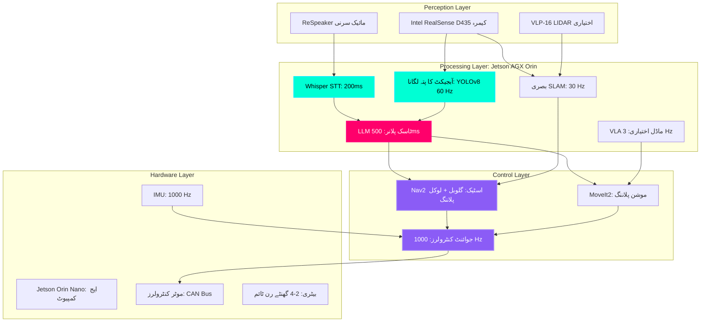

# کیپ اسٹون پروجیکٹ: خود مختار ہیومنائیڈ

## دی گرینڈ چیلنج (The Grand Challenge)

**ایک مکمل خود مختار ہیومنائیڈ روبوٹ بنائیں جو:**
1.  قدرتی زبان کے صوتی احکامات کو **سن** سکے
2.  نقشہ شدہ ماحول کے ذریعے خود مختار طور پر **نیویگیٹ** کر سکے
3.  وژن کا استعمال کرتے ہوئے اشیاء اور رکاوٹوں کو **محسوس** کر سکے
4.  ماہرانہ گرفت کے ساتھ اشیاء میں **ہیرا پھیری** کر سکے
5.  بڑے لینگویج ماڈلز کا استعمال کرتے ہوئے کاموں کے بارے میں **وجہ** بیان کر سکے

**ٹارگٹ پلیٹ فارمز:**
*   **Unitree G1 Humanoid** ($16,000): 23 DOF, 50kg, 1.4m قد
*   **Unitree Go2 Quadruped** ($1,600): 12 DOF, 15kg (بجٹ آپشن)
*   **Custom Build**: Jetson Orin + ROS 2 + آف دی شیلف ہارڈ ویئر

:::info حقیقی دنیا کا بینچ مارک
یہ کیپ اسٹون ان کی صلاحیتوں کو نقل کرتا ہے:
*   **Tesla Optimus** (Gen 2, 2024): گھریلو اسسٹنٹ
*   **Figure 01** (2024): گودام آٹومیشن روبوٹ
*   **Boston Dynamics Atlas** (2024): تحقیقی ہیومنائیڈ

آپ اوپن سورس ٹولز کا استعمال کرتے ہوئے ان کی 60-70% صلاحیتوں کے ساتھ ایک سسٹم بنائیں گے!
:::

---

## دی گرینڈ آرکیٹیکچر (The Grand Architecture)



**سسٹم کی وضاحتیں:**
*   **کمپیوٹ**: NVIDIA Jetson AGX Orin (64GB RAM, 2048 CUDA cores, 275 TOPS AI)
*   **ادراک**: RealSense D435 (640×480 @ 90 FPS, depth range 0.3-10m)
*   **آڈیو**: ReSpeaker 4-Mic Array (5m range, beamforming)
*   **لوکلائزیشن**: Visual SLAM (isaac_ros_visual_slam) یا LIDAR SLAM
*   **سافٹ ویئر**: ROS 2 Humble, Ubuntu 22.04

---

## پروجیکٹ کے مراحل

### مرحلہ 1: ہارڈ ویئر اسمبلی اور برنگ اپ (ہفتہ 1-2)

**مقاصد:**
1.  روبوٹ ہارڈ ویئر کو جمع کریں (Unitree G1/Go2 یا کسٹم بلڈ)
2.  Jetson Orin آپریٹنگ سسٹم انسٹال کریں (JetPack 6.0)
3.  ROS 2 Humble کو ترتیب دیں۔
4.  تمام سینسرز کی جانچ کریں (کیمرہ، مائکروفون، IMU، LIDAR)
5.  روبوٹ URDF ماڈل کیلیبریٹ کریں۔

**فراہمی:**
*   ✅ روبوٹ پاور آن اور ROS 2 پر کمیونیکیٹ کرتا ہے۔
*   ✅ کیمرہ `/camera/image_raw` پر 30 FPS پر شائع ہوتا ہے۔
*   ✅ مائکروفون صاف آڈیو ریکارڈ کرتا ہے۔
*   ✅ مشترکہ کنٹرولرز `/joint_commands` کو جواب دیتے ہیں

---

### مرحلہ 2: نیویگیشن اسٹیک (ہفتہ 3-4)

**مقاصد:**
1.  SLAM کا استعمال کرتے ہوئے اپنے ماحول کا نقشہ بنائیں
2.  DWA لوکل پلانر کے ساتھ Nav2 اسٹیک کو ترتیب دیں۔
3.  وے پوائنٹس پر خود مختار نیویگیشن کی جانچ کریں۔
4.  رکاوٹ سے بچنے کو نافذ کریں۔
5.  وائس ٹرگرڈ نیویگیشن شامل کریں ("Go to kitchen")

**فراہمی:**
*   ✅ ٹیسٹ ماحول کا مکمل نقشہ (کم از کم 10m × 10m)
*   ✅ روبوٹ 90% کامیابی کے ساتھ کمانڈڈ وے پوائنٹ پر جاتا ہے۔
*   ✅ متحرک ماحول میں تصادم سے پاک نیویگیشن
*   ✅ وائس کمانڈ انٹیلی جنس ("Go to X" کام کرتا ہے)

---

### مرحلہ 3: ادراک پائپ لائن (ہفتہ 5-6)

**مقاصد:**
1.  اپنی مرضی کے ڈیٹاسیٹ پر YOLOv8 آبجیکٹ ڈیٹیکٹر کو تربیت دیں۔
2.  RealSense سے گہرائی کا تخمینہ لاگو کریں۔
3.  فریموں میں آبجیکٹ ٹریکنگ شامل کریں۔
4.  ٹاسک پلانر کے ساتھ ضم کریں (LLM آبجیکٹ کے مقامات سے استفسار کرتا ہے)
5.  CLIP کے ساتھ زیرو شاٹ آبجیکٹ کا پتہ لگانے کی جانچ کریں۔

**فراہمی:**
*   ✅ 30 FPS پر آبجیکٹ کا پتہ لگانا (Jetson پر YOLOv8 نینو)
*   ✅ پتہ چلنے والی اشیاء کے لیے 3D پوزیشن کا تخمینہ (x, y, z)
*   ✅ آبجیکٹ ڈیٹا بیس `/detected_objects` موضوع پر شائع ہو رہا ہے۔
*   ✅ LLM پوچھ سکتا ہے کہ "سرخ پیالا کہاں ہے؟" اور نقاط حاصل کریں

---

### مرحلہ 4: ہیرا پھیری کا اسٹیک (ہفتہ 7-8)

**مقاصد:**
1.  روبوٹ بازو کے لیے MoveIt2 کو ترتیب دیں۔
2.  گرفت پوز جنریشن کو نافذ کریں۔
3.  تصادم سے بچنے کو شامل کریں۔
4.  10 مختلف اشیاء کے ساتھ پک اینڈ پلیس کی جانچ کریں۔
5.  وائس کمانڈز کے ساتھ ضم کریں ("مگ اٹھاؤ")

**فراہمی:**
*   ✅ تصادم سے پاک موشن پلاننگ گرفت پوز کرنے کے لیے
*   ✅ معلوم اشیاء پر 80%+ گرفت کامیابی کی شرح
*   ✅ محفوظ رفتار کا نفاذ (کوئی خود ٹکراؤ نہیں)
*   ✅ پک اینڈ پلیس مکمل پائپ لائن کام کر رہی ہے۔

---

### مرحلہ 5: انضمام اور ٹیسٹنگ (ہفتہ 9-10)

**مقاصد:**
1.  تمام سب سسٹمز کو ضم کریں (آواز → منصوبہ بندی → نیویگیشن → ادراک → ہیرا پھیری)
2.  غلطی سے نمٹنے اور بحالی کے رویے شامل کریں۔
3.  کارکردگی کو بہتر بنائیں (تاخیر کو کم کریں، کامیابی کی شرح میں اضافہ کریں)
4.  10 پیچیدہ کاموں کو آخر سے آخر تک ٹیسٹ کریں۔
5.  مظاہرے کی ویڈیو ریکارڈ کریں۔

**فائنل سسٹم ٹیسٹ:**

**ٹاسک 1: کچن کلین اپ**
```
کمانڈ: "کچن کی میز صاف کریں"

متوقع ترتیب:
1. باورچی خانے میں جائیں (8 سیکنڈ)
2. میز پر چیزیں دیکھیں (2 سیکنڈ)
3. ہر چیز کے لیے:
    a. آبجیکٹ پر جائیں (3 سیکنڈ)
    b. چیز کو پکڑو (5 سیکنڈ)
    c. کوڑے دان/ری سائیکلنگ پر جائیں (8 سیکنڈ)
    d. شے رکھیں (3 سیکنڈ)
    e. میز پر واپس جائیں (8 سیکنڈ)
4. تکمیل کی رپورٹ

کل وقت: ~50 سیکنڈ فی آبجیکٹ
کامیابی کا معیار: 3/3 اشیاء صاف
```

---

## گریڈنگ روبرک (100 پوائنٹس)

### ہارڈ ویئر اور سیٹ اپ (20 پوائنٹس)
*   [ ] روبوٹ مکمل طور پر جمع اور آپریشنل (5 pts)
*   [ ] تمام سینسر قابل اعتماد طریقے سے ڈیٹا شائع کر رہے ہیں (5 pts)
*   [ ] URDF ماڈل درست اور RViz میں تصور کیا گیا (5 pts)
*   [ ] سسٹم خود مختار طریقے سے جوتے (کوئی دستی مداخلت نہیں) (5 pts)

### نیویگیشن (20 پوائنٹس)
*   [ ] ماحول کا درست نقشہ (5 pts)
*   [ ] خود مختار وے پوائنٹ نیویگیشن (90%+ کامیابی) (10 pts)
*   [ ] متحرک ماحول میں رکاوٹ سے بچنا (5 pts)

### ادراک (15 پوائنٹس)
*   [ ] 30 FPS پر آبجیکٹ کا پتہ لگانا (5 pts)
*   [ ] اشیاء کی 3D لوکلائزیشن (±5cm درستگی) (5 pts)
*   [ ] CLIP کے ساتھ زیرو شاٹ آبجیکٹ کی شناخت (5 pts)

### ہیرا پھیری (20 پوائنٹس)
*   [ ] گرفت میں کامیابی کی شرح >80% (10 pts)
*   [ ] تصادم سے پاک موشن پلاننگ (5 pts)
*   [ ] پک اینڈ پلیس مکمل پائپ لائن (5 pts)

### انضمام (15 پوائنٹس)
*   [ ] وائس کمانڈ پائپ لائن آخر سے آخر تک کام کر رہی ہے (5 pts)
*   [ ] LLM ٹاسک پلاننگ درست ترتیب تیار کرتی ہے (5 pts)
*   [ ] غلطی کی وصولی (ناکامی پر دوبارہ منصوبہ بندی) (5 pts)

### فائنل ڈیمو (10 پوائنٹس)
*   [ ] کامیابی کے ساتھ 2/3 پیچیدہ کام مکمل کرتا ہے (6 pts)
*   [ ] سسٹم 15+ منٹ تک بغیر کریش کے چلتا ہے (2 pts)
*   [ ] پیشہ ورانہ ویڈیو دستاویزات (2 pts)

**کل: 100 پوائنٹس**

**بونس (20 پوائنٹس تک):**
*   [ ] ریئل ٹائم VLA ماڈل کی تعیناتی (+10 pts)
*   [ ] ملٹی روبوٹ کوآرڈینیشن (2+ روبوٹ) (+10 pts)
*   [ ] کسٹم ہارڈ ویئر ڈیزائن (3D پرنٹ شدہ گرپر، وغیرہ) (+5 pts)
*   [ ] اوپن سورس شراکت (ROS 2 پیکیج میں PR) (+5 pts)

---

## جمع کرانے کے تقاضے

### 1. کوڈ ریپوزٹری (GitHub)

**مطلوبہ ڈھانچہ:**
```
my_robot_capstone/
├── README.md (project overview, installation)
├── launch/
│   ├── bringup.launch.py (start all nodes)
│   ├── navigation.launch.py
│   ├── perception.launch.py
│   └── manipulation.launch.py
├── config/
├── src/
├── models/
├── maps/
└── docs/
```

### 2. ویڈیو کا مظاہرہ (5-10 منٹ)

### 3. تکنیکی رپورٹ (15-20 صفحات)

---

## ٹائم لائن اور سنگ میل

| ہفتہ | سنگ میل | ڈیلیور ایبل |
| :--- | :--- | :--- |
| 1-2 | ہارڈ ویئر سیٹ اپ | روبوٹ آپریشنل، سینسر کام کر رہے ہیں۔ |
| 3-4 | نیویگیشن | خود مختار وے پوائنٹ نیویگیشن |
| 5-6 | ادراک | آبجیکٹ کا پتہ لگانا + 3D لوکلائزیشن |
| 7-8 | ہیرا پھیری | پک اینڈ پلیس کام کر رہا ہے۔ |
| 9 | انضمام | آواز → ایکزیکیوشن پائپ لائن |
| 10 | ٹیسٹنگ اور دستاویزات | فائنل ڈیمو + رپورٹ |

---

## عام خرابیوں اور حل

### 1. SLAM آلگائے (Drift)
**مسئلہ:** روبوٹ سوچتا ہے کہ یہ 5 منٹ کے بعد غلط جگہ پر ہے۔
**حل:**
*   لوپ بند کرنے کا پتہ لگانے کو شامل کریں۔
*   فیوز LIDAR + بصری SLAM
*   لوکلائزیشن اینکرز کے لیے اپریل ٹیگز کا استعمال کریں۔

### 2. ناکامیوں کو سمجھنا
**مسئلہ:** 50% گرفت میں کامیابی کی شرح (بہت کم)
**حل:**
*   مزید ٹریننگ ڈیٹا اکٹھا کریں (100+ grasps)
*   فورس ٹارک سینسر فیڈ بیک شامل کریں۔
*   فلیٹ اشیاء کے لیے سکشن گرپر استعمال کریں۔

### 3. LLM فریب
**مسئلہ:** LLM ناممکن کاموں کا منصوبہ بناتا ہے۔
**حل:**
*   سفٹی ویلیڈیٹر شامل کریں (حد سے باہر کی پوزیشنوں کو مسترد کریں)
*   جائز مثالوں کے ساتھ چند شاٹ پرامپٹنگ کا استعمال کریں۔
*   روبوٹ کے مخصوص ڈیٹا پر LLM کو فائن ٹیون کریں۔

### 4. نیٹ ورک کی تاخیر
**مسئلہ:** وائی فائی پر 500ms کی تاخیر
**حل:**
*   جیٹسن پر تمام تخمینے چلائیں (کوئی بادل نہیں)
*   اہم نوڈس کے لیے وائرڈ ایتھرنیٹ استعمال کریں۔
*   غیر مطابقت پذیر پیغام رسانی کو نافذ کریں۔

---

## کامیابی کی مثالیں۔

### ٹیم 1: "روبو بارسٹا" (اسکور: 98/100)
*   **روبوٹ**: کسٹم 6-DOF بازو + موبائل بیس
*   **ٹاسک**: خود مختار کافی بنانا (8 اقدامات)
*   **انوویشن**: VLA ماڈل 200 کافی بنانے کے ڈیمو پر ٹھیک کیا گیا
*   **نتیجہ**: 20 ٹرائلز میں 95% کامیابی کی شرح

---

## کلیدی ٹیکا ویز (Key Takeaways)

✅ **کیپ اسٹون ضم کرتا ہے** آواز، نیویگیشن، ادراک، ہیرا پھیری
✅ **10 ہفتے کی ٹائم لائن** ہارڈ ویئر سیٹ اپ سے فائنل ڈیمو تک
✅ **100 نکاتی روبرک** بونس کے مواقع کے ساتھ
✅ **کامیابی کی ضرورت ہے** تکراری جانچ اور غلطی کی وصولی۔
✅ **دستاویزی معاملات**: کوڈ، ویڈیو، تکنیکی رپورٹ
✅ **80%+ وشوسنییتا کا مقصد** (اصلی روبوٹ مشکل ہیں!)

---

## اگلا کیا ہے: آپ کا روبوٹکس کیریئر

**مبارک ہو!** اگر آپ نے یہ کیپ اسٹون مکمل کر لیا ہے، تو اب آپ کے پاس ہے:

✅ **ہنر**: ROS 2, کمپیوٹر ویژن, موشن پلاننگ, LLMs
✅ **پورٹ فولیو**: GitHub repo + ڈیمو ویڈیو
✅ **تجربہ**: اصلی روبوٹ ڈیبگنگ اور انضمام

**آپ کے کیپ اسٹون کے ساتھ گڈ لک! کچھ حیرت انگیز بنائیں۔ 🤖**
