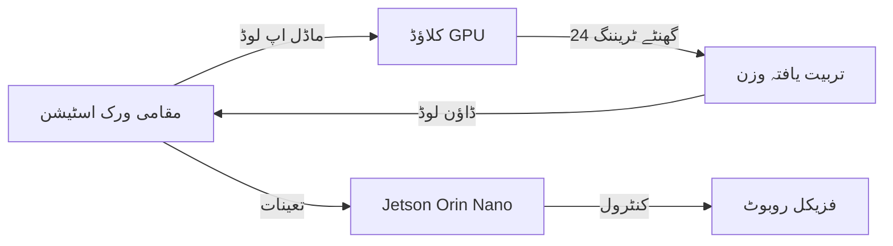

# فزیکل AI لیب کی تعمیر (Building the Physical AI Lab)

## تعارف: بنیادی ڈھانچے کا فیصلہ

اس سے پہلے کہ آپ روبوٹ کوڈ کی اپنی پہلی سطر لکھیں، آپ کو بنیادی ڈھانچے کے ایک اہم فیصلے کا سامنا کرنا پڑتا ہے: **کلاؤڈ یا فزیکل**؟ یہ صرف لاگت کے بارے میں نہیں ہے—یہ تاخیر (latency)، اسکیل ایبلٹی، دیکھ بھال اور سیکھنے کے مقاصد کے بارے میں ہے۔

:::tip ہائبرڈ اپروچ
زیادہ تر کامیاب فزیکل AI پروگرام **دونوں** کا استعمال کرتے ہیں: کمپیوٹ سے بھرپور ماڈلز کی تربیت کے لیے کلاؤڈ، ریئل ٹائم انفرنس اور روبوٹ کنٹرول کے لیے فزیکل ہارڈویئر۔
:::

---

## آپشن 1: دی "ایتھر لیب" (کلاؤڈ انفراسٹرکچر)

### کلاؤڈ کیوں؟

کلاؤڈ پر مبنی نقطہ نظر پیشگی سرمائے کے اخراجات (CapEx) کو ختم کرتا ہے اور ہارڈویئر کی دیکھ بھال کے بغیر ہائی اینڈ GPUs تک فوری رسائی فراہم کرتا ہے۔

**فوائد:**
*   ✅ صفر پیشگی سرمایہ کاری
*   ✅ فوری فراہمی (2 منٹ میں انسٹینس اسپن اپ کریں)
*   ✅ جدید ترین ہارڈویئر تک رسائی (H100s, A100s آن ڈیمانڈ)
*   ✅ ٹھنڈک، بجلی، یا جگہ کی کوئی ضرورت نہیں
*   ✅ 10 ہفتوں کے کورسز کے لیے بہترین (کوئی سامان ذخیرہ نہیں)

**نقصانات:**
*   ❌ جاری آپریشنل اخراجات (OpEx)
*   ❌ ریئل ٹائم کنٹرول کے لیے نیٹ ورک کی تاخیر (network latency)
*   ❌ فزیکل روبوٹس سے براہ راست رابطہ نہیں کر سکتے
*   ❌ ڈیٹا ایگریس فیس (ماڈلز ڈاؤن لوڈ کرنا)
*   ❌ طلباء کے لیے کریڈٹ ختم ہونے کا خطرہ

---

### تجویز کردہ کلاؤڈ کنفیگریشن

#### AWS g5.2xlarge Instance

**تفصیلات:**
*   **GPU**: 1x NVIDIA A10G Tensor Core (24GB VRAM)
*   **vCPUs**: 8 cores (3rd Gen AMD EPYC)
*   **RAM**: 32 GB
*   **اسٹوریج**: 225 GB NVMe SSD
*   **نیٹ ورک**: 10 Gbps تک
*   **لاگت**: ~$1.21/گھنٹہ (آن ڈیمانڈ, us-east-1)

**ماہانہ لاگت کا تخمینہ (8 گھنٹے/دن، 20 دن/مہینہ):**
```
$1.21/گھنٹہ × 8 گھنٹے/دن × 20 دن = $193.60/مہینہ
```

:::warning لاگت کا انتظام
رات بھر کے حادثاتی چارجز ($30+ فی رات) کو روکنے کے لیے 2 گھنٹے کی غیرفعالیت کے بعد **خودکار اسٹاپ (auto-stop)** کو فعال کریں۔
:::

---

#### AWS سیٹ اپ گائیڈ

**مرحلہ 1: مثال (Instance) لانچ کریں**
```bash
# AWS CLI انسٹال کریں
curl "https://awscli.amazonaws.com/awscli-exe-linux-x86_64.zip" -o "awscliv2.zip"
unzip awscliv2.zip
sudo ./aws/install

# اسناد (credentials) کنفیگر کریں
aws configure

# Deep Learning AMI کے ساتھ g5.2xlarge لانچ کریں
aws ec2 run-instances \
  --image-id ami-0c7217cdde317cfec \
  --instance-type g5.2xlarge \
  --key-name your-keypair \
  --security-group-ids sg-xxxxxxxxx \
  --subnet-id subnet-xxxxxxxxx \
  --block-device-mappings '[{"DeviceName":"/dev/sda1","Ebs":{"VolumeSize":500}}]' \
  --tag-specifications 'ResourceType=instance,Tags=[{Key=Name,Value=PhysicalAI-Lab}]'
```

**مرحلہ 2: جڑیں اور GPU کی تصدیق کریں**
```bash
# SSH into instance
ssh -i your-keypair.pem ubuntu@<instance-ip>

# GPU تصدیق کریں
nvidia-smi

# متوقع آؤٹ پٹ:
# +-----------------------------------------------------------------------------+
# | NVIDIA-SMI 525.60.13    Driver Version: 525.60.13    CUDA Version: 12.0     |
# |-------------------------------+----------------------+----------------------+
# | GPU  Name        Persistence-M| Bus-Id        Disp.A | Volatile Uncorr. ECC |
# |   0  NVIDIA A10G         On   | 00000000:00:1E.0 Off |                    0 |
```

**مرحلہ 3: Isaac Sim (کلاؤڈ) انسٹال کریں**
```bash
# Omniverse Launcher انسٹال کریں
wget https://install.launcher.omniverse.nvidia.com/installers/omniverse-launcher-linux.AppImage
chmod +x omniverse-launcher-linux.AppImage

# نوٹ: کلاؤڈ کے لیے Isaac Sim ہیڈ لیس موڈ
# مکمل GUI رینڈرنگ کے لیے X11 فارورڈنگ یا VNC کی ضرورت ہوتی ہے
```

---

### متبادل کلاؤڈ فراہم کنندگان (Alternative Cloud Providers)

#### Paperspace (زیادہ سستی)

**کنفیگریشن**: P4000 مثال
*   **GPU**: NVIDIA Quadro P4000 (8GB)
*   **لاگت**: $0.51/گھنٹہ ($81.60/مہینہ @ 8 گھنٹے/دن)
*   **کے لیے بہترین**: تنگ بجٹ والے طلباء
*   **حد**: Isaac Sim نہیں چلا سکتا (12GB+ VRAM کی ضرورت ہے)

#### Google Colab Pro+ (فوری تجربات)

*   **GPU**: V100 یا A100 (مختلف ہوتا ہے)
*   **لاگت**: $50/مہینہ (محدود کمپیوٹ یونٹس)
*   **کے لیے بہترین**: Jupyter نوٹ بک تجربات، پیداوار نہیں
*   **حد**: 24 گھنٹے سیشن ٹائم آؤٹ

---

## آپشن 2: دی "سم رگ" (فزیکل ورک اسٹیشن)

### فزیکل ہارڈویئر کیوں؟

ایک وقف شدہ ورک اسٹیشن فزیکل روبوٹس کے لیے کم تاخیر (low-latency) والا کنٹرول فراہم کرتا ہے اور طویل مدتی منصوبوں کے لیے بار بار آنے والے کلاؤڈ اخراجات سے بچتا ہے۔

**فوائد:**
*   ✅ ایک وقتی سرمایہ کاری (ہمیشہ کے لیے مالک)
*   ✅ روبوٹ کنٹرول کے لیے صفر تاخیر
*   ✅ کوئی ڈیٹا ایگریس فیس نہیں
*   ✅ USB سینسرز کو جوڑ سکتے ہیں (RealSense, ReSpeaker)
*   ✅ تعلیمی اداروں کے لیے ٹیکس کٹوتی کے قابل

**نقصانات:**
*   ❌ زیادہ پیشگی لاگت ($1,800 - $3,000)
*   ❌ جسمانی جگہ اور ٹھنڈک کی ضرورت ہے
*   ❌ دیکھ بھال کی ذمہ داری
*   ❌ ہارڈ ویئر کا متروک ہونا (3-5 سال کی عمر)

---

### تجویز کردہ ورک اسٹیشن کنفیگریشن

#### دی "گولڈن بلڈ" ($1,849)

| جزو | ماڈل | چشمی | قیمت |
| :--- | :--- | :--- | :--- |
| **GPU** | NVIDIA RTX 4070 Ti | 12GB GDDR6X, 7680 CUDA cores | $799 |
| **CPU** | AMD Ryzen 9 7900X | 12 cores, 24 threads, 4.7 GHz | $429 |
| **مدر بورڈ** | ASUS TUF Gaming X670E | PCIe 5.0, WiFi 6E | $289 |
| **RAM** | Corsair Vengeance DDR5 | 32GB (2x16GB), 5600 MHz | $119 |
| **اسٹوریج** | Samsung 980 Pro | 500GB NVMe Gen4 | $69 |
| **PSU** | Corsair RM850x | 850W 80+ Gold | $129 |
| **کیس** | Fractal Design Meshify 2 | ایئر فلو آپٹمائزڈ | $159 |
| **کولنگ** | Noctua NH-D15 | ڈوئل ٹاور، 140mm پرستار | $109 |

**کل**: $2,102 (ٹیکس/شپنگ سے پہلے)

:::info RTX 4070 Ti کیوں؟
12GB VRAM NVIDIA Isaac Sim کی تجویز کردہ تفصیلات کے لیے **کم از کم** ہے۔ RTX 4060 Ti (8GB) پیچیدہ مناظر کے ساتھ جدوجہد کرے گا۔
:::

---

#### متبادل بجٹ بلڈ ($1,299)

طلباء یا شوق رکھنے والوں کے لیے:

| جزو | ڈاؤن گریڈ (Downgrade) | بچت |
| :--- | :--- | :--- |
| GPU | RTX 4060 Ti (8GB) | -$300 |
| CPU | Ryzen 7 7700X (8-core) | -$150 |
| RAM | 16GB DDR5 (2x8GB) | -$60 |
| مدر بورڈ | B650 چپ سیٹ | -$100 |
| کولنگ | Corsair ایئر کولر | -$50 |

**نیا کل**: $1,442

**تجارت (Trade-offs):**
*   ⚠️ Isaac Sim کم گرافکس سیٹنگز پر چلے گا
*   ⚠️ بیک وقت 2-3 مصنوعی روبوٹس تک محدود
*   ⚠️ بڑے RL ماڈلز کو مقامی طور پر تربیت نہیں دے سکتے

---

### آپریٹنگ سسٹم: Ubuntu 22.04 LTS

**Ubuntu کیوں؟**
*   ✅ ROS 2 Humble کی سرکاری حمایت (2027 تک)
*   ✅ NVIDIA Isaac Sim مقامی مطابقت
*   ✅ تمام ٹیوٹوریلز Ubuntu/Linux کو فرض کرتے ہیں
*   ✅ مفت اور اوپن سورس

**انسٹالیشن گائیڈ:**

1.  **Ubuntu 22.04 ڈاؤن لوڈ کریں**
    ```bash
    # آفیشل سائٹ سے ڈاؤن لوڈ کریں
    wget https://releases.ubuntu.com/22.04/ubuntu-22.04.3-desktop-amd64.iso
   
    # بوٹ ایبل USB بنائیں (لینکس پر)
    sudo dd if=ubuntu-22.04.3-desktop-amd64.iso of=/dev/sdX bs=4M status=progress
    ```

2.  **ڈوئل بوٹ کنفیگریشن (اختیاری)**
    *   گیمنگ کے لیے ونڈوز رکھیں، روبوٹکس کے لیے Ubuntu
    *   Ubuntu کے لیے 200GB+ پارٹیشن مختص کریں
    *   GRUB بوٹ لوڈر انسٹال کریں

3.  **پوسٹ انسٹالیشن: NVIDIA ڈرائیورز**
    ```bash
    # GPU کا پتہ لگانا چیک کریں
    lspci | grep -i nvidia
   
    # تازہ ترین NVIDIA ڈرائیور انسٹال کریں
    sudo ubuntu-drivers devices
    sudo ubuntu-drivers autoinstall
   
    # ریبوٹ کریں اور تصدیق کریں
    sudo reboot
    nvidia-smi
    ```

---

## CapEx بمقابلہ OpEx تجزیہ

### 5 سالہ ملکیت کی کل لاگت

**کلاؤڈ (AWS g5.2xlarge):**
```
فی گھنٹہ لاگت: $1.21
فی ہفتہ گھنٹے: 40 (کل وقتی استعمال)
فی سال ہفتے: 50 (بریکس کا حساب لگانا)

سالانہ لاگت: $1.21 × 40 × 50 = $2,420/سال
5 سالہ لاگت: $2,420 × 5 = $12,100
```

**فزیکل ورک اسٹیشن:**
```
ابتدائی سرمایہ کاری: $1,849
بجلی: ~$15/مہینہ × 12 × 5 = $900
اپ گریڈز (RAM, اسٹوریج): 5 سالوں میں $300

5 سالہ لاگت: $1,849 + $900 + $300 = $3,049
```

**بریک ایون پوائنٹ**: ~18 ماہ کے باقاعدہ استعمال کے

:::tip ادارہ جاتی فیصلہ
*   **یونیورسٹیاں**: فزیکل ورک اسٹیشنز (کثیر طالب علم رسائی، 10+ سال کی امورٹائزیشن)
*   **بوٹ کیمپس/مختصر کورسز**: کلاؤڈ (کوئی دیکھ بھال نہیں، فی استعمال تنخواہ)
*   **انفرادی سیکھنے والے**: اگر 2+ سال کے لیے پرعزم ہیں تو فزیکل، تجربے کے لیے کلاؤڈ
:::

---

## تجویز کردہ لیب لے آؤٹ

### چھوٹے پیمانے کی لیب (1-10 طلباء)

**کنفیگریشن:**
*   5x فزیکل ورک اسٹیشنز (RTX 4070 Ti)
*   1x ہائی اینڈ سرور (مشترکہ تربیت کے لیے ڈوئل RTX 4090s)
*   ڈیٹاسیٹس کے لیے 1x NAS (نیٹ ورک منسلک اسٹوریج)
*   10Gbps مقامی نیٹ ورک

**لاگت**: ~$15,000 ابتدائی + $200/مہینہ بجلی

---

### بڑے پیمانے کی لیب (50+ طلباء)

**کنفیگریشن:**
*   2x فزیکل ورک اسٹیشنز (انسٹرکٹر ڈیمو)
*   AWS کلاؤڈ کریڈٹس ($100/طالب علم/سمسٹر)
*   ریموٹ ڈیسک ٹاپ انفراسٹرکچر (Apache Guacamole)
*   GitLab مثال کوڈ کے تعاون کے لیے

**لاگت**: ~$10,000 سیٹ اپ + $5,000/سمسٹر کلاؤڈ

---

## جگہ اور بجلی کی ضروریات

### جسمانی ضروریات (Physical Requirements)

**فی ورک اسٹیشن:**
*   **جگہ**: 2' × 2' ڈیسک فوٹ پرنٹ
*   **پاور**: 850W PSU (عام 300-600W کھینچتا ہے)
*   **کولنگ**: کمرہ AC تجویز کردہ (~1,200 BTU/گھنٹہ پیدا کرتا ہے)
*   **وینٹیلیشن**: بند الماریوں سے پرہیز کریں (GPU کو ہوا کے بہاؤ کی ضرورت ہے)

**کلاس روم سیٹ اپ:**
*   **برقی**: 15A سرکٹ فی 2 ورک اسٹیشنز
*   **کولنگ**: 1 ٹن AC فی 5 ورک اسٹیشنز
*   **آگ سے حفاظت**: بجھانے والے آلے کی مناسب رسائی کو یقینی بنائیں

:::danger آگ کا خطرہ (Fire Hazard)
کبھی بھی ایک ہی 15A گھریلو سرکٹ پر 3 سے زیادہ ہائی پاور GPUs نہ چلائیں۔ لیبز کے لیے وقف شدہ 20A سرکٹس کا استعمال کریں۔
:::

---

## دیکھ بھال اور دیکھ بھال (Maintenance and Upkeep)

### فزیکل ورک اسٹیشن کی دیکھ بھال

**ماہانہ:**
*   دھول کے فلٹرز صاف کریں (دھول بھرے ماحول میں ہر 30 دن بعد)
*   GPU درجہ حرارت چیک کریں (لوڈ کے نیچے 80°C سے نیچے)
*   اہم ڈیٹاسیٹس کا بیک اپ لیں

**سہ ماہی:**
*   NVIDIA ڈرائیورز اپ ڈیٹ کریں
*   Ubuntu کرنل اپ ڈیٹ کریں
*   اگر درجہ حرارت 85°C سے تجاوز کر جائے تو تھرمل کمپاؤنڈ دوبارہ پیسٹ کریں

**سالانہ:**
*   کیس فین تبدیل کریں (اگر شور ہو یا ناکام ہو رہا ہو)
*   اگر 20% خالی جگہ سے کم ہو تو اسٹوریج کو اپ گریڈ کریں
*   اگر 8GB VRAM سے کم ہو تو GPU اپ گریڈ پر غور کریں

---

## فیصلہ کا فریم ورک (Decision Framework)

### **کلاؤڈ** کا انتخاب کریں اگر:
*   ✅ کورس کی مدت 6 ماہ سے کم ہے
*   ✅ بجٹ لچکدار ہے (OpEx ماڈل منظور شدہ)
*   ✅ کوئی جسمانی روبوٹ ہارڈویئر نہیں ہے
*   ✅ طلباء دور سے کام کرتے ہیں
*   ✅ H100/A100 GPUs تک رسائی کی ضرورت ہے

### **فزیکل** کا انتخاب کریں اگر:
*   ✅ طویل مدتی وابستگی (2+ سال)
*   ✅ بجٹ کے پاس پیشگی سرمایہ دستیاب ہے
*   ✅ لیب میں فزیکل روبوٹس (Unitree, Boston Dynamics)
*   ✅ کم تاخیر (Low-latency) والا کنٹرول درکار ہے
*   ✅ ہارڈویئر کی دیکھ بھال سکھانا چاہتے ہیں

---

## ہائبرڈ اپروچ (تجویز کردہ)

### دونوں جہانوں میں بہترین

**مقامی ورک اسٹیشنز** (1-2 یونٹس):
*   روبوٹ کنٹرول اور ٹیسٹنگ
*   ریئل ٹائم انفرنس (Jetson منسلک)
*   طالب علم کے پروجیکٹ کے مظاہرے

**کلاؤڈ مثالیں** (AWS/GCP):
*   بڑے پیمانے پر RL ٹریننگ (Isaac Gym)
*   مصنوعی ڈیٹا جنریشن (10,000+ تصاویر)
*   ماڈل فائن ٹیوننگ (LoRA, RLHF)

**ورک فلو:**


---

## عام مسائل کا ازالہ (Troubleshooting Common Issues)

### کلاؤڈ مسائل

**مسئلہ**: AWS پر "ناکافی صلاحیت" (Insufficient capacity) کی خرابی
```bash
# حل: مختلف دستیابی زون کی کوشش کریں
aws ec2 run-instances ... --availability-zone us-east-1b
```

**مسئلہ**: آہستہ SSH کنکشن
```bash
# حل: کنکشن ملٹی پلیکسنگ کو فعال کریں
# ~/.ssh/config میں شامل کریں:
Host *.compute.amazonaws.com
    ControlMaster auto
    ControlPath ~/.ssh/sockets/%r@%h-%p
    ControlPersist 600
```

### فزیکل ہارڈویئر مسائل

**مسئلہ**: Ubuntu میں GPU کا پتہ نہیں چلا
```bash
# حل: محفوظ بوٹ NVIDIA ڈرائیوروں کو روک سکتا ہے
# BIOS میں غیر فعال کریں یا ڈرائیوروں پر دستخط کریں:
sudo mokutil --disable-validation
```

**مسئلہ**: زیادہ گرمی (85°C سے زیادہ)
```bash
# پنکھے کی رفتار چیک کریں
nvidia-smi -q -d TEMPERATURE

# حل: کیس ایئر فلو کو بہتر بنائیں یا GPU کو دوبارہ پیسٹ کریں
```

---

## خلاصہ (Summary)

| پہلو (Aspect) | کلاؤڈ (AWS g5.2xlarge) | فزیکل (RTX 4070 Ti) |
| :--- | :--- | :--- |
| **پیشگی لاگت** | $0 | $1,849 |
| **ماہانہ لاگت** | $194 (8گھنٹہ/دن) | $15 (بجلی) |
| **5 سالہ لاگت** | $11,640 | $2,749 |
| **GPU VRAM** | 24GB (A10G) | 12GB |
| **روبوٹ کنٹرول** | ❌ ہائی لیٹنسی | ✅ ریئل ٹائم |
| **دیکھ بھال** | صفر | DIY درکار ہے |
| **کے لیے بہترین** | مختصر کورسز | طویل مدتی منصوبے |

---

## اگلے مراحل

1.  **بجٹ کا اندازہ کریں**: اپنی ٹائم لائن کے لیے CapEx بمقابلہ OpEx کا حساب لگائیں
2.  **استعمال کے معاملے کا اندازہ کریں**: کیا آپ کو فزیکل روبوٹ انٹیگریشن کی ضرورت ہے؟
3.  **پروٹوٹائپ سب سے پہلے**: کلاؤڈ کے ساتھ شروع کریں، اگر پرعزم ہیں تو فزیکل پر ہجرت کریں
4.  **منصوبہ بندی کی جگہ**: فزیکل رگز کے لیے مناسب بجلی اور ٹھنڈک کو یقینی بنائیں

**زیادہ تر سیکھنے والوں کے لیے تجویز کردہ راستہ:**
1.  AWS مفت ٹائر کے ساتھ شروع کریں (محدود)
2.  تجربے کے لیے Paperspace استعمال کریں ($50-100/مہینہ)
3.  اگر 6 ماہ سے زیادہ جاری رہے تو فزیکل ورک اسٹیشن میں سرمایہ کاری کریں

---

:::tip پرو ٹپ
بہت سی یونیورسٹیوں میں **AWS Educate** یا **Azure for Students** کریڈٹ ($100-200/سال) ہوتے ہیں۔ جیب سے ادائیگی کرنے سے پہلے اپنے ادارے سے چیک کریں۔
:::

**اگلا باب**: [طالب علم کٹ (جیٹسن اور سینسرز)](./02-edge-hardware.mdx)
