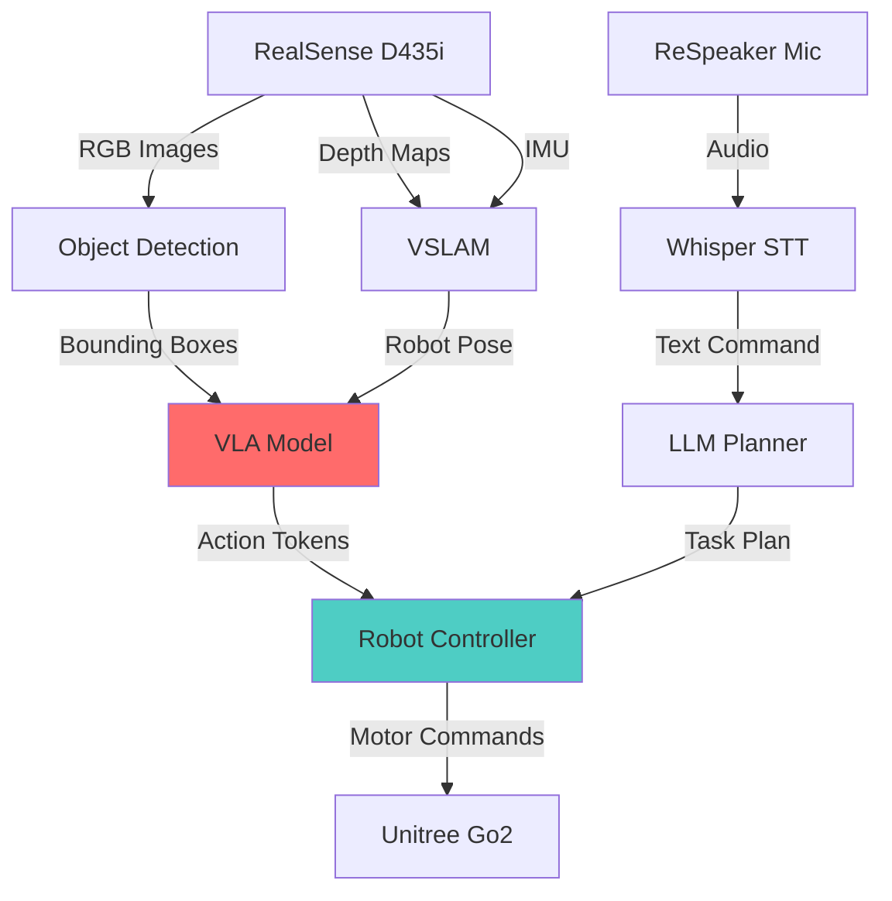

# طالب علم کٹ: جیٹسن اور سینسرز (The Student Kit: Jetson & Sensors)

## تعارف: ایج کمپیوٹنگ انقلاب (The Edge Computing Revolution)

اگرچہ کلاؤڈ GPUs بڑے پیمانے پر ٹریننگ پاور فراہم کرتے ہیں، **اصلی دنیا کے روبوٹس کو بیٹری سے چلنے والے ہارڈویئر پر ریئل ٹائم انفرنس کی ضرورت ہوتی ہے**۔ درج کریں **NVIDIA Jetson**—ایج AI پلیٹ فارم جو روبوٹس، ڈرونز، اور خود مختار گاڑیوں میں GPU ایکسلریشن لاتا ہے۔

:::info ایج کمپیوٹ کیوں؟
**کلاؤڈ**: 100-500ms تاخیر (توازن/گرفت کے لیے بیکار)
**ایج**: 10-30ms تاخیر (ریئل ٹائم کنٹرول ممکن ہے)

مقامی طور پر VLA ماڈلز چلانے والا ایک ہیومنائیڈ روبوٹ کلاؤڈ کے جوابات کا انتظار کرنے والے کے مقابلے میں 10-50 گنا زیادہ تیزی سے رد عمل ظاہر کر سکتا ہے۔
:::

---

## NVIDIA Jetson پلیٹ فارم

### Jetson فیملی (2024)

| ماڈل | GPU | RAM | پاور | قیمت | کس کے لیے بہترین |
| :--- | :--- | :--- | :--- | :--- | :--- |
| **Orin Nano 8GB** | 1024 CUDA cores | 8GB | 7-15W | $249 | طلباء، پروٹوٹائپس |
| **Orin Nano (4GB)** | 512 CUDA cores | 4GB | 5-10W | $199 | بجٹ پروجیکٹس |
| **Orin NX 16GB** | 1024 CUDA cores | 16GB | 10-25W | $599 | پروڈکشن روبوٹس |
| **AGX Orin 32GB** | 2048 CUDA cores | 32GB | 15-60W | $999 | خود مختار گاڑیاں |
| **AGX Orin 64GB** | 2048 CUDA cores | 64GB | 15-60W | $1,999 | ملٹی سینسر فیوژن |

:::tip طلباء کی سفارش
**Orin Nano 8GB** ($249) سیکھنے کے لیے بہترین جگہ ہے۔ چلاتا ہے:
*   ✅ ROS 2 Humble
*   ✅ Isaac ROS (visual SLAM, آبجیکٹ کا پتہ لگانا)
*   ✅ Whisper (صوتی کنٹرول)
*   ✅ چھوٹے VLA ماڈلز (quantization کے ساتھ OpenVLA 7B)
:::

---

### Jetson Orin Nano ڈیپ ڈائیو

**تکنیکی تفصیلات:**
*   **GPU**: 1024-core NVIDIA Ampere (RTX 30 سیریز جیسا آرکیٹیکچر)
*   **CPU**: 6-core ARM Cortex-A78AE @ 1.5 GHz
*   **AI کارکردگی**: 40 TOPS (INT8), 20 TFLOPS (FP16)
*   **میموری**: 8GB LPDDR5 (کمشترکہ میموری، مشترکہ CPU/GPU)
*   **اسٹوریج**: MicroSD + M.2 NVMe سلاٹ
*   **I/O**: 4× USB 3.2, HDMI 2.1, 1Gbps ایتھرنیٹ, GPIOs
*   **سائز**: 4.0" × 3.8" (کریڈٹ کارڈ کا سائز)

**پاور موڈز:**
*   **7W موڈ**: بیٹری سے چلنے والے روبوٹس (Unitree Go2)
*   **15W موڈ**: زیادہ سے زیادہ کارکردگی (پلگ ان)

**یہ انقلابی کیوں ہے:**
```
2019: NVIDIA Jetson Nano (128 CUDA cores, 1 TFLOPS) - $99
2024: NVIDIA Jetson Orin Nano (1024 CUDA cores, 20 TFLOPS) - $249

کی قیمت پر 20 گنا زیادہ AI کارکردگی 2.5×
```

---

### Jetson Orin Nano سیٹ اپ کرنا

#### ہارڈویئر اسمبلی

**مطلوبہ اجزاء:**
1.  **Jetson Orin Nano Developer Kit** ($249)
2.  **پاور سپلائی**: 19V 3.42A (65W) بیرل کنیکٹر (شامل)
3.  **MicroSD کارڈ**: 128GB+ UHS-I (Samsung EVO Select) - $15
4.  **NVMe SSD** (اختیاری): 256GB M.2 2280 (Samsung 980) - $35
5.  **WiFi ماڈیول** (اختیاری): Intel AX210 M.2 - $25

**کل بنیادی سیٹ اپ**: $289

---

#### سافٹ ویئر انسٹالیشن

**مرحلہ 1: فلیش JetPack 6.0 (تازہ ترین)**

```bash
# Ubuntu میزبان مشین پر:
# NVIDIA SDK مینیجر ڈاؤن لوڈ کریں
wget https://developer.nvidia.com/sdk-manager

# انحصار (dependencies) انسٹال کریں
sudo apt install libfuse2

# SDK مینیجر لانچ کریں
./sdkmanager_*.AppImage

# GUI پر عمل کریں:
# 1. ہدف کے طور پر "Jetson Orin Nano" منتخب کریں
# 2. "Jetson Linux" + "Jetson SDK Components" کو چیک کریں
# 3. MicroSD کارڈ پر فلیش کریں
# 4. انسٹالیشن کے لیے 45 منٹ انتظار کریں
```

**مرحلہ 2: پہلا بوٹ کنفیگریشن**

```bash
# Jetson کو USB-C کے ذریعے جوڑیں (سیریل کنسول کے لیے)
# یا HDMI مانیٹر + USB کی بورڈ کو جوڑیں

# Jetson پر (پہلے بوٹ کے بعد):
# صارف نام، پاس ورڈ، ٹائم زون سیٹ کریں

# سسٹم کو اپ ڈیٹ کریں
sudo apt update && sudo apt upgrade -y

# ضروری ٹولز انسٹال کریں
sudo apt install -y \
    build-essential \
    cmake \
    git \
    nano \
    htop \
    python3-pip \
    curl
```

**مرحلہ 3: CUDA کی تنصیب کی تصدیق کریں**

```bash
# GPU چیک کریں
nvidia-smi

# متوقع آؤٹ پٹ (JetPack 6.0):
# +-----------------------------------------------------------------------------+
# | NVIDIA-SMI 535.104.12   Driver Version: 535.104.12   CUDA Version: 12.2    |
# |-------------------------------+----------------------+----------------------+
# | GPU  Name        Persistence-M| Bus-Id        Disp.A | Volatile Uncorr. ECC |
# |   0  Orin                On   | 00000000:00:00.0 Off |                  N/A |

# CUDA کمپائلر چیک کریں
nvcc --version

# TensorRT ٹیسٹ کریں (Jetson's inference engine)
/usr/src/tensorrt/bin/trtexec --help
```

---

## آنکھیں (The Eyes): Intel RealSense D435i

### RealSense کیوں؟

**روایتی کیمرے**: صرف 2D تصاویر کیپچر کرتے ہیں (کوئی گہرائی نہیں)
**RealSense D435i**: RGB + Depth + IMU (inertial measurement) کیپچر کرتا ہے

یہ ممکن بناتا ہے:
*   **VSLAM** (میپنگ کے لیے بصری SLAM)
*   **رکاوٹ سے بچنا** (جانیں کہ دیواریں کتنی دور ہیں)
*   **گرفت (Grasping)** (ہیرا پھیری کے لیے آبجیکٹ کے فاصلے کا اندازہ لگائیں)
*   **شخص کی پیروی** (3D جگہ میں انسانوں کو ٹریک کریں)

---

### D435i تفصیلات

| خصوصیت | تفصیلات |
| :--- | :--- |
| **قیمت** | $289 (تعلیمی رعایت دستیاب) |
| **گہرائی ٹیکنالوجی** | Active IR stereo (اسٹرکچرڈ لائٹ) |
| **گہرائی کی حد** | 0.3m - 10m (بہترین: 0.5m - 5m) |
| **گہرائی ریزولوشن** | 1280×720 @ 30fps |
| **RGB ریزولوشن** | 1920×1080 @ 30fps |
| **IMU** | BMI055 (6-axis: gyro + accelerometer) |
| **فیلڈ آف ویو** | 87° × 58° (گہرائی), 69° × 42° (RGB) |
| **USB** | USB 3.0 (2.5W بجلی کی کھپت) |
| **وزن** | 72g |

:::info IMU کیوں اہم ہے
**IMU** (Inertial Measurement Unit) فراہم کرتا ہے:
*   حرکت کے تخمینہ کے لیے **لکیری ایکسلریشن** (m/s²)
*   گردش سے باخبر رہنے کے لیے **Angular Velocity** (rad/s)
*   گہرائی کے ڈیٹا کے ساتھ **سینسر فیوژن** → بہتر VSLAM کی درستگی

IMU کے بغیر: صرف گہرائی والا VSLAM 10-20% فی منٹ بڑھ جاتا ہے۔
IMU کے ساتھ: خرابی &lt; 1% فی منٹ (طویل مشنوں کے لیے اہم)
:::

---

### Jetson پر RealSense سیٹ اپ کرنا

**مرحلہ 1: librealsense انسٹال کریں**

```bash
# انحصار (dependencies) انسٹال کریں
sudo apt install -y \
    git \
    cmake \
    build-essential \
    libssl-dev \
    libusb-1.0-0-dev \
    pkg-config \
    libgtk-3-dev \
    libglfw3-dev \
    libgl1-mesa-dev \
    libglu1-mesa-dev

# librealsense کلون کریں اور بنائیں
git clone https://github.com/IntelRealSense/librealsense.git
cd librealsense
mkdir build && cd build

cmake .. \
    -DCMAKE_BUILD_TYPE=Release \
    -DBUILD_EXAMPLES=true \
    -DBUILD_PYTHON_BINDINGS=true

make -j$(nproc)
sudo make install
```

**مرحلہ 2: کیمرے کی تصدیق کریں**

```bash
# منسلک RealSense آلات کی فہرست بنائیں
rs-enumerate-devices

# متوقع آؤٹ پٹ:
# Device info:
#     Name                          : Intel RealSense D435I
#     Serial Number                 : 123456789012
#     Firmware Version              : 05.15.00.00
#     USB Type                      : 3.2

# viewer لانچ کریں (HDMI ڈسپلے کی ضرورت ہے)
realsense-viewer
```

**مرحلہ 3: ROS 2 انٹیگریشن**

```bash
# RealSense ROS 2 ریپر انسٹال کریں
sudo apt install ros-humble-realsense2-camera

# کیمرہ نوڈ لانچ کریں
ros2 launch realsense2_camera rs_launch.py \
    enable_depth:=true \
    enable_color:=true \
    enable_infra:=true \
    enable_gyro:=true \
    enable_accel:=true

# ٹوپکس کی تصدیق کریں
ros2 topic list
# متوقع آؤٹ پٹ:
# /camera/color/image_raw
# /camera/depth/image_rect_raw
# /camera/imu
# /camera/color/camera_info
```

---

## کان (The Ears): ReSpeaker USB مائک اری

### خصوصی مائکروفون کیوں؟

**لیپ ٹاپ مائک**: سنگل چینل، کوئی شور منسوخی نہیں، 5 میٹر رینج
**ReSpeaker مائک اری**: 4 مائکس، بیم فارمنگ، 10 میٹر رینج، ایکو کینسلیشن

ممکن بناتا ہے:
*   شور والے ماحول میں **وائس کمانڈز** (باورچی خانے، فیکٹری فلور)
*   **اسپیکر لوکلائزیشن** (روبوٹ اسپیکر کا سامنا کرنے کے لیے مڑتا ہے)
*   **ملٹی اسپیکر علیحدگی** (شناخت کریں کہ کون بات کر رہا ہے)

---

### ReSpeaker 4-Mic Array تفصیلات

| خصوصیت | تفصیلات |
| :--- | :--- |
| **قیمت** | $69 |
| **مائکروفونز** | 4× omnidirectional MEMS |
| **Sample Rate** | 16kHz / 48kHz |
| **چینلز** | 1-4 (کنفیگریبل) |
| **انٹرفیس** | USB 2.0 (پلگ اینڈ پلے) |
| **DSP خصوصیات** | Automatic Gain Control (AGC), Noise Suppression, Echo Cancellation |
| **LED رنگ** | 12× RGB LEDs (بصری تاثرات) |
| **رینج** | 10 میٹر تک (3m بہترین) |

---

### Jetson پر ReSpeaker سیٹ اپ کرنا

**مرحلہ 1: ہارڈویئر کنکشن**

```bash
# ReSpeaker کو Jetson USB 3.0 پورٹ سے جوڑیں
# ڈیوائس کا پتہ لگانا چیک کریں
lsusb | grep "Seeed"

# متوقع آؤٹ پٹ:
# Bus 001 Device 005: ID 2886:0018 Seeed Technology ReSpeaker 4 Mic Array
```

**مرحلہ 2: آڈیو ڈرائیور انسٹال کریں**

```bash
# ALSA ٹولز انسٹال کریں
sudo apt install -y alsa-utils

# آڈیو آلات کی فہرست بنائیں
arecord -l

# متوقع آؤٹ پٹ:
# card 2: ArrayUAC10 [ReSpeaker 4 Mic Array (UAC1.0)], device 0: USB Audio [USB Audio]
#   Subdevices: 1/1
#   Subdevice #0: subdevice #0

# ریکارڈنگ ٹیسٹ کریں (5 سیکنڈ)
arecord -D plughw:2,0 -f cd -d 5 test.wav

# دوبارہ چلائیں
aplay test.wav
```

**مرحلہ 3: Whisper انسٹال کریں (تقریر کی شناخت)**

```bash
# OpenAI Whisper انسٹال کریں
pip3 install openai-whisper

# بیس ماڈل ڈاؤن لوڈ کریں (74MB)
whisper --model base test.wav

# متوقع آؤٹ پٹ:
# [00:00.000 --> 00:05.000] Hello, robot. Please move forward.
```

---

## جسم (The Body): Unitree Robots

### Unitree کیوں؟

**Boston Dynamics Spot**: $75,000 (صرف انٹرپرائز)
**Unitree Go2**: $1,600 (اوپن SDK، طالب علم دوست)

Unitree پیش کرتا ہے:
*   ✅ اوپن سورس ROS 2 SDK
*   ✅ سستی قیمت (حریفوں سے 10-50 گنا سستی)
*   ✅ فعال کمیونٹی (Discord, GitHub)
*   ✅ اچھی دستاویزات

---

### Unitree روبوٹ لائن اپ (2024)

#### Unitree Go2 (Quadruped)

**قیمت**: $1,600 (EDU ورژن)

**تفصیلات:**
*   **وزن**: 15 kg
*   **پے لوڈ**: 5 kg
*   **رفتار**: 2.5 m/s (چلنا), 5 m/s (دوڑنا)
*   **بیٹری**: 8000mAh (1-2 گھنٹے رن ٹائم)
*   **کمپیوٹ**: Jetson Orin NX (بلٹ ان)
*   **سینسرز**: 3D LiDAR, فٹ فورس سینسرز، IMU
*   **جوڑ**: 12 موٹرز (3 فی ٹانگ)

**کے لیے بہترین:**
*   نیویگیشن تحقیق
*   SLAM تجربات
*   آؤٹ ڈور خود مختاری
*   معائنہ کے کام

:::tip Go2 EDU ایڈوانٹیج
**EDU ورژن** ($1,600) میں شامل ہیں:
*   مکمل ROS 2 Humble SDK
*   SSH روٹ رسائی
*   کسٹم فرم ویئر اپ لوڈ
*   LiDAR میپنگ اسٹیک

Pro ورژن ($2,700) شامل کرتا ہے:
*   بہتر تعمیر کا معیار
*   4G LTE کنیکٹوٹی
*   توسیعی وارنٹی
:::

---

#### Unitree G1 (Humanoid)

**قیمت**: $16,000

**تفصیلات:**
*   **اونچائی**: 1.32 میٹر (4'4")
*   **وزن**: 35 kg
*   **ڈگریز آف فریڈم**: 23 (بازو، ٹانگیں، دھڑ)
*   **ہاتھ**: 5-انگلیوں والے ڈیکسٹریس گریپرز
*   **کمپیوٹ**: Jetson AGX Orin 64GB
*   **بیٹری**: 9000mAh (1.5 گھنٹے رن ٹائم)
*   **سینسرز**: RealSense D435i (سر)، ٹارک سینسر (تمام جوڑ)

**کے لیے بہترین:**
*   ہیرا پھیری کی تحقیق
*   VLA ماڈل کی تعیناتی
*   ہیومن روبوٹ تعامل (Human-robot interaction)
*   تقلید سیکھنا (Imitation learning)

**حدود:**
*   ❌ ابھی تک دو پیڈل چلنا نہیں ہے (ترقی جاری ہے)
*   ❌ فی الحال اسٹیشنری یا صرف پہیے والی بنیاد
*   ❌ ہاتھ کی مہارت محدود (کوئی انفرادی انگلی کنٹرول نہیں)

---

### Unitree Go2 SDK سیٹ اپ

**مرحلہ 1: روبوٹ سے جڑیں**

```bash
# روبوٹ وائی فائی ہاٹ اسپاٹ بناتا ہے: "Unitree_Go2_XXXXXX"
# پاس ورڈ: "00000000" (8 zeros)

# SSH into robot
ssh unitree@192.168.123.161
# پاس ورڈ: 123

# ROS 2 کی تنصیب چیک کریں
ros2 topic list
```

**مرحلہ 2: ڈویلپمنٹ مشین پر Go2 SDK انسٹال کریں**

```bash
# SDK ریپوزٹری کلون کریں
git clone https://github.com/unitreerobotics/unitree_ros2.git
cd unitree_ros2

# colcon کے ساتھ بنائیں
colcon build --cmake-args -DCMAKE_BUILD_TYPE=Release

# سورس ورک اسپیس
source install/setup.bash
```

**مرحلہ 3: بنیادی حرکت کی کمانڈ**

```python
# go2_walk.py
import rclpy
from rclpy.node import Node
from unitree_ros2_msgs.msg import LowCmd

class Go2Walker(Node):
    def __init__(self):
        super().__init__('go2_walker')
        self.publisher = self.create_publisher(LowCmd, '/lowcmd', 10)
        
    def walk_forward(self, speed=0.5):
        """روبوٹ کو رفتار m/s پر آگے چلنے کا حکم دیں"""
        cmd = LowCmd()
        cmd.mode = 0  # Walking mode
        cmd.velocity_x = speed
        cmd.velocity_y = 0.0
        cmd.yaw_speed = 0.0
        
        self.publisher.publish(cmd)
        self.get_logger().info(f'Walking forward at {speed} m/s')

def main():
    rclpy.init()
    walker = Go2Walker()
    walker.walk_forward(0.3)  # آہستہ چلیں
    rclpy.spin(walker)

if __name__ == '__main__':
    main()
```

---

## مکمل طالب علم کٹ (The Complete Student Kit)

### بجٹ بریک ڈاؤن

| آئٹم | ماڈل | قیمت | ترجیح |
| :--- | :--- | :--- | :--- |
| **ایج کمپیوٹ** | Jetson Orin Nano 8GB | $249 | ضروری |
| **گہرائی کیمرہ** | RealSense D435i | $289 | ضروری |
| **مائیکروفون** | ReSpeaker 4-Mic Array | $69 | تجویز کردہ |
| **اسٹوریج** | 128GB MicroSD + 256GB NVMe | $50 | ضروری |
| **وائی فائی ماڈیول** | Intel AX210 M.2 | $25 | تجویز کردہ |
| **روبوٹ** | Unitree Go2 EDU | $1,600 | اختیاری |

**کل (روبوٹ کے بغیر)**: $682
**کل (روبوٹ کے ساتھ)**: $2,282

:::tip مشترکہ لیب کا سامان
تعلیمی اداروں کے لیے:
*   خريدیں **1 Unitree Go2** فی 5 طلباء (مشترکہ وسیلہ)
*   خریدیں **انفرادی Jetson + RealSense کٹس** ہر طالب علم کے لیے
*   طلباء ذاتی کٹس پر ترقی کرتے ہیں، مشترکہ روبوٹ پر ٹیسٹ کرتے ہیں

**فی طالب علم لاگت**: $682 (اپنی کٹ) + $320 (1/5 روبوٹ شیئر) = **$1,002 کل**
:::

---

## موبائل روبوٹس کے لیے پاور مینجمنٹ

### بیٹری کے تحفظات

**Jetson Orin Nano پاور ڈرا:**
*   **Idle**: 3-5W
*   **Running VSLAM**: 8-12W
*   **Running VLA inference**: 12-15W

**پورٹیبل بیٹری سیٹ اپ:**

```bash
# USB-C PD (پاور ڈیلیوری) بیٹری استعمال کریں
# تجویز کردہ: Anker PowerCore 20,000mAh (65W PD)

# رن ٹائم کا حساب لگائیں:
# بیٹری کی گنجائش: 20,000mAh × 5V = 100Wh
# Jetson @ 15W max = 6.6 گھنٹے رن ٹائم
# RealSense @ 2.5W = بوجھ بڑھاتا ہے
# کل: ~5 گھنٹے کا عملی رن ٹائم
```

**روبوٹ انٹیگریشن:**
```
Unitree Go2 میں بلٹ ان پاور ڈسٹری بیوشن ہے:
- مین بیٹری → موٹرز (12V)
- USB-C پورٹ → Jetson (19V بذریعہ PD)
- کسی بیرونی بیٹری کی ضرورت نہیں
```

---

## سینسر فیوژن آرکیٹیکچر

### پرسیپشن اسٹیک (The Perception Stack)



---

## کارکردگی بینچ مارکس

### Jetson Orin Nano 8GB

| ٹاسک | ماڈل | FPS | تاخیر |
| :--- | :--- | :--- | :--- |
| **آبجیکٹ کا پتہ لگانا** | YOLOv8n (TensorRT) | 45 fps | 22ms |
| **VSLAM** | Isaac ROS Visual SLAM | 30 fps | 33ms |
| **تقریر کی شناخت** | Whisper Tiny | ریئل ٹائم | 500ms |
| **VLA انفیرنس** | OpenVLA 7B (INT8) | 5 fps | 200ms |

:::warning VLA ماڈل کی پابندیاں
**مکمل درستگی VLA ماڈلز (FP16)** کے لیے 16GB+ RAM درکار ہے۔
Orin Nano 8GB پر، آپ کو تھوڑا سا درستگی نقصان کے ساتھ **INT8 quantization** استعمال کرنا چاہیے۔

**اختیارات:**
1.  جیٹسن پر کوانٹائزڈ ماڈل چلائیں (200ms تاخیر)
2.  کلاؤڈ GPU پر آف لوڈ کریں (500-1000ms تاخیر)
3.  چھوٹا ماڈل استعمال کریں (Llama 3.2 3B-based VLA)
:::

---

## عام مسائل کا ازالہ

### جیٹسن کے مسائل

**مسئلہ**: JetPack کی تنصیب ناکام
```bash
# حل: SDK مینیجر کے بجائے سرکاری NVIDIA SD کارڈ امیج استعمال کریں
wget https://developer.nvidia.com/downloads/embedded/l4t/r36_release_v2.0/jp60_image/jetson_orin_nano.img.xz
# Balena Etcher کے ساتھ فلیش کریں
```

**مسئلہ**: ڈسک کی جگہ ختم (microSD بھرا ہوا)
```bash
# استعمال چیک کریں
df -h

# پیکیج کیش صاف کریں
sudo apt clean
sudo apt autoremove -y

# ڈوکر ڈیٹا کو NVMe میں منتقل کریں
sudo systemctl stop docker
sudo mv /var/lib/docker /mnt/nvme/docker
sudo ln -s /mnt/nvme/docker /var/lib/docker
sudo systemctl start docker
```

### RealSense کے مسائل

**مسئلہ**: کیمرے کا پتہ نہیں چلا (اجازت مسترد)
```bash
# صارف کو ویڈیو گروپ میں شامل کریں
sudo usermod -aG video $USER

# ریبوٹ
sudo reboot
```

**مسئلہ**: خراب گہرائی کا معیار
```bash
# اعلی درستگی والے پیش سیٹ کو فعال کریں
rs-enumerate-devices -c

# لیزر پروجیکٹر استعمال کریں (کم ساخت والے مناظر کے لیے)
rs-sensor-control -d 0 -e 1
```

### ReSpeaker کے مسائل

**مسئلہ**: کوئی آڈیو ان پٹ کا پتہ نہیں چلا
```bash
# پہلے سے طے شدہ ڈیوائس کے طور پر سیٹ کریں
sudo nano /etc/asound.conf

# شامل کریں:
# pcm.!default {
#     type hw
#     card 2
# }

# ALSA دوبارہ شروع کریں
sudo alsa force-reload
```

---

## اگلے مراحل

1.  **آرڈر کے اجزاء**: جیٹسن + ریئل سینس کے ساتھ شروع کریں ($538)
2.  **مکمل ٹیوٹوریلز**: سافٹ ویئر سیٹ اپ کے لیے ماڈیول 2-4 پر عمل کریں
3.  **ٹیسٹ سینسرز**: تصدیق کریں VSLAM اور آبجیکٹ کا پتہ لگانے کا کام
4.  **روبوٹ کی خریداری کا منصوبہ**: اگر جاری ہے تو، Unitree Go2 میں سرمایہ کاری کریں

**تجویز کردہ سیکھنے کا راستہ:**
1.  ہفتے 1-4: Jetson + RealSense (VSLAM, آبجیکٹ کا پتہ لگانا)
2.  ہفتے 5-8: ReSpeaker شامل کریں (صوتی کنٹرول)
3.  ہفتے 9-12: Unitree روبوٹ پر تعینات کریں (اگر دستیاب ہو)

---

:::tip تعلیمی چھوٹ
*   **NVIDIA**: طلباء کے لیے Jetson پر 20% چھوٹ (.edu ای میل)
*   **Intel RealSense**: $230 (تعلیمی قیمت)
*   **Unitree**: بلک آرڈرز کے لیے سیلز سے رابطہ کریں (10+ یونٹس)

**کل بچت**: ~$150 فی طالب علم کٹ
:::

**اگلا باب**: [عام نقصانات اور حل](./03-troubleshooting.mdx)
