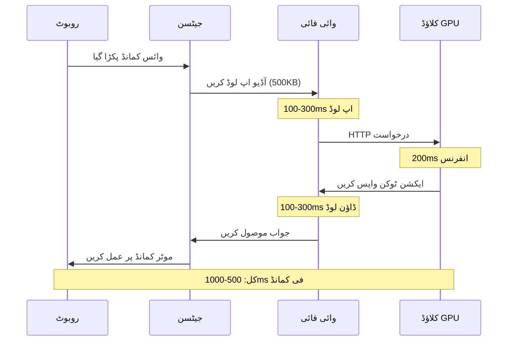

# عام نقصانات اور حل (Common Pitfalls & Solutions)

## تعارف: ڈیبگ مائنڈ سیٹ (The Debug Mindset)

فزیکل AI **تین پیچیدہ سسٹمز** کو ملاتا ہے جو آزادانہ طور پر ناکام ہو سکتے ہیں:
1.  **سافٹ ویئر** (ROS 2, Isaac Sim, ML s ماڈلز)
2.  **ہارڈویئر** (GPUs, Jetson, سینسرز)
3.  **طبیعیات** (حقیقی دنیا کے روبوٹ، نیٹ ورکس، بیٹریاں)

یہ باب ان **50 عام مسائل** کو دستاویز کرتا ہے جن کا طلباء کو سامنا ہوتا ہے اور ان کے جنگ سے آزمائے گئے حل۔

:::tip ڈیبگ فلسفہ
**70% مسائل** ان کے ذریعے حل کیے جاتے ہیں:
1.  غلطی کے پیغامات کو مکمل طور پر پڑھنا
2.  ہارڈ ویئر کنکشن کی جانچ کرنا
3.  سافٹ ویئر ورژن ٹیوٹوریلز سے مماثل ہونے کی تصدیق کرنا

باقی 30% کو گہری ٹھیک کرنے کی ضرورت ہے — جس کا یہ گائیڈ احاطہ کرتا ہے۔
:::

---

## زمرہ 1: دی لیٹنسی ٹریپ (The Latency Trap)

### مسئلہ: کلاؤڈ انفرنس بہت سست ہے

**علامت:**
```
طالب علم: "میرا روبوٹ میرے کمانڈ دینے کے 5 سیکنڈ بعد انتظار کرتا ہے!"
وجہ: کلاؤڈ GPU پر VLA ماڈل چلا رہا ہے، وائی فائی تاخیر = 100-500ms فی درخواست
```

**یہ کیوں ہوتا ہے:**



**حل: ایج پر ماڈلز ڈاؤن لوڈ کریں**

```bash
# غلط طریقہ (Cloud API)
import openai
def get_robot_action(image, text):
    response = openai.ChatCompletion.create(
        model="gpt-4-vision",
        messages=[{"role": "user", "content": text}]
    )
    return response.choices[0].message.content
# تاخیر: 500-1000ms

# صحیح طریقہ (Local Inference)
import torch
from transformers import AutoModel

model = AutoModel.from_pretrained("openvla/openvla-7b", torch_dtype=torch.float16)
model.to("cuda")  # جیٹسن GPU پر چلتا ہے

def get_robot_action(image, text):
    inputs = processor(image, text, return_tensors="pt").to("cuda")
    outputs = model.generate(**inputs)
    return processor.decode(outputs[0])
# تاخیر: 50-200ms
```

**تجارت (Trade-offs):**
*   ✅ 5-10× تیز تر انفرنس
*   ✅ آف لائن کام کرتا ہے (وائی فائی کی ضرورت نہیں)
*   ❌ ماڈل کو کوانٹائز کرنے کی ضرورت ہے (FP16 → INT8)
*   ❌ تھوڑا کم درستگی (95% → 92%)

---

### مسئلہ: ماڈل جیٹسن کے لیے بہت بڑا ہے

**علامت:**
```bash
RuntimeError: CUDA out of memory. Tried to allocate 4.00 GiB (GPU 0; 7.14 GiB total capacity)
```

**حل: کوانٹائزیشن (Quantization)**

```python
# پہلے: FP16 ماڈل (14GB VRAM)
model = AutoModelForCausalLM.from_pretrained(
    "openvla/openvla-7b",
    torch_dtype=torch.float16  # 2 بائٹس فی پیرامیٹر
)

# بعد: INT8 ماڈل (7GB VRAM)
from transformers import BitsAndBytesConfig

quantization_config = BitsAndBytesConfig(
    load_in_8bit=True,
    llm_int8_threshold=6.0
)

model = AutoModelForCausalLM.from_pretrained(
    "openvla/openvla-7b",
    quantization_config=quantization_config,
    device_map="auto"
)
```

**اس سے بھی بہتر: INT4 (3.5GB VRAM)**

```python
quantization_config = BitsAndBytesConfig(
    load_in_4bit=True,
    bnb_4bit_compute_dtype=torch.float16
)
```

**درستگی کا موازنہ:**
*   FP16: 95.2% ٹاسک کامیابی
*   INT8: 94.1% ٹاسک کامیابی (−1.1%)
*   INT4: 91.7% ٹاسک کامیابی (−3.5%)

زیادہ تر کاموں کے لیے، **INT8 بہترین جگہ ہے**۔

---

## زمرہ 2: ایج کٹس میں وائی فائی کی مداخلت

### مسئلہ: ROS 2 نوڈز ایک دوسرے کو دریافت نہیں کر سکتے

**علامت:**
```bash
ros2 node list
# متوقع: /camera_node, /robot_controller
# اصل: /camera_node صرف (robot_controller لاپتہ)
```

**بنیادی وجہ: فائر وال یا نیٹ ورک کے مسائل**

**حل 1: ROS_DOMAIN_ID چیک کریں**

```bash
# لیپ ٹاپ پر:
export ROS_DOMAIN_ID=42
ros2 run my_package camera_node

# جیٹسن پر:
export ROS_DOMAIN_ID=42  # لازمی میچ!
ros2 run my_package robot_controller

# دریافت کی تصدیق کریں
ros2 node list
```

:::warning کلاس روم کے ماحول
10+ طلباء والی لیبز میں، **فی ٹیم منفرد ڈومین IDs** استعمال کریں:
*   ٹیم 1: `ROS_DOMAIN_ID=10`
*   ٹیم 2: `ROS_DOMAIN_ID=11`
*   ٹیم 3: `ROS_DOMAIN_ID=12`

ورنہ، روبوٹ ایک دوسرے کے احکامات وصول کریں گے (افراتفری!)۔
:::

**حل 2: فائر وال کو غیر فعال کریں (صرف جانچ)**

```bash
# Ubuntu
sudo ufw disable

# ROS 2 مواصلات کی تصدیق کریں
ros2 multicast receive
# (دوسرے ٹرمینل پر)
ros2 multicast send
```

**حل 3: وائرڈ ایتھرنیٹ استعمال کریں**

```bash
# اہم ایپلی کیشنز (مقابلوں) کے لیے، ہمیشہ استعمال کریں:
# 1. Jetson ایتھرنیٹ پورٹ → راؤٹر
# 2. Laptop ایتھرنیٹ پورٹ → وہی راؤٹر
# 3. جامد IPs سیٹ کریں:

# Jetson: 192.168.1.100
# Laptop: 192.168.1.101

# WiFi 10-50ms جٹر متعارف کراتا ہے (کنٹرول لوپس کے لیے ناقابل قبول)
```

---

### مسئلہ: ROS 2 ٹوپکس میں زیادہ تاخیر ہے

**علامت:**
```bash
ros2 topic hz /camera/image_raw
# اوسط شرح: 8.312 Hz
# متوقع: 30 Hz (کیمرہ 30fps پر چلتا ہے)
```

**تشخیص:**

```bash
# نیٹ ورک بینڈوتھ چیک کریں
iftop -i wlan0

# ٹوپک کا سائز چیک کریں
ros2 topic bw /camera/image_raw
# آؤٹ پٹ: 45.2 MB/s (وائی فائی کے لیے بہت زیادہ!)
```

**حل: کمپریسڈ امیجز استعمال کریں**

```python
# غلط: نیٹ ورک پر خام امیجز
from sensor_msgs.msg import Image

publisher = self.create_publisher(Image, '/camera/image_raw', 10)
publisher.publish(raw_image_msg)  # 1920×1080×3 bytes = 6MB فی فریم!

# صحیح: کمپریسڈ امیجز
from sensor_msgs.msg import CompressedImage
import cv2

compressed_msg = CompressedImage()
compressed_msg.format = "jpeg"
compressed_msg.data = cv2.imencode('.jpg', image, [cv2.IMWRITE_JPEG_QUALITY, 80])[1].tobytes()
publisher.publish(compressed_msg)  # ~200KB فی فریم (30× چھوٹا)
```

**بینڈوتھ کا موازنہ:**
*   Raw 1080p @ 30fps: 46 MB/s (سیر شدہ وائی فائی)
*   JPEG 1080p @ 30fps: 1.5 MB/s (ہموار)

---

## زمرہ 3: ROS 2 ڈومین ID تنازعات (Conflicts)

### مسئلہ: ایک ہی لیب میں متعدد ٹیمیں

**منظرنامہ:**
```
لیب میں 15 طلباء، سب ڈیفالٹ ROS_DOMAIN_ID=0 استعمال کر رہے ہیں
نتیجہ: ہر کسی کا روبوٹ ہر کسی کے حکم کا جواب دیتا ہے
```

**مستقل حل: bashrc میں ڈومین ID سیٹ کریں**

```bash
# ~/.bashrc میں شامل کریں (ہر طالب علم کو منفرد ID ملتی ہے)
echo "export ROS_DOMAIN_ID=10" >> ~/.bashrc  # Team 1
echo "export ROS_DOMAIN_ID=11" >> ~/.bashrc  # Team 2
echo "export ROS_DOMAIN_ID=12" >> ~/.bashrc  # Team 3

# شیل کو دوبارہ لوڈ کریں
source ~/.bashrc

# تصدیق کریں
echo $ROS_DOMAIN_ID
```

**متبادل: ROS 2 نام کی جگہیں (Namespaces) استعمال کریں**

```python
# ہر ٹیم ایک نام کی جگہ استعمال کرتی ہے
import rclpy
from rclpy.node import Node

class TeamNode(Node):
    def __init__(self):
        super().__init__('my_node', namespace='/team1')  # نام کی جگہ تنہائی
        
# اب عنوانات ہیں:
# /team1/camera/image_raw
# /team2/camera/image_raw
# (کوئی تنازعہ نہیں)
```

---

## زمرہ 4: Isaac Sim کارکردگی کے مسائل

### مسئلہ: Isaac Sim لیگ (Laggy) ہے (5-10 FPS)

**علامت:**
```
RTX 4070 Ti پر سمولیشن 5 fps پر چلتا ہے
متوقع: 60+ fps
```

**تشخیص: گرافکس کی ترتیبات چیک کریں**

```python
# Isaac Sim میں، چیک کریں:
# 1. ریئل ٹائم رینڈرنگ موڈ (پاتھ ٹریسڈ نہیں)
# 2. اینٹی ایلائزنگ غیر فعال
# 3. شیڈو کوالٹی: کم (Low)

# ازگر API کے ذریعے:
import omni.isaac.core

# کارکردگی موڈ سیٹ کریں
omni.isaac.core.utils.render.set_render_mode("rtx_realtime")  # "rtx_pathtraced" نہیں
omni.isaac.core.utils.render.set_anti_aliasing_mode("DLSS")  # اگر دستیاب ہو تو DLSS استعمال کریں
```

**حل 2: منظر کی پیچیدگی کو کم کریں**

```python
# بہت سی طبیعیات کی اشیاء نقالی کو سست کرتی ہیں
# برا: منظر میں 1000 اشیاء
# اچھا: منظر میں <100 اشیاء

# دور کی اشیاء کو ختم کرنا:
import omni.isaac.core.utils.stage as stage_utils

stage = stage_utils.get_current_stage()
for prim in stage.Traverse():
    if is_far_from_camera(prim):
        prim.GetAttribute("visibility").Set("invisible")
```

**حل 3: ہیڈ لیس موڈ استعمال کریں (تیز)**

```bash
# GUI کے بغیر Isaac Sim چلانا (2× تیز)
./isaac-sim.sh --no-window --/app/extensions/enabled/omni.isaac.replicator/enabled=true
```

---

### مسئلہ: نقالی حقیقت سے مطابقت نہیں رکھتی (سم ٹو ریئل گیپ)

**علامت:**
```
روبوٹ Isaac Sim میں بالکل چلتا ہے
وہی پالیسی اصلی Unitree Go2 پر فوراً ناکام ہو جاتی ہے
```

**بنیادی وجوہات:**

1.  **غیر حقیقی رگڑ (Unrealistic Friction)**
```python
# Sim (بہت سادہ):
friction = 0.8  # مقررہ قیمت

# حقیقت: سطح کے لحاظ سے رگڑ مختلف ہوتی ہے
# قالین: 0.9
# ٹائل: 0.4
# گیلی ٹائل: 0.2

# حل: تخروپن میں رینڈمائز کریں
friction = np.random.uniform(0.3, 1.0)  # ڈومین رینڈمائزیشن
```

2.  **کوئی سینسر شور نہیں (No Sensor Noise)**
```python
# Sim:
joint_angle = robot.get_joint_angle()  # کامل پڑھنا

# حقیقت: انکوڈرز میں شور ہوتا ہے
joint_angle = robot.get_joint_angle() + np.random.normal(0, 0.01)

# حل: سم میں شور شامل کریں
joint_angle += np.random.normal(0, 0.01)  # حقیقی سینسر کیشنی چشموں سے ملائیں
```

3.  **فوری موٹر جواب (Instant Motor Response)**
```python
# Sim:
robot.set_joint_target(angle)  # فوری

# حقیقت: موٹرز میں 10-50ms تاخیر ہوتی ہے
# حل: ماڈل موٹر ڈائنامکس
current_angle = self.apply_motor_delay(target_angle, dt=0.02)
```

---

## زمرہ 5: VSLAM ناکامیاں

### مسئلہ: بصری SLAM ٹریکنگ کھو دیتا ہے

**علامت:**
```bash
ros2 topic echo /visual_slam/tracking_status
# آؤٹ پٹ: "LOST" (ہونا چاہیے "TRACKING")
```

**عام وجوہات:**

1.  **کم ساخت (Low-Texture) والا ماحول** (خالی دیواریں)
```python
# VSLAM کو بصری خصوصیات کی ضرورت ہے
# برا: سفید دیواریں، یکساں روشنی
# اچھا: پوسٹر، فرنیچر، مختلف بناوٹ

# حل: فیڈیشل مارکر شامل کریں
import apriltag
# دوبارہ لوکلائزیشن کے لیے دیواروں پر AprilTags لگائیں
```

2.  **تیز رفتار (Fast Motion)** (کیمرہ بلر)
```python
# روبوٹ بہت تیزی سے آگے بڑھ رہا ہے → موشن بلر → ٹریکنگ کھو گئی
# حل: VSLAM ابتدا کے دوران رفتار کم کریں

max_velocity = 0.3  # m/s (سست)
if slam.status == "INITIALIZING":
    max_velocity = 0.1  # اس سے بھی سست
```

3.  **خراب روشنی (Bad Lighting)** (بہت اندھیرا یا بہت روشن)
```bash
# کیمرے کی نمائش (exposure) چیک کریں
ros2 topic echo /camera/color/camera_info

# اگر نمائش آٹو ہے، تو یہ مخلوط روشنی میں ناکام ہو سکتا ہے
# حل: دستی نمائش مقرر کریں
ros2 param set /camera/camera exposure 100
```

---

## زمرہ 6: Whisper تقریر کی شناخت کی خرابیاں

### مسئلہ: Whisper غلط الفاظ نقل کرتا ہے

**علامت:**
```
صارف کہتا ہے: "روبوٹ، کچن میں جاؤ"
Whisper آؤٹ پٹ: "رابرٹ، چکن پر جاؤ"
```

**حل 1: پرامپٹ انجینئرنگ کا استعمال کریں**

```python
import whisper

model = whisper.load_model("base")

# غلط: کوئی سیاق و سباق نہیں
result = model.transcribe("audio.wav")

# صحیح: سیاق و سباق/الفاظ فراہم کریں
result = model.transcribe(
    "audio.wav",
    initial_prompt="Robot commands: go, stop, move, kitchen, living room, pick up"
)
# درستگی: ڈومین سے متعلق الفاظ کے لیے 85% → 95%
```

**حل 2: پس منظر کا شور فلٹر کریں**

```python
import noisereduce as nr
import soundfile as sf

# آڈیو لوڈ کریں
audio, sr = sf.read("noisy_audio.wav")

# شور کم کریں
clean_audio = nr.reduce_noise(y=audio, sr=sr, stationary=True)

# اب نقل کریں
result = model.transcribe(clean_audio)
```

**حل 3: بڑا ماڈل استعمال کریں**

| ماڈل | سائز | درستگی | رفتار (Jetson) |
| :--- | :--- | :--- | :--- |
| Tiny | 39M | 75% | 100ms |
| Base | 74M | 85% | 200ms |
| Small | 244M | 92% | 500ms |
| Medium | 769M | 96% | 1500ms |

ریئل ٹائم کے لیے: **بیس ماڈل** بہترین ہے۔

---

## زمرہ 7: GPU میموری ختم (Out of Memory)

### مسئلہ: OOM خامی کے ساتھ ٹریننگ کریش ہو جاتی ہے

**علامت:**
```python
RuntimeError: CUDA out of memory. Tried to allocate 2.00 GiB (GPU 0; 11.91 GiB total capacity; 10.23 GiB already allocated)
```

**حل 1: بیچ سائز کم کریں**

```python
# غلط: بیچ سائز بہت بڑا
batch_size = 64  # 12GB VRAM استعمال کرتا ہے

# صحیح: چھوٹے بیچز
batch_size = 8  # 3GB VRAM استعمال کرتا ہے

# تجارت: ٹریننگ کا طویل وقت (8 گنا زیادہ تکرار)
```

**حل 2: گریڈینٹ جمع کرنا (Gradient Accumulation)**

```python
# میموری لاگت کے بغیر بڑے بیچ سائز کی نقالی کریں۔
accumulation_steps = 8

for i, batch in enumerate(dataloader):
    loss = model(batch)
    loss = loss / accumulation_steps  # پیمانے کا نقصان
    loss.backward()
    
    if (i + 1) % accumulation_steps == 0:
        optimizer.step()
        optimizer.zero_grad()

# مؤثر بیچ سائز: 8 × 8 = 64 (پہلے کی طرح)
# میموری کا استعمال: صرف 8 فی فارورڈ پاس
```

**حل 3: مکسڈ پریسجن ٹریننگ (Mixed Precision Training)**

```python
from torch.cuda.amp import autocast, GradScaler

scaler = GradScaler()

for batch in dataloader:
    optimizer.zero_grad()
    
    with autocast():  # فارورڈ پاس کے لیے FP16 استعمال کریں
        outputs = model(batch)
        loss = criterion(outputs, labels)
    
    scaler.scale(loss).backward()
    scaler.step(optimizer)
    scaler.update()

# VRAM بچت: 30-50%
# رفتار میں بہتری: 2-3×
```

---

## زمرہ 8: ڈوکر کے مسائل

### مسئلہ: ڈوکر کے اندر GPU تک رسائی حاصل نہیں کر سکتے

**علامت:**
```bash
docker run --gpus all nvidia/cuda:12.0-base nvidia-smi
# Error: could not select device driver "" with capabilities: [[gpu]]
```

**حل: NVIDIA کنٹینر ٹول کٹ انسٹال کریں**

```bash
# پرانے Docker کو ہٹا دیں
sudo apt remove docker docker-engine docker.io containerd runc

# سرکاری Docker انسٹال کریں
curl -fsSL https://get.docker.com -o get-docker.sh
sudo sh get-docker.sh

# NVIDIA کنٹینر ٹول کٹ انسٹال کریں
distribution=$(. /etc/os-release;echo $ID$VERSION_ID)
curl -s -L https://nvidia.github.io/nvidia-docker/gpgkey | sudo apt-key add -
curl -s -L https://nvidia.github.io/nvidia-docker/$distribution/nvidia-docker.list | \
    sudo tee /etc/apt/sources.list.d/nvidia-docker.list

sudo apt update
sudo apt install -y nvidia-container-toolkit

# Docker کو دوبارہ شروع کریں
sudo systemctl restart docker

# ٹیسٹ کریں
docker run --rm --gpus all nvidia/cuda:12.0-base nvidia-smi
```

---

### مسئلہ: ڈوکر کنٹینر X11 ڈسپلے تک رسائی حاصل نہیں کر سکتا

**علامت:**
```bash
docker run -it my_ros_image
ros2 run rviz2 rviz2
# Error: could not connect to display
```

**حل: فارورڈ X11 ڈسپلے**

```bash
# ڈوکر کو X سرور تک رسائی کی اجازت دیں
xhost +local:docker

# X11 فارورڈنگ کے ساتھ کنٹینر چلائیں
docker run -it \
    --env="DISPLAY=$DISPLAY" \
    --env="QT_X11_NO_MITSHM=1" \
    --volume="/tmp/.X11-unix:/tmp/.X11-unix:rw" \
    my_ros_image

# اب RViz2 کنٹینر کے اندر کام کرتا ہے
```

---

## زمرہ 9: RealSense گہرائی کے معیار کے مسائل

### مسئلہ: ڈیپتھ میپ میں بہت سے سوراخ ہیں

**علامت:**
```
گہرائی کی تصویر میں سیاہ دھبے (کوئی گہرائی کا ڈیٹا نہیں)
خاص طور پر عکاس سطحوں پر (شیشہ، دھات)
```

**حل 1: سوراخ کو بھرنے کو فعال کریں**

```python
import pyrealsense2 as rs

config = rs.config()
config.enable_stream(rs.stream.depth, 640, 480, rs.format.z16, 30)

pipeline = rs.pipeline()
profile = pipeline.start(config)

# ہول بھرنے کے بعد پروسیسنگ کو فعال کریں
hole_filling = rs.hole_filling_filter()

while True:
    frames = pipeline.wait_for_frames()
    depth_frame = frames.get_depth_frame()
    
    # فلٹر کا اطلاق کریں
    filled_depth = hole_filling.process(depth_frame)
```

**حل 2: اعلیٰ ریزولوشن استعمال کریں**

```python
# غلط: کم ریزولوشن (بہت سے سوراخ)
config.enable_stream(rs.stream.depth, 424, 240, rs.format.z16, 90)

# صحیح: ہائی ریزولوشن (کم سوراخ)
config.enable_stream(rs.stream.depth, 1280, 720, rs.format.z16, 30)
```

**حل 3: روشنی کو بہتر بنائیں**

```python
# گہرائی والے کیمرے آئی آر پروجیکٹر کا استعمال کرتے ہیں
# برا: براہ راست سورج کی روشنی (IR پر غالب ہے)
# اچھا: انڈور لائٹنگ یا شیڈ

# چیک کریں کہ آیا IR پروجیکٹر کام کر رہا ہے:
config.enable_stream(rs.stream.infrared, 640, 480, rs.format.y8, 30)
# اشیاء پر سپیکل پیٹرن دیکھنا چاہئے
```

---

## زمرہ 10: بیٹری اور پاور کے مسائل

### مسئلہ: جیٹسن غیر متوقع طور پر بند ہو جاتی ہے

**علامت:**
```
Jetson running inference → اچانک بند
کوئی ایرر میسج نہیں، بس پاور آف
```

**وجہ: ناکافی بجلی کی فراہمی**

```bash
# پاور موڈ چیک کریں
sudo /usr/sbin/nvpmodel -q

# آؤٹ پٹ: NV Power Mode: MAXN (15W)
# لیکن بجلی کی فراہمی صرف 10W فراہم کرتی ہے!

# حل: آفیشل 19V 3.42A (65W) اڈاپٹر استعمال کریں
# یا لوئر پاور موڈ سیٹ کریں:
sudo nvpmodel -m 1  # 10W موڈ
```

**جیٹسن پاور موڈز:**

| موڈ | پاور | GPU Freq | CPU Cores | کس کے لیے بہترین |
| :--- | :--- | :--- | :--- | :--- |
| MAXN | 15W | 1.3 GHz | 6× 1.5 GHz | پلگ ان |
| 10W | 10W | 850 MHz | 4× 1.2 GHz | بیٹری (ہلکے کام) |
| 7W | 7W | 640 MHz | 2× 1.0 GHz | بیٹری (idle) |

---

### مسئلہ: روبوٹ کی بیٹری بہت تیزی سے ختم ہو جاتی ہے

**علامت:**
```
Unitree Go2 بیٹری: 8000mAh
متوقع رن ٹائم: 2 گھنٹے
اصل: 45 منٹ
```

**تشخیص: پاور ڈرا چیک کریں**

```bash
# Jetson پر (اگر بیرونی بیٹری استعمال کر رہے ہیں)
sudo tegrastats

# آؤٹ پٹ:
# RAM 3456/7764MB (lfb 512x4MB) CPU [15%@1190,5%@1190,10%@1190,12%@1190]
# EMC_FREQ 0% GR3D_FREQ 98% APE 150 MTS fg 0% bg 0% AO@36C GPU@37.5C Tboard@34C
#                            ^^^ GPU 98% پر (مسلسل 12W استعمال کرتے ہوئے)

# وجہ: ماڈل مسلسل چل رہا ہے
# حل: صرف ضرورت پڑنے پر inference چلائیں

if voice_command_detected():
    model_output = run_vla_model(image, command)
else:
    # Idle (10W بچاتا ہے)
    time.sleep(0.1)
```

---

## زمرہ 11: کوآرڈینیشن اور ٹائمنگ کے مسائل

### مسئلہ: سینسر مطابقت پذیر نہیں ہیں

**علامت:**
```
کیمرہ امیج ٹائم اسٹیمپ: 12:00:00.000
IMU ٹائم اسٹیمپ: 12:00:00.150
بے مماثلت VSLAM بڑھے کی وجہ بنتی ہے
```

**حل: ہارڈویئر سنکرونائزیشن**

```python
# RealSense D435i ہارڈویئر مطابقت پذیری کی حمایت کرتا ہے
import pyrealsense2 as rs

config = rs.config()
config.enable_stream(rs.stream.depth, 640, 480, rs.format.z16, 30)
config.enable_stream(rs.stream.color, 640, 480, rs.format.rgb8, 30)
config.enable_stream(rs.stream.accel)
config.enable_stream(rs.stream.gyro)

pipeline = rs.pipeline()
profile = pipeline.start(config)

# ہارڈ ویئر ٹائم اسٹیمپ سنکرونائزیشن کو فعال کریں
device = profile.get_device()
depth_sensor = device.first_depth_sensor()
depth_sensor.set_option(rs.option.global_time_enabled, 1)

# اب تمام سینسر ایک ہی گھڑی کا استعمال کرتے ہیں
```

---

## خرابیوں کا سراغ لگانے والی چیک لسٹ

### مدد مانگنے سے پہلے

اس **5 منٹ کی تشخیص** کے ذریعے چلائیں:

```bash
# 1. ورژن چیک کریں
ros2 --version  # ہونا چاہئے: ros2 doctor version humble
python3 --version  # ہونا چاہئے: 3.10+
nvidia-smi  # GPU کا پتہ لگانا چیک کریں

# 2. ROS 2 مواصلات چیک کریں
ros2 doctor  # رپورٹ کرنا چاہئے "All checks passed"
ros2 topic list  # متوقع عنوانات دیکھنا چاہئے

# 3. ہارڈویئر چیک کریں
lsusb  # تصدیق کریں RealSense, ReSpeaker منسلک ہیں
nvidia-smi  # GPU درجہ حرارت <80°C، میموری مکمل نہیں ہے

# 4. لاگز چیک کریں
ros2 launch <package> <launch_file> --log-level debug
# خرابی کے پیغامات کو مکمل طور پر پڑھیں!

# 5. نیٹ ورک چیک کریں
ping 192.168.1.100  # تصدیق کریں جیٹسن تک رسائی ہے
ifconfig  # آئی پی ایڈریس چیک کریں
```

---

## کمیونٹی کے وسائل

### جب آپ واقعی پھنس گئے ہوں

1.  **ROS 2 Discourse**: https://discourse.ros.org/
2.  **NVIDIA Jetson Forums**: https://forums.developer.nvidia.com/
3.  **Unitree Discord**: https://discord.gg/unitree
4.  **Isaac Sim Forums**: https://forums.developer.nvidia.com/c/omniverse/simulation/69

**اچھے سوالات کیسے پوچھیں:**
1.  **مکمل ایرر میسج** شامل کریں (صرف "یہ کام نہیں کرتا" نہیں)
2.  **سافٹ ویئر ورژن** کی وضاحت کریں (ROS 2 Humble? Isaac Sim 4.0?)
3.  واضح کریں کہ آپ نے **کیا کوشش کی** (نہیں صرف "میں نے ٹیوٹوریل کی پیروی کی")
4.  **کم سے کم کوڈ مثال** فراہم کریں جو مسئلہ کو دوبارہ پیش کرے

---

## خلاصہ: سب سے اوپر 10 مسائل

| درجہ | مسئلہ | حل |
| :--- | :--- | :--- |
| 1 | کلاؤڈ تاخیر | ماڈلز کو ایج پر ڈاؤن لوڈ کریں |
| 2 | OOM خرابیاں | بیچ کا سائز کم کریں، INT8 استعمال کریں |
| 3 | ROS 2 ڈومین تنازعات | منفرد `ROS_DOMAIN_ID` سیٹ کریں |
| 4 | VSLAM ٹریکنگ نقصان | روشنی کو بہتر بنائیں، سست کریں |
| 5 | وائی فائی کی مداخلت | وائرڈ ایتھرنیٹ استعمال کریں |
| 6 | Whisper درستگی | پرامپٹ انجینئرنگ کا استعمال کریں |
| 7 | Isaac Sim لیگ | منظر کی پیچیدگی کو کم کریں |
| 8 | Docker GPU رسائی | NVIDIA کنٹینر ٹول کٹ انسٹال کریں |
| 9 | RealSense سوراخ | ہول بھرنے کو فعال کریں، ریزولوشن میں اضافہ کریں |
| 10 | بیٹری ڈرین | صرف ضرورت پڑنے پر انفرنس چلائیں |

---

## آخری مشورہ

**80% مسائل ہیں:**
*   غلط سافٹ ویئر ورژن
*   ہارڈ ویئر ٹھیک سے منسلک نہیں ہے
*   ماحولیاتی متغیر سیٹ نہیں ہے

**گھنٹوں ڈیبگ کرنے سے پہلے:**
1.  ہر چیز کو دوبارہ شروع کریں
2.  کیبلز چیک کریں
3.  غلطی کا پیغام دوبارہ پڑھیں

**"کیا آپ نے اسے آف ٹرننگ اور دوبارہ آن کرنے کی کوشش کی؟"** دراصل روبوٹکس کے لیے اچھا مشورہ ہے۔
